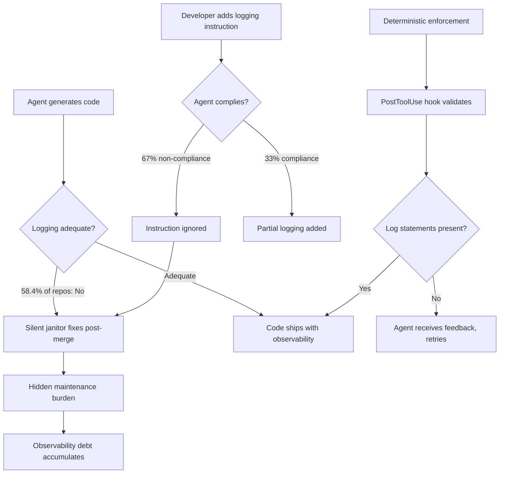
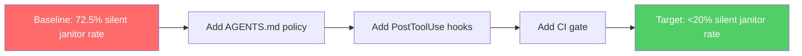

# The Agent Logging Gap: Why Codex CLI Agents Under-Log and How to Enforce Observability Standards


---

A fresh empirical study analysing 4,550 agent-generated pull requests has quantified what many senior engineers already suspected: AI coding agents systematically under-log compared to human developers, ignore explicit logging instructions 67% of the time, and leave behind an invisible maintenance burden that humans silently absorb [^1]. This article unpacks the findings, explains why they matter for production Codex CLI workflows, and provides concrete configuration patterns to close the gap.

## The Research: What 81 Repositories Tell Us

The paper "Do AI Coding Agents Log Like Humans?" by Ouatiti, Sayagh, Li, and Hassan (Queen's University and ETS Montréal, April 2026) examined 4,550 agentic PRs and 3,276 human PRs across 81 open-source repositories spanning Python, Java, and JavaScript/TypeScript [^1]. Three research questions drive the analysis.

### RQ1: Do agents log differently?

In 58.4% of repositories, agents modify logging in fewer PRs than humans [^1]. When agents do add log statements, they produce roughly 30% higher log density per thousand lines of code — but this is an artefact of smaller PR sizes rather than more thoughtful instrumentation. The critical divergence lies in log level selection: agents underutilise `INFO`-level logging in 24.7% of repositories, gravitating instead towards `ERROR` and `DEBUG` levels [^1]. Placement also diverges — agents align well in `try/catch` blocks (58.4% similarity) but poorly in conditionals and loops (46.7%) [^1].

### RQ2: Do instructions help?

Only 4.7% of agentic PRs include explicit logging instructions from the developer. When instructions are present, agents fail to comply 67% of the time [^1]. The paradox is sharper than expected: strong, specific instructions (73.3% of task specifications) yield only 27.3% compliance [^1]. Log-instructed PRs changed logging in 14.8% of cases versus 20.8% for uninstructed PRs — a statistically insignificant difference [^1].

### RQ3: Who cleans up?

This is the most concerning finding. Humans perform 72.5% of post-generation log modifications to agent code in subsequent commits [^1]. This "silent janitor" phenomenon means 77.2% of agent-generated logging changes are revised before merging, yet only 2.18% of agentic PRs receive explicit logging feedback in code reviews [^1]. Teams absorb observability debt silently rather than rejecting inadequately instrumented code.

## Why This Matters for Codex CLI Teams

The implications are threefold:

1. **Production blind spots.** Under-logged code deployed from agent PRs creates observability gaps. When an incident occurs at 03:00, the on-call engineer discovers that the agent-written service has `console.error` in catch blocks and nothing else — no request correlation IDs, no state-transition traces, no performance markers.

2. **Hidden maintenance cost.** The 72.5% silent-janitor rate means human developers are spending time adding log statements that the agent should have included. This is invisible in velocity metrics because it happens across subsequent commits rather than in review.

3. **Natural language is insufficient.** The 67% instruction non-compliance rate means that simply telling Codex "add appropriate logging" in your prompt is unreliable. Deterministic enforcement is required.



## Closing the Gap: Four Layers of Defence

The research recommends shifting from natural language guidance to deterministic enforcement [^1]. Here is how to implement that in Codex CLI using its current primitives.

### Layer 1: AGENTS.md Logging Policy

AGENTS.md instructions are injected into every agent turn and provide the foundational expectations. While the research shows that natural language alone is insufficient, AGENTS.md still sets the baseline contract that hooks can then enforce [^2].

```markdown
## Logging Standards

### Required Log Statements
- Every public function entry point: INFO level with key parameters
- Every error handler: ERROR level with stack trace and correlation ID
- Every external service call: DEBUG level with request/response summary
- Every state transition: INFO level with before/after values
- Every conditional branch with business logic: DEBUG level

### Log Format
All log statements MUST follow structured logging format:
```

logger.info("operation_completed", extra={"user_id": uid, "duration_ms": elapsed, "status": "success"})

```

### Prohibited Patterns
- No bare `print()` or `console.log()` for operational logging
- No string concatenation in log messages (use structured fields)
- No logging of secrets, tokens, or PII
- No `catch` blocks without an ERROR-level log statement
```

### Layer 2: PostToolUse Hooks for Log Verification

PostToolUse hooks fire after every file write, making them the ideal enforcement point [^3]. The hook inspects modified files for minimum logging requirements and feeds violations back to the agent as actionable feedback.

```toml
# ~/.codex/config.toml

[[hooks.PostToolUse]]
matcher = "^(apply_patch|Write)$"

[[hooks.PostToolUse.hooks]]
type = "command"
command = "python3 ~/.codex/scripts/check_logging.py"
timeout = 10
statusMessage = "Checking logging standards"
```

The verification script inspects diffs for missing log statements:

```python
#!/usr/bin/env python3
"""check_logging.py — PostToolUse hook for logging enforcement."""

import json
import re
import sys

LOGGING_PATTERNS = {
    "python": [
        r"logger\.\w+\(",
        r"logging\.\w+\(",
    ],
    "javascript": [
        r"logger\.\w+\(",
        r"console\.(info|warn|error|debug)\(",
        r"log\.\w+\(",
    ],
    "java": [
        r"(LOGGER|logger|LOG)\.\w+\(",
    ],
}

CATCH_PATTERNS = {
    "python": r"except\s+\w+",
    "javascript": r"catch\s*\(",
    "java": r"catch\s*\(",
}

def detect_language(filename: str) -> str | None:
    ext_map = {".py": "python", ".js": "javascript",
               ".ts": "javascript", ".java": "java"}
    for ext, lang in ext_map.items():
        if filename.endswith(ext):
            return lang
    return None

def check_diff(tool_input: dict) -> list[str]:
    warnings = []
    diff = tool_input.get("diff", tool_input.get("content", ""))
    filename = tool_input.get("path", "")
    lang = detect_language(filename)
    if not lang:
        return []

    # Check for catch blocks without logging
    catch_re = CATCH_PATTERNS.get(lang)
    if catch_re and re.search(catch_re, diff):
        has_log = any(re.search(p, diff)
                      for p in LOGGING_PATTERNS[lang])
        if not has_log:
            warnings.append(
                f"Error handler in {filename} has no log statement. "
                "Add an ERROR-level log with context and stack trace."
            )

    # Check for new function definitions without logging
    func_patterns = {
        "python": r"def \w+\(",
        "javascript": r"(async\s+)?function\s+\w+|const\s+\w+\s*=\s*(async\s*)?\(",
        "java": r"(public|private|protected)\s+\w+\s+\w+\(",
    }
    func_re = func_patterns.get(lang)
    if func_re:
        funcs = re.findall(func_re, diff) if isinstance(
            re.findall(func_re, diff), list) else []
        if len(funcs) > 0:
            log_count = sum(
                len(re.findall(p, diff))
                for p in LOGGING_PATTERNS[lang]
            )
            if log_count == 0:
                warnings.append(
                    f"New functions in {filename} have no log statements. "
                    "Add INFO-level entry logging with key parameters."
                )

    return warnings

def main():
    hook_input = json.loads(sys.stdin.read())
    tool_input = hook_input.get("tool_input", {})
    warnings = check_diff(tool_input)

    if warnings:
        msg = "Logging gaps detected:\n" + "\n".join(
            f"  - {w}" for w in warnings
        )
        print(msg, file=sys.stderr)
        sys.exit(2)  # Exit code 2 triggers block with feedback

    sys.exit(0)

if __name__ == "__main__":
    main()
```

### Layer 3: Stop Hook for Comprehensive Validation

The `Stop` hook fires when the agent completes a turn, providing an opportunity for a broader logging audit [^3]. Unlike PostToolUse, which checks individual files, the Stop hook can assess overall observability coverage.

```toml
[[hooks.Stop]]

[[hooks.Stop.hooks]]
type = "command"
command = "bash ~/.codex/scripts/audit_logging.sh"
timeout = 30
statusMessage = "Auditing observability coverage"
```

```bash
#!/usr/bin/env bash
# audit_logging.sh — Stop hook for logging coverage audit
set -euo pipefail

# Check recently modified files for logging coverage
MODIFIED=$(git diff --name-only HEAD 2>/dev/null || true)
MISSING=()

for file in $MODIFIED; do
    case "$file" in
        *.py)
            if grep -q "def " "$file" 2>/dev/null; then
                if ! grep -qE "logger\.|logging\." "$file" 2>/dev/null; then
                    MISSING+=("$file")
                fi
            fi
            ;;
        *.ts|*.js)
            if grep -qE "function |=>\s*{" "$file" 2>/dev/null; then
                if ! grep -qE "logger\.|console\.(info|warn|error|debug)" "$file" 2>/dev/null; then
                    MISSING+=("$file")
                fi
            fi
            ;;
    esac
done

if [ ${#MISSING[@]} -gt 0 ]; then
    echo "Files missing logging instrumentation:" >&2
    printf '  - %s\n' "${MISSING[@]}" >&2
    echo "" >&2
    echo "Add structured log statements before completing this task." >&2
    exit 2
fi
```

### Layer 4: CI Gate with codex exec

For headless pipelines, use `codex exec` with `--output-schema` to generate a structured logging audit report as part of your CI workflow [^4].

```bash
codex exec \
  -p ci \
  --output-schema '{"type":"object","properties":{"files_audited":{"type":"number"},"missing_logging":{"type":"array","items":{"type":"object","properties":{"file":{"type":"string"},"issue":{"type":"string"}}}},"score":{"type":"number"}},"required":["files_audited","missing_logging","score"]}' \
  "Audit the changed files in this PR for logging coverage. Check every error handler has an ERROR log, every public function has entry logging, and every external call has DEBUG logging. Return a score from 0-100."
```

## Model Selection for Logging Quality

The research found that logging compliance does not improve meaningfully with stronger instructions alone [^1]. However, model selection affects code quality patterns. Based on the current Codex CLI model lineup:

| Model | Logging Tendency | Best Use |
|-------|-----------------|----------|
| GPT-5.5 | Best baseline logging; follows AGENTS.md logging policy most reliably [^5] | Production feature development |
| GPT-5.2-Codex | Strong on error-path logging; may over-log in debug scenarios [^6] | Long-horizon refactoring, security audits |
| GPT-5.3-Codex-Spark | Minimal logging by default; fastest but needs strongest enforcement [^7] | Quick edits with PostToolUse enforcement |

Configure model-specific profiles to pair enforcement strength with model tendency:

```toml
[profile.dev]
model = "gpt-5.5"
reasoning_effort = "medium"

[profile.quick]
model = "gpt-5.3-codex-spark"
reasoning_effort = "low"
# Pair with stricter PostToolUse hooks for logging
```

## The Structured Logging Skill

For teams wanting a reusable enforcement pattern, wrap the logging policy into a Codex CLI skill [^8]:

```markdown
---
name: structured-logging
description: Enforce structured logging standards in modified code
---

When modifying or creating code files, ensure every change includes
appropriate structured logging:

1. **Entry logging**: Every public function gets an INFO log on entry
   with key parameters as structured fields
2. **Error logging**: Every catch/except block gets an ERROR log with
   the exception, a correlation ID, and relevant state
3. **External calls**: Every HTTP/database/message-queue call gets
   DEBUG logging with request summary and elapsed time
4. **State transitions**: Business state changes get INFO logging
   with before/after values

Use the project's logging framework (check imports). Never use bare
print/console.log for operational logging. Never log secrets or PII.

Format: structured key-value pairs, not string interpolation.
```

## Measuring Improvement

Track three metrics to assess whether your enforcement strategy is working:

1. **Log-to-function ratio** in agent PRs (target: >0.5 log statements per function)
2. **Silent janitor rate** — percentage of agent commits where humans add logging in subsequent commits (target: <20%, down from the research baseline of 72.5%)
3. **Catch-without-log violations** in CI (target: zero)



## Known Limitations

The research has several caveats worth noting:

- The study analysed open-source repositories; enterprise codebases with stricter review cultures may show different patterns
- The AIDev dataset primarily captures GitHub Copilot and Claude Code agents; Codex CLI-specific data is limited
- PostToolUse hooks add latency to the agent loop — keep scripts under one second using Rust-based linters (Ruff for Python, Oxlint for TypeScript) rather than Node.js-based tools [^9]
- The `--output-schema` flag for `codex exec` cannot currently be combined with MCP servers in the same invocation [^4]

## Practical Recommendations

1. **Do not rely on prompts alone.** The 67% non-compliance rate means natural language logging instructions are necessary but not sufficient.
2. **Start with AGENTS.md, enforce with hooks.** Layer 1 sets expectations; Layer 2 provides deterministic enforcement.
3. **Use the Stop hook for coverage audits.** PostToolUse catches individual files; the Stop hook assesses overall observability.
4. **Reject uninstrumented PRs.** The research explicitly recommends rejecting agent PRs that lack observability, rather than silently absorbing the debt [^1].
5. **Track the silent janitor metric.** If humans are still adding log statements after agent commits, your enforcement is too weak.

---

## Citations

[^1]: Ouatiti, Y. E., Sayagh, M., Li, H., & Hassan, A. E. (2026). "Do AI Coding Agents Log Like Humans? An Empirical Study." arXiv:2604.09409. [https://arxiv.org/abs/2604.09409](https://arxiv.org/abs/2604.09409)

[^2]: OpenAI. (2026). "AGENTS.md — Codex CLI." OpenAI Developers. [https://developers.openai.com/codex/agents-md](https://developers.openai.com/codex/agents-md)

[^3]: OpenAI. (2026). "Hooks — Codex." OpenAI Developers. [https://developers.openai.com/codex/hooks](https://developers.openai.com/codex/hooks)

[^4]: OpenAI. (2026). "Non-interactive mode — Codex CLI." OpenAI Developers. [https://developers.openai.com/codex/cli/non-interactive](https://developers.openai.com/codex/cli/non-interactive)

[^5]: OpenAI. (2026). "Models — Codex." OpenAI Developers. [https://developers.openai.com/codex/models](https://developers.openai.com/codex/models)

[^6]: OpenAI. (2026). "Introducing GPT-5.2-Codex." OpenAI Blog. [https://openai.com/index/introducing-gpt-5-2-codex/](https://openai.com/index/introducing-gpt-5-2-codex/)

[^7]: OpenAI. (2026). "Pricing — Codex." OpenAI Developers. [https://developers.openai.com/codex/pricing](https://developers.openai.com/codex/pricing)

[^8]: OpenAI. (2026). "Skills — Codex." OpenAI Developers. [https://developers.openai.com/codex/skills](https://developers.openai.com/codex/skills)

[^9]: Sakasegawa, N. (2026). "Harness Engineering Best Practices for Claude Code / Codex Users." [https://nyosegawa.com/en/posts/harness-engineering-best-practices-2026/](https://nyosegawa.com/en/posts/harness-engineering-best-practices-2026/)
