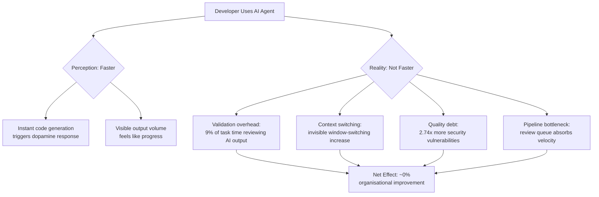

# The AI Coding Productivity Paradox: What Three Major Studies Reveal and How to Configure Codex CLI for Genuine Speed Gains


---

Ninety-three per cent of developers now use AI coding tools[^1]. Adoption is near-universal. Yet three independent research programmes — METR's randomised controlled trial, JetBrains' two-year telemetry study, and Faros AI's 10,000-developer metrics analysis — converge on an uncomfortable finding: individual speed gains are not translating into organisational delivery improvements, and experienced developers may actually be slower[^2][^3][^4]. This article synthesises the evidence, diagnoses the root causes, and maps each one to concrete Codex CLI configuration and workflow patterns that turn the paradox into genuine throughput.

## The Evidence: Three Studies, One Pattern

### METR: The 43-Point Perception Gap

METR's original randomised controlled trial (February–June 2025) recruited 16 experienced open-source developers, each working on real issues in repositories they maintained, and randomly assigned tasks to AI-allowed or AI-disallowed conditions[^2].

The results were striking:

| Metric | Value |
|---|---|
| Predicted speedup (pre-task) | +24% |
| Self-reported speedup (post-task) | +20% |
| **Measured actual effect** | **-19% (slower)** |
| Perception–reality gap | **43 percentage points** |

Developers with the deepest familiarity with their repositories experienced the largest slowdown[^2]. METR's February 2026 follow-up expanded to 57 developers, 143 repositories, and 800+ tasks. The revised estimate softened to -4% (confidence interval: -15% to +9%), but crucially, the researchers discovered that 30–50% of invited developers declined to participate without AI access, introducing severe selection bias[^5]. METR concluded that "AI likely provides productivity benefits in early 2026" but acknowledged their data offered "only very weak evidence" for the magnitude[^5].

### JetBrains HAX: Invisible Context Switching

JetBrains' Human-AI Experience (HAX) team analysed two years of IDE telemetry from 800 developers and presented their findings at ICSE 2026 in Rio de Janeiro[^3].

Key findings:

- **Invisible switching cost:** AI users' monthly window-switching trended upward over the study period while non-AI users' remained flat. Yet 74% of AI-assisted developers did not notice any increase[^3].
- **Typing volume paradox:** Developers who adopted in-IDE AI assistants consistently typed more characters than those who never used them, and this gap grew over two years[^3].
- **Perception mismatch:** "AI redistributes and reshapes developers' workflows in ways that often elude their own perceptions"[^3].

### Faros AI: Amdahl's Law Strikes Back

Faros AI's analysis across 10,000+ developers quantified the organisational bottleneck[^4]:

| Metric | Change with High AI Adoption |
|---|---|
| Pull requests merged | +98% |
| Code review time | +91% |
| Bug introduction rate | +9% |
| DORA delivery metrics | **Unchanged** |

The pattern follows Amdahl's Law precisely: even if AI doubles coding speed, coding represents only 25–35% of the development lifecycle[^6]. The review queue, CI pipeline, and release process absorb the gains entirely.

## Why the Paradox Exists: Four Root Causes



1. **Validation overhead.** Developers spend roughly 9% of task time reviewing and cleaning AI output — nearly four hours per week[^6]. For experienced developers with strong mental models, this exceeds the time saved by generation.

2. **Invisible context switching.** The JetBrains data shows AI tools increase cognitive switching without developers noticing[^3]. Each switch carries a well-documented resumption cost of 15–25 minutes for deep work.

3. **Quality debt.** CodeRabbit's analysis found AI-generated code contains 2.74× more security vulnerabilities than human-written code[^6]. Veracode reported 45% of AI output introduced OWASP Top 10 vulnerabilities[^6]. The time to fix these downstream is not captured in "time to first commit."

4. **Pipeline bottleneck.** The +98% PR volume crashes into human review capacity. Without proportional investment in review automation and CI performance, the system cannot absorb the increased throughput[^4].

## Configuring Codex CLI to Beat Each Root Cause

### 1. Reduce Validation Overhead: Plan Before You Build

The single most impactful configuration change is to use plan mode by default for complex tasks. This front-loads context gathering and prevents the generate-review-reject-regenerate cycle that consumes validation time[^7].

```toml
# ~/.codex/config.toml
[profiles.deep-work]
model = "gpt-5.5"
model_reasoning_effort = "high"
approval_policy = "on-request"
sandbox_mode = "workspace-write"
```

Invoke with:

```bash
codex --profile deep-work
```

Inside the session, start every non-trivial task with `/plan`:

```
/plan Refactor the authentication module to use JWT rotation.
Before implementing, identify all files that import from auth/,
list the current test coverage, and propose a migration sequence.
```

The research is clear: developers who skip planning and jump straight into AI-assisted coding experience the largest perception–reality gap[^2]. Plan mode forces Codex to load context, identify constraints, and propose a structured approach before touching files.

For multi-step work, use a `PLANS.md` template[^7]:

```markdown
## Objective
[One-sentence goal]

## Constraints
- [ ] No breaking changes to public API
- [ ] All existing tests must pass
- [ ] Follow existing error-handling patterns

## Steps
1. ...
2. ...

## Done When
- [ ] Tests pass
- [ ] Linter clean
- [ ] Review checklist complete
```

### 2. Eliminate Context Switching: One Thread Per Task

The JetBrains data shows invisible switching costs accumulate[^3]. Codex CLI's session model directly addresses this:

```bash
# Start a focused session for one task
codex --profile deep-work

# When switching tasks, DON'T reuse the thread — fork or start fresh
/fork    # Preserves transcript, creates new context
/clear   # Nuclear option: resets to clean slate
```

**Critical anti-pattern to avoid:** watching Codex step-by-step. The OpenAI best practices guide explicitly warns against this: "Work in parallel instead of watching step-by-step"[^7]. While Codex works on one task, work on something else or use `/side` to open a parallel ChatGPT conversation for auxiliary questions.

For parallelisable work, use subagents to avoid thread-switching entirely:

```toml
# .codex/config.toml
[agents]
max_depth = 1
```

```
Spawn two subagents:
1. Agent A: Update all API route handlers to use the new middleware
2. Agent B: Write integration tests for each updated route
```

### 3. Catch Quality Debt Early: Verification Gates

The 2.74× vulnerability multiplier[^6] makes post-generation verification non-negotiable. Configure hooks to enforce this automatically:

```toml
# .codex/config.toml
[hooks.PostToolUse]
command = "bash .codex/hooks/verify.sh"
```

```bash
#!/usr/bin/env bash
# .codex/hooks/verify.sh
set -euo pipefail

# Run type checker
npx tsc --noEmit 2>&1 || exit 1

# Run linter
npx eslint --max-warnings 0 . 2>&1 || exit 1

# Run tests for changed files
npx vitest run --changed 2>&1 || exit 1
```

Use `/review` with custom instructions to enforce quality standards before accepting any output:

```
/review --instructions "Check for: silent error swallowing,
missing input validation, hardcoded credentials, broad try-catch
blocks, and any deviation from existing patterns in this codebase."
```

Encode your verification standards permanently in `AGENTS.md`:

```markdown
## Verification Requirements

Every change MUST pass before completion:
1. `npm run typecheck` — zero errors
2. `npm run lint` — zero warnings
3. `npm run test` — all green
4. No `any` types introduced
5. No `console.log` in production code
6. Error handling follows the Result<T, E> pattern used in src/lib/
```

### 4. Unblock the Pipeline: Automate Review

The Faros data shows review time is the binding constraint[^4]. Use Codex CLI's GitHub integration to shift review left:

```bash
# Enable automatic PR review in GitHub
# Settings > Code Review > Enable automatic reviews

# Use codex exec in CI for structured analysis
codex exec "Review this diff for P0 security issues and P1
correctness bugs. Output JSON with file, line, severity, and
description." --input "$(git diff main...HEAD)" \
  --output-schema '{"issues": [{"file": "string", "line": "number",
  "severity": "string", "description": "string"}]}'
```

For the review queue specifically, the `/review` command against a base branch automates the first-pass triage that consumes the most reviewer time[^7]:

```
/review base=main
```

```mermaid
flowchart LR
    A[Developer Writes Code] --> B[Codex PostToolUse Hooks<br/>Type-check, Lint, Test]
    B --> C[/review Against Base Branch]
    C --> D[Push to PR]
    D --> E[Codex GitHub Auto-Review<br/>P0/P1 Issue Detection]
    E --> F{Issues Found?}
    F -->|Yes| G["@codex fix the P1 issue"]
    F -->|No| H[Human Reviewer:<br/>Architecture & Intent Only]
    G --> D
```

## Measuring Whether It Works

The studies agree on one thing: subjective assessment is unreliable. You need instrumentation. Track these metrics weekly:

| Metric | What It Shows | Target |
|---|---|---|
| Change-failure rate on Codex commits | Quality debt accumulation | ≤ team baseline |
| Time-to-merge for Codex PRs | Pipeline bottleneck severity | ≤ 1.2× human PRs |
| Accepted/rejected suggestion ratio | Validation overhead | ≥ 80% first-pass acceptance |
| Context compactions per session | Session scope creep | ≤ 1 per session |
| `/review` issue density | Pre-commit quality | Trending down |

The OpenAI best practices guide recommends applying "the same review gates you use for an external contributor" and instrumenting acceptance ratios, change-failure rates, and time-to-merge[^7].

## The Configuration That Ties It Together

```toml
# ~/.codex/config.toml — Productivity-Paradox-Aware Profile

[profiles.measured]
model = "gpt-5.5"
model_reasoning_effort = "high"
plan_mode_reasoning_effort = "high"
approval_policy = "on-request"
sandbox_mode = "workspace-write"

[profiles.quick]
model = "gpt-5.4-mini"
model_reasoning_effort = "low"
approval_policy = "on-request"
sandbox_mode = "workspace-write"
```

Use `measured` for anything that touches business logic, security, or architecture. Use `quick` for well-scoped mechanical tasks — rename refactors, test stubs, format conversions — where validation overhead is minimal and the generation speed advantage is real.

## Key Takeaways

The productivity paradox is not an argument against AI coding tools. It is a measurement of what happens when adoption outpaces workflow adaptation. The METR follow-up suggests genuine gains are emerging[^5]. The question is whether your configuration captures them or leaks them through validation overhead, context switching, quality debt, and pipeline bottlenecks.

The pattern is straightforward:

1. **Plan first** — front-load context to avoid the generate-reject-regenerate cycle
2. **Isolate focus** — one thread per task, parallel subagents, never watch step-by-step
3. **Verify automatically** — hooks, linters, and type-checkers enforce quality at generation time
4. **Automate review** — shift first-pass triage to Codex, reserve human review for intent and architecture
5. **Measure objectively** — instrument the metrics that the research says matter, not the ones that feel good

The 43-point perception gap will not close itself. Configuration will.

## Citations

[^1]: JetBrains, "AI Pulse Survey," January 2026. 93% adoption across 11,000 developers. [https://blog.jetbrains.com/research/2026/04/ai-impact-developer-workflows/](https://blog.jetbrains.com/research/2026/04/ai-impact-developer-workflows/)

[^2]: METR, "Measuring the Impact of Early-2025 AI on Experienced Open-Source Developer Productivity," July 2025. Randomised controlled trial with 16 developers and 246 tasks. [https://metr.org/blog/2025-07-10-early-2025-ai-experienced-os-dev-study/](https://metr.org/blog/2025-07-10-early-2025-ai-experienced-os-dev-study/)

[^3]: JetBrains HAX Team, "Understanding AI's Impact on Developer Workflows," presented at ICSE 2026, Rio de Janeiro. Two-year telemetry study of 800 developers. [https://blog.jetbrains.com/research/2026/04/ai-impact-developer-workflows/](https://blog.jetbrains.com/research/2026/04/ai-impact-developer-workflows/)

[^4]: Faros AI, "The AI Productivity Paradox Research Report," 2026. Analysis across 10,000+ developers showing 98% more PRs with unchanged DORA metrics. [https://www.faros.ai/blog/ai-software-engineering](https://www.faros.ai/blog/ai-software-engineering)

[^5]: METR, "We are Changing our Developer Productivity Experiment Design," February 2026. Follow-up with 57 developers, 800+ tasks, revised -4% estimate, and selection bias analysis. [https://metr.org/blog/2026-02-24-uplift-update/](https://metr.org/blog/2026-02-24-uplift-update/)

[^6]: Philipp Dubach, "AI Coding Productivity Paradox: 93% Adoption, 10% Gains," 2026. Synthesis of multiple research sources including Faros AI, CodeRabbit, Veracode, and NBER data. [https://philippdubach.com/posts/93-of-developers-use-ai-coding-tools.-productivity-hasnt-moved./](https://philippdubach.com/posts/93-of-developers-use-ai-coding-tools.-productivity-hasnt-moved./)

[^7]: OpenAI, "Best Practices — Codex," 2026. Official workflow and configuration guidance. [https://developers.openai.com/codex/learn/best-practices](https://developers.openai.com/codex/learn/best-practices)
