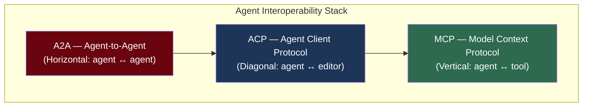
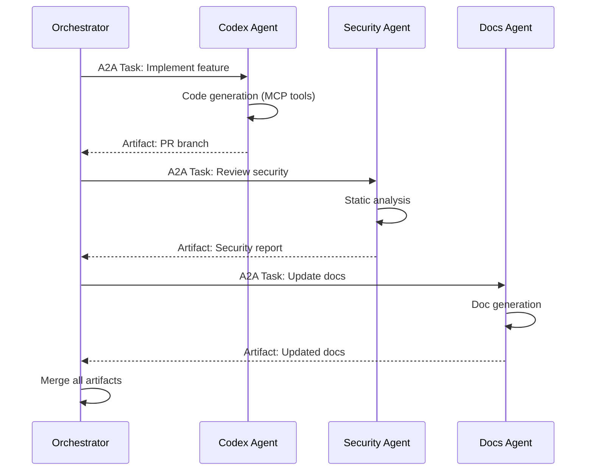
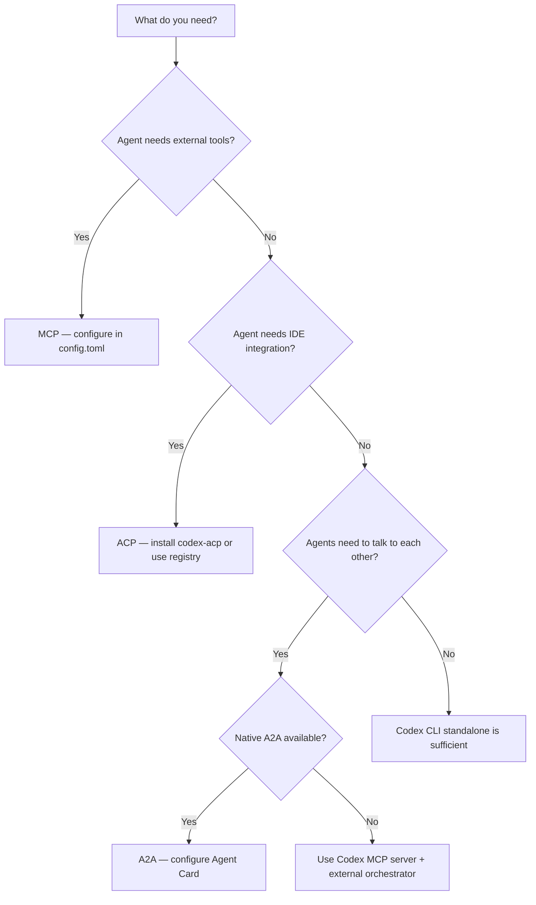

# Agent Interoperability Protocols and Codex CLI: MCP, ACP, and A2A in Practice


---

Three agent interoperability protocols now compete for the plumbing underneath every coding agent workflow: the **Model Context Protocol (MCP)** for tool integration, the **Agent Client Protocol (ACP)** for IDE integration, and the **Agent-to-Agent Protocol (A2A)** for inter-agent orchestration[^1]. Codex CLI supports MCP natively, has a mature community bridge for ACP, and is tracking A2A through an open feature request. This article maps each protocol to concrete Codex CLI configuration, explains when you need each one, and provides a phased adoption strategy.

## The Three-Protocol Stack

A recent academic survey formalises the relationship between these protocols as complementary layers rather than competitors[^1]:



| Protocol | Maintained By | Transport | Primary Use Case |
|----------|---------------|-----------|------------------|
| MCP | Anthropic / Linux Foundation AAIF | JSON-RPC 2.0 over stdio, HTTP+SSE | Agent ↔ tool communication[^2] |
| ACP | Zed Industries + JetBrains | Stdio (binary) | Agent ↔ IDE integration[^3] |
| A2A | Google / Linux Foundation AAIF | HTTP + SSE, Agent Cards | Agent ↔ agent orchestration[^4] |

## MCP: The Foundation Layer

MCP is the only protocol Codex CLI supports natively. Every MCP server configured in `config.toml` exposes its tools alongside Codex's built-in shell and file tools[^5]. With over 10,000 public MCP servers indexed by May 2026, this is the protocol with critical mass[^6].

### Configuration

Add an MCP server to `~/.codex/config.toml`:

```toml
[mcp_servers.github]
command = "npx"
args = ["-y", "@modelcontextprotocol/server-github"]
env = { GITHUB_TOKEN = "env:GITHUB_TOKEN" }

[mcp_servers.postgres]
command = "npx"
args = ["-y", "@modelcontextprotocol/server-postgres"]
env = { DATABASE_URL = "env:DATABASE_URL" }
```

Or use the CLI to add servers directly[^5]:

```bash
codex mcp add github -- npx -y @modelcontextprotocol/server-github
```

### Running Codex as an MCP Server

Codex can also *expose itself* as an MCP server, enabling orchestration by external systems like the OpenAI Agents SDK[^7]:

```bash
codex mcp-server
```

This exposes two tools: `codex` (start a new session) and `codex-reply` (continue an existing session via thread ID). External agents can then invoke Codex programmatically:

```python
from agents.mcp import MCPServerStdio

async with MCPServerStdio(
    name="Codex CLI",
    params={
        "command": "npx",
        "args": ["-y", "codex", "mcp-server"]
    },
    client_session_timeout_seconds=360000,
) as codex_mcp_server:
    agent = Agent(mcp_servers=[codex_mcp_server])
```

### Hardening MCP in Production

Limit the tools an MCP server can expose using `enabled_tools`[^5]:

```toml
[mcp_servers.github]
command = "npx"
args = ["-y", "@modelcontextprotocol/server-github"]
enabled_tools = ["get_file_contents", "search_code", "list_issues"]
```

This prevents the agent from invoking destructive operations — critical when running in CI pipelines or with elevated sandbox permissions.

## ACP: The IDE Bridge

The Agent Client Protocol, co-developed by Zed Industries and JetBrains, standardises how coding agents integrate with editors[^3]. Where MCP connects agents to tools, ACP connects agents to *editing environments* — exposing multi-file editing, terminal execution, and real-time feedback loops through a single protocol[^8].

### Why ACP Matters for Codex CLI Users

Since January 2026, the ACP Agent Registry has been live inside both JetBrains IDEs and Zed[^9]. Codex CLI is listed alongside Claude Code, Gemini CLI, and GitHub Copilot CLI. Installing Codex through the registry gives IDE users a graphical interface backed by the same Codex harness that powers the terminal.

### The codex-acp Bridge

The community-maintained `codex-acp` project provides a Rust-based ACP adapter that bridges the Codex runtime to any ACP-compatible client[^10]:

```bash
# Build from source
git clone https://github.com/cola-io/codex-acp.git
cd codex-acp
make release
```

The bridge exposes Codex's capabilities through ACP's standardised interface, including:

- **Session management** with three modes: read-only, auto, and full-access
- **Slash commands** advertised dynamically: `/init`, `/status`, `/compact`, `/review`
- **Filesystem tools** via an embedded MCP server (`acp_fs`) with `read_text_file`, `write_text_file`, `edit_text_file`, and `multi_edit_text_file`
- **Custom provider support** with model switching using the `{provider_id}@{model_name}` format[^10]

### Zed Configuration

Configure Codex as an ACP agent in Zed's `settings.json`[^10]:

```json
{
  "agent_servers": {
    "Codex": {
      "command": "/path/to/codex-acp",
      "args": [],
      "env": {
        "RUST_LOG": "info",
        "CODEX_LOG_DIR": "./logs"
      }
    }
  }
}
```

### JetBrains Configuration

In JetBrains IDEs (2025.3+), Codex appears in the AI chat agent picker[^11]. The registry handles installation — no manual binary management required. Select Codex from the agent list and it connects through ACP automatically.

## A2A: The Orchestration Layer

Google's Agent-to-Agent protocol, now at version 1.2 under the Linux Foundation's Agentic AI Foundation, enables agents to discover each other's capabilities via HTTP-hosted **Agent Cards** and delegate tasks through structured artifact exchanges[^4][^12].

### Current Codex CLI Status

A2A support for Codex CLI is not yet merged. GitHub issue #11980 tracks a working implementation spanning eight files in `codex-rs/a2a` and `codex-rs/mcp-server` that would add[^13]:

- ACP session lifecycle management within the A2A handler
- Token usage tracking via event handling
- Unified tool discovery across MCP and A2A surfaces
- Session-aware HTTP transport routing

The implementation passes `cargo check` and maintains backward compatibility, but remains open as of May 2026.

### What A2A Would Enable

Once landed, A2A support would let Codex CLI participate in multi-vendor agent orchestration. A concrete example: a Symphony-orchestrated workflow where a Codex agent handles code generation, a Claude Code agent handles security review, and a Gemini agent handles documentation — all coordinated through A2A's task delegation protocol.



### Working Around the Gap Today

Until native A2A lands, you can achieve cross-agent orchestration using two existing mechanisms:

1. **Codex as MCP server** — external orchestrators (Agents SDK, Kata, Bernstein) invoke Codex through its MCP server interface[^7]
2. **Symphony** — OpenAI's open-source orchestrator connects Linear tickets to Codex sessions. Since v1.1.0, Symphony also supports the Kata CLI runtime, enabling Claude Code and Gemini alongside Codex[^14]

## Protocol Decision Framework



| Scenario | Protocol | Codex CLI Support |
|----------|----------|-------------------|
| Connect a database, GitHub, or Sentry | MCP | Native — `config.toml` |
| Use Codex inside Zed or JetBrains | ACP | Community — `codex-acp` binary |
| Orchestrate Codex with other agents | A2A | Pending — use MCP server as workaround |
| Expose Codex to the Agents SDK | MCP (server mode) | Native — `codex mcp-server` |
| Run Codex in CI/CD pipelines | None needed | Native — `codex exec` |

## Phased Adoption Strategy

The academic survey recommends sequential adoption[^1], and this maps cleanly onto Codex CLI maturity:

### Phase 1: MCP Foundation (Start Here)

Configure two to three MCP servers that remove your most frequent manual loops. GitHub, your database, and your observability stack are good starting points.

```toml
# ~/.codex/config.toml — starter MCP stack
[mcp_servers.github]
command = "npx"
args = ["-y", "@modelcontextprotocol/server-github"]
env = { GITHUB_TOKEN = "env:GITHUB_TOKEN" }

[mcp_servers.context7]
command = "npx"
args = ["-y", "@upstash/context7-mcp"]
```

### Phase 2: ACP for IDE Integration (When Needed)

If your team splits time between terminal and IDE, add ACP. The JetBrains registry makes this zero-configuration for IntelliJ, WebStorm, and Rider users. For Zed, build `codex-acp` and point `settings.json` at the binary.

### Phase 3: A2A for Multi-Agent Orchestration (When Available)

Monitor GitHub issue #11980 for the A2A merge[^13]. In the interim, use `codex mcp-server` as the integration point for external orchestrators. Symphony provides a production-ready reference implementation[^14].

## Security Considerations

Each protocol introduces a distinct trust boundary:

- **MCP servers** run as child processes under Codex's sandbox. Use `enabled_tools` to restrict the attack surface, and `deny_read_paths` to protect credentials[^5].
- **ACP connections** run over local stdio — nothing traverses the network by default. The `codex-acp` bridge respects Codex's approval policy and sandbox settings[^10].
- **A2A Agent Cards** are served over HTTP and can be discovered by any agent on the network. When A2A lands, configure cards behind authentication and restrict which agents can invoke Codex capabilities.

For enterprise environments, `managed_config.toml` can enforce MCP server allowlists and block unapproved protocol endpoints[^15].

## What Comes Next

The protocol landscape is consolidating. The Linux Foundation's Agentic AI Foundation now governs both MCP and A2A[^12], and ACP's backing from JetBrains and Zed ensures IDE-side longevity. For Codex CLI practitioners, the practical advice is straightforward: invest in MCP configuration now, adopt ACP when your IDE workflow demands it, and prepare for A2A by structuring your orchestration around `codex mcp-server` so the transition is a protocol swap rather than an architecture change.

## Citations

[^1]: Taha, M. et al. (2026). "A Survey of Agent Interoperability Protocols: Model Context Protocol (MCP), Agent Communication Protocol (ACP), Agent-to-Agent Protocol (A2A), and Agent Network Protocol (ANP)." arXiv:2505.02279. [https://arxiv.org/html/2505.02279v1](https://arxiv.org/html/2505.02279v1)

[^2]: Anthropic. "Model Context Protocol — Specification." [https://spec.modelcontextprotocol.io/](https://spec.modelcontextprotocol.io/)

[^3]: Zed Industries. "Agent Client Protocol." [https://zed.dev/acp](https://zed.dev/acp)

[^4]: Google. "Agent2Agent Protocol." GitHub repository. [https://github.com/a2aproject/A2A](https://github.com/a2aproject/A2A)

[^5]: OpenAI. "Model Context Protocol — Codex CLI." OpenAI Developers. [https://developers.openai.com/codex/mcp](https://developers.openai.com/codex/mcp)

[^6]: GetStream. "Top AI Agent Protocols in 2026 — MCP, A2A, ACP & More." [https://getstream.io/blog/ai-agent-protocols/](https://getstream.io/blog/ai-agent-protocols/)

[^7]: OpenAI. "Use Codex with the Agents SDK." OpenAI Developers. [https://developers.openai.com/codex/guides/agents-sdk](https://developers.openai.com/codex/guides/agents-sdk)

[^8]: Natarajan, T. (2026). "Agent Client Protocol (ACP): The LSP Moment for AI Coding Agents." Medium. [https://thamizhelango.medium.com/agent-client-protocol-acp-the-lsp-moment-for-ai-coding-agents-and-how-jetbrains-and-zed-nailed-e2a42f5defb0](https://thamizhelango.medium.com/agent-client-protocol-acp-the-lsp-moment-for-ai-coding-agents-and-how-jetbrains-and-zed-nailed-e2a42f5defb0)

[^9]: JetBrains. "ACP Agent Registry Is Live." The JetBrains AI Blog. [https://blog.jetbrains.com/ai/2026/01/acp-agent-registry/](https://blog.jetbrains.com/ai/2026/01/acp-agent-registry/)

[^10]: Cola.io. "codex-acp — Agent Client Protocol bridge for Codex CLI." GitHub repository. [https://github.com/cola-io/codex-acp](https://github.com/cola-io/codex-acp)

[^11]: JetBrains. "Codex Is Now Integrated Into JetBrains IDEs." The JetBrains AI Blog. [https://blog.jetbrains.com/ai/2026/01/codex-in-jetbrains-ides/](https://blog.jetbrains.com/ai/2026/01/codex-in-jetbrains-ides/)

[^12]: Linux Foundation. "Agentic AI Foundation (AAIF)." Governs A2A and MCP specifications. [https://www.linuxfoundation.org/](https://www.linuxfoundation.org/)

[^13]: OpenAI/Codex. "feat(a2a): add ACP session management and token usage tracking to A2A server." GitHub Issue #11980. [https://github.com/openai/codex/issues/11980](https://github.com/openai/codex/issues/11980)

[^14]: OpenAI. "An open-source spec for Codex orchestration: Symphony." [https://openai.com/index/open-source-codex-orchestration-symphony/](https://openai.com/index/open-source-codex-orchestration-symphony/)

[^15]: OpenAI. "Managed Configuration — Codex." OpenAI Developers. [https://developers.openai.com/codex/managed-configuration](https://developers.openai.com/codex/managed-configuration)
