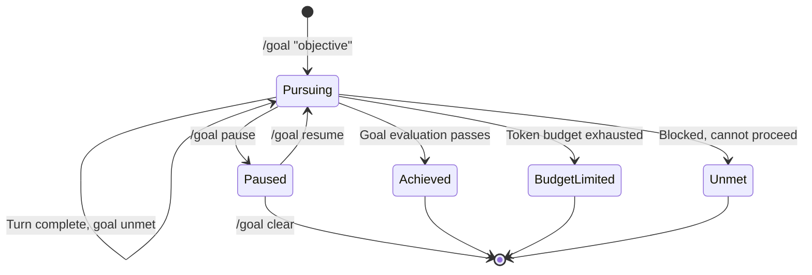

# Codex CLI /goal Workflows: Persistent Long-Horizon Task Execution in v0.128


---

Until v0.128, every Codex CLI interaction followed the same cadence: prompt, execute, wait for the next prompt. Long-horizon work — a multi-file refactor, a framework migration, a comprehensive test suite — required the developer to manually shepherd each step, deciding when to continue and what to tackle next. The `/goal` command, which shipped in Codex CLI v0.128.0 on 30 April 2026[^1], breaks this pattern by introducing **persistent, budget-constrained objective loops** that keep the agent working until the goal is achieved, the token budget runs out, or the developer intervenes.

This article covers the practical mechanics, configuration patterns, and operational trade-offs of `/goal` workflows for senior developers integrating them into daily work.

## What /goal Actually Does

The `/goal` command tells Codex to treat a prompt not as a single task but as a **persistent objective** that survives across turns[^2]. After each turn, Codex evaluates whether the goal has been met. If not, it plans and executes the next step autonomously — reading files, running tests, applying patches — looping until one of four exit conditions is reached:

1. **Achieved** — Codex determines the objective is complete
2. **Budget-limited** — the configured token budget is exhausted
3. **Paused/Cleared** — the developer intervenes with `/goal pause` or `/goal clear`
4. **Blocked** — Codex encounters an unresolvable obstacle (missing credentials, ambiguous requirements, or a failing test it cannot fix)

Internally, the loop is driven by two prompt templates injected after each turn: `goals/continuation.md` handles progress evaluation and next-step planning, whilst `goals/budget_limit.md` enforces token consumption constraints[^3]. This is architecturally similar to the "Ralph loop" pattern — a self-evaluating feedback cycle where the agent acts, assesses, and decides whether to continue[^3].



## Command Reference

The `/goal` slash command supports four forms[^2]:

```bash
# Set a new goal — Codex begins pursuing immediately
/goal "Migrate the auth module from session-based to OAuth2, update all tests, ensure CI passes"

# Pause the current goal — Codex stops looping but retains state
/goal pause

# Resume a paused goal — Codex picks up where it left off
/goal resume

# Clear the goal entirely — Codex returns to standard turn-by-turn mode
/goal clear
```

The goal status is surfaced in the TUI, showing one of five states: `pursuing`, `paused`, `achieved`, `unmet`, or `budget-limited`[^2].

## When to Use /goal (and When Not To)

The `/goal` command excels in scenarios where the work is **well-defined but multi-step**, and where each step produces verifiable output that the agent can evaluate.

### Strong candidates for /goal

| Scenario | Why it works |
|---|---|
| Framework migration (e.g. Express → Fastify) | Clear target state, tests validate progress |
| Comprehensive test suite generation | Measurable coverage targets, each file is independent |
| Multi-file refactoring (rename, extract, restructure) | Mechanical changes with compile/test feedback |
| Codebase-wide lint rule enforcement | Binary pass/fail per file |
| API version upgrade across consumers | Compiler errors guide the agent |

### Poor candidates for /goal

| Scenario | Why it struggles |
|---|---|
| Ambiguous design decisions | No clear completion criteria for the agent to evaluate |
| Greenfield feature development | Too many unknowns; the agent cannot self-validate |
| Performance optimisation | Success requires benchmarks the agent typically cannot run |
| Cross-repository changes | `/goal` operates within a single workspace |

The heuristic: if you can write a one-sentence acceptance criterion that a test suite or compiler can verify, `/goal` will likely work well. If the definition of "done" requires human judgement, stick with turn-by-turn prompting.

## Practical Workflow Patterns

### Pattern 1: Migration with Test Verification

The strongest `/goal` pattern pairs the objective with an existing test suite that validates progress:

```bash
/goal "Convert all class components in src/components/ to functional components \
with hooks. Run 'npm test' after each file. Stop if any test fails that you \
cannot fix within three attempts."
```

The explicit test command gives Codex a feedback signal at each iteration. The retry limit prevents infinite loops on genuinely broken transformations.

### Pattern 2: Incremental Coverage Expansion

```bash
/goal "Increase test coverage in src/services/ from current 42% to at least 80%. \
Run 'npm run coverage' after each new test file. Prioritise untested public methods."
```

Coverage percentage provides a quantitative completion criterion. Codex can read the coverage report, identify gaps, write tests, and re-measure — a natural loop.

### Pattern 3: Lint Rule Rollout

```bash
/goal "Fix all ESLint errors introduced by the new 'no-floating-promises' rule. \
Run 'npx eslint src/ --rule no-floating-promises:error' after each batch of fixes. \
Commit each passing batch."
```

This pattern uses the linter as a progress oracle. Each commit creates a checkpoint, making it safe to interrupt and resume later.

### Pattern 4: Pause-and-Steer

For goals where you want to review progress periodically:

```bash
/goal "Refactor the payment module to use the new PaymentGateway interface. \
Pause after completing each service file for review."
```

When Codex pauses, you can review the changes, provide feedback as a regular prompt, then `/goal resume` to continue. This gives you checkpoint control without losing the persistent objective.

## Token Budget Management

The `/goal` loop consumes tokens across every continuation turn. Without budget constraints, a complex goal could exhaust your daily allocation in a single session.

The token budget is managed through the standard context configuration in `config.toml`[^4]:

```toml
# Trigger compaction before the window fills
model_auto_compact_token_limit = 64000

# Cap individual tool outputs to prevent context bloat
tool_output_token_limit = 12000
```

Auto-compaction is critical for `/goal` workflows. As the loop accumulates turns, the context window fills with tool outputs, file contents, and test results. When `model_auto_compact_token_limit` is reached, Codex compacts the conversation — either through session memory (avoiding an LLM call) or via the Responses API `/compact` endpoint[^5]. This keeps the loop viable across dozens of iterations without degrading output quality.

For cost-conscious teams, pair `/goal` with a reasoning effort adjustment. Use `Alt+,` in the TUI to lower reasoning effort for mechanical tasks (lint fixes, renames) and `Alt+.` to raise it for complex transformations[^1].

## Combining /goal with Other Primitives

The `/goal` command does not exist in isolation. It interacts with several Codex CLI features:

### With /plan

Start with `/plan` to let Codex survey the codebase and propose a migration strategy, then set a `/goal` to execute it:

```bash
# Phase 1: Plan
/plan "How would you migrate our Express middleware to Fastify?"

# Phase 2: Execute the plan
/goal "Execute the migration plan above. Run tests after each middleware conversion."
```

### With Subagents

For truly parallel work, combine `/goal` with subagent spawning. The parent agent pursues the goal, delegating independent subtasks to subagents configured in `~/.codex/agents/`:

```bash
/goal "Migrate the API layer to v3. For each independent service, spawn a subagent \
to handle the conversion. Verify integration tests pass after all subagents complete."
```

Note that subagent token consumption adds to the overall budget. The `agents.max_threads` and `agents.max_depth` settings in `config.toml` prevent runaway spawning[^4].

### With /fork and /side

If a `/goal` reveals an unexpected problem, use `/side` for a quick investigation without polluting the goal context, or `/fork` for a persistent branch:

```bash
# Mid-goal, you notice a dependency issue
/side "What version of lodash are we using and is it compatible with Node 22?"

# Resume the goal with the answer in mind
/goal resume
```

## Operational Considerations

### The --full-auto Deprecation

v0.128 deprecated the `--full-auto` flag in favour of explicit permission profiles[^1]. For `/goal` workflows, this means configuring a named profile that grants appropriate autonomy:

```toml
[profile.goal-runner]
approval_policy = "on-request"
sandbox_mode = "workspace-write"
```

Then launch with:

```bash
codex -p goal-runner
```

This gives Codex write access to the workspace and command execution without approval, whilst keeping filesystem operations outside the working directory gated.

### Monitoring a Running Goal

The TUI displays the current goal state in the status line[^1]. For headless environments, the app-server APIs expose goal state programmatically — enabling dashboards or Slack notifications when a goal completes or hits a budget limit[^1].

### Recovery from Budget-Limited State

When a goal hits `budget-limited`, the work so far is preserved. You can:

1. Review what was accomplished
2. Adjust the context budget or switch to a cheaper model
3. `/goal resume` to continue from where it stopped

The persistence layer ensures that goal state survives session interruptions, so you can close the terminal, return later, and resume the same goal[^1].

## Known Limitations

The `/goal` command shipped in v0.128 with several gaps worth noting:

- **No official documentation yet** — as of 1 May 2026, `/goal` is absent from the official slash-command docs. Issue #20536 tracks this gap[^2].
- **Single-workspace scope** — goals operate within the current working directory. Cross-repository objectives require external orchestration.
- **Self-evaluation reliability** — Codex evaluates its own progress. Without tests or linter output as external oracles, the agent may declare a goal `achieved` prematurely. Always provide verifiable completion criteria.
- **No explicit token budget key** — there is no `goal_token_budget` configuration key. Budget management relies on the general `model_auto_compact_token_limit` and the overall rate-limit behaviour of your plan[^4].

## Conclusion

The `/goal` command transforms Codex CLI from a responsive assistant into a **persistent worker** that can tackle multi-hour, multi-file tasks with minimal human shepherding. The key to success is pairing it with verifiable completion criteria — test suites, linters, type checkers — that give the agent reliable feedback at each iteration. Start with well-bounded objectives (lint fixes, coverage expansion, mechanical refactors), build confidence in the loop's behaviour, and gradually expand to more complex migrations.

For teams already using Codex CLI in CI pipelines via `codex exec`, the `/goal` command represents the interactive counterpart: where `codex exec` handles one-shot headless tasks, `/goal` handles persistent, iterative work that benefits from real-time developer oversight and mid-course correction.

## Citations

[^1]: OpenAI, "Codex CLI v0.128.0 Release Notes," GitHub Releases, 30 April 2026. [https://github.com/openai/codex/releases/tag/rust-v0.128.0](https://github.com/openai/codex/releases/tag/rust-v0.128.0)

[^2]: OpenAI Community, "Document the /goal CLI command and Goals lifecycle in slash-command docs," GitHub Issue #20536, April 2026. [https://github.com/openai/codex/issues/20536](https://github.com/openai/codex/issues/20536)

[^3]: Simon Willison, "Codex CLI 0.128.0 adds /goal," simonwillison.net, 30 April 2026. [https://simonwillison.net/2026/Apr/30/codex-goals/](https://simonwillison.net/2026/Apr/30/codex-goals/)

[^4]: OpenAI, "Configuration Reference — Codex CLI," OpenAI Developers, 2026. [https://developers.openai.com/codex/config-reference](https://developers.openai.com/codex/config-reference)

[^5]: OpenAI, "Compaction — Responses API," OpenAI Developers, 2026. [https://developers.openai.com/api/docs/guides/compaction](https://developers.openai.com/api/docs/guides/compaction)
