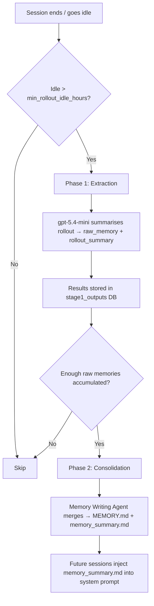

# Codex CLI Memories: Native Session Persistence, Third-Party Memory MCP Servers, and Cross-Session Context Strategies


---

Every Codex CLI session starts with a blank slate. AGENTS.md and skills provide *static* context — project conventions, coding standards, tool preferences — but they cannot encode what happened *last session*: which refactoring approach failed, which API quirk you discovered, which architectural decision you reached after three hours of exploration. That knowledge evaporates when the session ends.

Codex CLI v0.128 ships a native Memories system that addresses this gap, extracting durable insights from completed sessions and injecting them into future ones automatically [^1]. Meanwhile, a growing ecosystem of third-party MCP memory servers — Hindsight, Basic Memory, ctx-memory, MCP Backpack, and Memorix — offers alternative persistence strategies with different trade-offs around privacy, portability, and granularity [^2][^3][^4][^5].

This article covers both layers: how the native system works under the hood, how to configure it, when to supplement it with third-party memory, and which patterns to avoid.

## How Native Memories Work

The native Memories system operates as a two-phase background pipeline that runs after sessions go idle [^1][^6].



### Phase 1: Extraction

When a thread has been idle for at least `min_rollout_idle_hours` (default: 6 hours) and falls within the `max_rollout_age_days` window (default: 30 days), Codex spawns an extraction job [^6]. Up to 8 concurrent extraction jobs process stale threads in parallel, each using `gpt-5.4-mini` to distil the raw `.jsonl` rollout into two outputs:

- **`raw_memory`** — a detailed Markdown summary of discoveries, decisions, and lessons
- **`rollout_summary`** — a compact recap stored under `~/.codex/memories/rollout_summaries/`

### Phase 2: Consolidation

Periodically, a consolidation agent — spawned as a sub-agent with a global lock to prevent races — merges accumulated raw memories into two navigational files [^6]:

- **`MEMORY.md`** — a searchable registry of aggregated insights
- **`memory_summary.md`** — a high-level summary injected into future session system prompts, governed by a ~5,000-token budget

The consolidation prompt also reads from `memories_extensions/` for source-specific signals contributed by plugins or external tools [^6].

### File Structure

```
~/.codex/memories/
├── memory_summary.md          # Injected into system prompt
├── MEMORY.md                  # Searchable insight registry
├── raw_memories.md            # Temporary Phase 2 input
├── rollout_summaries/         # Per-thread recaps
├── memories_extensions/       # Plugin/source-specific inputs
└── skills/                    # Reusable procedures
```

## Enabling and Configuring Native Memories

Memories are off by default. Enable them in `~/.codex/config.toml` [^1][^7]:

```toml
[features]
memories = true
```

The `[memories]` table exposes granular controls [^7]:

```toml
[memories]
generate_memories = true                    # Store new threads for memory inputs
use_memories = true                         # Inject existing memories into sessions
disable_on_external_context = false         # Exclude MCP/web-search threads from generation
min_rollout_idle_hours = 6                  # Hours idle before thread qualifies (1–48)
max_rollout_age_days = 30                   # Thread age window (0–90)
max_rollouts_per_startup = 16              # Rollout candidates per startup (max 128)
max_raw_memories_for_consolidation = 256   # Raw memories retained for consolidation (max 4096)
max_unused_days = 30                        # Days before memory expires from consolidation (0–365)
min_rate_limit_remaining_percent = 25       # Rate-limit headroom required (0–100)
# extract_model = "gpt-5.4-mini"           # Override extraction model
# consolidation_model = "gpt-5.4-mini"     # Override consolidation model
```

### Thread-Level Control

Use `/memories` in the TUI to toggle per-thread behaviour: whether the current session can access existing memories, and whether it contributes to future memory generation [^1].

### Regional Availability

Memories are unavailable in the European Economic Area, the United Kingdom, and Switzerland at launch [^1]. Teams in these regions must rely on AGENTS.md, skills, or third-party MCP memory servers.

## The Third-Party Memory Ecosystem

Native Memories solve the "what did I learn last session?" problem, but they operate within constraints: they are tied to a single `codex_home`, they require idle time before extraction, and they offer no cross-agent portability. Third-party MCP memory servers fill these gaps.

### Hindsight

Hindsight hooks into the Codex CLI lifecycle via Python hook scripts, providing real-time auto-recall and auto-retain [^3]:

```bash
curl -fsSL https://hindsight.vectorize.io/get-codex | bash
```

**How it works:** A `UserPromptSubmit` hook queries the Hindsight memory bank before each prompt, injecting relevant memories as `additionalContext`. A post-response hook retains conversation content for future retrieval [^3].

**Configuration** lives in `~/.hindsight/codex.json`:

```json
{
  "bankId": "codex",
  "recallBudget": "mid",
  "recallMaxTokens": 1024,
  "retainEveryNTurns": 10,
  "retainMode": "chunked"
}
```

**Key differentiator:** Hindsight supports per-project memory banks via dynamic `bankId` resolution based on working directory, and it works across Codex CLI, Claude Code, and other MCP-compatible agents [^3].

### Basic Memory

Basic Memory connects via MCP, storing memories as plain Markdown files that are accessible from any MCP-compatible client [^4]:

```bash
# Local installation
codex mcp add basic-memory bash -c "uvx basic-memory mcp"

# Cloud configuration in ~/.codex/config.toml
[mcp_servers.basic-memory]
url = "https://cloud.basicmemory.com/mcp"
bearer_token_env_var = "BASIC_MEMORY_API_KEY"
```

**Key differentiator:** Markdown-native storage means memories are human-readable, version-controllable, and portable across Codex CLI, Claude Code, and Cursor without format translation [^4].

### ctx-memory

ctx-memory takes a radically local approach: a shell wrapper intercepts tool invocations and fires hooks, then runs a three-layer pipeline (extract → compress to ≤500-token digest → merge into project memory) at session end [^5]:

- No cloud, no telemetry — everything lives in `~/.ctx-memory/store.db` (SQLite)
- Next session gets prior context injected automatically
- Supports Codex CLI, Claude Code, Gemini CLI, and OpenCode

**Key differentiator:** Zero network dependency makes it suitable for air-gapped environments and privacy-sensitive teams [^5].

### MCP Backpack

MCP Backpack stores per-project memories in Git-tracked files, providing portability across machines [^8]:

- Two-layer storage: a speed-optimised local cache plus Git-tracked portable files
- Memories survive machine transfers via `git push`/`git pull`

### Comparison Matrix

| Feature | Native Memories | Hindsight | Basic Memory | ctx-memory | MCP Backpack |
|---------|----------------|-----------|--------------|------------|--------------|
| Setup complexity | Feature flag | Installer script | MCP add | Shell wrapper | MCP server |
| Storage | `~/.codex/memories/` | Cloud or local daemon | Markdown files | Local SQLite | Git-tracked files |
| Cross-agent | No | Yes | Yes | Yes | Yes |
| Real-time recall | No (batch) | Yes (per-prompt) | On-demand | Session start | On-demand |
| Per-project isolation | No | Dynamic bankId | `--project` flag | Per-directory | Per-repo |
| Privacy | Local (no upload) | Configurable | Cloud or local | Fully local | Local + Git |
| Token budget control | ~5,000 system prompt | `recallMaxTokens` | N/A | ≤500-token digest | N/A |
| EU/UK availability | No | Yes | Yes | Yes | Yes |

## Practical Patterns

### Pattern 1: Native Memories for Solo Developers

For individual developers working primarily on one machine, native Memories provide the lowest-friction option:

```toml
[features]
memories = true

[memories]
min_rollout_idle_hours = 1      # Faster extraction for iterative work
max_rollout_age_days = 60       # Longer retention for personal projects
```

### Pattern 2: Hindsight for Cross-Agent Teams

Teams using both Codex CLI and Claude Code benefit from Hindsight's cross-agent recall. Configure dynamic project isolation to prevent cross-contamination:

```json
{
  "bankId": "dynamic",
  "recallBudget": "high",
  "retainEveryNTurns": 5
}
```

### Pattern 3: Native + MCP Layering

Native Memories and third-party MCP memory are not mutually exclusive. A layered approach uses native Memories for Codex-specific session persistence and an MCP server for cross-agent, team-shared knowledge:

```toml
[features]
memories = true

[memories]
disable_on_external_context = true   # Avoid duplicating MCP-sourced context

[mcp_servers.basic-memory]
url = "https://cloud.basicmemory.com/mcp"
bearer_token_env_var = "BASIC_MEMORY_API_KEY"
```

Setting `disable_on_external_context = true` prevents native Memories from re-extracting knowledge that originated from MCP tool calls, avoiding duplication [^7].

### Pattern 4: Air-Gapped Environments

For regulated or air-gapped environments where native Memories may be unavailable (EU/UK regions) or cloud MCP servers are prohibited:

```bash
# Install ctx-memory — fully local, no network
# See https://glama.ai/mcp/servers/GhadiSaab/ctx-memory for setup
```

Combine with AGENTS.md as the static knowledge layer and ctx-memory for dynamic session-to-session persistence [^5].

## Anti-Patterns to Avoid

**Relying on memories for mandatory rules.** Memories are generated state, not configuration. Team-wide coding standards, security policies, and architectural constraints belong in AGENTS.md or `requirements.toml` — not in the memory layer [^1].

**Sharing `~/.codex/memories/` without review.** Memory files may contain sensitive information despite secret redaction. Review before copying to shared locations or committing to repositories [^1].

**Over-extracting with aggressive settings.** Setting `min_rollout_idle_hours = 1` and `max_rollouts_per_startup = 128` generates more memory overhead than most workflows benefit from. Start with defaults and tune based on observed memory quality.

**Running multiple memory systems without deduplication.** Enabling native Memories alongside Hindsight without `disable_on_external_context = true` can produce redundant context injection, consuming token budget without adding value.

## Measuring Memory Effectiveness

The native system tracks memory usage through citation tracking: each time a stage-1 output is injected into a session, the system increments a `usage_count` and updates a `last_usage` timestamp [^6]. Memories that go unused for `max_unused_days` are pruned from consolidation.

For third-party solutions, Hindsight provides debug logging (`"debug": true` in `codex.json`) that shows which memories were recalled and their relevance scores [^3].

A practical signal that memories are working: you stop needing to re-explain project context at the start of each session.

## Citations

[^1]: [Memories — Codex | OpenAI Developers](https://developers.openai.com/codex/memories)
[^2]: [Add Memory to OpenAI Codex — Basic Memory](https://docs.basicmemory.com/integrations/codex)
[^3]: [Codex CLI Persistent Memory with Hindsight | Integration Guide](https://hindsight.vectorize.io/sdks/integrations/codex)
[^4]: [Add Memory to OpenAI Codex — Persistent Development Context — Basic Memory](https://docs.basicmemory.com/integrations/codex)
[^5]: [ctx-memory by GhadiSaab | Glama](https://glama.ai/mcp/servers/GhadiSaab/ctx-memory)
[^6]: [Memories System | openai/codex | DeepWiki](https://deepwiki.com/openai/codex/3.9-memories-system)
[^7]: [Configuration Reference — Codex | OpenAI Developers](https://developers.openai.com/codex/config-reference)
[^8]: [Introducing MCP Backpack: Persistent, Portable Memory for AI Coding Agents | Medium](https://medium.com/codex/introducing-mcp-backpack-persistent-portable-memory-for-ai-coding-agents-87eea16eaa54)
