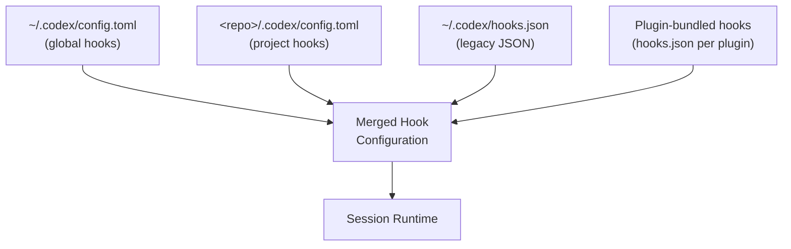
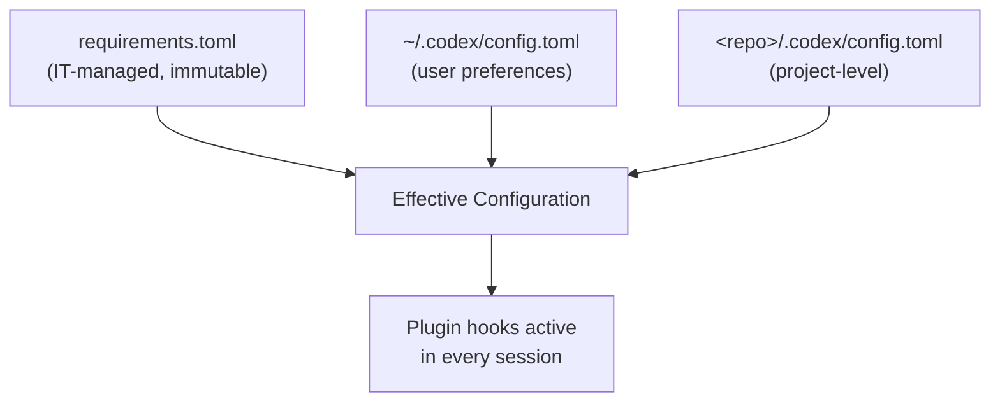

# Codex CLI Plugin-Bundled Hooks: Distributing Reusable Quality Gates Through the Marketplace


---

Codex CLI's hook system has matured steadily since its graduation to stable status in v0.124[^1]. Hooks let you intercept agent actions — blocking dangerous shell commands, validating file edits, injecting context at session start — using scripts that run at well-defined lifecycle points. The trouble, until recently, was distribution. Every team that wanted the same quality gate had to copy `hooks.json` files between repositories, keep them synchronised, and hope nobody forgot to enable the feature flag.

Version 0.128.0, released on 30 April 2026, changes that equation with **plugin-bundled hooks**[^2]. Plugins can now ship their own lifecycle configurations alongside skills, MCP servers, and app connectors. Install a plugin from the marketplace, and its hooks activate automatically — no manual wiring required. This article explains the mechanism, walks through building a plugin that bundles hooks, and covers the governance controls that prevent untrusted plugins from silently injecting policy.

## How Plugin-Bundled Hooks Work

### The Plugin Directory Layout

A Codex plugin is a directory with a `.codex-plugin/plugin.json` manifest at its root[^3]. Hooks live in a `hooks/` directory alongside skills and other components:

```
my-quality-gate/
├── .codex-plugin/
│   └── plugin.json
├── skills/
│   └── lint-check/
│       └── SKILL.md
├── hooks/
│   └── hooks.json
├── scripts/
│   ├── block-force-push.py
│   └── post-edit-lint.sh
└── assets/
    └── icon.png
```

The manifest references the hooks file with a relative path[^3]:

```json
{
  "name": "quality-gate",
  "version": "1.0.0",
  "description": "PreToolUse and PostToolUse guards for team coding standards",
  "skills": "./skills/",
  "hooks": "./hooks/hooks.json",
  "interface": {
    "displayName": "Quality Gate",
    "category": "Governance",
    "capabilities": ["Read"]
  }
}
```

When Codex installs the plugin, it copies the entire bundle — including `hooks/` and `scripts/` — into `~/.codex/plugins/cache/$MARKETPLACE/$PLUGIN_NAME/$VERSION/` and merges the hook definitions into the active session configuration[^3].

### Hook Discovery Order

Codex discovers hooks from multiple sources, evaluated in this order[^4]:



Plugin-bundled hooks merge alongside user-defined and project-defined hooks. When multiple hooks match the same event and tool, they run concurrently — one hook cannot prevent another from executing[^4].

### The Six Hook Events

Plugin-bundled hooks can target any of the six lifecycle events[^4]:

| Event | Fires When | Common Plugin Use |
|-------|-----------|-------------------|
| `SessionStart` | Session begins or resumes | Inject team context, check environment |
| `PreToolUse` | Before a tool call executes | Block dangerous commands, enforce policy |
| `PermissionRequest` | Before approval is needed | Auto-approve trusted patterns |
| `PostToolUse` | After a tool returns output | Run linters, validate edits |
| `UserPromptSubmit` | User submits a prompt | Filter sensitive input |
| `Stop` | Conversation turn ends | Trigger follow-up actions |

## Building a Plugin with Hooks: A Worked Example

Consider a team that wants two quality gates distributed via the marketplace:

1. **PreToolUse**: Block `git push --force` and `rm -rf /` patterns
2. **PostToolUse**: Run the project linter after every `apply_patch` edit

### Step 1: Define the Hooks

Create `hooks/hooks.json`:

```json
{
  "hooks": {
    "PreToolUse": [
      {
        "matcher": "^Bash$",
        "hooks": [
          {
            "type": "command",
            "command": "python3 \"$PLUGIN_DIR/scripts/block-force-push.py\"",
            "timeout": 10,
            "statusMessage": "Checking command safety"
          }
        ]
      }
    ],
    "PostToolUse": [
      {
        "matcher": "^apply_patch$",
        "hooks": [
          {
            "type": "command",
            "command": "bash \"$PLUGIN_DIR/scripts/post-edit-lint.sh\"",
            "timeout": 30,
            "statusMessage": "Running lint check"
          }
        ]
      }
    ]
  }
}
```

### Step 2: Write the Guard Scripts

The PreToolUse script receives JSON on stdin with the `tool_input` field containing the command to be executed[^4]:

```python
#!/usr/bin/env python3
"""Block destructive git and filesystem commands."""
import json, sys, re

data = json.load(sys.stdin)
command = data.get("tool_input", {}).get("command", "")

BLOCKED = [
    r"git\s+push\s+.*--force",
    r"git\s+reset\s+--hard",
    r"rm\s+-rf\s+/",
    r"chmod\s+777",
]

for pattern in BLOCKED:
    if re.search(pattern, command):
        result = {
            "hookSpecificOutput": {
                "hookEventName": "PreToolUse",
                "permissionDecision": "deny",
                "permissionDecisionReason": f"Blocked by quality-gate plugin: matches '{pattern}'"
            }
        }
        json.dump(result, sys.stdout)
        sys.exit(0)

# Allow the command
json.dump({}, sys.stdout)
```

The PostToolUse linter script runs after every file edit:

```bash
#!/usr/bin/env bash
# Run project linter on changed files after apply_patch edits.
set -euo pipefail

INPUT=$(cat)
TOOL_RESPONSE=$(echo "$INPUT" | python3 -c "import json,sys; print(json.load(sys.stdin).get('tool_response',''))")

# Extract file paths from the apply_patch response
FILES=$(echo "$TOOL_RESPONSE" | grep -oP '(?<=Edited: ).*' || true)

if [ -n "$FILES" ]; then
  # Attempt to lint — report but don't block
  if command -v npx &>/dev/null && [ -f "package.json" ]; then
    npx eslint --no-error-on-unmatched-pattern $FILES 2>&1 | head -20
  elif command -v ruff &>/dev/null; then
    ruff check $FILES 2>&1 | head -20
  fi
fi
```

### Step 3: Create the Plugin Manifest

```json
{
  "name": "quality-gate",
  "version": "1.0.0",
  "description": "Blocks destructive commands and runs post-edit linting.",
  "author": {
    "name": "Platform Engineering",
    "email": "platform@example.com"
  },
  "license": "MIT",
  "keywords": ["governance", "linting", "safety"],
  "hooks": "./hooks/hooks.json",
  "interface": {
    "displayName": "Quality Gate",
    "shortDescription": "Guard rails for safe agent coding",
    "category": "Governance",
    "capabilities": ["Read"]
  }
}
```

### Step 4: Publish to a Marketplace

For a team-internal marketplace, create `.agents/plugins/marketplace.json` at the repository root[^3]:

```json
{
  "name": "team-plugins",
  "interface": {
    "displayName": "Platform Engineering Plugins"
  },
  "plugins": [
    {
      "name": "quality-gate",
      "source": {
        "source": "git-subdir",
        "url": "https://github.com/example/codex-plugins.git",
        "path": "./plugins/quality-gate",
        "ref": "main"
      },
      "policy": {
        "installation": "AVAILABLE",
        "authentication": "ON_INSTALL"
      },
      "category": "Governance"
    }
  ]
}
```

Team members then run:

```bash
codex plugin marketplace add example/codex-plugins --ref main
```

## Hook Enablement and Toggle Controls

Version 0.128 added **hook enablement state** — the ability to enable or disable hooks from specific plugins without uninstalling the entire plugin[^2]. This is configured in `config.toml`:

```toml
# Disable hooks from a specific plugin without removing it
[plugins."quality-gate@team-plugins"]
enabled = true
hooks_enabled = false

# Or disable the entire plugin
[plugins."quality-gate@team-plugins"]
enabled = false
```

This separation matters for debugging. When a session behaves unexpectedly, you can temporarily disable plugin hooks to isolate whether the plugin's policy scripts are causing the issue, without losing access to the plugin's skills or MCP servers.

## Enterprise Governance: Managed Configuration

For organisations requiring mandatory quality gates across all developers, Codex's managed configuration system (`requirements.toml`) provides enforcement[^5]:

```toml
# requirements.toml — deployed by IT/platform team
[required_plugins]
"quality-gate@company-plugins" = { min_version = "1.0.0", hooks_enabled = true }

[features]
codex_hooks = true
```

When `requirements.toml` mandates a plugin with `hooks_enabled = true`, individual developers cannot disable those hooks through their personal `config.toml`. This creates a layered governance model:



## Practical Patterns for Plugin Hooks

### Pattern 1: Credential Leak Prevention

A PreToolUse hook that scans Bash commands and apply_patch diffs for secret patterns:

```json
{
  "hooks": {
    "PreToolUse": [
      {
        "matcher": "Bash|apply_patch",
        "hooks": [
          {
            "type": "command",
            "command": "python3 \"$PLUGIN_DIR/scripts/secret-scanner.py\"",
            "timeout": 15,
            "statusMessage": "Scanning for credentials"
          }
        ]
      }
    ]
  }
}
```

### Pattern 2: SessionStart Context Injection

A plugin that injects team-specific context at the start of every session:

```json
{
  "hooks": {
    "SessionStart": [
      {
        "matcher": "startup",
        "hooks": [
          {
            "type": "command",
            "command": "bash \"$PLUGIN_DIR/scripts/inject-context.sh\"",
            "timeout": 10,
            "statusMessage": "Loading team context"
          }
        ]
      }
    ]
  }
}
```

The script's stdout feeds directly into the model's context, making it ideal for injecting sprint goals, deployment freezes, or architecture decision records[^4].

### Pattern 3: Post-Edit Test Runner

A PostToolUse hook that runs relevant tests after every file edit, providing immediate feedback to the agent:

```json
{
  "hooks": {
    "PostToolUse": [
      {
        "matcher": "^apply_patch$",
        "hooks": [
          {
            "type": "command",
            "command": "python3 \"$PLUGIN_DIR/scripts/affected-tests.py\"",
            "timeout": 120,
            "statusMessage": "Running affected tests"
          }
        ]
      }
    ]
  }
}
```

## Current Limitations

Plugin-bundled hooks inherit the same constraints as standalone hooks[^4]:

- **PreToolUse** can only `deny` commands — it cannot modify the tool input (`updatedInput` is parsed but rejected)
- **PostToolUse** cannot modify tool output (`updatedMCPToolOutput` is parsed but not applied)
- Multiple matching hooks run concurrently; one cannot prevent another from executing
- WebSearch and non-MCP tool calls are not yet interceptable
- `$PLUGIN_DIR` path resolution depends on the plugin's cache location, which may vary across installations

⚠️ The `$PLUGIN_DIR` environment variable behaviour for hook commands within plugins is not yet formally documented. The examples above assume Codex resolves plugin-relative paths, which is consistent with how skills reference plugin-local files but may require verification in your specific version.

## What This Means for Teams

Plugin-bundled hooks shift quality gates from a per-repository configuration burden to a distributable, versionable artefact. The practical implications:

- **Platform teams** can publish governance plugins that enforce coding standards, block dangerous patterns, and inject team context — and update them centrally
- **Open source maintainers** can ship contribution-quality plugins that run linters and convention checks for new contributors
- **Enterprise IT** can mandate plugins via `requirements.toml`, ensuring hooks run in every session regardless of individual developer preferences

Combined with v0.128's marketplace installation improvements and remote bundle caching[^2], the distribution friction for team-wide quality gates has dropped significantly. The gap that remains is input/output modification — hooks can block and observe, but cannot yet transform — which limits patterns like automatic import rewriting or output sanitisation. That capability is likely on the roadmap, given that the fields are already parsed.

## Citations

[^1]: OpenAI, "Codex CLI v0.124.0 Changelog — Hooks Graduate to Stable", *OpenAI Developers*, 23 April 2026. [https://developers.openai.com/codex/changelog](https://developers.openai.com/codex/changelog)

[^2]: OpenAI, "Codex CLI v0.128.0 Release Notes", *GitHub Releases*, 30 April 2026. [https://github.com/openai/codex/releases/tag/rust-v0.128.0](https://github.com/openai/codex/releases/tag/rust-v0.128.0)

[^3]: OpenAI, "Build Plugins — Codex", *OpenAI Developers*, 2026. [https://developers.openai.com/codex/plugins/build](https://developers.openai.com/codex/plugins/build)

[^4]: OpenAI, "Hooks — Codex", *OpenAI Developers*, 2026. [https://developers.openai.com/codex/hooks](https://developers.openai.com/codex/hooks)

[^5]: OpenAI, "Advanced Configuration — Codex", *OpenAI Developers*, 2026. [https://developers.openai.com/codex/config-advanced](https://developers.openai.com/codex/config-advanced)
