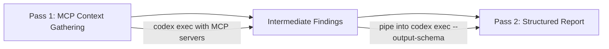

# Codex CLI for Production Log Analysis: Root Cause Pipelines with codex exec, MCP Observability Servers, and Structured Triage Reports


---

Production incidents rarely announce themselves with a single, readable error. They arrive as thousands of log lines across multiple services, peppered with red herrings, interleaved stack traces, and timestamps that only make sense once you already know the answer. Codex CLI — specifically its `codex exec` non-interactive mode — turns this needle-in-a-haystack problem into a composable pipeline: pipe logs in, get structured root cause analysis out, and feed the result into your incident response tooling.

This article covers the full surface area of using Codex CLI for production log triage: shell pipelines, MCP-connected observability platforms, structured output schemas, and practical patterns that fit into on-call workflows.

## Why Codex CLI for Log Analysis?

Traditional log analysis tools excel at indexing and searching but struggle with _interpretation_. An SRE searching Kibana for `ERROR` still needs to read, correlate, and hypothesise. Codex CLI bridges the gap by treating log content as context for a reasoning model[^1].

The key capabilities that make this work:

- **Prompt-plus-stdin**: pipe log content directly into `codex exec` while providing analysis instructions as the prompt argument[^2]
- **Structured output**: constrain the agent's response to a JSON schema via `--output-schema`, producing machine-readable triage reports[^2]
- **MCP integration**: connect to Datadog, Grafana, and Loki MCP servers so the agent can pull live metrics and logs during analysis[^3][^4]
- **Reasoning-token reporting**: `codex exec --json` now reports reasoning-token usage, letting you measure the cost of each analysis run[^5]

## Basic Pipeline: Piping Logs into codex exec

The simplest pattern pipes a log tail directly into `codex exec`:

```bash
tail -n 500 /var/log/app/production.log \
  | codex exec "Identify the root cause of any errors in these logs. \
    Cite specific log lines. Suggest three debugging steps." \
  > triage-report.md
```

Codex treats the piped content as additional context alongside the prompt instruction[^2]. Progress streams to stderr; the final analysis goes to stdout. This separation means you can redirect the report without capturing noise.

For larger log files, pre-filter before piping to stay within context window limits:

```bash
grep -A5 "ERROR\|FATAL\|Exception" /var/log/app/production.log \
  | tail -n 300 \
  | codex exec "Correlate these error patterns. Which errors are symptoms \
    and which is the root cause? Present a timeline." \
  > correlation-report.md
```

### Multi-Service Log Correlation

When an incident spans multiple services, concatenate filtered logs with service markers:

```bash
{
  echo "=== payment-service ==="
  grep "ERROR" /var/log/payment/app.log | tail -n 100
  echo "=== order-service ==="
  grep "ERROR" /var/log/order/app.log | tail -n 100
  echo "=== gateway ==="
  grep "5[0-9][0-9]" /var/log/nginx/error.log | tail -n 50
} | codex exec "These are error logs from three services during an incident \
  at approximately 14:30 UTC. Identify the originating failure, the propagation \
  path, and the downstream effects. Output a timeline." \
  > multi-service-triage.md
```

## Structured Output with --output-schema

Free-text triage reports are useful for humans but awkward for automation. The `--output-schema` flag constrains the agent's response to a JSON Schema, producing output that downstream tools can parse reliably[^2].

Define a schema for incident triage:

```json
{
  "$schema": "https://json-schema.org/draft/2020-12/schema",
  "type": "object",
  "properties": {
    "root_cause": {
      "type": "string",
      "description": "Single-sentence root cause hypothesis"
    },
    "confidence": {
      "type": "string",
      "enum": ["high", "medium", "low"]
    },
    "evidence": {
      "type": "array",
      "items": {
        "type": "object",
        "properties": {
          "log_line": { "type": "string" },
          "service": { "type": "string" },
          "timestamp": { "type": "string" },
          "relevance": { "type": "string" }
        },
        "required": ["log_line", "service", "relevance"],
        "additionalProperties": false
      }
    },
    "timeline": {
      "type": "array",
      "items": {
        "type": "object",
        "properties": {
          "time": { "type": "string" },
          "event": { "type": "string" },
          "service": { "type": "string" }
        },
        "required": ["time", "event"],
        "additionalProperties": false
      }
    },
    "next_steps": {
      "type": "array",
      "items": { "type": "string" }
    },
    "severity": {
      "type": "string",
      "enum": ["critical", "high", "medium", "low"]
    }
  },
  "required": ["root_cause", "confidence", "evidence", "timeline", "next_steps", "severity"],
  "additionalProperties": false
}
```

Run the analysis with schema enforcement:

```bash
tail -n 500 /var/log/app/production.log \
  | codex exec "Analyse these production logs and produce a structured \
    incident triage report." \
    --output-schema ./triage-schema.json \
    -o ./incident-2026-05-01.json
```

The resulting JSON can feed directly into PagerDuty, Jira, or a custom incident dashboard.

> **Known limitation**: `--output-schema` is silently ignored when MCP servers or tools are active in the session[^6]. If you need both MCP context and structured output, run the analysis in two passes — first gather context via MCP, then pipe the findings into a second `codex exec` call with `--output-schema`.

## MCP-Connected Observability: Datadog, Grafana, and Loki

Piping local log files works for simple cases, but production incidents often require correlating logs with metrics, traces, and alerts. MCP servers from Datadog and Grafana bring observability data directly into the agent's context.

### Datadog MCP Server

The Datadog MCP Server went GA on 10 March 2026 as a remote server — no local installation required[^3]. It exposes 16+ tools covering logs, APM traces, error tracking, alerting, and infrastructure metrics.

Configure it in `~/.codex/config.toml`:

```toml
[mcp_servers.datadog]
type = "remote"
url = "https://mcp.datadoghq.com/sse"
headers = { "DD-API-KEY" = "${DD_API_KEY}", "DD-APPLICATION-KEY" = "${DD_APP_KEY}" }
```

With Datadog connected, you can ask Codex to pull live context during analysis:

```bash
codex exec "Investigate the spike in 500 errors on payment-service \
  between 14:00 and 14:30 UTC today. Query Datadog for related logs, \
  APM traces, and infrastructure metrics. Identify the root cause \
  and suggest a fix."
```

The agent will call Datadog's MCP tools — `search_logs`, `get_trace`, `get_metric_timeseries` — to gather evidence before producing its analysis[^3].

### Grafana and Loki MCP Servers

Grafana maintains two complementary MCP servers: `mcp-grafana` for dashboards, alerting, and Prometheus metrics, and `loki-mcp` for deep log querying via LogQL[^4].

```toml
[mcp_servers.grafana]
type = "stdio"
command = "npx"
args = ["-y", "@grafana/mcp-grafana"]
env = { "GRAFANA_URL" = "https://grafana.internal.example.com", "GRAFANA_API_KEY" = "${GRAFANA_API_KEY}" }

[mcp_servers.loki]
type = "stdio"
command = "npx"
args = ["-y", "@grafana/loki-mcp"]
env = { "LOKI_URL" = "https://loki.internal.example.com", "LOKI_API_KEY" = "${LOKI_API_KEY}" }
```

The Loki MCP server supports querying logs via LogQL, retrieving label values, and identifying log patterns — detected automatically by Loki to surface common log structures and anomalies[^4].

```bash
codex exec "Query Loki for all error-level logs from the checkout \
  service in the last hour. Cross-reference with Grafana alerting \
  to identify any triggered alerts. Produce a root cause analysis."
```

### Architecture: Two-Pass Pattern for MCP + Structured Output

Because `--output-schema` is silently ignored when MCP tools are active[^6], use a two-pass approach:



```bash
# Pass 1: Gather context from observability tools
codex exec "Query Datadog for error logs and APM traces from \
  payment-service between 14:00-14:30 UTC. Summarise findings \
  as a plain-text evidence brief." > /tmp/evidence.txt

# Pass 2: Produce structured report from evidence
cat /tmp/evidence.txt \
  | codex exec "Convert this evidence brief into a structured \
    incident triage report." \
    --output-schema ./triage-schema.json \
    -o ./incident-report.json
```

## Practical On-Call Integration

### Automated Triage on Alert

Wire log analysis into your alerting pipeline. When PagerDuty fires, a webhook triggers a script that:

1. Pulls recent logs from the affected service
2. Runs `codex exec` with the triage schema
3. Posts the structured report back to the incident channel

```bash
#!/usr/bin/env bash
# on-call-triage.sh — triggered by PagerDuty webhook
SERVICE="$1"
WINDOW_MINS="${2:-30}"

# Pull logs from the last N minutes
journalctl -u "$SERVICE" --since "-${WINDOW_MINS}min" --no-pager \
  | codex exec "Triage these logs for service $SERVICE. \
    Identify the root cause, severity, and recommended next steps." \
    --output-schema ./triage-schema.json \
    -o "/tmp/triage-${SERVICE}-$(date +%s).json" \
    --ephemeral

# Post to Slack via webhook
jq -r '"*Root Cause*: \(.root_cause)\n*Severity*: \(.severity)\n*Confidence*: \(.confidence)\n*Next Steps*:\n\(.next_steps | map("- " + .) | join("\n"))"' \
  "/tmp/triage-${SERVICE}-$(date +%s).json" \
  | curl -X POST -H 'Content-type: application/json' \
    --data "{\"text\": \"$(cat -)\"}" \
    "$SLACK_WEBHOOK_URL"
```

### Cost-Aware Analysis with Reasoning-Token Tracking

Since v0.125.0, `codex exec --json` reports reasoning-token usage alongside completion tokens[^5]. For log analysis — which can involve large context — tracking this prevents cost surprises:

```bash
tail -n 500 /var/log/app/production.log \
  | codex exec --json "Triage these logs" 2>/dev/null \
  | jq 'select(.type == "turn.completed") | .usage'
```

Sample output:

```json
{
  "input_tokens": 12847,
  "output_tokens": 1523,
  "reasoning_tokens": 4096,
  "cached_input_tokens": 8192
}
```

The `reasoning_tokens` field reveals how much "thinking" the model spent. For routine triage, consider lowering reasoning effort:

```bash
codex exec -c 'model_reasoning_effort="medium"' \
  "Triage these logs" < /var/log/app/production.log
```

### AGENTS.md Template for Incident Response Repositories

If your team maintains a dedicated incident response repository, add an `AGENTS.md` that primes the agent for log analysis:

```markdown
# AGENTS.md — Incident Response Repository

## Context
This repository contains incident post-mortems, runbooks, and triage
automation scripts.

## When analysing logs
- Always produce a timeline of events
- Distinguish root cause from symptoms
- Cite specific log lines as evidence
- Rate confidence: high, medium, or low
- Suggest concrete next steps, not generic advice

## Service topology
- gateway → order-service → payment-service → ledger-db
- All services log to /var/log/{service}/app.log
- Metrics are in Datadog; logs are in Grafana Loki

## Style
- Use ISO 8601 timestamps
- Refer to services by their deployment name
- Be terse — on-call engineers are reading this at 3 AM
```

## Model Selection for Log Analysis

Not every log triage task needs GPT-5.5. Match the model to the complexity:

| Task | Recommended Model | Reasoning Effort |
|---|---|---|
| Simple grep + summarise | `gpt-5.4-mini` | `low` |
| Multi-service correlation | `gpt-5.4` | `medium` |
| Complex distributed system RCA | `gpt-5.5` | `high` |
| Quick error count and categorise | `gpt-5.4-mini` | `low` |
| Post-mortem draft from logs | `gpt-5.5` | `medium` |

Configure profiles for different triage scenarios:

```toml
[profiles.quick-triage]
model = "gpt-5.4-mini"
model_reasoning_effort = "low"

[profiles.deep-rca]
model = "gpt-5.5"
model_reasoning_effort = "high"
```

```bash
# Quick triage
tail -n 100 app.log | codex exec --profile quick-triage "summarise errors"

# Deep root cause analysis
cat full-incident-logs.txt | codex exec --profile deep-rca \
  "Full root cause analysis with timeline and evidence"
```

## Limitations and Caveats

- **Context window limits**: GPT-5.5 supports up to 1M tokens of context[^7], but piping 50,000 log lines is wasteful. Pre-filter with `grep`, `awk`, or `jq` before piping.
- **Schema + MCP conflict**: `--output-schema` is silently ignored when MCP tools are active[^6]. Use the two-pass pattern described above.
- **No streaming analysis**: `codex exec` processes the entire input before responding. For real-time log monitoring, use `codex exec` in a cron loop or wire it into a log aggregator's alerting pipeline.
- **Hallucination risk**: the model may invent plausible-sounding root causes from ambiguous logs. Always verify the cited log lines exist in the original output. Lower reasoning effort can increase tool hallucination rates[^8].
- **Cost accumulation**: large log files consume significant input tokens. A 500-line log at ~10 tokens per line is ~5,000 input tokens — manageable. A 50,000-line dump is not. ⚠️ Monitor reasoning-token usage with `--json` to avoid billing surprises.

## Citations

[^1]: OpenAI, "Codex CLI", [developers.openai.com/codex/cli](https://developers.openai.com/codex/cli), accessed 2026-05-01
[^2]: OpenAI, "Non-interactive mode — Codex", [developers.openai.com/codex/noninteractive](https://developers.openai.com/codex/noninteractive), accessed 2026-05-01
[^3]: Datadog, "OpenAI + Datadog: Codex CLI integration for AI-assisted DevOps", [datadoghq.com/blog/openai-datadog-ai-devops-agent](https://www.datadoghq.com/blog/openai-datadog-ai-devops-agent/), accessed 2026-05-01
[^4]: Grafana Labs, "MCP server for Grafana / Loki MCP", [github.com/grafana/mcp-grafana](https://github.com/grafana/mcp-grafana) and [github.com/grafana/loki-mcp](https://github.com/grafana/loki-mcp), accessed 2026-05-01
[^5]: OpenAI, "Codex Changelog — v0.125.0 (April 2026)", [developers.openai.com/codex/changelog](https://developers.openai.com/codex/changelog), accessed 2026-05-01
[^6]: openai/codex Issue #15451, "--json and --output-schema are silently ignored when tools/MCP servers are active", [github.com/openai/codex/issues/15451](https://github.com/openai/codex/issues/15451), accessed 2026-05-01
[^7]: OpenAI, "Introducing GPT-5.4", [openai.com/index/introducing-gpt-5-4](https://openai.com/index/introducing-gpt-5-4/), March 2026
[^8]: "The Reasoning Trap: Why Higher Reasoning Effort Increases Tool Hallucination", Codex Blog, [codex.danielvaughan.com/2026/04/29/reasoning-trap-tool-hallucination-codex-cli-reasoning-effort-defence](https://codex.danielvaughan.com/2026/04/29/reasoning-trap-tool-hallucination-codex-cli-reasoning-effort-defence/), 2026-04-29
