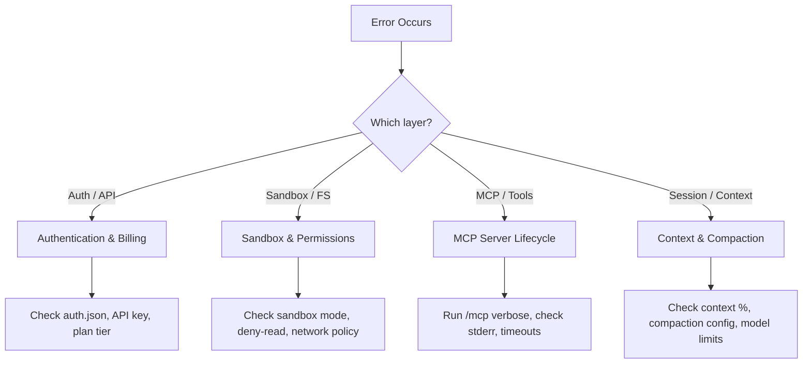

# Codex CLI Troubleshooting Field Guide: Diagnosing and Fixing the Most Common Errors


Every Codex CLI practitioner eventually hits an error that halts a session. The frustration is compounded when the error message is terse and the fix is not obvious. This field guide catalogues the most common Codex CLI errors as of v0.128, explains the root cause of each, and provides the fastest path to resolution. Bookmark it — you will need it.

## The Diagnostic Mindset

Before diving into specific errors, establish a triage routine. Codex CLI surfaces errors from four distinct layers, and knowing *which* layer produced the message determines where to look:



Useful first steps for any error:

```bash
# Check your Codex version
codex --version

# View active configuration (merged from all layers)
codex config show

# Check MCP server health
# (inside a TUI session, type /mcp verbose)
```

---

## Authentication and Billing Errors

### `401 Unauthorized — Invalid API key`

**Root cause:** The `OPENAI_API_KEY` environment variable is unset, contains trailing whitespace, or holds a revoked key[^1].

**Fix:**

```bash
# Verify the stored value (look for trailing spaces or quotes)
echo "[$OPENAI_API_KEY]"

# Clear cached credentials and re-authenticate
rm -f ~/.codex/auth.json
codex logout
export OPENAI_API_KEY  # set to your platform API key
```

If you use ChatGPT subscription auth instead of an API key, ensure you have run `codex login` and that `~/.codex/auth.json` exists. Treat this file like a password — it contains access tokens[^2].

### `429 Too Many Requests — Rate limit exceeded`

**Root cause:** You have exceeded your plan's per-window rate limit. On ChatGPT Plus this resets every five hours; on Pro and API plans the windows and thresholds differ[^3]. A known bug can trigger 429s even when the dashboard shows remaining quota[^4].

**Fix:**

1. Wait for the retry-after period (typically 60 seconds for transient 429s).
2. If you are on a ChatGPT plan, check `Settings → Usage` in the ChatGPT web interface for your actual remaining quota.
3. Switch to a cheaper model for routine tasks: `codex -m gpt-5.4-mini` or `codex -m codex-spark` will consume fewer credits per turn[^5].
4. If the error persists despite visible quota, clear your session and retry — stale session tokens occasionally cause phantom 429s[^4].

### `You've hit your usage limit`

**Root cause:** Your subscription plan's weekly or five-hour spending cap has been reached. Several users have reported this appearing prematurely, with GitHub Issues #12299 and #11508 tracking the problem[^6].

**Fix:** If you have remaining quota on the dashboard, try `codex logout && codex login` to refresh your session token. If the cap is genuinely reached, wait for the window to reset or switch to API key billing where you control the budget directly.

### Silent switch to API key billing

**Root cause:** When `OPENAI_API_KEY` is present in the environment alongside a ChatGPT login, Codex may silently prefer the API key, causing unexpected charges[^7].

**Fix:**

```bash
# Remove the environment variable if you intend to use ChatGPT auth
unset OPENAI_API_KEY

# Or force the login method in config.toml
# [auth]
# forced_login_method = "chatgpt"
```

---

## Sandbox and Permissions Errors

### `PermissionError: Operation not permitted — sandbox policy violation`

**Root cause:** The Codex sandbox (Landlock on Linux, Seatbelt on macOS, AppContainer on Windows) has blocked an operation that falls outside your current permission profile[^8].

**Fix:** Determine *what* was blocked. The error context usually names the path or syscall.

```toml
# In ~/.codex/config.toml, choose a profile that fits your workflow:
[profile.dev]
sandbox = "workspace-write"
approval_policy = "unless-allow-listed"
```

Common scenarios:

- **Writing outside the workspace:** Switch from `read-only` to `workspace-write` sandbox mode.
- **Network access denied:** Set `sandbox_workspace_write.network_access = true` in your profile or use `--sandbox full-auto`[^9].
- **Accessing `/tmp` or home directory:** These are intentionally restricted. Use `--cd` to ensure Codex operates from your project root.

### `FileNotFoundError: No such file or directory` (inside sandbox)

**Root cause:** The sandbox only sees files tracked by Git. Untracked files, `.env` files in `.gitignore`, and files outside the working tree are invisible to the agent[^10].

**Fix:**

```bash
# Stage the file so the sandbox can see it
git add path/to/new-file.ts

# Or for .env files, pass values via config.toml instead:
# [shell_environment_policy]
# inherit = "allowlist"
# allow = ["DATABASE_URL", "NODE_ENV"]
```

### `failed in sandbox` (intermittent, commands succeed on retry)

**Root cause:** A race condition in sandbox initialisation, particularly on WSL2 and older macOS versions. This is a known issue tracked in GitHub Issue #4934[^11].

**Fix:** Retry the command. If it recurs consistently, check your Codex version — `codex update` to v0.128+ includes fixes for several sandbox edge cases. On WSL2, ensure you are running WSL2 (not WSL1) as bubblewrap requires it since v0.115[^12].

---

## MCP Server Errors

### MCP server timeout on startup

**Root cause:** The default MCP startup timeout is 10 seconds. Large MCP servers (particularly those pulling remote schemas or running Docker containers) often exceed this[^13].

**Fix:**

```toml
# In config.toml, increase the startup timeout
[[mcp_servers]]
name = "my-slow-server"
command = "npx"
args = ["-y", "@my-org/mcp-server"]
startup_timeout_seconds = 30
tool_timeout_seconds = 120
```

Run `/mcp verbose` inside a TUI session to see the full initialisation log and identify where the server stalls.

### `user cancelled MCP tool call` (under managed sandbox)

**Root cause:** When using `read-only` or `workspace-write` sandbox modes, Codex may block MCP tool calls that it classifies as write operations. This is a known issue with v0.125 alpha builds[^14].

**Fix:**

1. Upgrade to v0.128 stable where this is partially resolved.
2. Explicitly allow specific MCP tools in your permission profile:

```toml
[sandbox_workspace_write]
mcp_tool_policy = "allow-listed"
mcp_tool_allowlist = ["my-server:read_data", "my-server:search"]
```

### MCP server crashes silently

**Root cause:** stdio-based MCP servers write errors to stderr, which Codex does not surface by default[^13].

**Fix:**

```bash
# Test the MCP server standalone first
echo '{"jsonrpc":"2.0","method":"initialize","id":1,"params":{"protocolVersion":"2025-11-25","capabilities":{},"clientInfo":{"name":"test","version":"1.0"}}}' | npx -y @my-org/mcp-server 2>mcp-errors.log

# Check the error log
cat mcp-errors.log
```

Inside a running session, `/mcp verbose` exposes the server's stderr output and connection state.

---

## Context and Compaction Errors

### `high demand` error during compaction

**Root cause:** Server-side auto-compaction is an API call that can fail during periods of high platform load. When compaction fails, subsequent API calls may also fail as the context exceeds limits[^15].

**Fix:**

1. Wait 30–60 seconds and retry. Compaction failures are transient.
2. Use `/compact` manually before the context fills — do not wait for auto-compaction.
3. For long sessions, adopt a checkpoint pattern: `/compact` after each major milestone, and `/fork` to continue with a clean context when the session becomes unwieldy[^16].

### `Maximum context length exceeded`

**Root cause:** Your prompt plus the accumulated conversation exceeds the model's context window (400K tokens for GPT-5.5 in Codex, smaller for other models)[^17].

**Fix:**

```toml
# Lower the compaction threshold to trigger earlier
[model]
compaction_threshold = 0.7  # compact at 70% context usage
```

Alternatively, target specific files with `@path/to/file.ts` rather than letting the agent read entire directories. For large codebases, prefer semantic search MCP servers (CocoIndex, SymDex) over brute-force file reads[^18].

### Chat history disappearing mid-session

**Root cause:** Auto-compaction summarises and evicts earlier turns to stay within the context window. This is expected behaviour, not data loss. The full session is preserved in rollout files[^19].

**Fix:** If you need to reference earlier context, use `/fork` to create a branch from the current state, or check `~/.codex/sessions/` for the complete JSONL rollout log.

---

## Installation and Environment Errors

### `EACCES: permission denied, access '/usr/local/lib/node_modules'`

**Root cause:** npm is installed system-wide and requires root for global packages[^1].

**Fix:**

```bash
# Use nvm to install Node.js in your home directory
curl -o- https://raw.githubusercontent.com/nvm-sh/nvm/v0.40.2/install.sh | bash
nvm install --lts
npm i -g @openai/codex
```

Or use Homebrew on macOS: `brew install codex`[^20].

### `codex update` fails or is not recognised

**Root cause:** The `codex update` self-update command was added in v0.128. Earlier versions do not have it[^21].

**Fix:**

```bash
# If codex update is not available, update via your package manager
npm update -g @openai/codex
# or
brew upgrade codex
```

### PowerShell execution policy blocks installation (Windows)

**Root cause:** Windows default execution policy prevents running npm post-install scripts[^1].

**Fix:**

```powershell
Set-ExecutionPolicy -Scope CurrentUser -ExecutionPolicy RemoteSigned
```

Alternatively, use Git Bash or WSL2 where this restriction does not apply.

---

## Remote and App-Server Errors

### WebSocket connection drops under load

**Root cause:** The app-server WebSocket transport can fail to drain events during heavy tool-use sequences, particularly in v0.125 and earlier[^22].

**Fix:** Upgrade to v0.128, which includes reliability fixes for WebSocket event draining and shutdown handling. If running behind a reverse proxy, ensure WebSocket upgrade headers are forwarded and idle timeouts are set to at least 300 seconds.

### Device code authentication fails in headless environments

**Root cause:** The default browser-based login flow cannot open a browser in SSH sessions, containers, or CI environments[^2].

**Fix:**

```bash
# Use device code flow (beta)
codex login --method device-code

# Or copy auth.json from a machine where you can log in
scp ~/.codex/auth.json remote-host:~/.codex/auth.json

# Or use SSH port forwarding for the callback
ssh -L 1455:localhost:1455 remote-host
# Then run codex login on the remote machine
```

---

## The Quick-Reference Decision Table

| Symptom | Likely Cause | First Action |
|---------|-------------|--------------|
| `401 Unauthorized` | Bad or missing API key | `echo $OPENAI_API_KEY`, check for spaces |
| `429 Too Many Requests` | Rate limit hit | Wait, check dashboard, try cheaper model |
| `sandbox policy violation` | Operation outside sandbox scope | Check sandbox mode in active profile |
| `FileNotFoundError` in sandbox | File not tracked by Git | `git add` the file |
| MCP server timeout | Slow server startup | Increase `startup_timeout_seconds` |
| `high demand` on compaction | Server-side load | Wait and retry, or manual `/compact` |
| Context length exceeded | Session too large | `/compact`, `/fork`, or start fresh |
| `EACCES` on npm install | System-wide npm | Use nvm or Homebrew |
| WebSocket drops | App-server transport bug | Upgrade to v0.128+ |
| Auth loop or silent billing | Mixed auth methods | Unset `OPENAI_API_KEY` or force method |

---

## When to Escalate

If none of the above resolves your issue:

1. **Check the GitHub Issues** at [github.com/openai/codex/issues](https://github.com/openai/codex/issues) — search for your error message.
2. **File a bug report** with your Codex version (`codex --version`), OS, the full error output, and your config (redact API keys).
3. **Use `/feedback`** inside a TUI session to send a report with optional session context directly to OpenAI.
4. **Check logs** at `~/.codex/sessions/` for session rollout files and at `~/Library/Logs/com.openai.codex/` (macOS) for app logs[^23].

---

## Citations

[^1]: Codex CLI Installation and Error Messages Troubleshooting Guide. *uniflow.kr*, 2026. [https://www.uniflow.kr/en/codex-cli-install-setup-troubleshooting-guide/](https://www.uniflow.kr/en/codex-cli-install-setup-troubleshooting-guide/)

[^2]: Authentication — Codex. *OpenAI Developers*, 2026. [https://developers.openai.com/codex/auth](https://developers.openai.com/codex/auth)

[^3]: Pricing — Codex. *OpenAI Developers*, 2026. [https://developers.openai.com/codex/pricing](https://developers.openai.com/codex/pricing)

[^4]: "Improper 429 error near the end of a 5-hour window." *GitHub Issue #9135*, openai/codex. [https://github.com/openai/codex/issues/9135](https://github.com/openai/codex/issues/9135)

[^5]: Codex CLI Models. *OpenAI Developers*, 2026. [https://developers.openai.com/codex/models](https://developers.openai.com/codex/models)

[^6]: "You've hit your usage limit despite 10% remaining." *GitHub Issue #12299*, openai/codex. [https://github.com/openai/codex/issues/12299](https://github.com/openai/codex/issues/12299)

[^7]: "Codex silently switches to API key auth when environment variable is present." *GitHub Issue #20099*, openai/codex. [https://github.com/openai/codex/issues/20099](https://github.com/openai/codex/issues/20099)

[^8]: Agent Approvals and Security — Codex. *OpenAI Developers*, 2026. [https://developers.openai.com/codex/agent-approvals-security](https://developers.openai.com/codex/agent-approvals-security)

[^9]: Configuration Reference — Codex. *OpenAI Developers*, 2026. [https://developers.openai.com/codex/config-reference](https://developers.openai.com/codex/config-reference)

[^10]: "Commands failed to run in sandbox in Codex CLI." *GitHub Issue #4934*, openai/codex. [https://github.com/openai/codex/issues/4934](https://github.com/openai/codex/issues/4934)

[^11]: Ibid.

[^12]: Windows — Codex. *OpenAI Developers*, 2026. [https://developers.openai.com/codex/windows](https://developers.openai.com/codex/windows)

[^13]: Model Context Protocol — Codex. *OpenAI Developers*, 2026. [https://developers.openai.com/codex/mcp](https://developers.openai.com/codex/mcp)

[^14]: "Codex CLI 0.125.0-alpha.3 cancels MCP tool calls under read-only/workspace-write sandbox." *OpenAI Developer Community*, 2026. [https://community.openai.com/t/codex-cli-0-125-0-alpha-3-cancels-mcp-tool-calls-under-read-only-workspace-write-sandbox/1379772](https://community.openai.com/t/codex-cli-0-125-0-alpha-3-cancels-mcp-tool-calls-under-read-only-workspace-write-sandbox/1379772)

[^15]: "High API error rate during remote compaction." *GitHub Issue #15105*, openai/codex. [https://github.com/openai/codex/issues/15105](https://github.com/openai/codex/issues/15105)

[^16]: Slash Commands in Codex CLI. *OpenAI Developers*, 2026. [https://developers.openai.com/codex/cli/slash-commands](https://developers.openai.com/codex/cli/slash-commands)

[^17]: GPT-5.5 Million-Token Context Window. *OpenAI Developers*, 2026. [https://developers.openai.com/codex/models](https://developers.openai.com/codex/models)

[^18]: Semantic Code Search for Codex CLI. *Codex Blog*, 2026-04-27. [https://codex.danielvaughan.com/2026/04/27/codex-cli-semantic-code-search/](https://codex.danielvaughan.com/2026/04/27/codex-cli-semantic-code-search/)

[^19]: Features — Codex CLI. *OpenAI Developers*, 2026. [https://developers.openai.com/codex/cli/features](https://developers.openai.com/codex/cli/features)

[^20]: CLI — Codex. *OpenAI Developers*, 2026. [https://developers.openai.com/codex/cli](https://developers.openai.com/codex/cli)

[^21]: Codex CLI v0.128.0 Release Notes. *GitHub*, openai/codex, 2026-04-30. [https://github.com/openai/codex/releases](https://github.com/openai/codex/releases)

[^22]: Changelog — Codex. *OpenAI Developers*, 2026. [https://developers.openai.com/codex/changelog](https://developers.openai.com/codex/changelog)

[^23]: Troubleshooting — Codex App. *OpenAI Developers*, 2026. [https://developers.openai.com/codex/app/troubleshooting](https://developers.openai.com/codex/app/troubleshooting)
