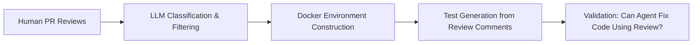
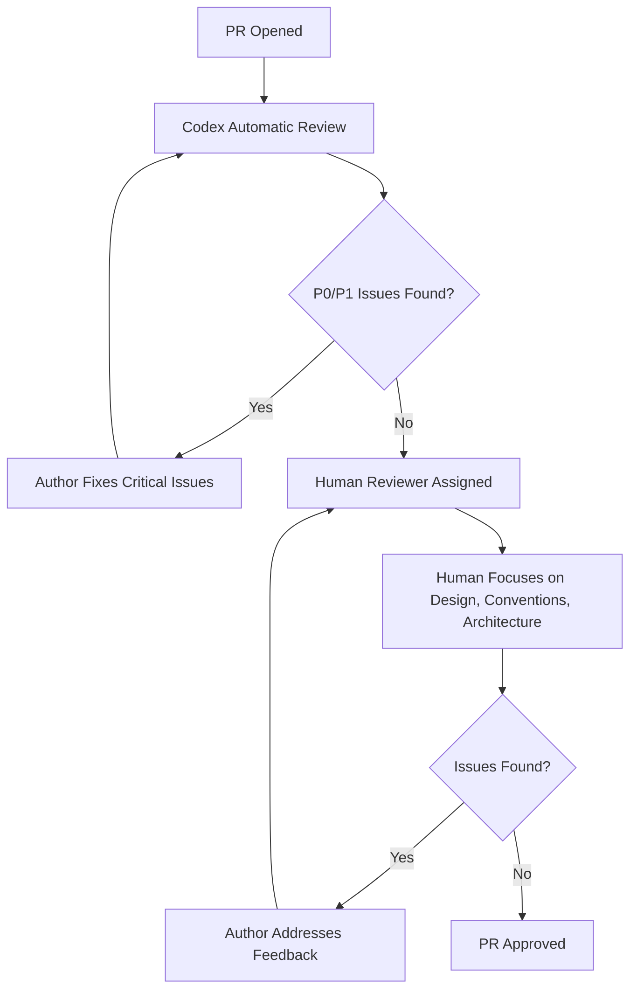

# The Code Review Agent Benchmark: What CR-bench Reveals and How to Configure Codex CLI for Higher-Quality Reviews


---

Every team that has enabled automated code review — whether through Codex's GitHub integration, Claude Code, Devin, or the open-source PR-Agent — has wondered the same thing: how good are these reviews, really? In March 2026, researchers at the National University of Singapore published **CR-bench**, the first rigorous executable benchmark for code review agents [^1]. The results are sobering: the four agents tested, taken together, pass only 41.5% of the benchmark's tests. Codex scored 20.1% out of the box.

That number deserves context rather than alarm. The benchmark's own analysis shows that 84% of agent-generated review comments are genuinely useful [^1] — the low pass rate reflects a mismatch in *what* agents look at, not an inability to find real issues. This article unpacks the CR-bench methodology, examines where Codex's review capabilities excel and where they fall short, and provides concrete configuration patterns to close the gap.

---

## How CR-bench Works

Traditional evaluations of code review agents rely on textual similarity: does the agent's comment match the human reviewer's wording? This approach is fundamentally flawed. The CR-bench authors demonstrate that an agent can identify the same bug with completely different phrasing, score near zero on n-gram metrics, yet still enable a correct fix [^1].

CR-bench replaces textual similarity with **executable tests**. The pipeline has four stages:



1. **Review filtering** — An LLM classifier selects actionable review comments from real pull requests, calibrated against 100 manually annotated examples [^1].
2. **Environment construction** — Each PR is reproduced in a Docker container with full dependency installation.
3. **Test generation** — Natural-language review comments are converted into executable tests through execution-guided refinement.
4. **Validation** — A coding agent attempts to revise the code using the generated review feedback. If the test passes, the review successfully identified an actionable issue.

The resulting dataset, **c-CRAB**, contains tests derived from real-world pull requests across multiple open-source repositories [^1].

---

## The Scoreboard

| Agent | Pass Rate | Strengths | Weaknesses |
|-------|-----------|-----------|------------|
| Claude Code | 32.1% | Broadest coverage | Suggests alternative fixes to what humans intended |
| Devin | 24.8% | Good at robustness issues | Misses design concerns |
| PR-Agent | 23.1% | Consistent on functional correctness | Limited context awareness |
| Codex | 20.1% | Strong on edge cases and robustness | Under-reports maintainability, documentation |
| **All four combined** | **41.5%** | — | — |

*Source: Zhang et al., CR-bench [^1]*

The combined score of 41.5% tells us something crucial: these agents find **different things**. There is remarkably little overlap between the issues each tool flags [^1]. This has direct implications for configuration — the goal is not to replace human review but to maximise the unique value an agent brings to the review cycle.

---

## Where Codex Reviews Excel

CR-bench categorises review comments into six types. Codex's review engine — the same one powering `@codex review` on GitHub PRs and the `/review` slash command in the CLI [^2] — performs strongest in two areas:

### Robustness and Edge Cases

Codex generates significantly more robustness-related comments than human reviewers [^1]. It catches unsafe indexing, missing null checks, unhandled error paths, and boundary conditions that humans routinely overlook during review. In the benchmark's concrete example, a human flagged unsafe nested indexing (`keyboard[0][0]` before validation), and Codex identified the same issue independently, albeit with different wording [^1].

### Functional Correctness

When the logic is simply wrong — an off-by-one error, an inverted condition, a missing return — Codex catches it reliably. This aligns with the model's training on code generation and bug-fixing tasks [^3].

---

## Where Codex Reviews Fall Short

### Maintainability and Design (7.9%–27.0% Pass Rate)

This is the largest gap. Codex under-reports concerns about API design, abstraction boundaries, naming consistency, and architectural coherence [^1]. These are precisely the review comments that require deep repository context — the kind of knowledge a long-tenured maintainer carries implicitly.

### Documentation

Agents produce substantially fewer documentation-related comments than humans [^1]. Missing docstrings, outdated README sections, and changelog omissions slip through.

### Repository-Specific Conventions

Domain-specific patterns — naming schemes, import ordering preferences, commit message formats, test file organisation — are invisible to the model unless explicitly documented [^1]. This is the most actionable gap for Codex CLI users.

---

## Closing the Gap: Practical Codex CLI Configuration

The CR-bench findings map directly onto Codex CLI's configuration surface. The benchmark's recommendation to "integrate repository context" through architecture notes and style guides [^1] is precisely what `AGENTS.md` was designed for [^4].

### 1. Write Review-Specific AGENTS.md Sections

Create a dedicated review guidelines section in your project's `AGENTS.md`:

```markdown
## Review Guidelines

### Priority Classification
- **P0**: Security vulnerabilities, data loss risks, authentication bypasses
- **P1**: Logic errors, race conditions, missing error handling, API contract violations
- **P2**: Naming inconsistencies, missing tests for new code paths, documentation gaps
- **P3**: Style nits, formatting, minor readability improvements

### Repository Conventions
- All public API methods require JSDoc with @param and @returns
- Error handling: use Result<T, AppError> — never unwrap() in library code
- Test files mirror source structure: src/foo/bar.ts → tests/foo/bar.test.ts
- Imports: stdlib first, then external deps, then internal — separated by blank lines

### Design Review Checklist
- Does this change respect existing abstraction boundaries?
- Are new public interfaces minimal and consistent with adjacent APIs?
- Could this be achieved with less surface area?
```

This directly addresses the maintainability and convention gaps that CR-bench identified. Codex applies guidance from the closest `AGENTS.md` to each changed file, so place more specific instructions deeper in the tree when particular packages need extra scrutiny [^2].

### 2. Create a Dedicated code_review.md

For teams with extensive review standards, extract them into a separate file and reference it from `AGENTS.md`:

```markdown
## Review
See `code_review.md` for full review guidelines.
```

This keeps `AGENTS.md` manageable while giving the review context room to be comprehensive [^5].

### 3. Use Custom /review Instructions

The `/review` slash command in Codex CLI accepts custom focus instructions [^5]:

```
/review Focus on API design consistency and documentation completeness
```

For GitHub PR reviews, append context to the trigger:

```
@codex review for maintainability regressions and naming consistency
```

This steers the model towards the exact categories where CR-bench showed agents under-perform.

### 4. Layer a PostToolUse Hook for Documentation Checks

CR-bench found agents miss documentation gaps. A `PostToolUse` hook can enforce documentation standards automatically:

```toml
# .codex/config.toml
[[hooks]]
event = "PostToolUse"
command = "python3 .codex/hooks/check_docstrings.py"
timeout_ms = 10000
```

```python
#!/usr/bin/env python3
# .codex/hooks/check_docstrings.py
import json, sys, ast, os

event = json.loads(os.environ.get("CODEX_HOOK_EVENT", "{}"))
tool_name = event.get("tool_name", "")

if tool_name != "apply_patch":
    sys.exit(0)

file_path = event.get("tool_input", {}).get("path", "")
if not file_path.endswith(".py"):
    sys.exit(0)

try:
    with open(file_path) as f:
        tree = ast.parse(f.read())
    missing = []
    for node in ast.walk(tree):
        if isinstance(node, (ast.FunctionDef, ast.AsyncFunctionDef, ast.ClassDef)):
            if not ast.get_docstring(node) and not node.name.startswith("_"):
                missing.append(f"  - {node.name} (line {node.lineno})")
    if missing:
        print(f"WARNING: Public symbols missing docstrings in {file_path}:")
        print("\n".join(missing))
except Exception:
    pass
```

### 5. Combine Agent Review with Human Review

The most important CR-bench finding is that agent reviews and human reviews are **complementary**, not substitutional [^1]. The optimal workflow uses both:



This workflow lets Codex handle the robustness and correctness sweep first — where it outperforms humans on coverage — while human reviewers focus on maintainability, design, and conventions — where agents score worst [^1].

---

## Measuring Improvement

CR-bench's executable test approach suggests a measurement strategy for your own review quality. Track these metrics over time:

1. **Review escape rate** — issues found in production that a review should have caught.
2. **Agent-unique findings** — issues Codex flagged that human reviewers confirmed were genuine but would have missed.
3. **False positive rate** — review comments the author rightfully dismissed.
4. **Category distribution** — use Codex's P0–P3 classification to track whether AGENTS.md changes shift the balance towards maintainability and documentation comments.

OpenAI reports that Codex reviews 100% of pull requests internally [^5], which provides a large enough sample to track these trends weekly.

---

## The Bigger Picture: Why 20% Is Not the Whole Story

The 20.1% pass rate sounds damning in isolation, but three factors contextualise it:

1. **Usefulness is not the same as pass rate.** CR-bench's own analysis found 84% of agent review comments are genuinely useful [^1]. The test suite captures a specific definition of "correct" — matching the human reviewer's intended fix — but agents often identify the same problem and propose a different, equally valid solution.

2. **The benchmark tests review-then-fix, not review alone.** A review comment that correctly identifies a problem but suggests a slightly different fix path still fails the test. Claude Code's tendency to suggest alternative fixes (e.g., increasing a CharField max length rather than switching to TextField) penalises it despite identifying the right issue [^1].

3. **Configuration matters enormously.** The benchmark tested agents with default configurations against repositories they had no prior context for. Adding AGENTS.md review guidelines, custom instructions, and repository conventions directly addresses the categories where agents score worst.

The path from 20% to a meaningfully higher score is not a model upgrade — it is a configuration effort.

---

## Quick-Reference Configuration Checklist

| Gap Identified by CR-bench | Codex CLI Configuration Response |
|---|---|
| Missing repository conventions | `AGENTS.md` with explicit naming, import, and style rules [^4] |
| Under-reported documentation issues | `PostToolUse` hook checking docstrings; P1 classification for doc gaps [^2] |
| Weak maintainability feedback | Custom `/review` instructions targeting design and API consistency [^5] |
| Low design/architecture coverage | `code_review.md` with design review checklist referenced from `AGENTS.md` [^5] |
| Different issues found per agent | Layer Codex automatic review before human review [^2] |

---

## Citations

[^1]: Zhang, Y. et al. "Code Review Agent Benchmark." arXiv:2603.23448v3, March 2026. [https://arxiv.org/abs/2603.23448](https://arxiv.org/abs/2603.23448)

[^2]: OpenAI. "Code review in GitHub — Codex." OpenAI Developers, 2026. [https://developers.openai.com/codex/integrations/github](https://developers.openai.com/codex/integrations/github)

[^3]: OpenAI. "Introducing GPT-5.3-Codex." OpenAI Blog, 2026. [https://openai.com/index/introducing-gpt-5-3-codex/](https://openai.com/index/introducing-gpt-5-3-codex/)

[^4]: OpenAI. "Custom instructions with AGENTS.md — Codex." OpenAI Developers, 2026. [https://developers.openai.com/codex/guides/agents-md](https://developers.openai.com/codex/guides/agents-md)

[^5]: OpenAI. "Best practices — Codex." OpenAI Developers, 2026. [https://developers.openai.com/codex/learn/best-practices](https://developers.openai.com/codex/learn/best-practices)
