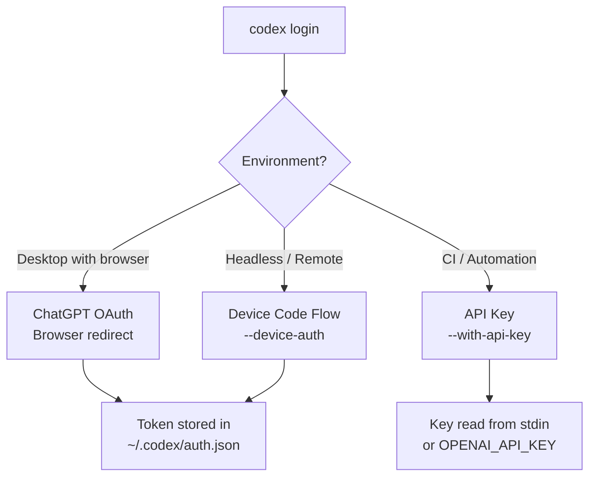
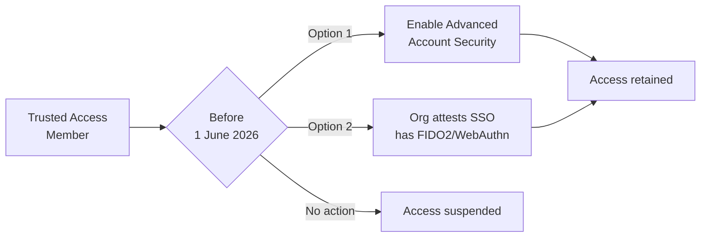

# Codex CLI in the Post-Password Era: Advanced Account Security, Passkeys, and Hardening Your Authentication Chain


---

On 30 April 2026, OpenAI launched **Advanced Account Security** — a new opt-in hardening layer that disables password-based login entirely, mandates phishing-resistant credentials, shortens session lifetimes, and blocks legacy recovery methods[^1]. Protection extends to every surface authenticated through that account, including Codex CLI sessions[^2]. For members of the **Trusted Access for Cyber** programme, enrolment becomes mandatory from 1 June 2026[^3].

This article examines how the announcement reshapes Codex CLI authentication workflows, what breaks if you enable it naively, and how to configure CLI access patterns — interactive, headless, and CI/CD — that satisfy the new security posture without sacrificing developer velocity.

## What Advanced Account Security Actually Changes

The feature bundles five capabilities under a single toggle in ChatGPT account settings[^1]:

| Control | Before | After |
|---------|--------|-------|
| **Sign-in method** | Password, social login, passkey | Passkey or hardware security key only |
| **Recovery** | Email, SMS, support ticket | Backup passkey, recovery key — no support recovery |
| **Session lifetime** | Extended (weeks) | Shortened (hours) |
| **Login alerts** | None | Notification on every new session |
| **Training exclusion** | Manual opt-out | Automatic — conversations excluded from training |

The key implication: **password-based `codex login` flows stop working immediately** once Advanced Account Security is active on the underlying ChatGPT account[^1].

## How Codex CLI Authentication Works Today

Codex CLI offers three authentication paths[^4][^5]:



### ChatGPT OAuth (Default)

Running `codex login` opens a browser window. After completing the OAuth flow (now requiring a passkey tap if Advanced Account Security is enabled), an access token is returned to the CLI and cached in `~/.codex/auth.json` or the OS keyring[^5].

### Device Code Flow (Beta)

For headless servers and remote development environments, `codex login --device-auth` prints a one-time code and verification URL. You authenticate on any device with a browser, then the CLI receives its token[^6]. This flow **works with passkeys** — the browser-side authentication supports hardware keys and platform passkeys natively.

### API Key Authentication

For CI/CD pipelines, `printenv OPENAI_API_KEY | codex login --with-api-key` reads a platform API key from stdin[^4]. This path bypasses ChatGPT authentication entirely, using usage-based billing instead of subscription credits.

## What Breaks (and What Doesn't)

### Scenarios That Continue Working

1. **Interactive desktop sessions**: The browser OAuth redirect works with passkeys. You tap your YubiKey or use a platform passkey (Touch ID, Windows Hello) during the browser-side flow. No CLI changes required.

2. **Device code flow**: Because authentication happens in a browser on a separate device, hardware keys work naturally. The CLI itself never handles the passkey — it only receives the resulting token[^6].

3. **API key authentication**: Completely unaffected. API keys authenticate against the OpenAI Platform, not ChatGPT accounts[^4].

### Scenarios That Break

1. **Cached tokens expiring faster**: With shortened session lifetimes, `~/.codex/auth.json` tokens expire in hours rather than weeks. Long-running CI jobs using cached ChatGPT credentials will fail mid-session[^1].

2. **Shared credential files**: Teams copying `auth.json` between machines (a discouraged but common pattern) will find tokens invalidated more quickly and login alerts triggered[^5].

3. **Password-authenticated automation**: Any scripted flow that previously relied on password entry during `codex login` breaks entirely — passwords no longer work[^1].

## Configuration for Each Environment

### Interactive Development (Desktop)

For developers with Advanced Account Security enabled, configure the credential store to use the OS keyring for better security:

```toml
# ~/.codex/config.toml
cli_auth_credentials_store = "keyring"
```

The keyring integration stores tokens in macOS Keychain, Windows Credential Manager, or Linux Secret Service rather than a plaintext JSON file[^5].

### Remote / Headless Servers

The device code flow is the recommended path for remote servers where no local browser exists:

```bash
# On the remote server
codex login --device-auth

# Output:
# Visit https://auth.openai.com/device and enter code: ABCD-1234
# Waiting for authorisation...
```

Complete the flow on your phone or laptop (tapping your YubiKey there), and the remote CLI receives its token[^6].

### CI/CD Pipelines

For automation, use API key authentication exclusively. This avoids session lifetime issues entirely:


```bash
# GitHub Actions example
- name: Authenticate Codex CLI
  run: |
    echo "${{ secrets.OPENAI_API_KEY }}" | codex login --with-api-key
```


Note that API key authentication uses usage-based billing and does not provide access to ChatGPT-subscription-only features like fast mode or Codex-Spark[^4][^7].

### Enterprise SSO with Managed Configuration

For organisations using SSO, administrators can enforce authentication method and workspace through managed configuration[^8]:

```toml
# requirements.toml (cloud-pushed or local)
forced_login_method = "chatgpt"
forced_chatgpt_workspace_id = "00000000-0000-0000-0000-000000000000"
```

If your SSO provider already enforces phishing-resistant authentication (FIDO2/WebAuthn), the organisation can attest this as an alternative to individual YubiKey enrolment for Trusted Access for Cyber compliance[^3].

## The Trusted Access for Cyber Deadline

OpenAI's Trusted Access for Cyber programme grants verified security researchers access to the most capable and permissive models — including unrestricted GPT-5.3-Codex for vulnerability research[^3]. From **1 June 2026**, individual programme members must either:

1. Enable Advanced Account Security on their personal account, or
2. Have their organisation attest that SSO already enforces phishing-resistant authentication[^3]



For Codex CLI users in this programme, this means ensuring your authentication workflow handles the passkey requirement before the deadline.

## Practical Hardening Recommendations

### 1. Separate CI and Interactive Credentials

Never share authentication methods between humans and machines. Humans use ChatGPT OAuth with passkeys; machines use API keys:

```toml
# Developer config (~/.codex/config.toml)
cli_auth_credentials_store = "keyring"

# CI config (project .codex/config.toml)
# No auth config — API key passed via environment
```

### 2. Rotate and Scope API Keys

Create dedicated API keys for each CI/CD pipeline with appropriate spend limits. The OpenAI dashboard supports per-key budget caps[^7].

### 3. Handle Token Expiry Gracefully

With shorter sessions, long-running interactive sessions may require re-authentication. The CLI refreshes tokens automatically during active use[^5], but idle sessions exceeding the new shortened window will prompt for re-login.

### 4. Configure Custom CA Bundles for Corporate Proxies

Enterprises using TLS-intercepting proxies must configure the CA bundle for authentication traffic to reach OpenAI:

```bash
export CODEX_CA_CERTIFICATE=/path/to/corporate-ca.pem
```

### 5. Audit auth.json Exposure

Check whether `~/.codex/auth.json` appears in any dotfile backups, shared volumes, or container images:

```bash
# Find exposed credential files
codex exec "search this repository and any Docker images for references to auth.json or OPENAI_API_KEY that might leak credentials"
```

## The YubiKey Bundle

OpenAI partnered with Yubico to offer a branded 2-pack (YubiKey 5C NFC + YubiKey 5C Nano) for \$68 — a meaningful discount over individual retail pricing of approximately \$55 per key[^9]. The bundle provides:

- **5C NFC**: Primary key for mobile and laptop use (USB-C + NFC)
- **5C Nano**: Backup key that remains inserted in a laptop USB-C port

Both keys store hardware-backed passkeys using the FIDO2/WebAuthn standard. They work with the Codex CLI OAuth flow because authentication happens in the browser, where WebAuthn is natively supported[^9].

## What This Means for the Codex CLI Ecosystem

The shift to phishing-resistant authentication is part of a broader industry convergence. GitHub now requires 2FA for all contributors[^10], and OpenAI is following suit for its most sensitive access tiers. For Codex CLI practitioners, the practical impact is:

1. **Desktop users**: Minimal friction — a passkey tap during `codex login`
2. **Remote developers**: Device code flow continues working without changes
3. **CI/CD pipelines**: Already using API keys should see zero impact
4. **Security researchers**: Must act before 1 June 2026 or lose Trusted Access

The authentication chain is only as strong as its weakest link. Advanced Account Security removes the weakest links — passwords and SMS recovery — leaving a credential surface that hardware keys and platform passkeys can genuinely protect.

## Citations

[^1]: OpenAI, "Introducing Advanced Account Security," 30 April 2026. [https://openai.com/index/advanced-account-security/](https://openai.com/index/advanced-account-security/)

[^2]: RMN Digital, "OpenAI Launches 'Advanced Account Security' to Shield High-Risk ChatGPT and Codex Users," May 2026. [https://www.rmndigital.com/openai-launches-advanced-account-security-to-shield-high-risk-chatgpt-and-codex-users/](https://www.rmndigital.com/openai-launches-advanced-account-security-to-shield-high-risk-chatgpt-and-codex-users/)

[^3]: OpenAI, "Trusted access for the next era of cyber defense," 2026. [https://openai.com/index/scaling-trusted-access-for-cyber-defense/](https://openai.com/index/scaling-trusted-access-for-cyber-defense/)

[^4]: OpenAI Developers, "Command line options – Codex CLI." [https://developers.openai.com/codex/cli/reference](https://developers.openai.com/codex/cli/reference)

[^5]: OpenAI Developers, "Authentication – Codex." [https://developers.openai.com/codex/auth](https://developers.openai.com/codex/auth)

[^6]: GitHub Issue #9253, "Codex CLI cannot log in on headless environments unless Device Code auth is enabled by workspace admin." [https://github.com/openai/codex/issues/9253](https://github.com/openai/codex/issues/9253)

[^7]: OpenAI Developers, "Pricing – Codex." [https://developers.openai.com/codex/pricing](https://developers.openai.com/codex/pricing)

[^8]: OpenAI Developers, "Admin Setup – Codex." [https://developers.openai.com/codex/enterprise/](https://developers.openai.com/codex/enterprise/)

[^9]: Yubico/OpenAI, "OpenAI and Yubico Partner to Bring Custom Phishing-Resistant YubiKeys to OpenAI Users," 30 April 2026. [https://www.yubico.com/press-releases/openai-and-yubico-partner-to-bring-custom-phishing-resistant-yubikeys-to-openai-users/](https://www.yubico.com/press-releases/openai-and-yubico-partner-to-bring-custom-phishing-resistant-yubikeys-to-openai-users/)

[^10]: GitHub Blog, "Raising the bar for software security: GitHub 2FA begins March 13," 2023. [https://github.blog/news-insights/product-news/raising-the-bar-for-software-security-github-2fa-begins-march-13/](https://github.blog/news-insights/product-news/raising-the-bar-for-software-security-github-2fa-begins-march-13/)
