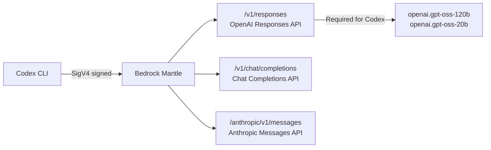
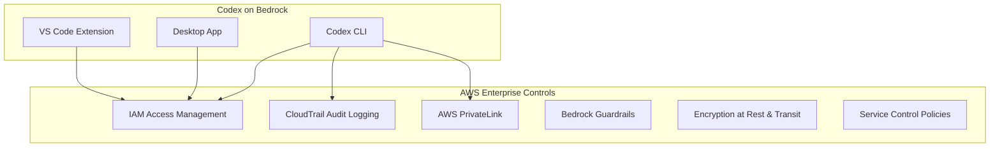
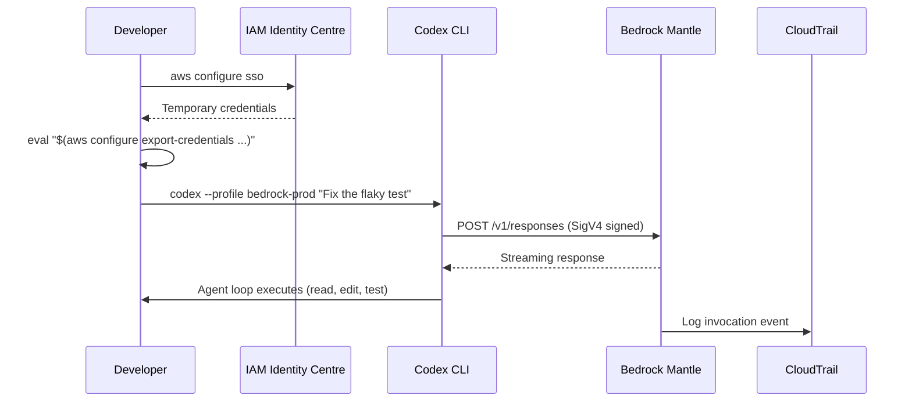

# Codex CLI on Amazon Bedrock: Enterprise Configuration, SigV4 Authentication, and AWS-Native Workflows


---

On 28 April 2026, AWS and OpenAI announced that Codex — the OpenAI coding agent — is available on Amazon Bedrock in limited preview [^1]. For enterprise teams already invested in AWS, this removes the requirement for a separate OpenAI API key and places all Codex inference under the same IAM governance, CloudTrail auditing, and billing consolidation they use for everything else [^2].

This article walks through the end-to-end setup: built-in provider configuration, SigV4 authentication, model selection on Bedrock Mantle, enterprise security controls, and the current limitations you need to plan around.

## What Changed: The Built-In `amazon-bedrock` Provider

Codex CLI v0.124.0 introduced first-class Bedrock support through a new built-in `amazon-bedrock` model provider [^3]. Unlike custom provider configurations that require you to specify a `base_url` and `env_key`, the built-in provider handles endpoint resolution and AWS credential signing automatically.

The implementation lives in a dedicated `codex-aws-auth` crate that provides AWS SDK configuration, credential resolution, and HTTP request signing with SigV4 before transport send [^4]. Two authentication paths are supported:

1. **Bearer token** — prefers the `AWS_BEARER_TOKEN_BEDROCK` environment variable when available
2. **SDK/SigV4 signing** — falls back to standard AWS credential chain resolution

The signing uses the service name `bedrock-mantle` rather than the standard `bedrock-runtime`, reflecting the OpenAI-compatible API surface that Bedrock exposes [^4].

## Configuration Reference

### Minimal Setup

Create or update `~/.codex/config.toml`:

```toml
model = "openai.gpt-oss-120b"
model_provider = "amazon-bedrock"

[model_providers.amazon-bedrock.aws]
region = "us-east-1"
```

That is the minimum viable configuration. The built-in provider resolves the Bedrock Mantle endpoint automatically for your specified region [^5].

### Profile-Based Configuration

For teams managing multiple environments, use named profiles:

```toml
profile = "bedrock-prod"

[profiles.bedrock-prod]
model = "openai.gpt-oss-120b"
model_provider = "amazon-bedrock"

[profiles.bedrock-staging]
model = "openai.gpt-oss-20b"
model_provider = "amazon-bedrock"

[model_providers.amazon-bedrock.aws]
profile = "codex-bedrock"
region = "us-east-1"
```

Switch profiles at invocation time:

```bash
codex --profile bedrock-staging "Refactor the auth module"
```

### Key Configuration Parameters

| Parameter | Description | Default |
|---|---|---|
| `model_providers.amazon-bedrock.aws.region` | AWS region for inference | `us-east-1` |
| `model_providers.amazon-bedrock.aws.profile` | AWS credentials profile name | SDK default |
| `wire_api` | API protocol (`responses` only) | `responses` |
| `web_search` | Must be `"disabled"` on Bedrock | — |

The `wire_api` defaults to `responses` — the only value Bedrock Mantle supports for the Codex agent loop. The older `chat` completions endpoint is not compatible with current Codex CLI versions [^6].

## Authentication: AWS Credentials for Codex

### IAM Identity Centre (SSO)

For enterprise environments, configure SSO-based temporary credentials:

```bash
aws configure sso --profile codex-bedrock
```

Then export credentials into environment variables before launching Codex:

```bash
eval "$(aws configure export-credentials --format env --profile codex-bedrock)"
codex "Generate unit tests for the payment service"
```

This is the recommended approach. Profile-based credentials from `~/.aws/credentials` can fail with credential provider configuration errors — the environment variable export resolves this reliably [^3].

### Minimum IAM Policy

Scope Codex access to specific models and actions:

```json
{
  "Version": "2012-10-17",
  "Statement": [
    {
      "Effect": "Allow",
      "Action": [
        "bedrock:InvokeModel",
        "bedrock:InvokeModelWithResponseStream"
      ],
      "Resource": [
        "arn:aws:bedrock:us-east-1::foundation-model/openai.gpt-oss-120b",
        "arn:aws:bedrock:us-east-1::foundation-model/openai.gpt-oss-20b"
      ]
    },
    {
      "Effect": "Allow",
      "Action": "bedrock:ListFoundationModels",
      "Resource": "*"
    }
  ]
}
```

For production, further restrict by AWS account, region, and apply Service Control Policies (SCPs) to prevent use of unapproved regions or models [^7].

## Available Models and the Bedrock Mantle API

Amazon Bedrock exposes OpenAI-compatible APIs through **Bedrock Mantle**, a distributed inference engine that implements three API surfaces [^3]:



Codex CLI requires the Responses API (`/v1/responses`). As of May 2026, only two models support this endpoint on Bedrock Mantle [^3]:

- **`openai.gpt-oss-120b`** — the full-size model, suitable for complex multi-file refactors and reasoning-heavy tasks
- **`openai.gpt-oss-20b`** — the smaller variant, faster and cheaper for routine operations

⚠️ Other models available on Bedrock (Claude, Nova, Llama, Mistral) do not currently support the Responses API and therefore cannot be used with Codex CLI's agent loop [^3].

### Mantle vs Runtime Model IDs

A common source of confusion: Bedrock has two endpoint families with different model ID formats.

| Path | Model ID Format | Codex Compatible |
|---|---|---|
| Bedrock Mantle | `openai.gpt-oss-120b` | Yes |
| Bedrock Runtime | `openai.gpt-oss-120b-1:0` | No (no Responses API) |

Use the Mantle model IDs (without version suffix) in your `config.toml` [^7].

### Supported Regions

Validated regions as of May 2026: `us-east-1`, `us-east-2`, `us-west-2` [^7]. Verify availability in your target region:

```bash
aws bedrock list-foundation-models \
  --region us-east-1 \
  --query "modelSummaries[?starts_with(modelId, 'openai')].modelId" \
  --output table
```

## Enterprise Security Controls

The primary appeal of Bedrock-routed Codex is inheriting the full AWS enterprise control plane without additional infrastructure [^2].

### What You Get



- **CloudTrail** logs every model invocation with caller identity, timestamp, region, and model ID — providing the audit trail that compliance teams require [^2]
- **IAM** governs who can invoke which models, scoped to specific foundation model ARNs
- **PrivateLink** endpoints are available for `bedrock-mantle`, keeping traffic off the public internet [^7]
- **Guardrails** can filter inputs and outputs according to organisational policy
- **Billing consolidation** — Codex usage counts toward existing AWS cloud commitments, simplifying procurement [^1]

### Cost Controls

Bedrock does not publish separate Codex-specific pricing as of May 2026 [^7]. Set account-level budgets with alerts:

```bash
aws budgets create-budget \
  --account-id 123456789012 \
  --budget file://codex-budget.json \
  --notifications-with-subscribers file://budget-alerts.json
```

Enable Cost Anomaly Detection with a Bedrock service filter and use Bedrock Projects for application-level cost attribution [^7].

## Critical Limitation: Web Search

Bedrock Mantle only supports `function` and `mcp` tool types. Codex CLI's built-in web search tool causes validation errors on Bedrock [^3]. You must explicitly disable it:

```toml
[profiles.bedrock-prod]
model = "openai.gpt-oss-120b"
model_provider = "amazon-bedrock"
web_search = "disabled"
```

This is not optional — omitting it will produce runtime errors when the agent loop attempts to register unsupported tool types.

## End-to-End Workflow

Putting it all together for a team onboarding to Codex on Bedrock:



### Performance Expectations

Response times on Bedrock Mantle are in the 2–4 second range for typical operations — comparable to direct OpenAI API access [^3]. Complex multi-step agent loops will accumulate latency across turns as with any provider.

## What This Does Not Cover (Yet)

The limited preview has notable gaps:

- **Model breadth** — only `gpt-oss-120b` and `gpt-oss-20b` support the Responses API; no GPT-5.5 or o4-mini on Bedrock Mantle yet [^3]
- **Managed Agents** — Amazon Bedrock Managed Agents powered by OpenAI are a separate preview track with their own compute (AgentCore) and are not configured through `config.toml` [^1]
- **General availability timeline** — no GA date has been announced [^1]
- **Regional expansion** — currently limited to select US regions [^7]

## Recommendations

1. **Start with a non-production repository** — validate the configuration, credential flow, and CloudTrail logging before pointing Codex at your monorepo
2. **Use SSO with temporary credentials** — avoid long-lived access keys
3. **Scope IAM policies tightly** — restrict to specific model ARNs and regions
4. **Disable web search explicitly** — add `web_search = "disabled"` to every Bedrock profile
5. **Monitor costs early** — set budget alerts before the team scales usage
6. **Pin a profile name** — standardise on a team-wide profile name (`bedrock-prod`, `bedrock-staging`) in your shared `config.toml` templates

---

## Citations

[^1]: AWS, "Amazon Bedrock now offers OpenAI models, Codex, and Managed Agents (Limited Preview)", 28 April 2026. [https://aws.amazon.com/about-aws/whats-new/2026/04/bedrock-openai-models-codex-managed-agents/](https://aws.amazon.com/about-aws/whats-new/2026/04/bedrock-openai-models-codex-managed-agents/)

[^2]: OpenAI, "OpenAI models, Codex, and Managed Agents come to AWS", 28 April 2026. [https://openai.com/index/openai-on-aws/](https://openai.com/index/openai-on-aws/)

[^3]: DevelopersIO, "I tried Amazon Bedrock support for Codex CLI v0.124.0", 2026. [https://dev.classmethod.jp/en/articles/codex-cli-amazon-bedrock-mantle-responses-api/](https://dev.classmethod.jp/en/articles/codex-cli-amazon-bedrock-mantle-responses-api/)

[^4]: GitHub, "feat: add AWS SigV4 auth for OpenAI-compatible model providers", PR #17820. [https://github.com/openai/codex/pull/17820](https://github.com/openai/codex/pull/17820)

[^5]: OpenAI, "Configuration Reference – Codex", 2026. [https://developers.openai.com/codex/config-reference](https://developers.openai.com/codex/config-reference)

[^6]: DEV Community, "Use OpenAI Codex CLI with Amazon Bedrock Models — Pay As You Go", 2026. [https://dev.to/aws-builders/use-openai-codex-cli-with-amazon-bedrock-models-pay-as-you-go-48eb](https://dev.to/aws-builders/use-openai-codex-cli-with-amazon-bedrock-models-pay-as-you-go-48eb)

[^7]: Elevata, "OpenAI on Amazon Bedrock: Codex, GPT-5.5, Managed Agents & AWS Access", 2026. [https://elevata.io/en/codex-openai-agents-on-amazon-bedrock-aws-setup-guide](https://elevata.io/en/codex-openai-agents-on-amazon-bedrock-aws-setup-guide)
