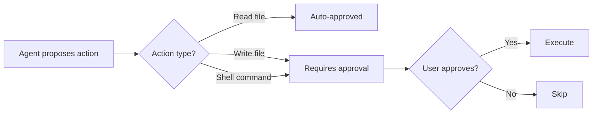
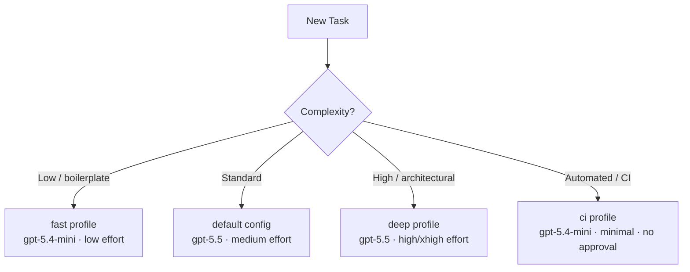

# Codex CLI Daily Driver Setup for May 2026: An Opinionated Configuration Guide


---

Codex CLI v0.128 is the most configurable release yet. Between named profiles, persistent memories, configurable keymaps, goal workflows, and a growing MCP ecosystem, the number of knobs available can paralyse new adopters and leave experienced users with stale defaults. This guide presents a single, opinionated `config.toml` for a senior developer using Codex CLI as their primary coding tool in May 2026 — then explains every choice so you can adapt it to your own workflow.

## The Full Configuration

Drop this into `~/.codex/config.toml` and adjust the three lines marked with comments:

```toml
# ~/.codex/config.toml — May 2026 daily driver

model = "gpt-5.5"
approval_policy = "on-request"
model_reasoning_effort = "medium"
plan_mode_reasoning_effort = "high"
model_reasoning_summary = "concise"

[features]
memories = true

[memories]
min_rollout_idle_hours = 2
max_rollout_age_days = 60
max_unused_days = 45

[tui.keymap]
copy = "Ctrl+Shift+C"
reasoning-up = "Ctrl+]"
reasoning-down = "Ctrl+["

[tui.title]
format = "{model} | {profile} | {cwd_basename}"
show_turn_count = true
action_required_prefix = "! "

# --- Profiles ---

[profiles.fast]
model = "gpt-5.4-mini"
model_reasoning_effort = "low"

[profiles.deep]
model = "gpt-5.5"
model_reasoning_effort = "high"
plan_mode_reasoning_effort = "xhigh"
model_reasoning_summary = "detailed"

[profiles.ci]
model = "gpt-5.4-mini"
model_reasoning_effort = "minimal"
approval_policy = "never"

# --- MCP Servers ---

[mcp_servers.github]
command = "npx"
args = ["-y", "@modelcontextprotocol/server-github"]
env = { GITHUB_TOKEN = "env:GITHUB_TOKEN" }          # set your token
enabled_tools = ["get_file_contents", "search_code", "list_issues", "create_pull_request"]

[mcp_servers.context7]
command = "npx"
args = ["-y", "@upstash/context7-mcp"]
```

## Why These Choices

### Model: GPT-5.5 as Default

GPT-5.5 scores 88.7% on SWE-bench Verified and 82.7% on Terminal-Bench 2.0 — the benchmark most relevant to agentic CLI work[^1][^2]. Its 40% token efficiency gain partially offsets the doubled per-token pricing, making the effective cost increase closer to 20%[^3]. For daily interactive work, `medium` reasoning effort strikes the right balance: deep enough for multi-file refactoring, lean enough to keep responses snappy.

The `plan_mode_reasoning_effort = "high"` override gives the model more room to think when you enter `/plan` mode, where architectural decisions benefit from deeper reasoning[^4].

### Approval Policy: `on-request`



The `on-request` policy auto-approves read operations but requires explicit approval for writes and shell commands[^5]. This is the sweet spot for daily work — you maintain oversight without the friction of approving every `cat` or `ls`. For trusted automation, the `ci` profile drops to `never`; for unfamiliar codebases, switch to `untrusted` at launch with `codex --approval-policy untrusted`.

### Memories: Enabled and Tuned

Native memories are off by default[^6]. Enabling them means Codex extracts insights from completed sessions and injects them into future ones automatically. The tuning choices here reflect iterative daily use:

- **`min_rollout_idle_hours = 2`** — faster extraction than the 6-hour default, suited to developers who complete multiple sessions per day[^7].
- **`max_rollout_age_days = 60`** — retains context from recent project phases rather than expiring after 30 days.
- **`max_unused_days = 45`** — prunes genuinely stale memories but keeps seasonal knowledge (quarterly release patterns, infrequent deployment procedures).

Note: memories are currently unavailable in the EEA, UK, and Switzerland[^6]. Developers in those regions should consider ctx-memory or Basic Memory as MCP-based alternatives[^8].

### TUI Keymaps

The default `Alt+,` and `Alt+.` bindings for reasoning effort clash with readline's "insert last argument" in many terminal emulators[^9]. Remapping to `Ctrl+]` and `Ctrl+[` avoids the conflict. Similarly, `Ctrl+Shift+C` for copy prevents collision with tmux prefix bindings.

### Terminal Title

The `action_required_prefix` setting prepends `!` to your terminal tab title when Codex is waiting for approval — invaluable when running multiple sessions across tmux panes[^9].

## The Three Profiles

### `fast` — Quick Iterations

```bash
codex --profile fast
```

Uses `gpt-5.4-mini` at `low` reasoning effort. Ideal for boilerplate generation, simple refactors, and exploratory questions where speed matters more than depth. At roughly one-fifth the cost of GPT-5.5 at `high` effort, this is the profile for high-volume, low-complexity work[^3].

### `deep` — Architectural Work

```bash
codex --profile deep
```

GPT-5.5 at `high` reasoning effort with `xhigh` in plan mode. Use this for complex refactoring, security reviews, and architectural decisions. The `detailed` reasoning summary makes the model's chain of thought visible, which is useful for reviewing *why* the agent chose a particular approach[^4].

### `ci` — Non-Interactive Automation

```bash
codex --profile ci -q "Run the test suite and fix any failures"
# or
codex exec --profile ci "Lint and auto-fix all TypeScript files"
```

Minimal reasoning effort on the cheapest model, with `approval_policy = "never"` for unattended execution. Pair this with `codex exec` for CI/CD pipelines where human approval is not available[^10].



## MCP Servers: Start Small

The configuration includes two MCP servers — GitHub and Context7 — chosen because they cover the two most common manual loops: repository operations and documentation lookups[^11].

Resist the temptation to add every available MCP server. Each server adds startup latency and injects its tools into the agent's tool list, which consumes context window tokens. Start with two or three servers that eliminate your most frequent context switches, then add more only when you identify a recurring manual step[^12].

Use `enabled_tools` to restrict what the agent can do through each server. The GitHub configuration above permits read operations and PR creation but blocks repository deletion, branch management, and other destructive operations — a sensible default when the agent runs with write access to your codebase[^11].

## AGENTS.md: The Static Layer

Memories handle *dynamic* session-to-session knowledge. For *static* project conventions — coding standards, architectural constraints, testing requirements — use `AGENTS.md` at your repository root[^13]:

```markdown
# AGENTS.md

## Code Style
- TypeScript strict mode, no `any` types
- Prefer composition over inheritance
- All public functions require JSDoc comments

## Testing
- Run `npm test` after every file change
- Minimum 80% branch coverage for new code

## Architecture
- Repository pattern for data access
- No direct database queries outside repository classes
```

The agent reads `AGENTS.md` at session start and treats its contents as project-level instructions. Keep it concise — under 500 words — to avoid consuming context budget that would be better spent on your actual task[^13].

## Essential Slash Commands

Six commands cover 90% of daily interactive use:

| Command | Purpose |
|---------|---------|
| `/model gpt-5.4-mini` | Switch models mid-session without restarting[^14] |
| `/plan` | Enter plan mode for multi-step reasoning before execution[^4] |
| `/compact` | Compress conversation history when approaching context limits[^14] |
| `/goal create "..."` | Set a persistent objective that survives session restarts[^9] |
| `/fork` | Branch the conversation to explore an alternative approach[^14] |
| `/debug-config` | Inspect the resolved configuration — invaluable when profiles interact unexpectedly[^14] |

## What to Do Next

1. Copy the configuration above into `~/.codex/config.toml`.
2. Set your `GITHUB_TOKEN` environment variable.
3. Run `codex --profile fast` on a low-stakes task to verify the setup.
4. Gradually increase complexity: try `deep` for a real refactoring session.
5. After a week, check `~/.codex/memories/memory_summary.md` to see what the memory system has captured.
6. Adjust reasoning effort levels based on observed output quality and cost.

The best configuration is one you actually use. Start with these defaults, tune what irritates you, and ignore everything else until you need it.

## Citations

[^1]: [Introducing GPT-5.5 — OpenAI](https://openai.com/index/introducing-gpt-5-5/)
[^2]: [OpenAI's GPT-5.5 masters agentic coding with 82.7% benchmark score — Interesting Engineering](https://interestingengineering.com/ai-robotics/opanai-gpt-5-5-agentic-coding-gains)
[^3]: [GPT-5.5 Pricing: Full Breakdown of API, Codex, and ChatGPT Costs — Apidog](https://apidog.com/blog/gpt-5-5-pricing/)
[^4]: [Codex CLI Features — OpenAI Developers](https://developers.openai.com/codex/cli/features)
[^5]: [Codex CLI Configuration Reference — OpenAI Developers](https://developers.openai.com/codex/config-reference)
[^6]: [Memories — Codex | OpenAI Developers](https://developers.openai.com/codex/memories)
[^7]: [Memories System | openai/codex | DeepWiki](https://deepwiki.com/openai/codex/3.9-memories-system)
[^8]: [ctx-memory by GhadiSaab | Glama](https://glama.ai/mcp/servers/GhadiSaab/ctx-memory)
[^9]: [Codex CLI v0.128.0 release notes](https://github.com/openai/codex/releases/tag/rust-v0.128.0)
[^10]: [Best Practices — Codex | OpenAI Developers](https://developers.openai.com/codex/learn/best-practices)
[^11]: [Model Context Protocol — Codex CLI — OpenAI Developers](https://developers.openai.com/codex/mcp)
[^12]: [Codex CLI Configuration (Advanced) — OpenAI Developers](https://developers.openai.com/codex/config-advanced)
[^13]: [Codex CLI Configuration (Basic) — OpenAI Developers](https://developers.openai.com/codex/config-basic)
[^14]: [Codex CLI Slash Commands — OpenAI Developers](https://developers.openai.com/codex/cli/slash-commands)
