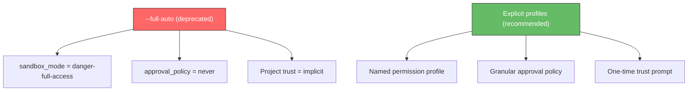
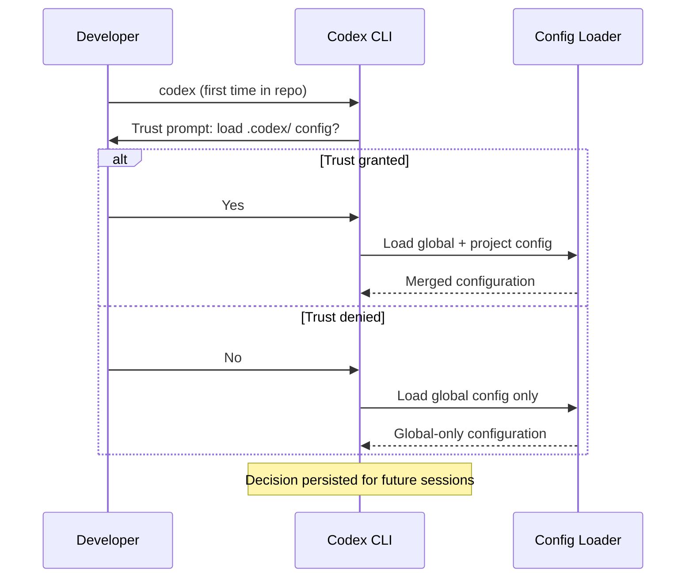

# The --full-auto Deprecation: Migrating to Codex CLI's Explicit Permission Profiles and Trust Flows


---

Codex CLI v0.128 quietly retired one of the tool's most convenient — and most dangerous — flags. The `--full-auto` option, which bypassed all approval prompts and gave the agent unrestricted access to your filesystem and network, is now deprecated [^1]. The flag still works for one release cycle to give teams time to migrate, but it prints a deprecation warning and will be hard-removed in a future release [^2].

This article explains why the flag was removed, what replaces it, and how to migrate existing scripts and workflows to the new explicit permission profiles and trust flows without losing productivity.

## Why --full-auto Had to Go

The `--full-auto` flag was a blunt instrument. It collapsed three separate concerns into a single switch:

1. **Sandbox mode** — the filesystem and network boundary the agent operates within.
2. **Approval policy** — when the agent must pause and ask before acting.
3. **Project trust** — whether project-scoped configuration (`.codex/config.toml`, hooks, skills) should be loaded.

In practice, `--full-auto` resolved to `sandbox_mode = "danger-full-access"` combined with `approval_policy = "never"` [^3]. That meant the agent could write to any path, execute arbitrary shell commands, make outbound network requests, and load untrusted project configuration — all without a single human checkpoint.

For quick experiments in a throwaway container this was fine. For CI pipelines processing untrusted pull requests, it was a security incident waiting to happen. OpenAI's own harness engineering team stopped using it internally in favour of scoped profiles months before the formal deprecation [^4].



## The Replacement: Three Independent Controls

The new model separates the three concerns so you can dial each one independently.

### 1. Permission Profiles

Permission profiles define what the agent can touch on the filesystem and network. Three built-in profiles ship with Codex CLI [^5]:

| Profile | Filesystem | Network | Use Case |
|---------|-----------|---------|----------|
| `:read-only` | Read anywhere, write nowhere | Blocked | Code review, exploration |
| `:workspace` | Read anywhere, write within project roots | Blocked | Standard development |
| `:danger-no-sandbox` | Unrestricted | Unrestricted | Externally sandboxed environments |

Set the default in `~/.codex/config.toml`:

```toml
default_permissions = ":workspace"
```

For teams that need finer control, custom profiles let you specify per-path and per-domain rules [^6]:

```toml
[permissions.ci-runner.filesystem]
":project_roots" = { "." = "write", "**/*.env" = "none", "**/.git" = "read" }
glob_scan_max_depth = 3

[permissions.ci-runner.network.domains]
"api.openai.com" = "allow"
"registry.npmjs.org" = "allow"
"*" = "deny"

[permissions.ci-runner.network.unix_sockets]
"/var/run/docker.sock" = "allow"
```

This `ci-runner` profile grants write access to the project root but denies reads on `.env` files, restricts network access to OpenAI and npm, and allows Docker socket communication — precisely the surface area a CI job needs, nothing more [^6].

### 2. Granular Approval Policies

Instead of the binary choice between "ask everything" and "ask nothing", granular policies let you control each approval category independently [^7]:

```toml
approval_policy = { granular = {
  sandbox_approval = true,
  rules = true,
  mcp_elicitations = false,
  request_permissions = false,
  skill_approval = false
} }
```

This configuration keeps sandbox escalation and exec-policy rule prompts interactive (the high-risk operations) whilst automatically handling MCP prompts, permission requests, and skill activations. For most development workflows, this eliminates 80% of approval fatigue without removing the safety net [^7].

You can also delegate approvals to the Guardian reviewer subagent rather than handling them yourself [^8]:

```toml
approvals_reviewer = "auto_review"
```

When `auto_review` is active, the Guardian evaluates each pending approval against a built-in safety policy that checks for data exfiltration, credential probing, persistent security weakening, and destructive actions. Low-risk operations proceed automatically; genuinely risky ones escalate to the human [^8]. ⚠️ The Guardian's built-in policy covers common attack patterns but is not a substitute for network-level controls in high-security environments.

### 3. Project Trust

Codex now presents a one-time trust prompt when you first open a repository [^9]. If you mark a project as untrusted, Codex skips all project-scoped `.codex/` layers — including local config, hooks, rules, and skills [^5]. This prevents a malicious repository from injecting instructions via `.codex/config.toml` or skill files.

The trust decision persists across sessions. You do not see the prompt again for the same project unless you explicitly revoke trust.



## Migration Recipes

### Recipe 1: Interactive Development (Replaces `codex --full-auto`)

Before:

```bash
codex --full-auto
```

After — add to `~/.codex/config.toml`:

```toml
default_permissions = ":workspace"
approval_policy = "on-request"
approvals_reviewer = "auto_review"
```

This gives the agent workspace-scoped write access with the Guardian handling routine approvals. You only see prompts for genuinely unusual operations [^8].

### Recipe 2: CI/CD Pipeline (Replaces `codex exec --full-auto`)

Before:

```bash
codex exec --full-auto "Run the test suite and fix failures"
```

After — create a CI-specific profile:

```toml
[profiles.ci]
default_permissions = "ci-runner"
approval_policy = "never"
sandbox_mode = "workspace-write"

[permissions.ci-runner.filesystem]
":project_roots" = { "." = "write", "**/*.env" = "none" }

[permissions.ci-runner.network.domains]
"api.openai.com" = "allow"
```

Then invoke with the profile flag:

```bash
codex exec --profile ci "Run the test suite and fix failures"
```

The agent can write to the workspace and reach the OpenAI API, but cannot read secrets files, access arbitrary network hosts, or escalate beyond workspace boundaries [^6].

### Recipe 3: Externally Sandboxed Container (Replaces `codex --yolo`)

If your environment is already hardened (Docker container, ephemeral VM, Firecracker microVM), the `:danger-no-sandbox` profile provides the same unrestricted access as `--yolo` without the deprecation warning [^5]:

```toml
[profiles.container]
default_permissions = ":danger-no-sandbox"
approval_policy = "never"
```

```bash
codex --profile container
```

The `--yolo` flag (`--dangerously-bypass-approvals-and-sandbox`) remains available but should be reserved for explicitly hardened environments [^3]. Unlike `--full-auto`, `--yolo` is not deprecated — its name makes the risk self-evident.

### Recipe 4: Overnight Batch Jobs (Cost-Optimised)

For long-running `codex exec` jobs where you want both cost savings and security:

```toml
[profiles.batch]
default_permissions = ":workspace"
approval_policy = "never"
model = "gpt-5.4-mini"
service_tier = "flex"
model_reasoning_effort = "medium"
```

```bash
codex exec --profile batch "Migrate all deprecated API calls in src/"
```

This combines `:workspace` sandboxing with the flex service tier (roughly 50% cost reduction) and a lighter model [^10].

## What Changes for Existing Scripts

If your scripts or CI configurations use `--full-auto`, the migration path is straightforward:

| Old Flag | Replacement | Notes |
|----------|------------|-------|
| `--full-auto` | `--profile <name>` with explicit permissions | Create a profile in config.toml |
| `--full-auto` in `codex exec` | `--profile ci` or equivalent | Deprecated; will be removed in a future release |
| `--yolo` | `--yolo` (unchanged) | Not deprecated; name signals the risk |
| `--dangerously-bypass-approvals-and-sandbox` | Same (unchanged) | Long form of `--yolo` |

The TUI no longer accepts `--full-auto` at all — it was fully removed from the interactive interface in v0.128, since it resolved to default permissions there and served no purpose [^2].

## Checking Your Current Configuration

Use `/debug-config` inside an interactive session to see which configuration layers are active and how they merge:

```bash
codex
> /debug-config
```

This prints the resolved configuration with layer provenance, making it easy to spot if a project-level config is overriding your global defaults or if a profile is not loading as expected [^11].

The `/status` command shows a quick summary of the active model, approval policy, sandbox mode, writable roots, and token usage [^11].

## Best Practices for the New Model

1. **Start with `:workspace` and `on-request`** — this is the safest default that still allows productive development. Loosen only when you have a specific reason.

2. **Use named profiles for different contexts** — keep a `dev` profile for interactive work, a `ci` profile for pipelines, and a `review` profile for read-only code review.

3. **Enable `auto_review` for interactive sessions** — the Guardian catches the obvious risks and lets routine operations proceed, reducing approval fatigue without removing the safety net.

4. **Define custom permission profiles for CI** — lock down filesystem and network access to exactly what your pipeline needs. Deny-by-default is the correct posture for automated agents processing untrusted code.

5. **Trust projects explicitly** — do not bypass the trust prompt. It exists to prevent malicious `.codex/` configurations from injecting instructions into your agent.

## The Broader Direction

The `--full-auto` deprecation is part of a wider trend across coding agents. Claude Code's `--dangerously-skip-permissions` carries the same "this is unsafe" naming convention [^12]. Google's Gemini CLI launched with Plan Mode as a read-only exploration phase before any writes [^12]. The industry consensus is converging on explicit, granular permissions rather than binary on/off switches.

For Codex CLI, the direction is clear: separate sandbox, approval, and trust into independent, composable controls that teams can configure per context. The `--full-auto` flag was the last remnant of the simpler, riskier model. Its removal marks the completion of that architectural shift.

## Citations

[^1]: Codex CLI v0.128.0 release notes — "Deprecated `--full-auto` while steering users toward explicit permission profiles and trust flows." [GitHub Release](https://github.com/openai/codex/releases/tag/rust-v0.128.0)

[^2]: Codex CLI PR #20133 — `--full-auto` deprecation implementation, phased removal approach. [GitHub PR](https://github.com/openai/codex/pull/20133)

[^3]: Codex CLI reference — Command line options, sandbox modes, and approval flags. [OpenAI Developers](https://developers.openai.com/codex/cli/reference)

[^4]: OpenAI Engineering Blog — "Harness engineering: leveraging Codex in an agent-first world." [OpenAI](https://openai.com/index/harness-engineering/)

[^5]: Codex CLI config basics — Approval modes, sandbox modes, and permission levels. [OpenAI Developers](https://developers.openai.com/codex/config-basic)

[^6]: Codex CLI configuration reference — Permission profile filesystem and network tables. [OpenAI Developers](https://developers.openai.com/codex/config-reference)

[^7]: Codex CLI agent approvals and security — Granular approval policy components. [OpenAI Developers](https://developers.openai.com/codex/agent-approvals-security)

[^8]: Codex CLI agent approvals and security — `approvals_reviewer = "auto_review"` and Guardian safety policy. [OpenAI Developers](https://developers.openai.com/codex/agent-approvals-security)

[^9]: Codex CLI config basics — Project trust and configuration layer loading. [OpenAI Developers](https://developers.openai.com/codex/config-basic)

[^10]: Codex CLI pricing — Service tier cost differences and flex tier savings. [OpenAI Developers](https://developers.openai.com/codex/pricing)

[^11]: Codex CLI slash commands — `/debug-config` and `/status` command references. [OpenAI Developers](https://developers.openai.com/codex/cli/slash-commands)

[^12]: Claude Code vs Codex CLI vs Gemini CLI comparisons — Industry convergence on explicit permission models. [CodeAnt.ai](https://www.codeant.ai/blogs/claude-code-cli-vs-codex-cli-vs-gemini-cli-best-ai-cli-tool-for-developers-in-2025)
