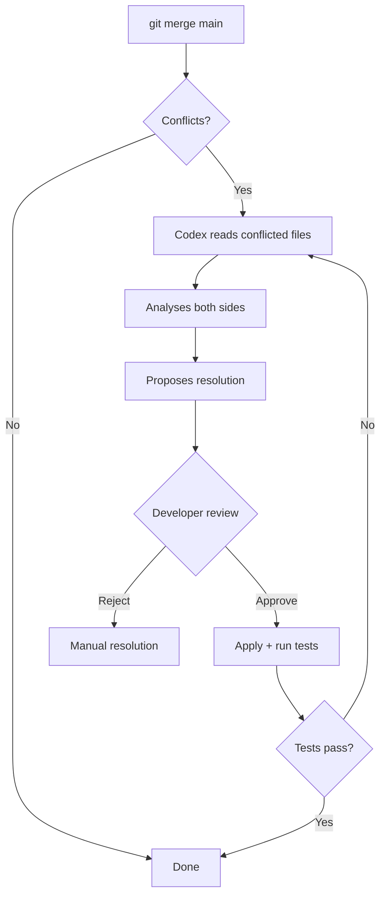
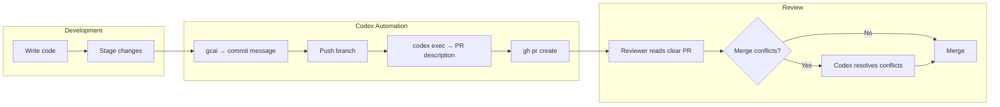

# Codex CLI for Everyday Git Workflows: Commit Messages, PR Descriptions, and Branch Automation


---

Most Codex CLI coverage focuses on the spectacular — multi-file refactors, overnight goal workflows, multi-agent orchestration. But the tool's highest-frequency value often comes from the mundane: writing commit messages, drafting PR descriptions, naming branches, and resolving merge conflicts. These micro-tasks happen dozens of times a day, each one a small context switch that breaks flow. This article covers practical patterns for automating everyday git workflows with `codex exec` and interactive sessions.

## Commit Message Generation

### The Basic Pattern

The simplest and most immediately useful git automation pipes `git diff` context to Codex and asks for a conventional commit message:

```bash
codex exec "Look at the staged changes (git diff --cached) and write a \
conventional commit message. Use the imperative mood. Keep the subject \
line under 72 characters. Add a body only if the change is non-trivial." \
--full-auto
```

Codex reads the staged diff via its shell tool, analyses the intent behind the changes, and outputs a commit message that reflects what actually changed rather than what you meant to change three hours ago[^1].

### Structured Output for Scripting

For CI pipelines or git hooks that need machine-readable output, use `--output-schema` to enforce a consistent format:

```bash
codex exec "Analyse the staged git diff and produce a commit message." \
--output-schema '{"type":"object","properties":{"subject":{"type":"string","maxLength":72},"body":{"type":"string"},"breaking":{"type":"boolean"}},"required":["subject","body","breaking"]}' \
--full-auto -o commit-msg.json
```

A downstream script can then parse `commit-msg.json` and call `git commit -m` with the extracted subject and body[^2]. The `breaking` field is particularly useful for release automation — flag it in your pipeline to trigger major version bumps.

### Shell Function Recipe

Wrap the pattern into a shell function for daily use:

```bash
# ~/.bashrc or ~/.zshrc
gcai() {
  local msg
  msg=$(codex exec "Read the staged diff with git diff --cached. \
Write a conventional commit message in imperative mood. \
Subject line under 72 chars. Body if non-trivial. \
Output ONLY the commit message, nothing else." \
--full-auto 2>/dev/null)

  if [ -z "$msg" ]; then
    echo "Failed to generate commit message" >&2
    return 1
  fi

  echo "Proposed commit message:"
  echo "---"
  echo "$msg"
  echo "---"
  read -rp "Commit with this message? [y/N/e(dit)] " choice
  case "$choice" in
    y|Y) git commit -m "$msg" ;;
    e|E) git commit -e -m "$msg" ;;
    *) echo "Aborted." ;;
  esac
}
```

The function generates the message, shows it for review, and lets you accept, edit, or reject — keeping a human in the loop without the cognitive load of composing the message from scratch.

## PR Description Automation

### From Commits to Context

Pull request descriptions suffer from the same problem as commit messages, amplified: by the time you open the PR, you have forgotten the reasoning behind changes you made two days ago. Codex can reconstruct that context from the commit history and diff:

```bash
codex exec "Examine the git log and diff between this branch and main. \
Write a pull request description with: \
1. A one-line summary \
2. A 'What changed' section with bullet points \
3. A 'Why' section explaining the motivation \
4. A 'Testing' section listing what was verified. \
Use markdown formatting." \
--full-auto -o pr-description.md
```

### Integration with GitHub CLI

Combine `codex exec` with `gh` for a single-command PR workflow:

```bash
# Generate description, then create the PR
codex exec "Read git log main..HEAD and git diff main. \
Write a PR title (under 70 chars) and markdown body." \
--output-schema '{"type":"object","properties":{"title":{"type":"string"},"body":{"type":"string"}},"required":["title","body"]}' \
--full-auto -o pr.json

# Parse and submit
TITLE=$(jq -r .title pr.json)
BODY=$(jq -r .body pr.json)
gh pr create --title "$TITLE" --body "$BODY"
```

The structured output schema ensures clean parsing. For teams using PR templates, add the template content to your `AGENTS.md` so Codex follows your organisation's format[^3].

## Branch Naming

Consistent branch names make repository navigation predictable. Codex can generate them from issue descriptions or plain-language intent:

```bash
# From a GitHub issue
codex exec "Read GitHub issue #142 using 'gh issue view 142'. \
Suggest a branch name following the pattern: \
type/short-description (e.g., feat/add-user-auth, fix/null-pointer-login). \
Output only the branch name." --full-auto
```

In an interactive session, this becomes conversational:

```
> I need to fix the race condition in the connection pool timeout handler
Branch suggestion: fix/connection-pool-timeout-race
```

## Merge Conflict Resolution

Merge conflicts are where Codex's understanding of code semantics genuinely outperforms mechanical tooling. Rather than choosing "ours" or "theirs" blindly, Codex can read both versions, understand the intent, and produce a merged result:

```bash
codex "I've just run git merge main and have conflicts. \
Look at the conflicted files (git diff --name-only --diff-filter=U). \
For each file, read both sides of the conflict, understand the intent \
of each change, and resolve the conflict preserving both intentions. \
After resolving, run the test suite to verify nothing is broken."
```

This works best in `suggest` approval mode, where you review each resolution before it is applied[^4].



### Conflict Resolution with Context

For complex conflicts, provide additional context through your `AGENTS.md`:

```markdown
## Merge Conflict Policy

When resolving merge conflicts:
- Prefer the approach that maintains backward compatibility
- If both sides add new functions, keep both
- If both sides modify the same function, combine the changes logically
- Always run `npm test` after resolving conflicts
- Flag any conflict you are uncertain about rather than guessing
```

This policy-driven approach means Codex resolves routine conflicts automatically whilst escalating genuinely ambiguous cases[^3].

## CI Integration with codex-action

The official `codex-action` GitHub Action brings these patterns into your CI pipeline[^5]. A practical configuration for automated PR descriptions:


```yaml
name: PR Description
on:
  pull_request:
    types: [opened]

jobs:
  describe:
    runs-on: ubuntu-latest
    steps:
      - uses: actions/checkout@v4
        with:
          fetch-depth: 0
      - uses: openai/codex-action@v1
        with:
          prompt: |
            Examine git log main..HEAD and git diff main.
            Write a detailed PR description with sections:
            What Changed, Why, and Testing Notes.
          mode: exec
          full_auto: true
        env:
          OPENAI_API_KEY: ${{ secrets.OPENAI_API_KEY }}
```


Combine this with the commit message patterns above for a fully automated git metadata pipeline — developers focus on code, Codex handles the documentation around it.

## Performance Considerations

Git workflow automation is a prime candidate for aggressive speed tuning. These are short, bounded tasks that benefit from low reasoning effort and fast model selection[^6]:

```toml
# ~/.codex/config.toml
[profiles.git]
model = "gpt-5.4-mini"
model_reasoning_effort = "low"
```

Launch git-related tasks with the profile:

```bash
codex --profile git exec "Write a commit message for the staged changes" --full-auto
```

GPT-5.4-mini at `low` effort handles commit messages and branch naming with sub-second latency, whilst keeping credit consumption minimal. Reserve GPT-5.5 at `medium` or `high` for merge conflict resolution, where semantic understanding materially affects quality[^7].

## Putting It Together

The everyday git workflow with Codex looks like this:



None of these patterns require `full-auto` approval mode for the development workflow — `suggest` mode lets you review every generated message before it touches your repository. The automation removes the composition burden, not the review step.

## Summary

The highest-ROI use of Codex CLI is not the dramatic multi-hour refactoring session — it is the thirty-second commit message generation you run forty times a week. Pipe your diffs to `codex exec`, enforce structure with `--output-schema`, wrap the result in a shell function, and reclaim the cognitive overhead that git metadata has been silently consuming. Start with commit messages, extend to PR descriptions, and let merge conflict resolution follow naturally once you trust the tool's judgement on your codebase.

## Citations

[^1]: [Codex CLI reference](https://developers.openai.com/codex/cli/reference), OpenAI Developers, accessed May 2026
[^2]: [Non-interactive mode — Codex](https://developers.openai.com/codex/noninteractive), OpenAI Developers, accessed May 2026
[^3]: [AGENTS.md — Codex](https://developers.openai.com/codex/agents-md), OpenAI Developers, accessed May 2026
[^4]: [Config basics — Codex](https://developers.openai.com/codex/config-basic), OpenAI Developers, accessed May 2026
[^5]: [codex-action — GitHub Action for Codex](https://github.com/openai/codex-action), OpenAI, accessed May 2026
[^6]: [Speed — Codex](https://developers.openai.com/codex/speed), OpenAI Developers, accessed May 2026
[^7]: [GPT-5.5 Migration Cookbook](https://codex.danielvaughan.com/2026/04/24/gpt-5-5-migration-cookbook-effort-tuning-cost-comparison/), Daniel Vaughan, 24 April 2026
