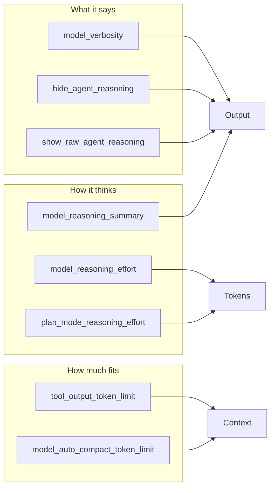

# Codex CLI Output Control: Tuning Verbosity, Reasoning Summaries, and Token Budgets for Every Workflow


---

Codex CLI ships with sensible defaults, but those defaults assume a single use case: interactive development with moderate explanation. In practice, senior developers use Codex across radically different contexts — terse automation pipelines, verbose architecture explorations, cost-conscious CI jobs, and long-running refactoring sessions that push against context limits. Each demands different output behaviour.

Codex CLI exposes seven configuration keys that collectively control how much the agent says, how it reasons, and how aggressively it manages its own context window. Most developers never touch them. This article explains each one, shows how they interact, and provides ready-to-use configuration profiles for common workflows.

## The Seven Output Control Knobs

The keys fall into three groups: **what the agent says** (verbosity and reasoning visibility), **how the agent thinks** (reasoning effort and summaries), and **how much fits in context** (token limits and compaction).



## Controlling What the Agent Says

### `model_verbosity`

This key maps directly to the GPT-5 Responses API's verbosity parameter [^1]. It accepts three values:

| Value | Behaviour |
|---|---|
| `low` | Code-focused output, minimal prose. Saves output tokens without reducing code quality [^2]. |
| `medium` | Balanced explanation and code (the default). |
| `high` | Detailed walkthroughs, architectural commentary, and step-by-step reasoning in prose [^2]. |

When left unset, the model's own preset default applies [^1]. The practical difference is significant: `low` can cut output tokens by 40–60% on explanation-heavy tasks, which matters both for cost and for preserving context window space in long sessions.

```toml
# ~/.codex/config.toml
model_verbosity = "low"  # terse output for automation
```

At the CLI, override for a single run:

```bash
codex -c model_verbosity='"high"' "walk me through the payment service architecture"
```

### `hide_agent_reasoning` and `show_raw_agent_reasoning`

These two booleans control reasoning visibility in both the TUI and `codex exec` JSONL output [^1]:

- **`hide_agent_reasoning = true`** — suppresses reasoning events entirely. Useful in CI pipelines where reasoning clutter obscures the actual output, or when streaming JSONL to a dashboard that only cares about tool calls and final responses.
- **`show_raw_agent_reasoning = true`** — surfaces the raw reasoning content when the model emits it. This is the opposite extreme: full transparency into the chain-of-thought, useful when debugging why the agent chose a particular approach.

Both default to `false`. Setting both to `true` is contradictory; `hide_agent_reasoning` takes precedence [^3].

## Controlling How the Agent Thinks

### `model_reasoning_effort`

This is the primary reasoning dial, accepting five levels: `minimal`, `low`, `medium`, `high`, and `xhigh` [^1]. Higher effort means more reasoning tokens, slower responses, and higher cost — but better results on complex tasks.

The v0.128 TUI added keyboard shortcuts for dynamic adjustment: **Alt+,** lowers reasoning and **Alt+.** raises it, with automatic reset to the new model's default when you accept a model upgrade [^4]. This means you can start a session at `medium`, bump to `high` for a tricky algorithm, and drop back without leaving the TUI.

```toml
model_reasoning_effort = "medium"  # sensible default for most work
```

### `plan_mode_reasoning_effort`

Plan mode (`/plan`) is where the agent analyses a task and proposes an approach before executing. This key lets you assign a different reasoning effort specifically for planning, independently of the execution effort [^1].

The pattern that works well in practice: use `high` or `xhigh` reasoning during planning (where getting the approach right prevents costly rework), then drop to `medium` for execution (where the plan provides sufficient guidance) [^5].

```toml
model_reasoning_effort = "medium"
plan_mode_reasoning_effort = "high"  # deeper thinking during planning only
```

When unset, plan mode uses its built-in preset default, which is typically one level above the execution effort [^1].

### `model_reasoning_summary`

Reasoning summaries are condensed versions of the model's chain-of-thought, surfaced in the TUI and JSONL output [^1]. Four options:

| Value | Use Case |
|---|---|
| `auto` | Let the model decide (default). Typically produces concise summaries. |
| `concise` | Short, bullet-point summaries. Good for keeping the TUI clean whilst retaining visibility. |
| `detailed` | Full reasoning summaries. Useful when reviewing decisions post-session. |
| `none` | Suppress summaries entirely. Saves tokens in automation pipelines. |

The `model_supports_reasoning_summaries` boolean (default: inferred from model capabilities) forces Codex to send or skip reasoning metadata regardless of model detection [^1]. Override this when using a custom model provider whose capabilities Codex cannot auto-detect.

## Controlling How Much Fits in Context

### `tool_output_token_limit`

Every tool call — shell commands, file reads, MCP responses — produces output that gets stored in the conversation history. Without limits, a single `cat` of a large log file can consume tens of thousands of tokens, crowding out useful context [^6].

`tool_output_token_limit` sets a per-tool-call token budget. When output exceeds this limit, Codex truncates or summarises it before storing [^1].

```toml
tool_output_token_limit = 12000  # cap individual tool outputs
```

A value of 12,000 tokens works well for most development workflows [^6]. Lower it for sessions that involve log analysis or large generated outputs; raise it when you need the agent to see complete files.

### `model_auto_compact_token_limit`

This is the threshold that triggers automatic history compaction — the process where Codex hands the entire conversation to an LLM to produce a handoff summary, then replaces the original history with that summary [^7].

When unset, Codex calculates a default based on the model's context window (typically around 85–90% of the window minus output tokens) [^7]. For GPT-5.4 with its standard context window, this lands around 167,000 tokens [^7].

```toml
model_auto_compact_token_limit = 140000  # trigger compaction earlier
```

Lower values give the post-compaction re-read cycle more headroom, reducing the risk of cascading compactions where the summary itself is so large that it immediately triggers another compaction [^7]. For monorepos or API-heavy codebases with large essential context files, dropping to 80–85% of context capacity is recommended [^7].

After compaction, Codex automatically re-reads up to five recently edited files (budgeted at 50,000 tokens total) and injects a lead-in message to orient the model [^7].

You can also trigger compaction manually with the `/compact` slash command, and override the compaction prompt itself with `compact_prompt` for specialised use cases [^1].

## Putting It Together: Configuration Profiles

Codex CLI's named profiles let you package these settings for different scenarios and switch with `codex --profile <name>` [^8].

### Profile: Automation Pipeline

Minimal output, no reasoning clutter, aggressive token limits for cost control:

```toml
[profiles.ci]
model_verbosity = "low"
model_reasoning_effort = "medium"
model_reasoning_summary = "none"
hide_agent_reasoning = true
tool_output_token_limit = 8000
```

```bash
codex --profile ci exec "run the test suite and report failures"
```

### Profile: Architecture Exploration

Maximum verbosity and reasoning transparency for design discussions:

```toml
[profiles.explore]
model_verbosity = "high"
model_reasoning_effort = "high"
model_reasoning_summary = "detailed"
show_raw_agent_reasoning = true
model_auto_compact_token_limit = 160000
```

### Profile: Long Refactoring Session

Balanced output with aggressive compaction to survive extended sessions:

```toml
[profiles.refactor]
model_verbosity = "low"
model_reasoning_effort = "medium"
plan_mode_reasoning_effort = "high"
model_reasoning_summary = "concise"
tool_output_token_limit = 10000
model_auto_compact_token_limit = 120000
```

### Profile: Cost-Conscious Solo Developer

Minimise token spend whilst maintaining reasonable output quality:

```toml
[profiles.frugal]
model = "gpt-5.4-mini"
model_verbosity = "low"
model_reasoning_effort = "low"
model_reasoning_summary = "none"
hide_agent_reasoning = true
tool_output_token_limit = 6000
```

## Interaction Effects to Watch

These settings do not operate in isolation. Several interaction effects are worth understanding:

1. **Verbosity × reasoning summary** — setting `model_verbosity = "high"` with `model_reasoning_summary = "none"` produces verbose final output but hides the reasoning process. This is useful when you want detailed explanations without the intermediate thinking.

2. **Reasoning effort × plan mode effort** — when `plan_mode_reasoning_effort` is higher than `model_reasoning_effort`, the agent appears to "think harder" during `/plan` and produce faster responses during execution. This asymmetry is intentional and cost-effective [^5].

3. **Tool output limit × compaction threshold** — a low `tool_output_token_limit` extends session life by keeping context lean, but can cause the agent to miss important details in truncated output. A low `model_auto_compact_token_limit` triggers compaction earlier, preserving headroom but potentially losing context from early in the session. Tune both together.

4. **`codex exec --json` reasoning tokens** — since v0.125, `codex exec --json` reports reasoning token usage in turn completion events [^4]. This data lets you empirically measure the cost impact of different `model_reasoning_effort` settings per task type, rather than guessing.

## Measuring the Impact

To compare profiles empirically, use `codex exec --json` and extract token usage:

```bash
codex --profile ci exec --json "fix the failing test in src/auth.ts" 2>/dev/null \
  | jq 'select(.type == "turn.completed") | .usage'
```

This outputs the input, output, and reasoning token counts for the completed turn [^4]. Run the same task across different profiles to find the optimal trade-off between cost and output quality for your specific workload.

## Recommendations

For most senior developers, the defaults are reasonable for interactive work. Tune these settings when:

- **Running in CI/CD**: use the `ci` profile pattern above to cut costs and noise.
- **Context window pressure**: lower `tool_output_token_limit` and `model_auto_compact_token_limit` before the session starts, not after compaction failures.
- **Debugging agent behaviour**: temporarily enable `show_raw_agent_reasoning = true` to understand decision paths.
- **Cost management**: start with `model_reasoning_effort = "low"` and only increase when task complexity demands it. The v0.128 TUI shortcuts (Alt+,/Alt+.) make this adjustment trivial mid-session [^4].

---

## Citations

[^1]: OpenAI, "Configuration Reference – Codex", [https://developers.openai.com/codex/config-reference](https://developers.openai.com/codex/config-reference), accessed 2 May 2026.

[^2]: OpenAI, "Sample Configuration – Codex", [https://developers.openai.com/codex/config-sample](https://developers.openai.com/codex/config-sample), accessed 2 May 2026.

[^3]: OpenAI, "Advanced Configuration – Codex", [https://developers.openai.com/codex/config-advanced](https://developers.openai.com/codex/config-advanced), accessed 2 May 2026.

[^4]: OpenAI, "Changelog – Codex", [https://developers.openai.com/codex/changelog](https://developers.openai.com/codex/changelog), v0.125.0 (24 April 2026) and v0.128.0 (30 April 2026).

[^5]: OpenAI, "Best Practices – Codex", [https://developers.openai.com/codex/learn/best-practices](https://developers.openai.com/codex/learn/best-practices), accessed 2 May 2026.

[^6]: Mario Badlogic, "Context Compaction Research: Claude Code, Codex CLI, OpenCode, Amp", GitHub Gist, [https://gist.github.com/badlogic/cd2ef65b0697c4dbe2d13fbecb0a0a5f](https://gist.github.com/badlogic/cd2ef65b0697c4dbe2d13fbecb0a0a5f), 2026.

[^7]: Justin3go, "Shedding Heavy Memories: Context Compaction in Codex, Claude Code, and OpenCode", [https://justin3go.com/en/posts/2026/04/09-context-compaction-in-codex-claude-code-and-opencode](https://justin3go.com/en/posts/2026/04/09-context-compaction-in-codex-claude-code-and-opencode), April 2026.

[^8]: OpenAI, "Config Basics – Codex", [https://developers.openai.com/codex/config-basic](https://developers.openai.com/codex/config-basic), accessed 2 May 2026.
