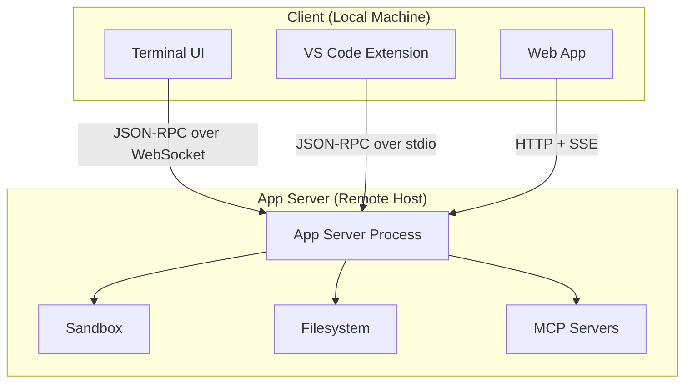
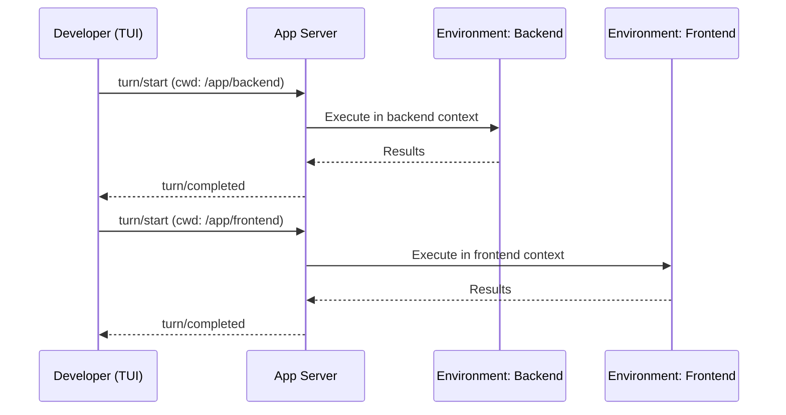
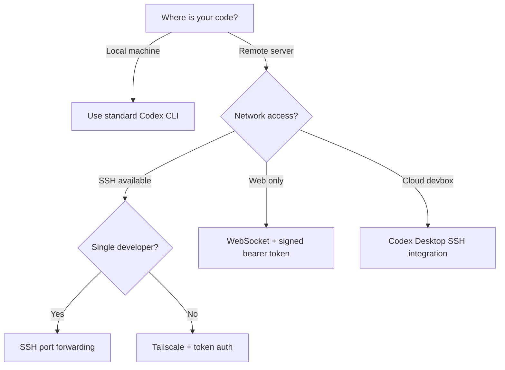

# Codex CLI Remote Development: App Server Architecture, SSH Connections, and Multi-Environment Workflows


---

Running your coding agent on a beefy remote machine whilst driving it from a laptop is no longer a workaround — it is an officially supported workflow. Since v0.125, the Codex App Server has matured from an internal implementation detail into a documented protocol powering every Codex surface: the CLI, the VS Code extension, the desktop app, and third-party IDE integrations[^1]. With the April 2026 alpha launch of remote SSH connections[^2] and per-turn multi-environment selection in v0.128[^3], the architecture is ready for serious remote development use. This article explains what the App Server is, how to configure remote TUI sessions, and how to build multi-environment workflows that keep your code, credentials, and build toolchains where they belong.

## Why Remote Matters for Coding Agents

Most coding agents assume the codebase sits on the same machine as the agent process. That assumption breaks in three common scenarios:

1. **GPU build servers** — CUDA compilation, ML training loops, and large C++ builds need hardware that lives in a data centre, not on a MacBook Air.
2. **Credential isolation** — Production secrets, signing keys, and database credentials exist on locked-down infrastructure that should never be cloned to developer laptops.
3. **Cloud devboxes** — Teams using ephemeral development environments (Coder, Gitpod, GitHub Codespaces) need the agent to run inside the devbox where the toolchain is pre-configured.

The App Server solves all three by decoupling the agent's execution from its user interface.

## The App Server Architecture

The App Server is a bidirectional JSON-RPC 2.0 protocol built in Rust that separates the Codex agent loop from its client surfaces[^1]. OpenAI initially experimented with MCP for VS Code integration but found that streaming diffs, approval flows, and thread persistence did not map cleanly onto MCP's tool-oriented model[^4]. The result is a purpose-built protocol with three core primitives:



**Threads** are durable conversation containers that persist across disconnects via rollout files. **Turns** represent a single user request plus the agent's response cycle. **Items** are atomic units of input or output — messages, commands, file edits, or tool calls[^5].

### Transport Options

The App Server supports three transports[^5]:

| Transport | Flag | Use Case |
|-----------|------|----------|
| **stdio** | Default | Local clients (VS Code, desktop app) |
| **WebSocket** | `--listen ws://IP:PORT` | Remote TUI, cross-network access |
| **Unix socket** | Via control socket | Local IPC with lower overhead |

For remote development, WebSocket is the primary transport.

## Setting Up Remote TUI

Remote TUI mode runs the App Server on one machine and connects the Codex terminal UI from another[^2]. The simplest setup uses SSH port forwarding to avoid exposing the WebSocket listener to the network.

### Step 1: Enable the Alpha Feature

On your **local** machine, enable remote connections:

```toml
# ~/.codex/config.toml
[features]
remote_connections = true
```

### Step 2: Install Codex on the Remote Host

Ensure `codex` is on the remote user's login shell PATH. The App Server bootstraps through the login shell, so if `codex` is only available in an interactive shell (e.g. loaded via `.bashrc` but not `.bash_profile`), the connection will fail even though plain SSH works[^2].

### Step 3: Configure SSH

Add the remote host to your SSH config:

```
# ~/.ssh/config
Host devbox
  HostName devbox.example.com
  User you
  IdentityFile ~/.ssh/id_ed25519
```

Codex auto-discovers concrete host aliases from `~/.ssh/config` and ignores pattern-only entries (e.g. `Host *`)[^2].

### Step 4: Connect

**Option A — SSH port forwarding (recommended):**

Start the App Server on the remote host listening on localhost:

```bash
# On remote host
codex app-server --listen ws://127.0.0.1:4500
```

Forward the port through SSH:

```bash
# On local machine
ssh -L 4500:127.0.0.1:4500 devbox
```

Then connect the TUI:

```bash
codex --remote ws://127.0.0.1:4500
```

**Option B — Direct WebSocket with authentication:**

If SSH port forwarding is impractical (e.g. web-based clients), start the App Server with token authentication:

```bash
# On remote host — generate a token file
openssl rand -hex 32 > /tmp/codex-ws-token
codex app-server \
  --listen ws://0.0.0.0:4500 \
  --ws-auth capability-token \
  --ws-token-file /tmp/codex-ws-token
```

Then connect with the token:

```bash
# On local machine
export CODEX_REMOTE_AUTH_TOKEN=$(cat /tmp/codex-ws-token)
codex --remote ws://devbox:4500 \
  --remote-auth-token-env CODEX_REMOTE_AUTH_TOKEN
```

## Authentication Deep Dive

Non-loopback WebSocket listeners require explicit authentication. The App Server supports two modes[^5]:

### Capability Token

A shared secret stored in a file on the server. The client presents it as `Authorization: Bearer <token>` during the WebSocket handshake. Simple and suitable for single-user setups.

```bash
codex app-server --listen ws://0.0.0.0:4500 \
  --ws-auth capability-token \
  --ws-token-sha256 $(sha256sum /tmp/codex-ws-token | cut -d' ' -f1)
```

### Signed Bearer Token

HMAC-based JWT validation with configurable issuer and audience claims. Designed for multi-user or enterprise deployments where tokens are minted by an identity provider:

```bash
codex app-server --listen ws://0.0.0.0:4500 \
  --ws-auth signed-bearer-token \
  --ws-shared-secret-file /etc/codex/hmac-secret \
  --ws-issuer "https://auth.example.com" \
  --ws-audience "codex-devbox"
```

## Multi-Environment Per-Turn Workflows

The v0.128 release introduced multi-environment support for App Server sessions[^3]. Each turn can target a different environment and working directory, which is particularly useful for polyglot monorepos, multi-service architectures, and mixed local/remote workflows.



The `turn/start` method accepts per-turn overrides for model, reasoning effort, working directory, sandbox policy, and output schema[^5]. This means you can:

- Switch between a Go backend and a React frontend within one session
- Target different sandbox policies per turn (read-only for exploration, workspace-write for implementation)
- Use different models per turn (Spark for quick queries, GPT-5.5 for complex refactoring)

### Cloud Environments

For Codex Cloud users, the `codex cloud exec` command supports environment targeting directly:

```bash
codex cloud exec --env ENV_ID "Summarise open bugs"
```

The `--attempts` flag (1–4) requests multiple solution variants for a single task[^6].

## Security Hardening for Remote Deployments

Remote App Server deployments expand the attack surface. Follow these guidelines:

### Network Security

- **Never expose the App Server directly to the internet**[^2]. Use SSH port forwarding, a VPN, or a mesh network like Tailscale[^7].
- The App Server rejects HTTP requests with `Origin` headers on the health endpoint to prevent cross-origin abuse[^5].
- Bounded WebSocket queues reject requests with error code `-32001` when saturated, providing backpressure rather than unbounded memory growth[^5].

### Credential Isolation

```toml
# Remote host config.toml
[security]
deny_read_paths = [
  "~/.ssh",
  "~/.aws/credentials",
  "~/.config/gcloud",
  "/etc/secrets"
]

shell_environment_policy = "exclude-all-except-system-defaults"
```

### Health Monitoring

The App Server exposes two HTTP endpoints when running in WebSocket mode[^5]:

- `GET /readyz` — returns `200 OK` once the server is accepting connections
- `GET /healthz` — returns `200 OK` for health checks (rejects requests with `Origin` headers)

These integrate naturally with load balancers, container orchestrators, and monitoring systems.

## Practical Deployment Patterns

### Pattern 1: SSH-Forwarded Single Developer

The simplest pattern. One developer, one remote machine, SSH port forwarding for security.

```bash
# Terminal 1: SSH with port forward
ssh -L 4500:127.0.0.1:4500 devbox \
  "codex app-server --listen ws://127.0.0.1:4500"

# Terminal 2: Connect TUI
codex --remote ws://127.0.0.1:4500
```

### Pattern 2: Tailscale Mesh for Team Devboxes

For teams sharing development infrastructure, Tailscale provides private networking without exposed ports[^7]:

```bash
# On remote devbox (100.x.x.x via Tailscale)
codex app-server --listen ws://100.64.0.5:4500 \
  --ws-auth capability-token \
  --ws-token-file /etc/codex/team-token

# From any team member's machine on the tailnet
codex --remote ws://100.64.0.5:4500 \
  --remote-auth-token-env CODEX_TEAM_TOKEN
```

### Pattern 3: Container-Based Devbox

For ephemeral environments where the App Server runs inside a container:

```bash
# Dockerfile excerpt
FROM ubuntu:24.04
RUN curl -fsSL https://codex.openai.com/install.sh | sh
EXPOSE 4500
CMD ["codex", "app-server", "--listen", "ws://0.0.0.0:4500", \
     "--ws-auth", "capability-token", \
     "--ws-token-file", "/run/secrets/codex-token"]
```

### Pattern 4: Codex Desktop App with SSH

The desktop app natively supports SSH connections through its GUI[^2]:

1. Open **Settings → Connections**
2. Add or enable an SSH host (auto-discovered from `~/.ssh/config`)
3. Select a remote project folder
4. Remote threads execute commands, read files, and write changes on the remote host

## Known Limitations

| Limitation | Status | Workaround |
|-----------|--------|------------|
| Remote connections are alpha | `[features] remote_connections = true` required | Expect breaking changes |
| WebSocket mode is experimental | Stability improving each release | Use SSH forwarding for reliability |
| No native Tailscale integration | Manual IP configuration | Use Tailscale MagicDNS hostnames |
| Login shell PATH issues | Common failure cause | Ensure `codex` is in `.bash_profile` or `.profile`, not just `.bashrc`[^2] |
| Outbound queue limit (128 messages) | Can disconnect during large turns | ⚠️ Reported in GitHub Issue #18203 |

## Decision Framework



## What Comes Next

The App Server is the foundation for Codex's multi-surface strategy. OpenAI has stated that MCP remains supported for simpler workflows, but the App Server is recommended for full-fidelity IDE integrations[^4]. With multi-environment per-turn selection now available, the path towards seamless remote development — where the agent runs wherever the code lives, and the developer connects from wherever they are — is well under way.

For most practitioners today, the SSH port-forwarding pattern provides the best balance of security, simplicity, and reliability. Start there, and graduate to authenticated WebSocket listeners when your team or infrastructure demands it.

---

## Citations

[^1]: [InfoQ — OpenAI Publishes Codex App Server Architecture for Unifying AI Agent Surfaces](https://www.infoq.com/news/2026/02/opanai-codex-app-server/)
[^2]: [OpenAI — Remote Connections (Codex Developer Docs)](https://developers.openai.com/codex/remote-connections)
[^3]: [OpenAI — Codex Changelog (v0.128 multi-environment per-turn)](https://developers.openai.com/codex/changelog)
[^4]: [OpenAI — Unlocking the Codex Harness: How We Built the App Server](https://openai.com/index/unlocking-the-codex-harness/)
[^5]: [OpenAI — App Server (Codex Developer Docs)](https://developers.openai.com/codex/app-server)
[^6]: [OpenAI — Codex CLI Features](https://developers.openai.com/codex/cli/features)
[^7]: [OpenAI — Remote Connections Security Guidance (Tailscale/VPN recommendation)](https://developers.openai.com/codex/remote-connections)
