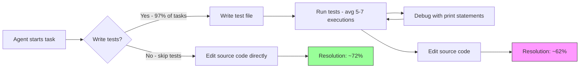
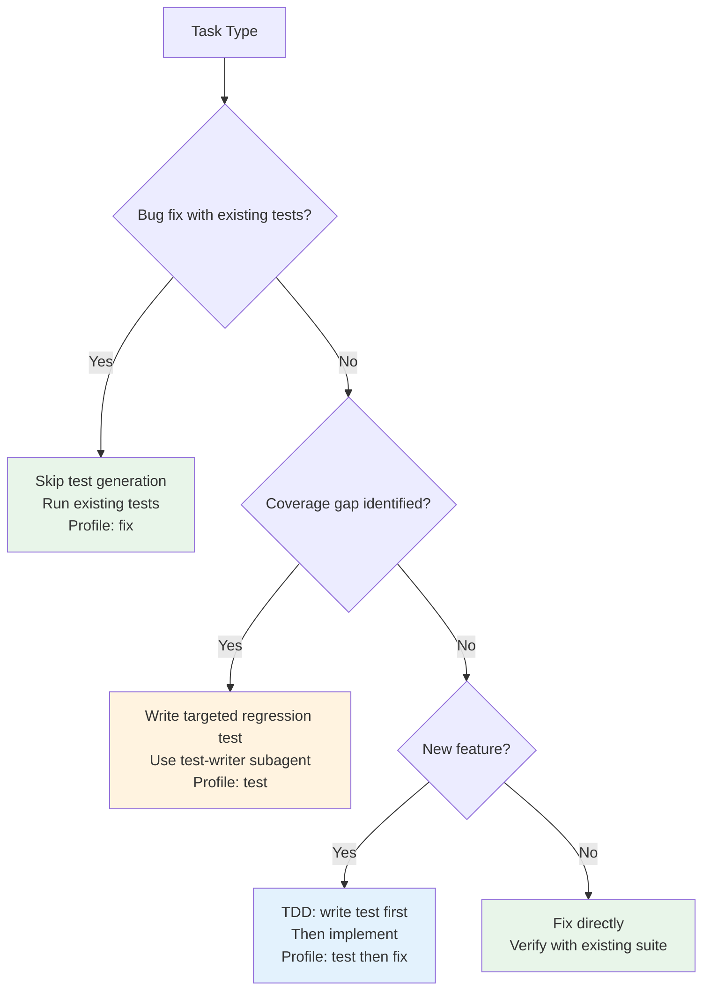

# Do Agent-Written Tests Actually Help? What Six LLMs on SWE-bench Reveal and How to Rethink Your Codex CLI Testing Strategy


---

## Introduction

The instinct to make coding agents write tests is strong — and understandable. Test-driven development has been a pillar of professional software engineering for decades, and encoding that discipline into your AGENTS.md feels like the obvious move. But a February 2026 study by Chen et al. challenges this assumption head-on: across six frontier LLMs on SWE-bench Verified, **agent-written tests reshaped process and cost far more than they changed outcomes** [^1].

The finding is striking. GPT-5.2 wrote new tests in just 0.6% of tasks yet resolved 71.8% — comparable to models that generated tests in over 97% of tasks [^1]. This article unpacks the research, cross-references it with a complementary March 2026 empirical study of real-world agent test generation [^2], and translates both into actionable Codex CLI configuration guidance.

---

## The Core Finding: Tests as Process, Not Outcome

Chen et al. analysed trajectories from six strong LLMs on SWE-bench Verified [^1]:

| Model | Test Gen Rate | Resolution Rate |
|---|---|---|
| MiniMax M2 | 98.6% | 61.0% |
| Kimi K2 Thinking | 97.4% | 63.4% |
| DeepSeek v3.2 Reasoner | 89.2% | 60.0% |
| Claude Opus 4.5 | 83.0% | 74.4% |
| Gemini 3 Pro | 61.6% | 74.2% |
| GPT-5.2 | 0.6% | 71.8% |

The correlation between test generation rate and resolution rate is, if anything, *negative*. The three highest test generators (MiniMax, Kimi, DeepSeek) all resolved fewer tasks than the three lowest generators (Claude, Gemini, GPT-5.2).

### What Agents Actually Write

When agents do write tests, they overwhelmingly use **print statements rather than assertions** as their primary feedback mechanism [^1]. Across all models, value-revealing prints exceeded assertions by a factor of 3–5×:

- Claude Opus 4.5: 5.16 assertions vs 25.00 prints per task
- MiniMax M2: 7.37 assertions vs 34.06 prints per task
- Kimi K2 Thinking: 2.86 assertions vs 20.72 prints per task

The print statements serve as observational feedback — the agent is essentially `console.log`-debugging rather than building a regression safety net [^1]. Of those prints, 70–77% were categorised as value/content inspection (P1), with only 3–7% being structural summaries (P2) [^1].

### Prompt Interventions Don't Change Outcomes

The study's most provocative finding comes from the prompt-intervention experiment. When prompts were modified to encourage or discourage test writing across four models [^1]:

- **GPT-5.2** (encouraged to write tests): 64.4% of tasks gained tests, but **zero net change** in resolved tasks (p=1.000)
- **Gemini 3 Pro** (encouraged): 37.0% shift, net −1 resolved task (p=0.522)
- **Kimi K2 Thinking** (discouraged): 68.4% shift, net −11 resolved tasks (p=0.228)
- **DeepSeek v3.2 Reasoner** (discouraged): 75.2% shift, net −20 resolved tasks (p=0.435)

No McNemar test reached statistical significance. Tests changed the process but not the bottom line.

---

## The Cost of Testing Theatre

Where the impact *does* show up is in token consumption. When Kimi K2 Thinking was discouraged from writing tests [^1]:

- API calls dropped **35.4%** (−16.57 calls per task)
- Input tokens dropped **49.0%** (−327,760 tokens per task)
- Output tokens dropped **43.1%** (−6,427 tokens per task)
- Resolution dropped just 2.6% (statistically insignificant)

DeepSeek v3.2 Reasoner showed similar patterns: 32.9% fewer input tokens and 24.5% fewer API calls when discouraged from testing, with a non-significant 1.8% resolution drop [^1].

This is not a small overhead. At current Codex CLI pricing, a 49% input token reduction translates directly to lower session costs — and in a CI pipeline running `codex exec` on hundreds of issues, the savings compound rapidly.



---

## Complementary Evidence: Real-World Test Quality

A March 2026 study by Yoshimoto et al. provides the other side of the coin [^2]. Analysing 2,232 commits from real-world repositories via the AIDev dataset, they found:

- AI authored **16.4%** of all commits adding tests
- AI-generated tests featured **higher assertion density** and longer code
- AI-generated tests maintained **lower cyclomatic complexity** (linear, sequential logic)
- Code coverage from AI tests was **comparable to human-written tests** [^2]

This paints a more nuanced picture: when agents write tests that *persist in the codebase* (as opposed to throwaway debugging tests during issue resolution), those tests are structurally sound and contribute meaningfully to coverage.

The reconciliation is straightforward: **agent-written tests are valuable as durable artefacts but wasteful as ephemeral debugging scaffolding**. The problem isn't that agents can't write good tests — it's that during autonomous issue resolution, they default to using tests as `printf` debugging rather than building lasting regression protection.

---

## Reconfiguring Your Codex CLI Testing Strategy

### 1. Separate Test-Writing from Bug-Fixing

Rather than asking Codex to write tests *while* fixing a bug, treat testing as a distinct phase. Use the plan-execute pattern [^3]:

```markdown
<!-- AGENTS.md -->
## Bug Fix Protocol
1. Diagnose the root cause
2. Implement the minimal fix
3. Run existing tests to verify the fix
4. ONLY write new tests if the bug reveals a coverage gap
5. Do NOT write throwaway diagnostic scripts
```

This mirrors GPT-5.2's approach — minimal test generation, maximum resolution — while preserving the option for genuine coverage expansion.

### 2. Use Reasoning Effort to Control Test Behaviour

Higher reasoning effort correlates with more deliberate tool use [^4]. For bug-fix tasks where you want focused resolution without test proliferation, lower effort keeps the agent on target:

```toml
# ~/.codex/config.toml

[profile.fix]
model = "gpt-5.5"
model_reasoning_effort = "medium"
# Medium effort: focused problem-solving, less process overhead

[profile.test]
model = "gpt-5.5"
model_reasoning_effort = "high"
# High effort for dedicated test-writing sessions
```

Invoke with `codex -p fix` for repairs and `codex -p test` for coverage expansion.

### 3. Dedicated Test-Writing Subagent

Codex CLI's custom agent definitions let you create a specialised test writer that runs *after* the fix is verified [^5]:

```toml
# .codex/agents/test-writer.toml

model = "gpt-5.5"
model_reasoning_effort = "high"

[instructions]
content = """
You are a test engineer. Your sole job is to write durable regression tests.

Rules:
- Never modify production code
- Every test must use proper assertions, never print-based verification
- Each test must have a clear docstring explaining what regression it prevents
- Target the specific behaviour that was just fixed or added
- Prefer integration tests over unit tests for cross-module changes
"""
```

### 4. PostToolUse Hooks for Test Quality

Rather than preventing test writing entirely, enforce quality when it happens [^6]:

```toml
# ~/.codex/config.toml

[[hooks]]
event = "PostToolUse"
tool = "apply_patch"
command = """
python3 -c "
import sys, re
patch = open(sys.argv[1]).read() if len(sys.argv) > 1 else ''
if 'test' in patch.lower():
    prints = len(re.findall(r'print\(', patch))
    asserts = len(re.findall(r'assert|self\.assert|expect\(', patch))
    if prints > asserts and prints > 3:
        print('WARNING: Test has more print statements than assertions.')
        print(f'Prints: {prints}, Assertions: {asserts}')
        print('Consider using proper assertions for durable regression coverage.')
        sys.exit(1)
"
"""
```

### 5. Structured CI Testing with codex exec

For CI pipelines, split the workflow into two explicit phases to avoid the test-writing overhead during resolution [^7]:

```bash
#!/bin/bash
# Phase 1: Fix the issue (discourage throwaway tests)
codex exec -p fix \
  --ignore-rules \
  "Fix issue #${ISSUE_NUMBER}. Do NOT write diagnostic test scripts. \
   Run existing tests to verify your fix passes."

# Phase 2: Add regression test (dedicated test-writing pass)
codex exec -p test \
  "Write a regression test for the fix applied to issue #${ISSUE_NUMBER}. \
   The test must use assertions, not print statements. \
   It must fail if the fix is reverted."
```

This two-pass approach captures both the efficiency of skipping throwaway tests *and* the durability of proper regression coverage.

---

## When Agent-Written Tests ARE Worth the Cost

The research does not say "never write tests". It says the *current default behaviour* — where agents reflexively generate ephemeral tests as a debugging mechanism — costs tokens without improving outcomes [^1]. Tests remain valuable when:

1. **You are building coverage, not fixing bugs** — dedicated test-writing sessions with high reasoning effort produce structurally sound, high-assertion-density tests [^2]
2. **The test will persist** — if the test goes into the repository and protects against regression, the token cost is amortised across every future CI run
3. **You need verification, not exploration** — TDD workflows where the test *defines* the requirement (red-green-refactor) are fundamentally different from agents writing tests to debug their own work [^8]
4. **Existing coverage is thin** — when there are no existing tests to validate against, generating them becomes a genuine necessity rather than a habit

---

## Decision Framework



---

## Practical Takeaways

1. **Mandate test quality, not test quantity** — AGENTS.md policies that say "always write tests" encourage the very pattern the research shows is wasteful. Say "write durable regression tests when coverage gaps exist" instead.

2. **Measure assertion-to-print ratio** — if your agent's test files contain more `print()` calls than assertions, it is debugging, not testing. PostToolUse hooks can catch this automatically.

3. **Use two-pass CI workflows** — separate fix and test phases in `codex exec` pipelines. The fix pass runs 35–49% cheaper without throwaway test overhead.

4. **Match the approach to the model** — GPT-5.2 and GPT-5.5 naturally favour direct resolution. Other models (particularly Kimi K2 and MiniMax) default to heavy test generation. Your AGENTS.md should account for the model's tendencies.

5. **Test-writing is a first-class task, not a side effect** — treat test creation with the same intentionality as feature development. Dedicated subagents, dedicated profiles, dedicated sessions.

---

## Citations

[^1]: Chen, Z., Sun, Z., Shi, Y., Peng, C., Gu, X., Lo, D., & Jiang, L. (2026). "Rethinking the Value of Agent-Generated Tests for LLM-Based Software Engineering Agents." arXiv:2602.07900v2. [https://arxiv.org/abs/2602.07900](https://arxiv.org/abs/2602.07900)

[^2]: Yoshimoto, S., Fujita, S., Horikawa, K., Feitosa, D., Kashiwa, Y., & Iida, H. (2026). "Testing with AI Agents: An Empirical Study of Test Generation Frequency, Quality, and Coverage." arXiv:2603.13724. [https://arxiv.org/abs/2603.13724](https://arxiv.org/abs/2603.13724)

[^3]: OpenAI. "Best practices — Codex." [https://developers.openai.com/codex/learn/best-practices](https://developers.openai.com/codex/learn/best-practices)

[^4]: OpenAI. "Configuration Reference — Codex." [https://developers.openai.com/codex/config-reference](https://developers.openai.com/codex/config-reference)

[^5]: OpenAI. "Subagents — Codex." [https://developers.openai.com/codex/concepts/subagents](https://developers.openai.com/codex/concepts/subagents)

[^6]: OpenAI. "Hooks — Codex CLI." [https://developers.openai.com/codex/cli/hooks](https://developers.openai.com/codex/cli/hooks)

[^7]: OpenAI. "Non-interactive mode — Codex CLI." [https://developers.openai.com/codex/cli/non-interactive](https://developers.openai.com/codex/cli/non-interactive)

[^8]: OpenAI. "Codex Prompting Guide." [https://developers.openai.com/cookbook/examples/gpt-5/codex_prompting_guide](https://developers.openai.com/cookbook/examples/gpt-5/codex_prompting_guide)
