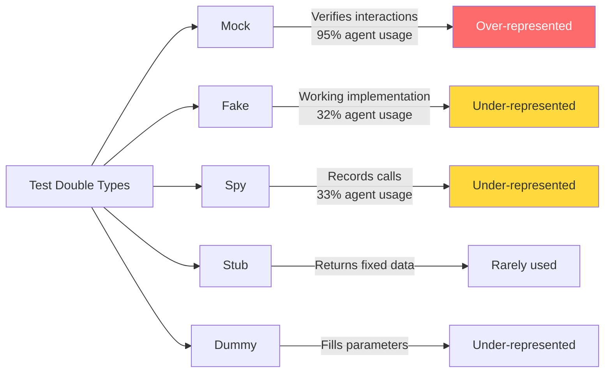

# The Over-Mocking Problem: What 1.2 Million Commits Reveal About Agent-Generated Tests and How to Configure Codex CLI for Realistic Test Output


---

A new empirical study accepted at MSR 2026 analysed 1.2 million commits across 2,168 repositories and found that coding agents generate mocks in 36% of their test commits — compared with 26% for human developers [^1]. Worse, agent-generated mocks cluster overwhelmingly around a single test-double type, suggesting that agents reach for the easiest isolation technique rather than the most appropriate one. The paper asks the question bluntly: are coding agents generating over-mocked tests?

For Codex CLI users, this is not an abstract concern. If your agent is wrapping every dependency in `jest.fn()` or `unittest.mock.patch`, your test suite may pass reliably whilst validating almost nothing about real component interactions. This article unpacks the research, maps the findings to Codex CLI behaviour, and provides concrete configuration to steer the agent towards realistic test output.

## What the Research Found

Hora and Robbes examined 48,563 agent commits and 169,361 test commits made during 2025 across TypeScript, JavaScript, and Python repositories [^1]. Three findings stand out.

### Agents Write More Tests — and More Mocks

Coding agents modify test files in 23% of their commits, nearly double the 13% rate for human developers [^1]. On the surface this looks positive. But agents also add mocks in 36% of those test commits versus 26% for humans [^1]. The gap widens with scale: in repositories with 50 or more agent commits, the agent mock ratio climbs to 36% against 28% for non-agents, with a statistically significant effect size (Cliff's delta = 0.252) [^1].

### Mock Type Concentration

Human developers spread their test doubles across mock (91%), fake (57%), spy (51%), and dummy (40%) types [^1]. Agents concentrate almost entirely on mock (95%), with fakes at just 32% and spies at 33% [^1]. This matters because different test-double types serve different purposes:



When an agent defaults to `mock` for everything, it creates tests that verify *interaction patterns* — "did you call this function with these arguments?" — rather than *behavioural correctness*. A fake database that enforces constraints catches real bugs. A mock that returns `{ ok: true }` catches nothing [^2].

### The Configuration Gap

The study examined agent configuration files (CLAUDE.md, copilot-instructions.md, CURSOR.md) across GitHub. Of 112,000 CLAUDE.md files that mentioned testing, only 13,000 (11.6%) mentioned mocking [^1]. Developers tell their agents *to write tests* but rarely tell them *how to mock responsibly*.

## Why Agents Over-Mock

The root cause is structural. Large language models optimise for test files that compile, pass, and cover the function under test. Mocks are the path of least resistance: they eliminate external dependencies, remove setup complexity, and guarantee deterministic outcomes [^2]. From the model's perspective, a heavily mocked test is a *successful* test — it runs fast, never flakes, and achieves line coverage.

The problem is that coverage without realistic interaction is a false signal. As the MSR paper notes: "tests with mocks may be potentially easier to generate automatically (but less effective at validating real interactions)" [^1].

## Configuring Codex CLI for Realistic Tests

Codex CLI provides three layers of control: AGENTS.md instructions, PostToolUse hooks, and custom review instructions. Used together, they can significantly reduce over-mocking.

### Layer 1: AGENTS.md Testing Policy

Add explicit mocking guidance to your project's `AGENTS.md` file. The key is being *prescriptive* about when mocking is acceptable and when it is not [^3] [^4].

```markdown
## Testing Standards

### Mocking Policy
- **Mock**: external HTTP APIs, third-party services, system clocks, random generators
- **Fake**: databases (use SQLite in-memory or testcontainers), message queues, caches
- **Spy**: event emitters, logging, metrics — when you need to verify calls happened
  without replacing behaviour
- **Never mock**: pure functions, value objects, your own domain logic

### Anti-Patterns to Avoid
- Do not mock the module under test
- Do not mock more than two dependencies per test function
- Do not use `jest.fn()` or `unittest.mock.patch` for anything that has a
  lightweight in-memory alternative
- Prefer dependency injection over patching

### Test Quality Checklist
Before considering a test complete:
1. At least one test exercises the real integration (no mocks)
2. Mock count per test file does not exceed the function count
3. Every mock has a comment explaining why a fake or real dependency is unsuitable
```

This approach works because Codex reads AGENTS.md before beginning work and uses it to shape tool-call decisions throughout the session [^3]. Setting an explicit policy reduces the model's tendency to default to the easiest isolation technique.

### Layer 2: PostToolUse Mock Detection Hook

A PostToolUse hook can analyse test files after the agent writes them and inject feedback when mocking thresholds are exceeded [^5].

```toml
# config.toml
[[hooks.PostToolUse]]
matcher = "^(Bash|apply_patch)$"

[[hooks.PostToolUse.hooks]]
type = "command"
command = '/usr/bin/python3 .codex/hooks/mock_audit.py'
timeout = 15
statusMessage = "Auditing mock usage in modified tests"
```

The hook script examines recently modified test files:

```python
#!/usr/bin/env python3
"""mock_audit.py — PostToolUse hook that flags over-mocked test files."""
import json, sys, re
from pathlib import Path

TEST_PATTERNS = re.compile(
    r"(test_.*\.py|.*_test\.py|.*\.test\.[jt]sx?|.*\.spec\.[jt]sx?)"
)
MOCK_INDICATORS = re.compile(
    r"\b(jest\.fn|mock\(|Mock\(|patch\(|MagicMock|vi\.fn|sinon\.stub|"
    r"sinon\.mock|createMock|spyOn)\b"
)
MAX_MOCKS_PER_FILE = 8

def audit():
    data = json.load(sys.stdin)
    tool_input = data.get("tool_input", {})

    # Identify modified test files from the tool response
    modified = []
    response = data.get("tool_response", "")
    if isinstance(response, dict):
        response = json.dumps(response)

    # Check recently modified test files in the working directory
    cwd = Path(data.get("cwd", "."))
    for p in cwd.rglob("*"):
        if TEST_PATTERNS.match(p.name) and p.is_file():
            try:
                content = p.read_text(errors="ignore")
                mocks = MOCK_INDICATORS.findall(content)
                if len(mocks) > MAX_MOCKS_PER_FILE:
                    modified.append((p.name, len(mocks)))
            except Exception:
                continue

    if modified:
        files = "; ".join(f"{n} ({c} mocks)" for n, c in modified)
        msg = (
            f"Mock audit: {files} exceed the {MAX_MOCKS_PER_FILE}-mock threshold. "
            "Consider replacing mocks with fakes or in-memory implementations. "
            "See AGENTS.md mocking policy."
        )
        json.dump({
            "hookSpecificOutput": {
                "hookEventName": "PostToolUse",
                "additionalContext": msg
            }
        }, sys.stdout)
        sys.exit(0)

    sys.exit(0)

if __name__ == "__main__":
    audit()
```

When the hook fires, the agent receives the audit message as developer context and adjusts its approach — typically replacing some mocks with fakes or real implementations in its next edit [^5].

### Layer 3: Custom /review Instructions

Codex CLI's `/review` command accepts custom instructions. After the agent finishes generating tests, run a focused review pass [^6]:

```
/review Focus on test quality: flag any test file where mock count exceeds
function-under-test count. Identify mocks that could be replaced with
in-memory fakes. Check that at least one integration test exists per
module. Ignore styling issues.
```

This creates a second-pass review that catches over-mocking the hook might miss — particularly in cases where mocks are semantically unnecessary even if they fall below the numeric threshold.

## Practical AGENTS.md Templates by Language

### Python (pytest)

```markdown
## Testing — Python
- Framework: pytest with pytest-asyncio for async code
- **Prefer**: `sqlite3` in-memory databases over mocking `psycopg2`
- **Prefer**: `httpx.MockTransport` over `unittest.mock.patch("requests.get")`
- **Prefer**: `fakeredis` over mocking Redis calls
- Use `monkeypatch` (a spy) for environment variables and sys attributes
- Maximum two `@patch` decorators per test function
- Every new module must have at least one test without any mocks
```

### TypeScript/JavaScript (Jest/Vitest)

```markdown
## Testing — TypeScript
- Framework: Vitest with @testing-library/react for components
- **Prefer**: MSW (Mock Service Worker) for HTTP mocking over `jest.fn()`
- **Prefer**: `testcontainers` for database tests over mocking Prisma
- **Prefer**: `nock` for HTTP with real request/response shapes
- Maximum three `vi.fn()` / `jest.fn()` calls per test file
- Use `vi.spyOn()` only when verifying side effects, never to replace return values
- Component tests must render real components, not mock child components
```

## Measuring Improvement

Track your mock ratio over time using a simple git analysis:

```bash
# Count mock vs test commits in the last 30 days
codex exec "Analyse the last 30 days of commits in this repo. \
  For each commit that touches test files, count the number of \
  mock/spy/fake/patch invocations added. Report: total test commits, \
  commits with mocks, mock ratio percentage, and top 5 most-mocked \
  test files. Output as JSON." --output-schema '{
    "type": "object",
    "properties": {
      "total_test_commits": {"type": "integer"},
      "commits_with_mocks": {"type": "integer"},
      "mock_ratio_pct": {"type": "number"},
      "top_mocked_files": {
        "type": "array",
        "items": {
          "type": "object",
          "properties": {
            "file": {"type": "string"},
            "mock_count": {"type": "integer"}
          }
        }
      }
    }
  }'
```

The MSR study's 36% agent mock ratio provides a useful benchmark [^1]. If your ratio sits significantly above this after applying the configurations above, the AGENTS.md policy or hook thresholds likely need tightening.

## The Broader Picture

The over-mocking problem is a symptom of a deeper issue: coding agents optimise for *test passage* rather than *test value*. A test suite where every external boundary is mocked will achieve 100% pass rates and high coverage numbers whilst catching zero integration bugs.

The MSR 2026 findings should prompt every team using AI-generated tests to audit their mock ratios. Codex CLI's layered configuration — AGENTS.md for intent, PostToolUse hooks for enforcement, and `/review` for auditing — provides the tooling to address this systematically rather than relying on manual code review to catch every `jest.fn()` that should have been a `fakeredis.FakeRedis()`.

The paper's most actionable recommendation is also the simplest: only 11.6% of agent configuration files mention mocking at all [^1]. Simply telling the agent your mocking policy is the highest-leverage change you can make.

## Citations

[^1]: Hora, A. and Robbes, R. "Are Coding Agents Generating Over-Mocked Tests? An Empirical Study." *Proceedings of the 23rd International Conference on Mining Software Repositories (MSR '26)*, 2026. [https://arxiv.org/abs/2602.00409](https://arxiv.org/abs/2602.00409)

[^2]: Meszaros, G. *xUnit Test Patterns: Refactoring Test Code.* Addison-Wesley, 2007. Test double taxonomy: mock, stub, fake, dummy, spy. [https://martinfowler.com/bliki/TestDouble.html](https://martinfowler.com/bliki/TestDouble.html)

[^3]: OpenAI. "Custom instructions with AGENTS.md." *Codex Developer Documentation*, 2026. [https://developers.openai.com/codex/guides/agents-md](https://developers.openai.com/codex/guides/agents-md)

[^4]: OpenAI. "Best practices." *Codex Developer Documentation*, 2026. [https://developers.openai.com/codex/learn/best-practices](https://developers.openai.com/codex/learn/best-practices)

[^5]: OpenAI. "Hooks." *Codex Developer Documentation*, 2026. [https://developers.openai.com/codex/hooks](https://developers.openai.com/codex/hooks)

[^6]: OpenAI. "Features — Codex CLI." *Codex Developer Documentation*, 2026. [https://developers.openai.com/codex/cli/features](https://developers.openai.com/codex/cli/features)
