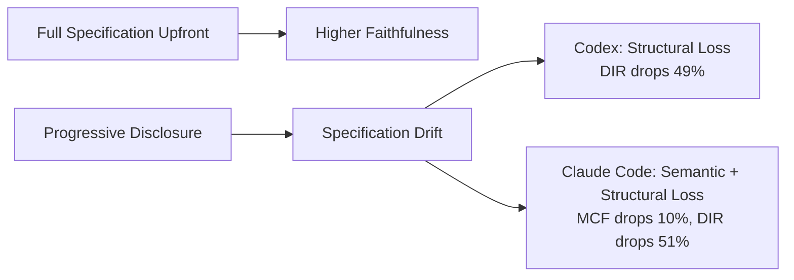
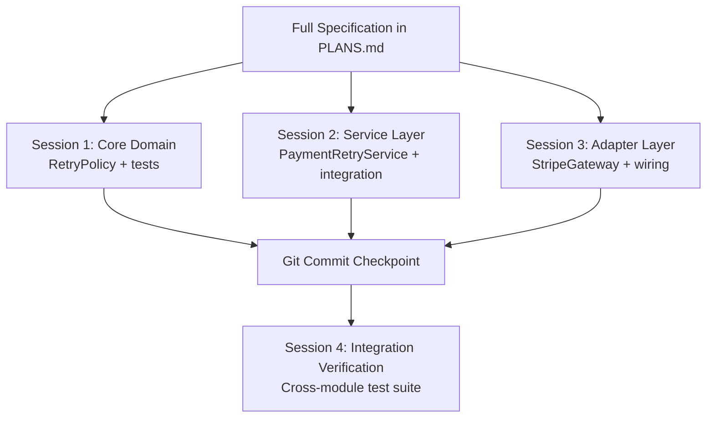

# Specification Drift and SLUMP: Why Codex CLI Loses Faithfulness in Long-Horizon Sessions and How to Fight Back


---

Every developer who has used a coding agent for a multi-hour session has felt it: somewhere around the thirtieth turn, the agent starts building something subtly different from what you asked for. A recent Purdue University study puts hard numbers on this phenomenon, introducing a metric called **SLUMP** that measures exactly how much faithfulness agents lose when specifications emerge incrementally — the way real development actually works [^1]. This article unpacks that research, maps its findings to Codex CLI's architecture, and provides concrete configuration patterns to minimise specification drift in your own sessions.

## The SLUMP Metric: Measuring What We All Suspected

Lu Yan, Xuan Chen, and Xiangyu Zhang from Purdue University constructed a benchmark from 20 recent ML papers (10 from ICML 2025, 10 from NeurIPS 2025), extracting 371 atomic verifiable components [^1]. They then tested two conditions:

- **Single-shot specification**: the full design is provided upfront in one prompt.
- **Emergent specification**: the design is disclosed progressively across approximately 60 coding requests, mimicking real-world iterative development.

SLUMP — **faithfulneSs Loss Under eMergent sPecification** — is the gap between the two:

```
SLUMP(p, a) = F(R_single_shot) − F(R_emergent)
```

where `F` is a composite faithfulness score combining **Mean Component Faithfulness** (MCF, semantic fidelity on a 0–4 scale) and **Dependency Integration Ratio** (DIR, structural module reuse on a 0–1 scale) into a single endpoint metric called **IF50** [^1].

## The Numbers: Codex vs Claude Code

The study evaluated both Codex and Claude Code. The results reveal platform-specific failure modes:

| Metric | Codex (single-shot) | Codex (emergent) | Claude Code (single-shot) | Claude Code (emergent) |
|--------|---------------------|-------------------|---------------------------|------------------------|
| MCF | 3.245 | 3.242 | 3.031 | 2.718 |
| DIR | 0.289 | 0.148 | 0.303 | 0.149 |
| IF50 gap | — | +0.071 (p=0.012) | — | +0.116 (p=0.0003) |
| Papers where single-shot wins | — | 14/20 | — | 16/20 |

Two distinct failure patterns emerge [^1]:

- **Codex preserves semantics but loses structure.** MCF barely changes (3.245 → 3.242), but DIR drops by nearly half (0.289 → 0.148). Codex implements the right components but stops wiring them together properly over long sessions.
- **Claude Code loses both.** MCF drops from 3.031 to 2.718 *and* DIR collapses. Progressive disclosure causes both semantic and structural degradation.



## Why Executable Tests Miss This

A critical finding: **executable tests weakly correlate with IF50** [^1]. Your test suite may pass whilst the implementation has drifted significantly from the intended design. Tests verify behaviour against *their own* assertions, not against the original specification. If the specification drifts, the tests often drift with it — they validate the wrong thing, confidently.

This aligns with broader research on agent-written tests. A February 2026 study of six LLMs on SWE-bench Verified found that test generation rates (0.6%–98.6%) are uncorrelated with resolution rates [^2], suggesting tests are not the reliable quality signal many assume.

## The Mechanics of Specification Drift

Agent drift — the gradual deviation from an original goal — operates through several compounding mechanisms [^3]:

1. **Interpretive fill-in.** When instructions are ambiguous, the model fills gaps with statistically likely completions. Over many turns, small interpretive deviations compound.
2. **Goal reframing.** The agent encounters unexpected results and reframes the objective, confidently executing a plan that has shifted from the original intent.
3. **Context decay.** As conversation history grows and compaction kicks in, earlier specification details may be summarised away, losing precision.
4. **Structural amnesia.** Module dependencies established in early turns become invisible after compaction — explaining Codex's specific DIR degradation pattern.

A typical Codex CLI session working on a moderately complex feature can consume 150,000–200,000 tokens within 20–30 minutes [^4]. For multi-hour sessions, compaction is inevitable, and with it comes the risk of losing the structural connective tissue between components.

## Fighting Back: Five Defence Layers for Codex CLI

### 1. Front-Load Your Specification with PLANS.md

The single most effective mitigation is simple: give Codex the full specification upfront. The SLUMP research shows this consistently outperforms progressive disclosure [^1].

OpenAI's own cookbook recommends the **ExecPlan** pattern — a self-contained `PLANS.md` file that enables multi-hour execution from a single prompt [^5]. The critical constraint is self-containment:

```markdown
<!-- PLANS.md -->
# Feature: Payment Retry Logic

## Goal
Implement exponential backoff retry for failed Stripe payments.

## Architecture
- `PaymentRetryService` in `src/services/` orchestrates retries
- `RetryPolicy` value object in `src/domain/` encodes backoff rules
- `PaymentRetryService` MUST call `RetryPolicy.nextDelay()` — no inline delay logic
- `StripeGateway` adapter in `src/adapters/` wraps the Stripe SDK

## Module Dependencies
PaymentRetryService → RetryPolicy (delay calculation)
PaymentRetryService → StripeGateway (payment execution)
StripeGateway → stripe-node SDK

## Done When
- [ ] All three modules exist with the dependency graph above
- [ ] RetryPolicy unit tests cover: first retry, max retries, jitter bounds
- [ ] Integration test proves retry-after-failure flow end-to-end
```

This addresses Codex's specific weakness: by explicitly declaring module dependencies in the specification, you counteract the structural integration loss that SLUMP measures.

### 2. Use Plan Mode as a Specification Checkpoint

Before implementation, toggle plan mode with `/plan` or `Shift+Tab` [^6]. Treat the resulting plan not as a convenience but as a **specification anchor** — a document you can refer back to when the session drifts.

```toml
# config.toml — nudge plan mode for complex tasks
[model]
plan_mode_nudge = true  # TUI reminds you to plan on complex prompts
```

When the session has been running for more than 30 turns, re-anchor by pasting the original specification back into the conversation:

```
Here is the original specification from PLANS.md. Verify the current
implementation matches all module dependencies listed. Flag any drift.
```

### 3. Structure Sessions Around /goal Workflows

The `/goal` command introduced in Codex CLI v0.128 [^7] provides persistent long-horizon objectives that survive across turns. Unlike a regular prompt, a goal acts as a durable anchor:

```
/goal Implement the payment retry system exactly as specified in PLANS.md.
      All module dependencies must match. No new modules without updating the plan.
```

Goals persist through compaction, providing a re-anchoring mechanism that counteracts context decay. When the agent's behaviour drifts, the goal remains visible, pulling it back towards the original specification.

### 4. Deploy PostToolUse Hooks for Structural Verification

Codex's specific SLUMP failure mode is structural — components lose their wiring. A `PostToolUse` hook can verify that module dependencies remain intact after each file write:

```bash
#!/usr/bin/env bash
# hooks/verify-structure.sh
# Run after file writes to check import graph matches specification

if [[ "$TOOL_NAME" == "write" || "$TOOL_NAME" == "apply_patch" ]]; then
  SPEC_DEPS=$(grep "^[A-Z].*→" PLANS.md 2>/dev/null || true)
  if [[ -n "$SPEC_DEPS" ]]; then
    echo "SPEC_CHECK: Verifying module dependencies from PLANS.md"
    echo "$SPEC_DEPS"
    echo "---"
    echo "Ensure the above dependency graph is maintained in the implementation."
  fi
fi
```

Configure in `config.toml`:

```toml
[[hooks]]
event = "PostToolUse"
command = "bash hooks/verify-structure.sh"
```

### 5. Decompose into Bounded Sessions

The SLUMP data implies a trade-off: longer sessions accumulate more drift. Rather than fighting this with increasingly complex mitigation, lean into Codex's session architecture:



Each session receives the same `PLANS.md` as context but focuses on a bounded scope. Git commits between sessions provide hard checkpoints. The verification session at the end specifically checks the structural integration that Codex tends to lose.

This maps to OpenAI's own guidance: "Smaller tasks are easier for Codex to test and for you to review" [^6].

## The ProjectGuard Approach

The SLUMP paper's own mitigation — **ProjectGuard** — is an external project-state layer that maintains semantic and structural registries across turns [^1]. Tested on Claude Code, it recovered 90% of the faithfulness gap, increased fully faithful components from 118 to 181 (53% improvement), and reduced severe failures from 72 to 49 (32% reduction).

Whilst ProjectGuard is a research prototype, you can approximate its function in Codex CLI using a combination of:

- **AGENTS.md** with explicit module registry and dependency constraints
- **Memories** (native or MCP-based) to persist structural decisions across sessions [^8]
- **PostToolUse hooks** that compare the current module graph against the specification

```markdown
<!-- AGENTS.md — specification anchor section -->
## Module Registry (do not modify without updating this section)

| Module | Location | Dependencies | Status |
|--------|----------|-------------|--------|
| RetryPolicy | src/domain/retry-policy.ts | None | Specified |
| PaymentRetryService | src/services/payment-retry.ts | RetryPolicy, StripeGateway | Specified |
| StripeGateway | src/adapters/stripe-gateway.ts | stripe-node | Specified |

When creating or modifying any module listed above, verify that:
1. The dependency graph matches this table exactly
2. No circular dependencies are introduced
3. Any new module is added to this table before implementation
```

## Measuring Your Own SLUMP

You do not need the full Purdue benchmark to track specification drift. A lightweight approach:

1. **Before the session**: list all components and their dependencies in `PLANS.md`.
2. **After the session**: run `codex exec` with a verification prompt:

```bash
codex exec "Compare the module dependency graph in PLANS.md against the \
actual import statements in src/. Report any missing dependencies, \
unexpected dependencies, or modules that exist in code but not in the \
spec. Output as JSON." --output-schema ./drift-report-schema.json
```

1. **Track the ratio**: `(matched dependencies) / (specified dependencies)` gives you a session-level DIR proxy.

## Key Takeaways

The SLUMP research quantifies what practitioners have long felt: **progressive specification disclosure costs you faithfulness**, and the cost is measurable and significant [^1]. For Codex CLI specifically:

- **Your structural integration will degrade** by roughly 49% over a long emergent session, even when semantic correctness is maintained.
- **Front-loading specifications** via PLANS.md is the single highest-impact mitigation.
- **Tests alone will not catch this** — you need explicit structural verification.
- **Session decomposition** trades session length for faithfulness, a trade-off that the data strongly supports.
- **The /goal command and PostToolUse hooks** provide Codex-native anchoring mechanisms that approximate the ProjectGuard approach.

The era of "just chat with the agent and it'll figure it out" is over. Specification engineering is the new skill boundary.

---

## Citations

[^1]: Lu Yan, Xuan Chen, Xiangyu Zhang, "When the Specification Emerges: Benchmarking Faithfulness Loss in Long-Horizon Coding Agents," arXiv:2603.17104, March 2026. [https://arxiv.org/abs/2603.17104](https://arxiv.org/abs/2603.17104)

[^2]: Chen et al., "Do Agent-Written Tests Actually Help?", arXiv:2602.07900, February 2026. [https://arxiv.org/abs/2602.07900](https://arxiv.org/abs/2602.07900)

[^3]: Wire Blog, "Agent drift: why long-running AI agents lose the plot," 2026. [https://usewire.io/blog/agent-drift-why-long-running-ai-agents-lose-the-plot/](https://usewire.io/blog/agent-drift-why-long-running-ai-agents-lose-the-plot/)

[^4]: OpenAI, "Context Compaction — Codex CLI Features," 2026. [https://developers.openai.com/codex/cli/features](https://developers.openai.com/codex/cli/features)

[^5]: OpenAI Cookbook, "Using PLANS.md for multi-hour problem solving," 2025. [https://developers.openai.com/cookbook/articles/codex_exec_plans](https://developers.openai.com/cookbook/articles/codex_exec_plans)

[^6]: OpenAI, "Best practices — Codex," 2026. [https://developers.openai.com/codex/learn/best-practices](https://developers.openai.com/codex/learn/best-practices)

[^7]: OpenAI, Codex CLI v0.128.0 Release Notes, 30 April 2026. [https://github.com/openai/codex/releases/tag/rust-v0.128.0](https://github.com/openai/codex/releases/tag/rust-v0.128.0)

[^8]: OpenAI, "Memories — Codex," 2026. [https://developers.openai.com/codex/memories](https://developers.openai.com/codex/memories)
