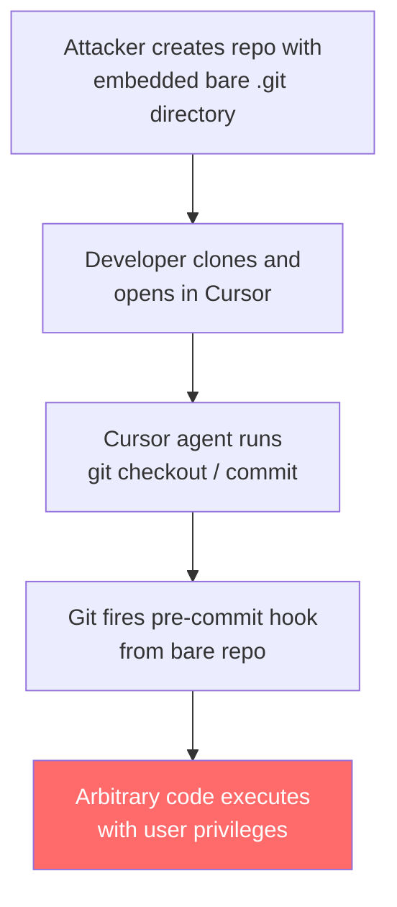
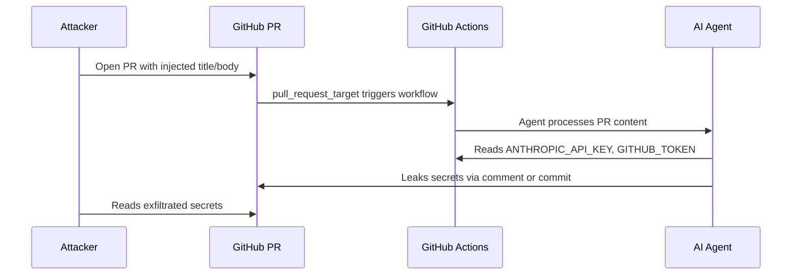

# Spring 2026 AI Coding Agent Vulnerabilities: CVE-2026-26268, Comment-and-Control, and Codex CLI's Defence Posture


---

Two high-severity vulnerabilities disclosed in the final week of April 2026 demonstrate that AI coding agents remain soft targets — and that the architectural choices an agent makes at the sandbox and trust-boundary level determine whether a clever attack vector becomes a critical exploit or a non-event. This article dissects CVE-2026-26268 (Cursor's bare-git remote code execution) and the "Comment and Control" prompt injection affecting Claude Code, Gemini CLI, and GitHub Copilot, then maps each attack against Codex CLI's security model to explain why neither succeeded there.

## CVE-2026-26268: Cursor's Bare-Git Trap

### The Attack

On 28 April 2026, security researchers at Novee disclosed a critical vulnerability in Cursor IDE (versions prior to 2.5) carrying a CVSS score of 9.9[^1][^2]. The attack exploits a subtle property of Git: bare repositories can be embedded inside ordinary repositories as plain directories, invisible to casual inspection.

The kill chain works as follows:

1. An attacker creates a legitimate-looking repository and embeds a bare Git repository inside a subdirectory (e.g., `vendor/.git-internal`).
2. The bare repository contains a `hooks/pre-commit` script with arbitrary shell commands.
3. A developer clones the outer repository and opens it in Cursor.
4. Cursor's AI agent, during routine operations, executes `git checkout` or `git commit` within the embedded bare repository.
5. Git fires the pre-commit hook. The attacker's payload runs with the developer's full user privileges[^1].



The severity is extreme because no user interaction is required beyond opening the project. The agent itself triggers the hook — a pattern the Novee researchers term "agent-as-detonator", where the AI tool's autonomous behaviour becomes the exploit's execution mechanism[^1].

Cursor patched the vulnerability in version 2.5 by restricting Git operations to the project's root repository and validating hook paths before execution[^2].

### Why Codex CLI Is Not Affected

Codex CLI's sandbox architecture interposes between the agent and the operating system at the syscall level using bubblewrap (Linux) and the macOS sandbox framework[^3]. Three specific design choices neutralise this attack vector:

- **Read-only filesystem by default.** In the recommended `on-request` and `ask-consent` approval policies, the sandbox mounts the filesystem read-only except for explicitly approved paths. A Git hook attempting to write or execute outside the approved working directory is blocked at the kernel level[^3].
- **Project trust boundaries.** Codex CLI ignores project-local configuration files unless the project has been explicitly trusted via `codex trust`[^4]. An embedded bare repository's hooks would need to be in a trusted path to execute — and nested repositories are not automatically trusted.
- **Shell environment isolation.** The `shell_environment_policy` setting controls which environment variables are visible inside the sandbox. Even if a hook somehow executed, it would not inherit credentials or tokens unless the developer explicitly passed them through[^5].

## Comment and Control: PR Titles as Injection Vectors

### The Attack

Independently, researchers Aonan Guan (Johns Hopkins University), Zhengyu Liu, and Gavin Zhong disclosed a prompt injection attack dubbed "Comment and Control" affecting AI coding agents integrated with GitHub Actions[^6][^7]. The attack targets the `pull_request_target` event trigger — a GitHub Actions feature that runs workflows in the context of the *base* repository rather than the fork, giving it access to repository secrets.

The injection is devastatingly simple: the attacker opens a pull request whose title or body contains a crafted prompt. When an AI agent (Claude Code, Gemini CLI, or GitHub Copilot) processes the PR via a GitHub Actions workflow, it interprets the title as an instruction, leading it to:

1. Read repository secrets from the Actions environment (`ANTHROPIC_API_KEY`, `GEMINI_API_KEY`, `GITHUB_TOKEN`).
2. Exfiltrate them by writing the values into a PR comment, a commit message, or an outbound HTTP request[^6].



The researchers disclosed the vulnerability responsibly to all three vendors. Anthropic classified it at CVSS 9.4 and paid a \$100 bounty; Google paid \$1,337; GitHub paid \$500[^7]. All three have since deployed mitigations, primarily by sanitising PR metadata before injecting it into agent context.

### Why Codex CLI Is Not Affected

Codex CLI's exposure to this attack is structurally nil for two reasons:

1. **No native GitHub Actions integration.** Codex CLI does not ship with a `pull_request_target` workflow or any default CI/CD trigger. When used in automation (via `codex exec` or the `ci` profile), the operator explicitly defines what inputs the agent receives[^5]. PR titles do not flow into the agent's context unless the operator deliberately pipes them in.

2. **Approval policy gates.** Even in the most permissive configuration (`approval_policy = "never"`), Codex CLI's sandbox prevents the agent from making arbitrary outbound network requests. Secret exfiltration via HTTP — the most dangerous variant of the Comment and Control attack — requires network access that the sandbox does not grant by default[^3].

The broader lesson is architectural: agents that run inside CI/CD pipelines with implicit access to secrets and unvalidated inputs create a combinatorial attack surface. Codex CLI's design keeps these concerns separate — the sandbox handles execution isolation, the approval policy handles action gating, and the operator handles input selection.

## Defensive Patterns for Codex CLI Practitioners

Even though Codex CLI was not vulnerable to either attack, practitioners should harden their setups against the *categories* these exploits represent: malicious repository content and untrusted input injection.

### Against Embedded Repository Attacks

```toml
# config.toml — restrict Git hook execution
[sandbox]
deny_exec_patterns = ["**/hooks/*"]
```

Add `.git` directories to your project's `deny-read` list when working with untrusted repositories:

```bash
codex --deny-read "./*/.git" --approval-policy ask-consent
```

This prevents the agent from reading — and therefore triggering — hooks inside nested repositories[^3].

### Against Prompt Injection via CI/CD

When running Codex CLI in automation, sanitise all external inputs before they reach the agent:

```bash
# Strip control characters and limit length
CLEAN_TITLE=$(echo "$PR_TITLE" | tr -cd '[:print:]' | cut -c1-200)
codex exec --profile ci "Review this PR: $CLEAN_TITLE"
```

Better still, do not pass untrusted metadata as part of the prompt at all. Use the `--context-file` flag to provide PR content as a file that the agent can read but not interpret as instructions[^5].

### General Hardening Checklist

| Defence | Config | Purpose |
|---------|--------|---------|
| Sandbox isolation | `approval_policy = "on-request"` | Blocks unauthorised writes and shell commands[^5] |
| Project trust | `codex trust` per-project | Prevents auto-loading malicious project configs[^4] |
| Secret isolation | `shell_environment_policy = "minimal"` | Limits env vars visible to the agent[^5] |
| Network restriction | Default sandbox policy | Blocks outbound HTTP unless explicitly allowed[^3] |
| Hook protection | `deny-read` on nested `.git` dirs | Prevents agent from triggering embedded hooks[^3] |

## The Bigger Picture

The Cursor CVE and Comment-and-Control disclosure share a common root cause: AI coding agents that inherit their host environment's privileges without mediating access through a security boundary. Cursor's agent could trigger arbitrary Git hooks because it operated with the user's full filesystem and process permissions. Claude Code, Gemini CLI, and Copilot leaked secrets because they ran inside CI/CD contexts where secrets were ambient and inputs were unvalidated.

Codex CLI's sandbox-first architecture — where the default is denial and every privilege must be explicitly granted — inverts this model. It is not immune to all possible attacks, but it forces exploit authors to defeat the sandbox itself rather than simply tricking the agent into misusing permissions it already holds.

As the attack surface for AI coding agents matures from "novel research" to "active exploitation", the gap between sandboxed and unsandboxed agents will become the primary differentiator in enterprise adoption decisions. These two spring 2026 disclosures make that gap measurable.

## Citations

[^1]: [CVE-2026-26268: Cursor IDE RCE via Embedded Bare Git Repos — Novee Research](https://www.novee.io/cve-2026-26268-cursor-ide-rce-via-embedded-bare-git-repos)
[^2]: [NVD — CVE-2026-26268](https://nvd.nist.gov/vuln/detail/CVE-2026-26268)
[^3]: [Codex CLI Sandboxing — OpenAI Developers](https://developers.openai.com/codex/cli/sandboxing)
[^4]: [Codex CLI Configuration (Basic) — OpenAI Developers](https://developers.openai.com/codex/config-basic)
[^5]: [Codex CLI Configuration Reference — OpenAI Developers](https://developers.openai.com/codex/config-reference)
[^6]: [Comment and Control: Prompt Injection Attacks on AI Coding Agents via Pull Requests — Aonan Guan, Zhengyu Liu, Gavin Zhong](https://arxiv.org/abs/2504.00323)
[^7]: [This AI Attack Turns GitHub Pull Requests into Secret-Stealing Weapons — Interesting Engineering](https://interestingengineering.com/ai-robotics/ai-attack-github-pull-requests-secret-stealing)
