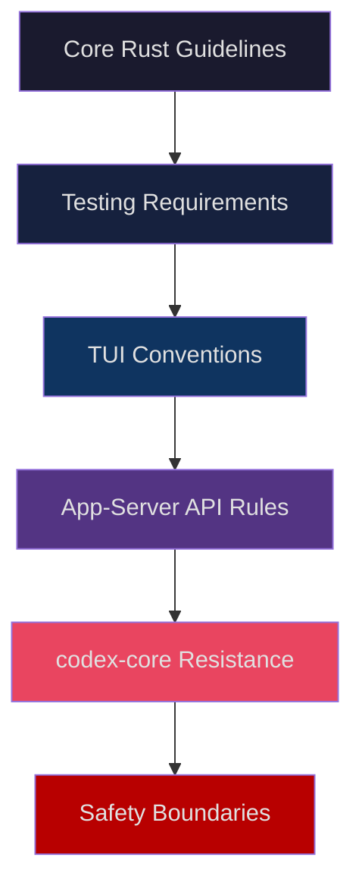
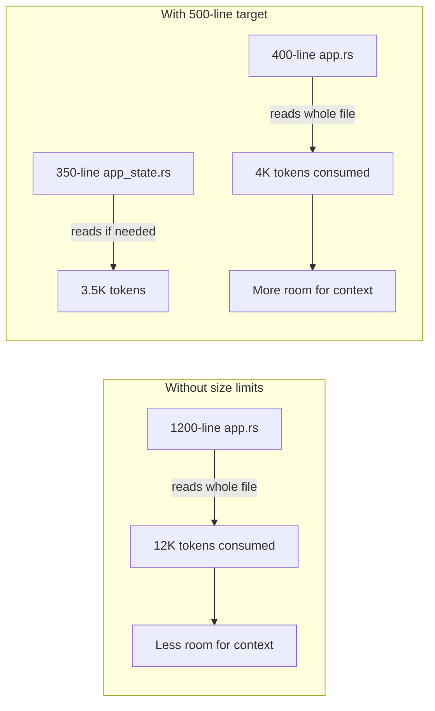

# Anatomy of a Production AGENTS.md: What the openai/codex Repository Teaches About Agent-Aware Codebase Configuration


---

Most AGENTS.md guides tell you what sections to include. Few show you a battle-tested file from a codebase where agents write production code daily. The openai/codex repository — the 70-crate Rust workspace that powers Codex CLI, the desktop app, and the VS Code extension — ships its own AGENTS.md[^1]. It is arguably the most consequential AGENTS.md file in existence: it governs how Codex contributes to Codex.

This article dissects that file, extracts the patterns that make it effective, and shows how to apply them to your own projects.

## Why Study This File?

OpenAI's AGENTS.md is not a demo. It governs a workspace that ships binaries to over four million weekly users[^2]. Every internal contributor — human or agent — reads it. The file reflects months of iteration on what actually reduces rework in an agentic Rust development workflow, and it follows the layered discovery rules that Codex CLI applies to every project[^3].

Research from ETH Zurich confirms the stakes: LLM-generated context files reduce task success rates in five out of eight tested settings, adding 2.5 to 3.9 extra steps per task and increasing inference costs by over 20%[^4]. Human-curated files, by contrast, yield roughly a four-percentage-point improvement. The openai/codex AGENTS.md is hand-curated, specific, and opinionated — exactly the profile that works.

## The Structure

The file is organised into six sections, each targeting a different failure mode that agents exhibit in large Rust codebases[^1]:



Each section is directive, not descriptive. The file never explains *why* Rust uses exhaustive match statements — it simply tells the agent to use them. This is the single most important pattern: an AGENTS.md is instructions, not documentation.

## Pattern 1: Encode the Counterintuitive Convention

The strongest entries in the openai/codex AGENTS.md target conventions that agents would not discover from the code alone. Three examples stand out:

**Async trait shape.** The file specifies the exact signature for async trait methods — native RPITIT with `Send` bounds rather than the `#[async_trait]` macro[^1]. Without this instruction, an agent trained on pre-2024 Rust would default to `#[async_trait]`, creating inconsistency across the workspace.

**Boolean parameter prohibition.** The file forbids opaque `bool` and `Option` parameters, requiring enums or named methods instead[^1]. This is a taste decision that cannot be inferred from compiler output.

**API field naming split.** The app-server uses `camelCase` for protocol fields but `snake_case` for configuration payloads[^1]. An agent seeing both patterns in the codebase would have no way to know which applies where without explicit instruction.

The principle: one real code convention beats three paragraphs of description[^4]. If a rule contradicts what the model would do by default, it belongs in AGENTS.md.

## Pattern 2: Gate Quality with Specific Commands

The openai/codex AGENTS.md does not say "write tests." It specifies exact commands:

```bash
# After any UI change
cargo test -p codex-tui        # generates insta snapshots
cargo insta accept -p codex-tui # review and accept snapshots

# After changes to common, core, or protocol crates
cargo test                      # full workspace suite

# After Cargo.toml changes
just bazel-lock-update          # sync Bazel lockfile
just bazel-lock-check           # verify lockfile drift
```

This pattern maps directly to the official best-practice guidance: Codex produces higher-quality outputs when it can verify its work, and specific verification commands outperform vague instructions like "make sure tests pass"[^5].

The file also specifies `just fmt` for formatting and `just write-config-schema` after configuration changes[^1] — commands that a newcomer (human or agent) would not know to run.

## Pattern 3: Set Module Size Limits

The AGENTS.md sets a hard target: modules under 500 lines of code, excluding tests[^1]. Files exceeding approximately 800 lines should be split into new modules.

This is a context-window-aware convention. Large files consume disproportionate context when the agent reads them, crowding out other relevant files. By keeping modules small, the AGENTS.md ensures that the agent can read, understand, and modify a file without exhausting its token budget — a concern the Codex documentation addresses directly in its guidance on `tool_output_token_limit`[^6].



The size limit is not arbitrary aesthetics — it is infrastructure for agentic productivity.

## Pattern 4: Declare No-Go Zones

The most striking section is a flat prohibition:

> Never modify code related to `CODEX_SANDBOX_NETWORK_DISABLED_ENV_VAR` or `CODEX_SANDBOX_ENV_VAR`.

This is a security boundary encoded in natural language. The sandbox isolation code is critical enough that no agent should touch it without explicit human instruction. Similar patterns appear for MCP tool call mutations, which must go through `mcp_connection_manager.rs`[^1].

For your own projects, identify the code paths where an agent mistake would cause the most damage — secrets management, authentication flows, billing logic — and declare them off-limits in AGENTS.md.

## Pattern 5: Resist Crate Growth

The file includes a strategic directive: resist additions to `codex-core`[^1]. It instructs contributors to consider existing crates or create new ones rather than expanding the already-large core crate.

This addresses a specific failure mode in agentic development: agents tend to add code to the most obvious location, which in a large workspace is usually the central crate. Over time, this creates a monolithic dependency that slows compilation, increases merge conflicts, and makes the codebase harder to navigate.

The pattern generalises to any project: identify your "gravity well" modules — the files or packages that attract disproportionate additions — and add an AGENTS.md directive redirecting new code elsewhere.

## Pattern 6: Encode API Naming Conventions

The app-server section of the AGENTS.md is a complete API style guide compressed into a few dozen lines[^1]:

| Element | Convention |
|---------|-----------|
| Request types | `*Params` suffix |
| Response types | `*Response` suffix |
| Notification types | `*Notification` suffix |
| Resource paths | `<singular_resource>/<method>` |
| Field casing | `camelCase` via `#[serde(rename_all = "camelCase")]` |
| IDs | Plain `String` |
| Timestamps | `i64` Unix seconds, `*_at` suffix |
| Optional fields | `#[ts(optional = nullable)]` |
| Pagination | Cursor-based: `cursor`, `limit`, `data`, `next_cursor` |

This level of specificity is unusual for an AGENTS.md, but it reflects a codebase where API consistency across 70 crates matters more than in smaller projects. For teams building internal APIs, encoding these conventions in AGENTS.md prevents the drift that accumulates when agents (or humans) work on different services independently.

## What the File Does Not Do

The openai/codex AGENTS.md is notable for what it omits:

- **No architectural overview.** It does not explain the crate dependency graph or the purpose of each module. That information lives in READMEs and documentation.
- **No onboarding narrative.** It does not welcome new contributors or explain the project's goals. AGENTS.md is for instructions, not storytelling.
- **No duplicated compiler rules.** It does not repeat things the Rust compiler already enforces (borrow checker rules, lifetime annotations). Only conventions the compiler cannot catch are included.

This restraint keeps the file within the 32 KiB default discovery limit[^3] and avoids the token-wasting padding that research shows degrades agent performance[^4].

## Applying These Patterns to Your Project

To build an AGENTS.md inspired by the openai/codex approach:

1. **Start with counterintuitive conventions.** List every rule that a new team member gets wrong on their first PR. Those rules belong in AGENTS.md.
2. **Add verification commands.** For each category of change (UI, API, configuration, dependencies), specify the exact commands to run.
3. **Set size constraints.** Choose a module size target appropriate to your language and enforce it in the file.
4. **Declare no-go zones.** Identify security-critical and stability-critical code paths and prohibit agent modification.
5. **Encode API conventions as tables.** Tables are token-efficient and unambiguous — agents parse them more reliably than prose.
6. **Omit what the compiler catches.** If your toolchain already enforces a rule, do not repeat it.

Verify the result by running `codex --ask-for-approval never "Summarise current instructions"` and confirming that every directive loads correctly[^3].

## Recommendations

The openai/codex AGENTS.md is not a template to copy verbatim — it is a Rust-specific file for a specific workspace. But its structural patterns transfer to any language and any project size. The core insight is that AGENTS.md is not documentation, not a README, and not a style guide. It is a set of machine-readable instructions that prevent the specific mistakes agents make in your codebase. Write it from your bug tracker, not from your wiki.

---

## Citations

[^1]: OpenAI, "AGENTS.md — openai/codex," GitHub, [https://github.com/openai/codex/blob/main/AGENTS.md](https://github.com/openai/codex/blob/main/AGENTS.md), accessed 3 May 2026.

[^2]: Sam Altman, user growth announcement, April 2026; OpenAI, "Introducing upgrades to Codex," [https://openai.com/index/introducing-upgrades-to-codex/](https://openai.com/index/introducing-upgrades-to-codex/), 2026.

[^3]: OpenAI, "Custom instructions with AGENTS.md — Codex," [https://developers.openai.com/codex/guides/agents-md](https://developers.openai.com/codex/guides/agents-md), accessed 3 May 2026.

[^4]: Augment Code, "How to Build Your AGENTS.md (2026): The Context File That Makes AI Coding Agents Actually Work," [https://www.augmentcode.com/guides/how-to-build-agents-md](https://www.augmentcode.com/guides/how-to-build-agents-md), 2026; referencing ETH Zurich findings on LLM-generated context files.

[^5]: OpenAI, "Best practices — Codex," [https://developers.openai.com/codex/learn/best-practices](https://developers.openai.com/codex/learn/best-practices), accessed 3 May 2026.

[^6]: OpenAI, "Configuration Reference — Codex," [https://developers.openai.com/codex/config-reference](https://developers.openai.com/codex/config-reference), accessed 3 May 2026.
