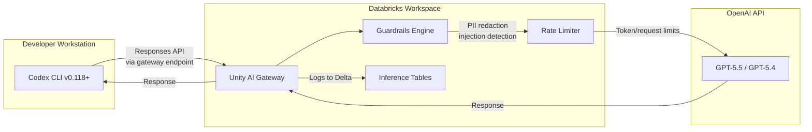
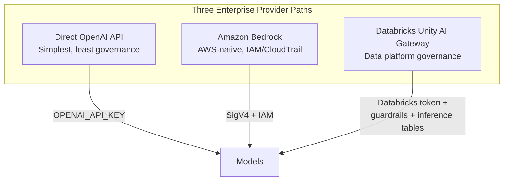

# Codex CLI Through Databricks Unity AI Gateway: Enterprise Governance, Rate Limits, and Guardrails for Coding Agents


---

## Why Route Codex CLI Through a Gateway

Enterprise teams adopting Codex CLI face a recurring governance challenge: how do you give fifty — or five thousand — developers access to GPT-5.5 for agentic coding while maintaining cost control, usage visibility, PII protection, and prompt injection defence? The answer, increasingly, is an AI gateway that sits between the coding agent and the model provider.

Databricks announced GPT-5.5 and Codex availability through Unity AI Gateway in late April 2026, making it the first major data platform to offer governed Codex CLI access natively.[^1] This article covers the practical configuration, the governance controls you gain, and the trade-offs compared to routing directly through the OpenAI API or Amazon Bedrock.

---

## Architecture Overview



Unity AI Gateway acts as a transparent proxy between Codex CLI and OpenAI's Responses API.[^2] Every request passes through configurable guardrails, rate limits, and audit logging before reaching the model. Responses flow back through the same path, with output guardrails optionally scanning for PII or unsafe content before delivery to the developer's terminal.[^3]

---

## Prerequisites

Before configuring Codex CLI, ensure:

1. **Databricks workspace** with Unity Catalog enabled on AWS, Azure, or GCP[^4]
2. **Unity AI Gateway preview** activated by an account administrator via the Previews page[^2]
3. **Codex CLI v0.118 or later** installed (the custom provider feature requires this minimum)[^5]
4. **Databricks CLI** authenticated for token retrieval[^5]

```bash
# Install or update Codex CLI
npm install -g @openai/codex@latest

# Authenticate with Databricks (one-time)
databricks auth login --host https://your-workspace.databricks.net
```

---

## Configuration

### config.toml Setup

Create or update `~/.codex/config.toml` to route through Unity AI Gateway:

```toml
profile = "databricks"

[profiles.databricks]
model = "gpt-5.5"
model_provider = "Databricks"

[model_providers.Databricks]
name = "Databricks Unity AI Gateway"
base_url = "https://your-workspace.databricks.net/ai-gateway/codex/v1"
wire_api = "responses"

[model_providers.Databricks.auth]
command = "sh"
args = ["-c", "databricks auth token --host https://your-workspace.databricks.net --output json | jq -r '.access_token'"]
timeout_ms = 5000
refresh_interval_ms = 1800000
```

The critical settings:

| Key | Purpose |
|-----|---------|
| `base_url` | Points to the gateway's Codex endpoint, not the OpenAI API directly |
| `wire_api = "responses"` | Ensures Codex CLI uses the Responses API format that the gateway expects[^5] |
| `auth.command` | Retrieves a fresh Databricks access token via the Databricks CLI |
| `refresh_interval_ms` | Refreshes the token every 30 minutes to avoid expiry during long sessions |

### Multi-Profile Configuration

Most teams will want a fallback for situations where the gateway is unavailable:

```toml
profile = "databricks"

[profiles.databricks]
model = "gpt-5.5"
model_provider = "Databricks"

[profiles.direct]
model = "gpt-5.5"
# Falls back to standard OpenAI API via OPENAI_API_KEY

[profiles.fast]
model = "gpt-5.4-mini"
model_provider = "Databricks"
```

Switch profiles at launch with `codex -p direct` or mid-session via the TUI model selector.

---

## Governance Controls

### Rate Limits

Unity AI Gateway supports per-user and per-group rate limits, configurable by administrators through the gateway UI or API:[^6]

- **Requests per minute** — prevents a single developer's runaway `/goal` workflow from exhausting team capacity
- **Tokens per minute** — caps total token throughput, critical for controlling costs during parallel `codex exec` batch runs
- **Automatic failover** — when a rate limit is hit, the gateway can route traffic to a backup endpoint (e.g., a secondary deployment or a lower-cost model)[^6]

⚠️ When Codex CLI receives a 429 response from the gateway, it applies exponential backoff internally. However, extended rate limiting during interactive TUI sessions can feel unresponsive — consider setting generous per-user limits for interactive work and stricter limits for CI/batch.

### Guardrails

Guardrails run as configurable middleware on requests, responses, or both:[^3]

| Guardrail | What It Does | Codex CLI Relevance |
|-----------|-------------|---------------------|
| **PII Detection** | Detects and redacts emails, SSNs, phone numbers | Prevents accidental inclusion of test data credentials in prompts |
| **Prompt Injection Detection** | Catches jailbreak attempts | Defends against indirect injection via malicious repository content[^7] |
| **Content Safety** | Blocks toxic or harmful content | Prevents inappropriate code comments or documentation generation |
| **Data Exfiltration Prevention** | Detects attempts to leak sensitive data | Complements Codex CLI's `deny_read_paths` filesystem protection |
| **Custom Guardrails** | User-defined rules via a guardrail model | Enforce organisation-specific policies (e.g., "never generate SQL DELETE without WHERE") |

Each guardrail is independently configurable per endpoint, allowing different policies for interactive development versus CI/CD batch processing.

### Permissions

Unity AI Gateway integrates with Databricks' identity system:[^2]

- **Per-user access** — control which developers can access GPT-5.5 versus GPT-5.4-mini
- **Group-based policies** — security teams get higher rate limits; interns get lower ones
- **Service principal access** — CI/CD pipelines authenticate as service principals with separate quotas

---

## Observability

### Inference Tables

Every Codex CLI interaction routed through the gateway is logged to Delta tables in Unity Catalog:[^2]

- Full request and response payloads (subject to retention policy)
- Token counts per request (input, output, reasoning)
- Latency measurements
- Guardrail trigger events
- User identity and source IP

This gives data platform teams visibility into:

```sql
-- Daily token spend by team
SELECT
  user_identity,
  date_trunc('day', timestamp) AS day,
  SUM(total_tokens) AS tokens,
  SUM(total_tokens * cost_per_token) AS estimated_cost
FROM ai_gateway.codex_inference_logs
WHERE timestamp > current_date - INTERVAL 7 DAYS
GROUP BY 1, 2
ORDER BY estimated_cost DESC
```

### Pre-Built Dashboard

Databricks provides a pre-configured dashboard accessible via the "View dashboard" option in the gateway UI, showing usage trends, cost attribution, guardrail violations, and rate limit events.[^2]

### OpenTelemetry Export

For teams already using Codex CLI's native OTEL support, the gateway's telemetry complements client-side traces with server-side metrics — giving end-to-end visibility from keystroke to model response.[^8]

---

## Comparison with Other Provider Routes



| Dimension | Direct API | Amazon Bedrock | Databricks Gateway |
|-----------|-----------|----------------|-------------------|
| **Authentication** | API key or OAuth | IAM + SigV4 | Databricks CLI token |
| **Rate limiting** | OpenAI tier-based | Bedrock quotas | Custom per-user/group |
| **PII scanning** | None (client-side hooks only) | None native | Built-in guardrails |
| **Prompt injection defence** | Client-side hooks | None native | Built-in guardrails |
| **Audit trail** | OpenAI usage dashboard | CloudTrail | Delta inference tables |
| **Cost attribution** | Per API key | Per IAM principal | Per user/group with SQL |
| **Model availability** | Full lineup | GPT-OSS only (preview) | GPT-5.5, GPT-5.4, GPT-5.4-mini[^1] |
| **Multi-cloud** | N/A | AWS only | AWS, Azure, GCP[^4] |
| **Status** | GA | Limited Preview | Beta (no charges)[^2] |

### When to Choose Databricks

The Databricks route makes most sense when:

- Your organisation already uses Databricks for data engineering or ML
- You need **PII scanning on prompts** without building custom `PreToolUse` hooks
- Finance requires **per-developer cost attribution** queryable via SQL
- Security mandates **prompt injection detection** at the gateway layer
- You want a **single governance plane** across Codex CLI, Claude Code, Cursor, and Gemini CLI[^2]

### When to Choose Other Routes

- **Direct API**: Solo developers, small teams without governance requirements, or when you need the full model lineup (including GPT-5.3-Codex-Spark)
- **Amazon Bedrock**: AWS-only shops with existing IAM infrastructure, or teams needing GPT-OSS open-weight models on private infrastructure[^9]

---

## Defence-in-Depth Integration

Unity AI Gateway's guardrails complement — but do not replace — Codex CLI's own security controls. A production-hardened setup layers both:

```toml
# ~/.codex/config.toml — belt and braces

[profiles.governed]
model = "gpt-5.5"
model_provider = "Databricks"
sandbox = "workspace-write"

# CLI-side defences (gateway doesn't see filesystem)
deny_read_paths = [
  "**/.env",
  "**/*credentials*",
  "**/secrets/**"
]

shell_environment_policy = "inherit-with-exclusions"
shell_environment_exclude = [
  "AWS_SECRET_ACCESS_KEY",
  "DATABASE_URL",
  "GITHUB_TOKEN"
]
```

| Layer | Defence | Where |
|-------|---------|-------|
| 1 | Filesystem deny-read | Codex CLI sandbox |
| 2 | Environment variable exclusion | Codex CLI shell policy |
| 3 | PII detection on prompts | Unity AI Gateway |
| 4 | Prompt injection detection | Unity AI Gateway |
| 5 | Rate limiting | Unity AI Gateway |
| 6 | Audit logging | Inference tables (Delta) |

---

## CI/CD Integration

For headless `codex exec` pipelines, authenticate via a Databricks service principal:

```bash
#!/usr/bin/env bash
# ci-codex-review.sh — governed code review in CI

export DATABRICKS_HOST="https://your-workspace.databricks.net"
export DATABRICKS_CLIENT_ID="$SP_CLIENT_ID"
export DATABRICKS_CLIENT_SECRET="$SP_CLIENT_SECRET"

codex exec \
  -p databricks \
  --ignore-user-config \
  --output-schema '{"type":"object","properties":{"issues":{"type":"array"},"summary":{"type":"string"}}}' \
  "Review the staged changes for security vulnerabilities and style violations"
```

The service principal's token is generated via OAuth client credentials, and the gateway applies the same guardrails and rate limits as interactive developer sessions — ensuring CI pipelines can't bypass governance.[^5]

---

## Current Limitations

- **Beta status** — Unity AI Gateway's coding agent integration is in preview; breaking changes may occur[^2]
- **No GPT-5.3-Codex or Spark models** — only GPT-5.5, GPT-5.4, and GPT-5.4-mini are currently available through the gateway[^1]
- **Latency overhead** — gateway guardrails add 50–150ms per request depending on configuration; noticeable during rapid interactive typing but negligible for batch runs
- **No MCP passthrough** — MCP tool calls are not routed through the gateway; only model inference traffic is governed
- **Token refresh complexity** — the `databricks auth token` command requires the Databricks CLI to be installed on every developer machine and CI runner

---

## Getting Started Checklist

1. ☐ Confirm Unity AI Gateway preview is enabled in your Databricks account
2. ☐ Create a gateway endpoint for Codex CLI in your workspace
3. ☐ Configure guardrails (PII detection + prompt injection at minimum)
4. ☐ Set rate limits appropriate to your team size
5. ☐ Distribute the `config.toml` snippet to developers (or use Codex CLI's `managed_config.toml` for enforcement)
6. ☐ Create a service principal for CI/CD pipelines
7. ☐ Verify with `codex exec "print hello world"` — confirm the request appears in inference tables
8. ☐ Set up the pre-built dashboard for ongoing monitoring

---

## Citations

[^1]: Databricks, "OpenAI GPT-5.5 and Codex now available on Databricks, governed through Unity AI Gateway," Databricks Blog, April 2026. [https://www.databricks.com/blog/openai-gpt-55-now-available-databricks-fully-governed-through-unity-ai-gateway](https://www.databricks.com/blog/openai-gpt-55-now-available-databricks-fully-governed-through-unity-ai-gateway)

[^2]: Databricks, "Unity AI Gateway," Databricks Documentation, 2026. [https://docs.databricks.com/aws/en/ai-gateway/](https://docs.databricks.com/aws/en/ai-gateway/)

[^3]: Databricks, "Expanding Agent Governance with Unity AI Gateway," Databricks Blog, 2026. [https://www.databricks.com/blog/ai-gateway-governance-layer-agentic-ai](https://www.databricks.com/blog/ai-gateway-governance-layer-agentic-ai)

[^4]: Databricks Community, "OpenAI GPT-5.5 + Codex, now available and fully governed in Databricks," Databricks Community Forum, 2026. [https://community.databricks.com/t5/announcements/openai-gpt-5-5-codex-now-available-and-fully-governed-in/td-p/155558](https://community.databricks.com/t5/announcements/openai-gpt-5-5-codex-now-available-and-fully-governed-in/td-p/155558)

[^5]: Databricks, "Integrate with coding agents," Databricks Documentation, 2026. [https://docs.databricks.com/aws/en/ai-gateway/coding-agent-integration-beta](https://docs.databricks.com/aws/en/ai-gateway/coding-agent-integration-beta)

[^6]: Databricks, "Configure rate limits for Unity AI Gateway endpoints," Databricks Documentation, 2026. [https://docs.databricks.com/aws/en/ai-gateway/rate-limits-beta](https://docs.databricks.com/aws/en/ai-gateway/rate-limits-beta)

[^7]: Databricks, "Mitigating The Risk of Prompt Injection for AI Agents on Databricks," Databricks Blog, 2026. [https://www.databricks.com/blog/mitigating-risk-prompt-injection-ai-agents-databricks](https://www.databricks.com/blog/mitigating-risk-prompt-injection-ai-agents-databricks)

[^8]: SigNoz, "Codex CLI OpenTelemetry Monitoring," SigNoz Documentation, 2026. Referenced in existing article: `2026-04-26-codex-cli-opentelemetry-observability-monitoring-agent-sessions.md`

[^9]: OpenAI, "OpenAI on AWS," OpenAI Blog, April 2026. Referenced in existing article: `2026-05-02-codex-cli-amazon-bedrock-aws-enterprise-configuration-guide.md`
