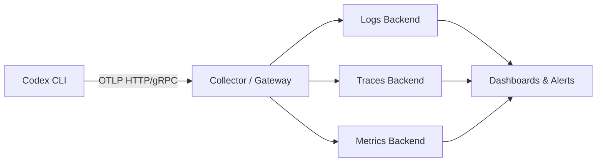
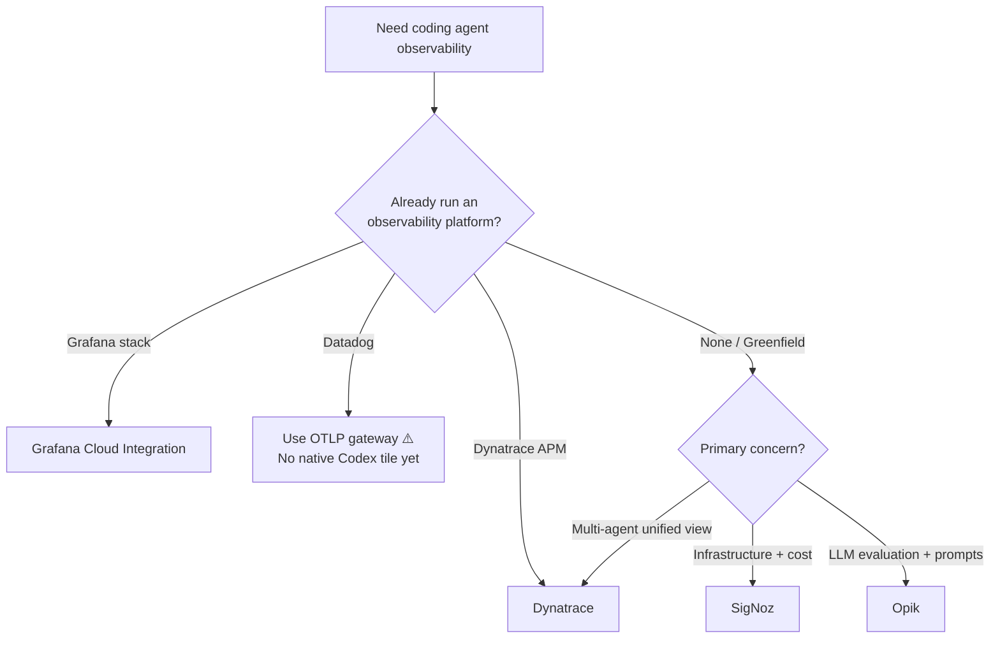

# Codex CLI Enterprise Observability: Choosing and Configuring Grafana Cloud, SigNoz, Dynatrace, and Opik


---

Codex CLI has shipped opt-in OpenTelemetry export since v0.107.0, but the documentation stops at "here's how to configure an OTLP endpoint" [^1]. For teams running Codex across dozens of developers, the real question is: *which observability platform should receive that telemetry, and what do you actually get once it arrives?*

This article compares four platforms that now offer first-class Codex CLI integrations — Grafana Cloud, SigNoz, Dynatrace, and Opik — with production-ready configuration for each and a decision framework for choosing between them.

## The Telemetry Codex Emits

Before choosing a backend, understand what Codex sends. The `[otel]` configuration block in `config.toml` controls three signal types [^2]:

| Signal | Config Key | Events / Data |
|--------|-----------|---------------|
| Logs | `otel.exporter` | API requests, SSE streams, tool approvals, tool results, user prompts (opt-in) |
| Traces | `otel.trace_exporter` | Span-per-turn execution traces with tool invocations |
| Metrics | `otel.metrics_exporter` | Token consumption, request counts, latency histograms |

Every emitted event carries metadata: service name, CLI version, environment tag, conversation ID, model name, and sandbox/approval settings [^1]. Events batch asynchronously and flush on shutdown.



## Platform Configurations

### Grafana Cloud

Grafana Cloud provides a dedicated **OpenAI Codex integration tile** that deploys three prebuilt dashboards: Overview, Usage, and Performance [^3]. The integration expects three separate OTLP HTTP endpoints — one each for logs, metrics, and traces.

```toml
[otel]
environment = "production"
log_user_prompt = false

exporter = { otlp-http = {
  endpoint = "https://otlp-gateway-<region>.grafana.net/otlp/v1/logs",
  protocol = "binary",
  headers = {
    "Authorization" = "Basic ${GRAFANA_OTLP_TOKEN}"
  }
}}

metrics_exporter = { otlp-http = {
  endpoint = "https://otlp-gateway-<region>.grafana.net/otlp/v1/metrics",
  protocol = "binary",
  headers = {
    "Authorization" = "Basic ${GRAFANA_OTLP_TOKEN}"
  }
}}

trace_exporter = { otlp-http = {
  endpoint = "https://otlp-gateway-<region>.grafana.net/otlp/v1/traces",
  protocol = "binary",
  headers = {
    "Authorization" = "Basic ${GRAFANA_OTLP_TOKEN}"
  }
}}
```

The token is a base64-encoded `<instance-id>:<access-policy-token>` with write permissions for metrics, logs, and traces [^3]. Restart Codex after saving; data typically appears within minutes.

**Strengths:** Three purpose-built dashboards out of the box, strong alerting via Grafana Alerting, and the ability to correlate Codex telemetry with existing infrastructure metrics already in your Grafana stack. The open-source Grafana frontend means custom dashboards are straightforward.

### SigNoz

SigNoz is an open-source, full-stack observability platform that provides logs, metrics, and traces in a single application [^4]. Its Codex integration uses a single gRPC endpoint.

```toml
[otel]
environment = "production"
log_user_prompt = true

exporter = { otlp-grpc = {
  endpoint = "https://ingest.<region>.signoz.cloud:443",
  headers = {
    "signoz-ingestion-key" = "${SIGNOZ_INGESTION_KEY}"
  }
}}
```

For self-hosted SigNoz, point the endpoint at your collector (typically `http://localhost:4317`) and omit the ingestion key header [^4].

SigNoz renders each Codex session as a trace with nested spans. Clicking into a trace shows every tool invocation, API request, and approval decision with associated attributes [^4]. A community-contributed Codex dashboard template provides token-spend breakdowns and session duration distributions.

**Strengths:** Open-source with self-hosting option (critical for air-gapped or data-sovereignty environments), ClickHouse-backed storage with predictable pricing, and a unified interface for all three signal types without the Grafana stack assembly tax.

### Dynatrace

On 30 April 2026, Dynatrace announced expanded monitoring for five coding agents including Codex CLI [^5]. Dynatrace ingests Codex's native OpenTelemetry signals and layers its AI-powered analysis on top.

```toml
[otel]
environment = "production"
log_user_prompt = false

exporter = { otlp-http = {
  endpoint = "https://<environment-id>.live.dynatrace.com/api/v2/otlp/v1/logs",
  protocol = "binary",
  headers = {
    "Authorization" = "Api-Token ${DT_API_TOKEN}"
  }
}}

trace_exporter = { otlp-http = {
  endpoint = "https://<environment-id>.live.dynatrace.com/api/v2/otlp/v1/traces",
  protocol = "binary",
  headers = {
    "Authorization" = "Api-Token ${DT_API_TOKEN}"
  }
}}
```

The API token requires the `openTelemetryTrace.ingest` and `logs.ingest` scopes [^5]. Dynatrace also publishes instrumentation examples in the `dynatrace-oss/dynatrace-ai-agent-instrumentation-examples` repository [^6].

**Strengths:** Davis AI anomaly detection applied to agent telemetry, unified monitoring across Codex CLI, Claude Code, Gemini CLI, and GitHub Copilot SDK in a single pane [^5], and deep enterprise integration with existing Dynatrace-monitored infrastructure. If your organisation already runs Dynatrace for APM, adding Codex telemetry is a configuration change, not a platform decision.

### Opik (Comet)

Opik focuses specifically on LLM observability rather than general infrastructure monitoring. Its Codex integration captures trace-level data with an emphasis on evaluation and prompt analysis [^7].

```toml
[otel]
log_user_prompt = false

trace_exporter = { otlp-http = {
  endpoint = "https://www.comet.com/opik/api/v1/private/otel/v1/traces",
  protocol = "binary",
  headers = {
    "Authorization" = "${OPIK_API_KEY}",
    "Comet-Workspace" = "${OPIK_WORKSPACE}",
    "projectName" = "codex-cli"
  }
}}
```

For self-hosted Opik, replace the endpoint with `http://localhost:5173/api/v1/private/otel/v1/traces` [^7].

**Strengths:** Purpose-built for LLM workflows with automated evaluation pipelines, prompt versioning, and experiment tracking. If your primary concern is understanding *what the model does* rather than infrastructure health, Opik provides the richest analytical layer.

## Security Considerations

All four platforms receive potentially sensitive telemetry. Key controls:

- **`log_user_prompt = false`** (default) redacts user prompts from exported logs [^2]. Only enable this when your data governance policy explicitly permits prompt export.
- **TLS configuration** is available for all exporters via `tls.ca-certificate`, `tls.client-certificate`, and `tls.client-private-key` keys [^2] — essential for self-hosted collectors behind corporate PKI.
- **Environment variable substitution** (`${VAR_NAME}`) in headers keeps secrets out of config files [^1].
- Enterprise deployments can enforce OTEL settings via `managed_config.toml`, preventing individual developers from disabling telemetry or redirecting it to unapproved endpoints [^8].

## Decision Framework



| Criterion | Grafana Cloud | SigNoz | Dynatrace | Opik |
|-----------|:---:|:---:|:---:|:---:|
| Prebuilt Codex dashboards | ✅ 3 dashboards | ✅ Community template | ✅ AI-powered | ✅ LLM-focused |
| Self-hostable | ✅ OSS Grafana | ✅ Fully open-source | ❌ SaaS only | ✅ Self-hosted option |
| Multi-agent monitoring | ⚠️ Manual setup | ⚠️ Manual setup | ✅ 5 agents native | ❌ Codex focus |
| AI anomaly detection | ❌ Rule-based alerts | ❌ Rule-based alerts | ✅ Davis AI | ❌ |
| LLM evaluation pipelines | ❌ | ❌ | ❌ | ✅ Native |
| Air-gapped deployment | ✅ | ✅ | ❌ | ✅ |
| Pricing model | Usage-based | Open-source / Cloud | Per-host enterprise | Open-source / Cloud |

## Multi-Platform Collection with an OTEL Collector

For organisations that need to send Codex telemetry to multiple backends simultaneously — say, Grafana for dashboards and Opik for LLM evaluation — deploy an OpenTelemetry Collector as a local gateway:

```toml
# config.toml — point Codex at your local collector
[otel]
environment = "production"
log_user_prompt = false
exporter = { otlp-grpc = { endpoint = "http://localhost:4317" }}
trace_exporter = { otlp-grpc = { endpoint = "http://localhost:4317" }}
```

Then configure the collector's `exporters` and `pipelines` to fan out to each platform. This also centralises sampling, redaction, and header injection — keeping your `config.toml` clean and your secrets in the collector's environment.

## Practical Recommendations

1. **Start with what you have.** If your organisation already pays for Dynatrace or Grafana Cloud, add the Codex integration there. The marginal cost is near zero and you avoid a new procurement cycle.

2. **Enable traces first, logs second.** Traces give you session-level visibility with minimal privacy risk. Logs with `log_user_prompt = true` require explicit data governance approval.

3. **Use `managed_config.toml` for consistency.** Enterprise teams should distribute OTEL configuration via managed config to ensure every developer's CLI reports to the same endpoint with the same redaction settings [^8].

4. **Set environment tags.** Use `otel.environment` to distinguish `dev`, `staging`, and `production` telemetry. This is especially important when the same Codex CLI binary is used across CI pipelines and interactive sessions.

5. **Monitor token spend as a leading indicator.** All four platforms can alert on token consumption spikes — the clearest early signal that a session has entered a runaway loop or that a model change has inflated costs.

## Citations

[^1]: OpenAI, "Advanced Configuration – Codex", [https://developers.openai.com/codex/config-advanced](https://developers.openai.com/codex/config-advanced)
[^2]: OpenAI, "Configuration Reference – Codex", [https://developers.openai.com/codex/config-reference](https://developers.openai.com/codex/config-reference)
[^3]: Grafana Labs, "OpenAI Codex Integration", [https://grafana.com/docs/grafana-cloud/monitor-infrastructure/integrations/integration-reference/integration-openai-codex/](https://grafana.com/docs/grafana-cloud/monitor-infrastructure/integrations/integration-reference/integration-openai-codex/)
[^4]: SigNoz, "OpenAI Codex Observability & Monitoring with OpenTelemetry", [https://signoz.io/docs/codex-monitoring/](https://signoz.io/docs/codex-monitoring/)
[^5]: Dynatrace, "Dynatrace expands AI Coding Agent monitoring for Claude Code, Google Gemini CLI, Codex CLI, OpenCode, and GitHub Copilot SDK", [https://www.dynatrace.com/news/blog/dynatrace-expands-ai-coding-agent-monitoring/](https://www.dynatrace.com/news/blog/dynatrace-expands-ai-coding-agent-monitoring/)
[^6]: Dynatrace OSS, "AI Agent Instrumentation Examples", [https://github.com/dynatrace-oss/dynatrace-ai-agent-instrumentation-examples](https://github.com/dynatrace-oss/dynatrace-ai-agent-instrumentation-examples)
[^7]: Comet, "OpenAI Codex Integration – Opik", [https://www.comet.com/docs/opik/integrations/openai-codex](https://www.comet.com/docs/opik/integrations/openai-codex)
[^8]: OpenAI, "Agent approvals & security – Codex", [https://developers.openai.com/codex/agent-approvals-security](https://developers.openai.com/codex/agent-approvals-security)
