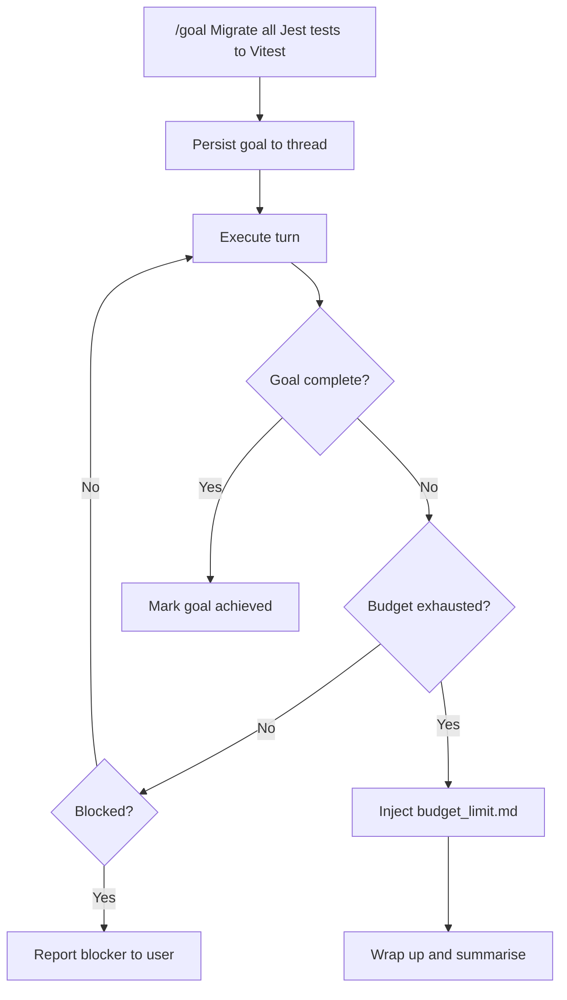
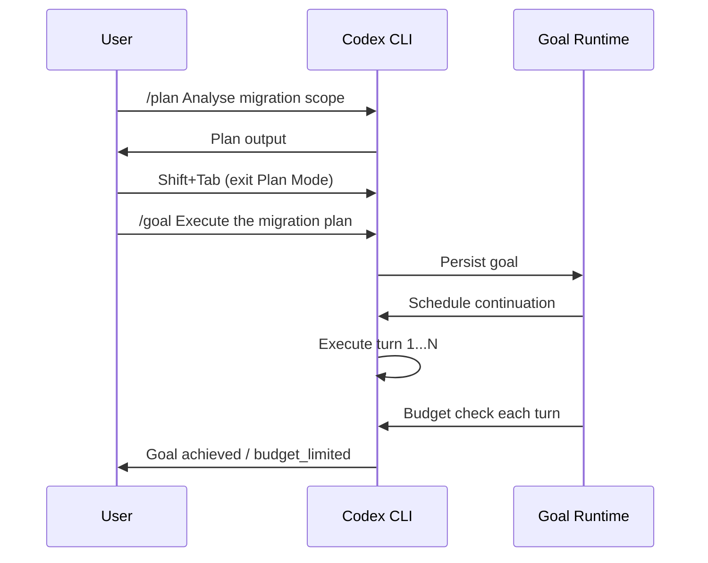

# Goal Mode in Codex CLI: Persistent Objectives, Token Budgets, and the Shift to Agentic Loops


---

Until version 0.128.0, Codex CLI operated in a request-response paradigm: you typed a prompt, the agent executed, and it stopped. If the task wasn't finished, you typed another prompt. For single-file bug fixes that works well enough. For multi-file refactors, test suite expansions, or migration campaigns, the constant re-prompting becomes the bottleneck — not the model's capability.

The `/goal` command, shipped in Codex CLI 0.128.0 on 30 April 2026 [^1], changes the execution model. Rather than executing a single turn and yielding control, Codex enters a **persistent agentic loop**: it keeps working towards a stated objective until it either completes the work, hits a configured token budget, or encounters a blocker it cannot resolve autonomously.

This article covers the mechanics, configuration, practical workflow patterns, and current sharp edges of Goal Mode.

## How Goal Mode Works

### The Continuation Loop

When you issue `/goal <objective>`, Codex persists that objective as a first-class runtime entity — not a chat message that drifts out of context, but a structured record stored against the active thread [^2]. At the end of each turn, the runtime evaluates whether to schedule another continuation turn by injecting the `goals/continuation.md` template [^3].



The continuation prompt tracks four metrics in real time: elapsed wall-clock time, tokens consumed, total budget, and remaining tokens [^3]. This gives the model situational awareness about when to wrap up rather than start new work.

### Goal States

A goal moves through a defined lifecycle [^4]:

| State | Meaning |
|---|---|
| `pursuing` | Actively working towards the objective |
| `paused` | Interrupted by the user or by a mode conflict |
| `achieved` | Completion audit passed; work is done |
| `unmet` | Blocked by an external dependency |
| `budget_limited` | Token budget exhausted; partial progress preserved |

State transitions are managed through the `update_goal` model tool, which the agent calls when it determines the goal has reached a terminal or transitional state [^2].

### The Completion Audit

One of the most important design decisions in Goal Mode is the **completion audit**. The continuation template explicitly forbids the agent from accepting proxy signals as evidence of completion [^3]. Passing tests alone do not prove a goal is met if the objective includes requirements beyond test coverage. Before calling `update_goal` with a `complete` status, the agent must:

1. Convert the objective into concrete deliverables
2. Create a checklist mapping each requirement to evidence
3. Inspect actual artefacts — files on disc, test output, PR status
4. Verify coverage comprehensively

This addresses a known failure mode where agents declare victory based on circumstantial evidence rather than verified outcomes.

## Enabling and Configuring Goal Mode

Goal Mode ships behind a feature flag. Enable it in your `config.toml`:

```toml
[features]
goals = true
```

### Setting a Token Budget

The token budget is the primary cost-control lever. It determines how many tokens Codex may consume before the goal is soft-stopped [^5]. You can set this when creating a goal or via the App Server API:

```bash
# In the TUI, set a goal with an implicit default budget
/goal Refactor the auth module to use the new OAuth2 library

# Pause, resume, or clear
/goal pause
/goal resume
/goal clear
```

When the budget is exhausted, the runtime injects the `goals/budget_limit.md` template [^6], which instructs the agent to:

- **Not** start substantial new work
- Summarise progress made so far
- List remaining blockers
- Provide clear next steps for the user or a subsequent goal

Critically, budget exhaustion is treated as a **soft stop**, not an abort [^5]. The active turn completes gracefully rather than being killed mid-operation — preventing half-applied patches or uncommitted state.

### App Server API

For programmatic workflows — dashboards, CI orchestrators, or custom clients — the App Server exposes three JSON-RPC endpoints [^2]:

| Endpoint | Purpose |
|---|---|
| `thread/goal/set` | Create, replace, or update the persisted goal |
| `thread/goal/get` | Fetch the current goal (returns `null` if none) |
| `thread/goal/clear` | Remove the active goal |

Notifications (`thread/goal/updated`, `thread/goal/cleared`) are emitted on state changes, enabling reactive UIs [^2].

```json
{
  "method": "thread/goal/set",
  "params": {
    "thread_id": "thr_abc123",
    "objective": "Add OpenTelemetry tracing to all HTTP handlers",
    "token_budget": 500000
  }
}
```

Supplying a new objective replaces the existing goal and resets usage accounting. Updating a non-terminal goal preserves accumulated usage whilst allowing status or budget changes [^2].

## Practical Workflow Patterns

### Pattern 1: Migration Campaign

Goal Mode excels at bounded-but-tedious migrations where the objective is clear and the work is repetitive:

```bash
/goal Migrate all 47 React class components in src/components/ to functional
components with hooks. Run the existing test suite after each file. Stop if
any test fails.
```

The agent will iterate through files, convert each one, run tests, and continue until all 47 are done or the budget runs out. The completion audit ensures it doesn't declare victory after converting 30 and forgetting the rest.

### Pattern 2: Test Coverage Gap Closure

```bash
/goal Increase test coverage for src/payments/ from 43% to 80%.
Write integration tests, not unit tests with mocked dependencies.
Run coverage after each new test file.
```

This leverages the continuation loop's ability to check progress metrics between turns and adjust strategy.

### Pattern 3: Codebase-Wide Lint Fix

```bash
/goal Fix all 312 ESLint errors reported by `npm run lint`.
Fix in batches of 10 files. Run lint after each batch to confirm
the count decreases.
```

### Pattern 4: Goal + Plan Mode (With Caveats)

You might want to plan first, then execute. Currently, there is a sharp edge here: Plan Mode silently suppresses goal continuation [^7]. If you set a goal whilst in Plan Mode, the TUI shows the goal as active but no work happens. The workaround is to complete your planning, switch out of Plan Mode (`Shift+Tab`), and then set the goal.



## Known Sharp Edges

Goal Mode shipped in v0.128.0 and is still under active development [^4]. Three issues are worth knowing about:

### 1. Compaction Can Lose Goal Context

When a session hits context limits and triggers mid-turn compaction, the goal continuation prompt and audit requirements can be stripped from the compacted context [^8]. The post-compaction agent may receive only immediate task context, interpret passing tests as completion evidence, and prematurely close the goal. A fix has been proposed to reattach the goal continuation prompt after compaction — the overhead is roughly 500–1,000 tokens, approximately 1/180th of GPT-5.5's context window [^8].

### 2. Plan Mode Suppresses Goals Silently

As noted above, the codebase intentionally skips goal continuation when Plan Mode is active, but the UI does not communicate this [^7]. The goal appears active with time and token metrics ticking, yet no work occurs. Until the UI is updated, be aware that goals and Plan Mode do not mix.

### 3. Documentation Gap

As of May 2026, `/goal` does not appear in the official slash commands documentation [^4]. The feature exists, works, and is persisted — but you won't find it by browsing the docs. The feature flag `goals = true` is the gatekeeper.

## Goal Mode vs Alternatives

How does `/goal` compare to other approaches for multi-turn work?

| Approach | Persistence | Budget Control | Completion Verification | Autonomy |
|---|---|---|---|---|
| Manual re-prompting | None | Manual | Manual | Low |
| PLANS.md + ExecPlan | File-based | None | Manual | Medium |
| `/goal` | Runtime-persisted | Token budget | Automated audit | High |
| Codex App Automations | Thread-based | Time-based | Configurable | High |

The key differentiator is that `/goal` is the first approach where the **runtime itself** manages persistence, budgeting, and completion verification — rather than relying on prompt engineering or external files that can drift out of context [^5].

## Cost Implications

Goal Mode's agentic loop consumes tokens continuously. A rough budget framework:

- **Small goals** (single-module refactor, ~20 files): 50,000–150,000 tokens
- **Medium goals** (cross-module migration, ~50 files): 150,000–500,000 tokens
- **Large goals** (codebase-wide changes, 100+ files): 500,000–2,000,000+ tokens

At GPT-5.5 API pricing, a medium goal might cost \$3–10 depending on reasoning effort settings [^9]. The continuation prompt itself adds approximately 462 tokens per turn [^8], which is negligible relative to the work being done.

Set your token budget conservatively at first. You can always `/goal resume` to continue where you left off — the persisted goal and its accumulated progress survive across sessions.

## Configuration Recipes

### Conservative: Supervised Goal Execution

```toml
[features]
goals = true

# Keep approval on so you review each tool call
approval_policy = "unless-allow-listed"

# Lower reasoning effort to reduce per-turn cost
model_reasoning_effort = "medium"
```

### Autonomous: Overnight Migration

```toml
[features]
goals = true

# Trust the agent for workspace operations
permissions = ":workspace"

# Higher reasoning for complex refactors
model_reasoning_effort = "high"

# Use the most capable model
model = "gpt-5.5"
```

### CI Integration: Headless Goal

```bash
codex exec \
  --config features.goals=true \
  --config model_reasoning_effort=medium \
  "Fix all type errors in src/ reported by tsc --noEmit. \
   Run tsc after each fix. Goal: zero type errors."
```

## What Comes Next

Goal Mode's trajectory points towards deeper integration with the Codex ecosystem. The App Server API already supports programmatic goal management [^2], which opens the door to:

- **Orchestrator-driven goals**: a parent agent setting goals for subagents
- **Chained goals**: completing one goal automatically triggers the next
- **Dashboard visibility**: real-time goal progress across team sessions

For now, `/goal` is the most significant workflow shift in Codex CLI since Plan Mode. It moves the tool from "smart assistant that waits for instructions" to "autonomous agent that pursues objectives" — with the engineering rigour of budget limits and completion audits to keep that autonomy bounded.

## Citations

[^1]: Simon Willison, "Codex CLI 0.128.0 adds /goal," 30 April 2026. [https://simonwillison.net/2026/Apr/30/codex-goals/](https://simonwillison.net/2026/Apr/30/codex-goals/)

[^2]: OpenAI, "codex-rs/app-server/README.md — Goal API endpoints," GitHub, 2026. [https://github.com/openai/codex/blob/main/codex-rs/app-server/README.md](https://github.com/openai/codex/blob/main/codex-rs/app-server/README.md)

[^3]: OpenAI, "goals/continuation.md template," GitHub, 2026. [https://github.com/openai/codex/blob/main/codex-rs/core/templates/goals/continuation.md](https://github.com/openai/codex/blob/main/codex-rs/core/templates/goals/continuation.md)

[^4]: GitHub Issue #20536, "Document the /goal CLI command and Goals lifecycle in slash-command docs," May 2026. [https://github.com/openai/codex/issues/20536](https://github.com/openai/codex/issues/20536)

[^5]: GitHub PR #18076, "Add goal core runtime (4/5)," etraut-openai, April 2026. [https://github.com/openai/codex/pull/18076](https://github.com/openai/codex/pull/18076)

[^6]: OpenAI, "goals/budget_limit.md template," GitHub, 2026. [https://github.com/openai/codex/blob/main/codex-rs/core/templates/goals/budget_limit.md](https://github.com/openai/codex/blob/main/codex-rs/core/templates/goals/budget_limit.md)

[^7]: GitHub Issue #20656, "Plan mode makes active /goal look stuck because continuation is suppressed silently," May 2026. [https://github.com/openai/codex/issues/20656](https://github.com/openai/codex/issues/20656)

[^8]: GitHub Issue #19910, "Goals: active goal continuation prompt and audit requirements can be lost after mid-turn compaction," 2026. [https://github.com/openai/codex/issues/19910](https://github.com/openai/codex/issues/19910)

[^9]: OpenAI, "Pricing — Codex," OpenAI Developers, 2026. [https://developers.openai.com/codex/pricing](https://developers.openai.com/codex/pricing)
