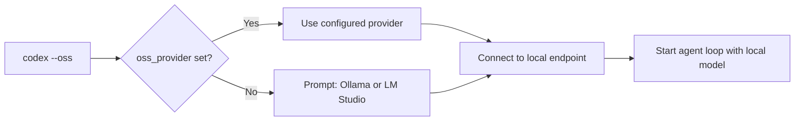
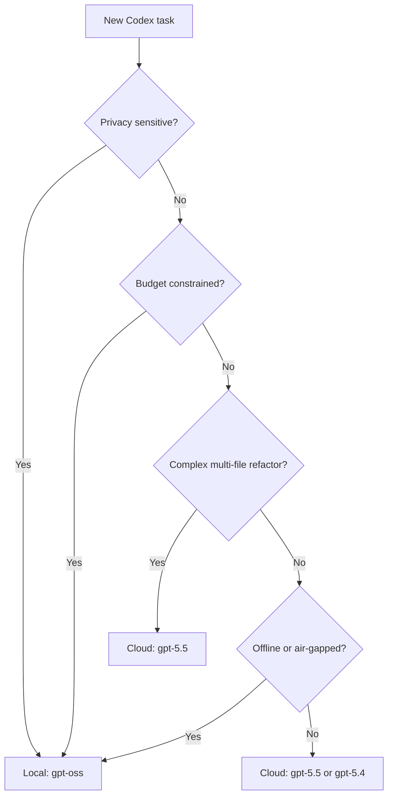

# Running GPT-OSS with Codex CLI: A Complete Guide to Local Inference via Ollama, LM Studio, and MLX


OpenAI's release of GPT-OSS — two open-weight models under the Apache 2.0 licence — changed the economics of agentic coding overnight[^1]. The 120-billion-parameter variant scores 62.4% on SWE-Bench Verified and 2,622 Elo on Codeforces (with tools), approaching o4-mini territory while running on a single 80 GB GPU[^2]. The 20-billion-parameter variant fits in 16 GB of memory and still manages 60.7% on SWE-Bench Verified[^2]. Codex CLI supports both models natively through its `--oss` flag and provider configuration, giving practitioners a zero-API-cost, privacy-preserving agentic coding workflow.

This article covers the architecture of both models, walks through three local inference backends — Ollama, LM Studio, and MLX — and provides production-ready `config.toml` recipes for daily use.

## GPT-OSS Architecture at a Glance

Both models use a Mixture-of-Experts (MoE) Transformer architecture with MXFP4 quantisation on expert weights[^1][^2]. The efficiency gains come from activating only a fraction of total parameters per token.

| Specification | gpt-oss-120b | gpt-oss-20b |
|---|---|---|
| Total parameters | 116.8B | 20.9B |
| Active parameters per token | 5.1B | 3.6B |
| Transformer layers | 36 | 24 |
| Experts per MoE block | 128 (top-4 routing) | 32 |
| Checkpoint size | 60.8 GiB | 12.8 GiB |
| Minimum memory | 80 GB (single H100) | 16 GB |
| Context window | 131,072 tokens (YaRN) | 131,072 tokens (YaRN) |

The models use the `o200k_harmony` tokeniser and support configurable reasoning effort levels (`low`, `medium`, `high`) with full chain-of-thought access[^2]. Both support function calling, structured outputs, and agentic tool use out of the box — the capabilities Codex CLI depends on.

## How Codex CLI Discovers Local Models

When you pass `--oss`, Codex CLI reads the `oss_provider` key from `~/.codex/config.toml` to determine which local backend to use[^3]. If `oss_provider` is not set, the CLI prompts you to choose between the built-in `ollama` and `lmstudio` providers. The default model for `--oss` is `gpt-oss:20b`[^4].



You can override the model on any invocation with `-m`:

```bash
codex --oss -m gpt-oss:120b
```

For anything more sophisticated — custom ports, multiple backends, or cloud-local switching — you need named profiles in `config.toml`.

## Backend 1: Ollama

Ollama is the simplest path. It handles model downloads, quantisation, and serves an OpenAI-compatible API on port 11434[^4].

### Setup

```bash
# Install Ollama (macOS/Linux)
curl -fsSL https://ollama.com/install.sh | sh

# Pull the model
ollama pull gpt-oss:120b    # or gpt-oss:20b for smaller hardware

# Verify it is running
ollama list
```

### Context Window Configuration

Codex requires a minimum of 64,000 tokens of context[^5]. Ollama defaults to a smaller window, so you must increase it:

```bash
# Set context length for the current session
/set parameter num_ctx 65536
```

For persistent configuration, create a Modelfile:

```
FROM gpt-oss:120b
PARAMETER num_ctx 65536
```

Then build and use it:

```bash
ollama create gpt-oss-codex -f Modelfile
codex --oss -m gpt-oss-codex
```

### Config.toml Profile

```toml
oss_provider = "ollama"

[profiles.local-120b]
model_provider = "ollama"
model = "gpt-oss:120b"
```

Launch with:

```bash
codex --profile local-120b
```

Alternatively, Ollama offers a one-command setup:

```bash
ollama launch codex
```

This pulls the default model, configures the context window, and starts Codex in one step[^5].

## Backend 2: LM Studio

LM Studio provides a desktop GUI for model management and serves an OpenAI-compatible endpoint on port 1234[^6].

### Setup

```bash
# Load the model (from LM Studio CLI)
lms load gpt-oss-120b
lms server start
```

Ensure the context length is set to at least 65,536 tokens via the `--context-length` flag or the GUI settings.

### Config.toml Profile

```toml
[model_providers.lms]
name = "LM Studio"
base_url = "http://localhost:1234/v1"

[profiles.lms-120b]
model_provider = "lms"
model = "gpt-oss:120b"

[profiles.lms-qwen]
model_provider = "lms"
model = "qwen/qwen3-coder-30b"
```

LM Studio's advantage is switching between models without re-pulling — useful when comparing GPT-OSS against alternatives like Qwen3-Coder-30B[^6].

## Backend 3: MLX on Apple Silicon

For Mac users, MLX provides native Apple Silicon inference without the overhead of an emulation layer[^6].

### Setup

```bash
pip install mlx-lm
mlx_lm.server --model SuperagenticAI/gpt-oss-20b-8bit-mlx --port 8888
```

The 8-bit quantised gpt-oss-20b fits comfortably on a MacBook Pro with 32 GB of unified memory. The 120b variant requires substantially more — realistically an M2 Ultra or M4 Max with 192 GB[^6].

### Config.toml Profile

```toml
[model_providers.mlx]
name = "MLX LM"
base_url = "http://localhost:8888/v1"

[profiles.mlx-20b]
model_provider = "mlx"
model = "SuperagenticAI/gpt-oss-20b-8bit-mlx"
```

## A Multi-Profile Config.toml

In practice, you want profiles that let you switch between cloud and local with a flag. Here is a consolidated configuration:

```toml
# Default: cloud model for daily work
model = "gpt-5.5"
model_provider = "openai"

# Local fallback
oss_provider = "ollama"

# --- Profiles ---

[profiles.cloud]
model = "gpt-5.5"
model_provider = "openai"

[profiles.local]
model_provider = "ollama"
model = "gpt-oss:120b"

[profiles.local-small]
model_provider = "ollama"
model = "gpt-oss:20b"

[profiles.mlx]
model_provider = "mlx"
model = "SuperagenticAI/gpt-oss-20b-8bit-mlx"

# --- Providers ---

[model_providers.mlx]
name = "MLX LM"
base_url = "http://localhost:8888/v1"
```

Switch contexts without touching the file:

```bash
codex --profile cloud "explain this function"
codex --profile local "refactor the auth module"
codex --profile mlx "add unit tests for utils.ts"
```

## Benchmark Reality Check

The headline benchmarks are impressive, but coding-agent performance in the real world depends heavily on tool-use reliability and context management. Here is how GPT-OSS stacks up on the benchmarks that matter for Codex CLI workflows:

| Benchmark | gpt-oss-120b | gpt-oss-20b | o4-mini (reference) |
|---|---|---|---|
| SWE-Bench Verified | 62.4% | 60.7% | ⚠️ ~65% (estimated) |
| Codeforces Elo (tools) | 2,622 | 2,516 | ⚠️ ~2,700 (estimated) |
| MMLU | 90.0% | 85.3% | — |
| GPQA Diamond | 80.1% | 71.5% | 81.4% |
| Tau-Bench Retail | 67.8% | 54.8% | — |

*Scores from the GPT-OSS model card with high reasoning effort[^2]. Direct o4-mini comparisons on identical benchmarks are limited; estimates marked with ⚠️.*

The 120b model's 62.4% on SWE-Bench Verified puts it ahead of every other open-weight model and within striking distance of o4-mini[^2]. For Codex CLI, the critical capability is function calling — both models support it natively through the harmony response format[^1].

## When to Use Local vs Cloud



**Choose local GPT-OSS when:**

- Working with proprietary code that cannot leave your network
- Running in air-gapped or regulated environments
- Iterating on small-to-medium tasks where latency tolerance is higher
- Optimising cost on high-volume `codex exec` batch jobs

**Stick with cloud models when:**

- Tackling complex multi-file refactors where the extra capability of GPT-5.5's million-token context matters
- Using features that require server-side infrastructure (WebSocket mode, extended prompt cache retention)
- Running CI pipelines where consistent latency matters more than cost

## Known Limitations and Sharp Edges

**Context window mismatch.** Ollama's default context window is far below what Codex needs. If you see truncation errors or degraded output quality, the first thing to check is `num_ctx`[^5].

**No WebSocket transport.** Local providers serve HTTP only. You lose the ~40% latency reduction that WebSocket mode provides with the cloud Responses API[^7].

**No prompt caching.** The server-side prompt cache that reduces cloud API costs does not exist for local inference. Every turn pays full compute cost.

**Reasoning effort calibration.** The `model_reasoning_effort` setting in `config.toml` maps to the model's reasoning levels, but local inference does not benefit from the same optimisation passes that the cloud API applies. Expect higher latency at `high` effort, particularly on the 120b model[^2].

**Tool-use reliability.** While both models support function calling, community reports suggest the 20b variant occasionally misformats tool calls on complex multi-step tasks. The 120b model is significantly more reliable here[^6]. ⚠️ This observation is from community reports, not systematic benchmarking.

## Verifying Your Setup

After configuring a local provider, run a quick diagnostic:

```bash
# Check the active configuration
codex --profile local /debug-config

# Run a simple task to verify tool use
codex --profile local "list the files in this directory and explain the project structure"

# Test non-interactive mode
codex exec --profile local "echo hello from local GPT-OSS"
```

If the agent loop stalls or produces empty responses, check that:

1. The provider is running (`curl http://localhost:11434/v1/models` for Ollama)
2. The context window is large enough (64K+ tokens)
3. The model supports function calling (GPT-OSS does; not all Ollama models do)

## Citations

[^1]: [OpenAI, "Introducing gpt-oss", openai.com, August 2025](https://openai.com/index/introducing-gpt-oss/)
[^2]: [OpenAI, "gpt-oss-120b & gpt-oss-20b Model Card", arxiv.org, August 2025](https://arxiv.org/html/2508.10925v1)
[^3]: [OpenAI, "Advanced Configuration — Codex", developers.openai.com, 2026](https://developers.openai.com/codex/config-advanced)
[^4]: [Ollama, "OpenAI Codex with Ollama", ollama.com, 2025](https://ollama.com/blog/codex)
[^5]: [Ollama, "Codex Integration", docs.ollama.com, 2026](https://docs.ollama.com/integrations/codex)
[^6]: [Shashi Jagtap, "Codex CLI: Running GPT-OSS and Local Coding Models with Ollama, LM Studio, and MLX", dev.to, 2026](https://dev.to/shashikant86/codex-cli-running-gpt-oss-and-local-coding-models-with-ollama-lm-studio-and-mlx-403g)
[^7]: [OpenAI, "Features — Codex CLI", developers.openai.com, 2026](https://developers.openai.com/codex/cli/features)
