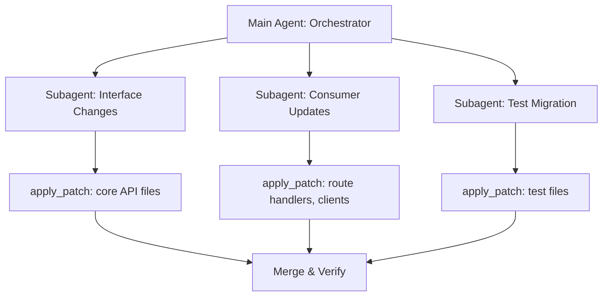

# Codex CLI Multi-File Editing Strategies: Coordinating Changes Across Large Pull Requests with apply_patch and Subagents


---

Every senior developer knows the pain: a rename that touches forty files, an API migration that ripples through three service boundaries, a framework upgrade that rewrites imports in every module. These *coordinated multi-file changes* are where AI coding agents earn their keep — or fall flat. Codex CLI, as of v0.128, offers two complementary mechanisms for orchestrating large-scale edits: the `apply_patch` diff format for precise surgical changes, and the subagent system for parallelising work across isolated threads[^1][^2].

This article covers practical strategies for wielding both effectively.

## The apply_patch Format: Codex's Native Diff Language

Codex CLI does not use standard unified diffs. Instead, it uses a bespoke patch format — `apply_patch` — designed for reliability in LLM-generated output[^3]. The format was introduced alongside GPT-4.1 and has been refined through the Rust rewrite of `codex-rs`[^4].

### Anatomy of a Patch

Every patch is wrapped in an envelope:

```
*** Begin Patch
[file operations]
*** End Patch
```

Three operation types are supported[^3]:

| Operation | Header | Purpose |
|-----------|--------|---------|
| **Add** | `*** Add File: <path>` | Create a new file; every line prefixed with `+` |
| **Update** | `*** Update File: <path>` | Modify in place; optional `*** Move to:` for renames |
| **Delete** | `*** Delete File: <path>` | Remove a file entirely |

Update operations use `@@` hunk markers with context lines (3 above, 3 below by default), plus `-` and `+` prefixes for removals and additions respectively.

### Multi-File Patches in Practice

A single `apply_patch` call can bundle changes across many files. Here is a realistic example — renaming a service class and updating all its consumers:

```
*** Begin Patch
*** Update File: src/services/user_service.py
*** Move to: src/services/account_service.py
@@ class UserService:
-class UserService:
+class AccountService:
     """Handles account lifecycle operations."""

*** Update File: src/api/routes.py
@@ from services.user_service import UserService
-from services.user_service import UserService
+from services.account_service import AccountService

@@ def create_user():
-    svc = UserService()
+    svc = AccountService()

*** Update File: tests/test_user_service.py
*** Move to: tests/test_account_service.py
@@ from services.user_service import UserService
-from services.user_service import UserService
+from services.account_service import AccountService

@@ class TestUserService:
-class TestUserService:
+class TestAccountService:
*** End Patch
```

### Robustness: Progressive Matching

The Rust implementation in `codex-rs/apply-patch` uses a progressive matching strategy for context lines[^4]:

1. Attempt exact match
2. Fall back to match ignoring line endings
3. Fall back to match ignoring all whitespace

This means patches survive minor formatting differences between what the model expected and what actually exists on disc — a common failure mode in other diff formats.

## When a Single Patch Is Not Enough

The `apply_patch` format works brilliantly for changes the model can hold in a single context window. But three scenarios demand a different approach:

1. **The change set exceeds the context window** — touching 50+ files where understanding each requires reading surrounding code
2. **The changes require different expertise** — e.g. backend API changes paired with frontend component updates and database migration scripts
3. **Verification is needed between stages** — you want tests to pass after the interface change before updating consumers

This is where subagents become essential.

## Subagent Architecture for Multi-File Work

Codex CLI's subagent system (MultiAgentV2 as of v0.128) spawns specialised agents in parallel threads, each with its own context window, model configuration, and optional sandbox policy[^2][^5].



### Configuration

Global subagent settings live in `config.toml`[^2]:

```toml
[agents]
max_threads = 6        # concurrent subagent cap
max_depth = 1          # prevent recursive delegation
job_max_runtime_seconds = 1800  # 30-minute timeout per worker
```

### Custom Agent Definitions

For repeatable multi-file workflows, define custom agents as TOML files in `~/.codex/agents/` or `.codex/agents/`[^2]:

```toml
# .codex/agents/interface_migrator.toml
name = "interface_migrator"
description = "Migrates interface definitions and updates type signatures across the codebase"
developer_instructions = """
You are a specialist in interface migration. When given an old interface name
and a new interface definition:
1. Update the interface file itself
2. Find and update ALL files that import or reference the old interface
3. Run the type checker to verify correctness
4. Report which files were changed and any remaining type errors
"""
model = "gpt-5.4"
model_reasoning_effort = "medium"
sandbox_mode = "workspace-write"
```

```toml
# .codex/agents/test_updater.toml
name = "test_updater"
description = "Updates test files to match interface and implementation changes"
developer_instructions = """
You update test suites after interface changes. For each test file:
1. Update imports and type references
2. Update mock definitions to match new interfaces
3. Run the affected test file to verify it passes
4. Do NOT modify test assertions unless the behaviour has genuinely changed
"""
model = "gpt-5.4-mini"
model_reasoning_effort = "low"
sandbox_mode = "workspace-write"
```

### Sandbox and Approval Inheritance

Subagents inherit the parent's sandbox policy by default[^2]. During interactive sessions, approval overlays show the source thread label — press `o` to inspect the thread before approving. In non-interactive (`codex exec`) flows, subagent operations that require fresh approval will fail with an error rather than hang, which is the correct behaviour for CI pipelines[^6].

## Five Production Patterns

### Pattern 1: Rename Propagation

A single-agent workflow using one multi-file `apply_patch`. Best for changes touching fewer than 20 files where the model can hold the full dependency graph in context.

```bash
codex "Rename the UserService class to AccountService across the entire
  codebase. Update all imports, type hints, test references, and
  documentation strings. Run pytest after to verify."
```

### Pattern 2: Staged Migration with Plan Mode

For larger migrations, use Plan Mode as a gating mechanism[^7]:

1. Enter Plan Mode (`Ctrl+G` or `/plan`)
2. Ask Codex to map all files affected by the change
3. Review the plan and approve
4. Codex executes the plan, running tests between stages
5. Use `/compact` if the context window fills during execution

### Pattern 3: Parallel Subagent Delegation

For cross-cutting changes spanning backend, frontend, and infrastructure:

```
Migrate from REST to gRPC for the payments service.

Delegate to three subagents:
1. A backend agent to generate proto definitions and update the Go service
2. A frontend agent to update the TypeScript client SDK and React hooks
3. An infrastructure agent to update the Helm chart and Kubernetes manifests

Each agent should run its domain's tests before reporting completion.
```

### Pattern 4: CSV Batch Processing

For mechanical changes applied to a list of items (e.g. migrating 200 API endpoints), use the experimental `spawn_agents_on_csv` feature[^2]:

```toml
# migration_manifest.csv
endpoint,old_auth,new_auth
/api/v1/users,api_key,oauth2
/api/v1/orders,api_key,oauth2
/api/v1/products,api_key,oauth2
```

Each row spawns a worker subagent that applies the migration pattern to the specific endpoint, reports a structured result via `report_agent_job_result`, and writes failures with error metadata to the output CSV.

### Pattern 5: Review-Then-Apply Pipeline

Combine `/review` with multi-file edits for safety[^8]:

1. Make changes on a feature branch
2. Run `/review` against the base branch before pushing
3. Codex highlights the riskiest changes across all modified files
4. Fix issues identified by the review
5. Push with confidence

## AGENTS.md: The Coordination Backbone

For any repository where multi-file changes are routine, your `AGENTS.md` should encode coordination rules[^9]:

```markdown
## Multi-File Change Rules

- Always run `make typecheck` after interface changes before updating consumers
- Never modify generated files in `src/generated/` — regenerate from proto definitions
- Test files live alongside source files (`foo.ts` / `foo.test.ts`) — update both atomically
- Maximum 30 files per commit; split larger changes into stacked PRs
- Use subagents for changes spanning more than two top-level directories
```

This ensures that both human developers and Codex agents follow the same coordination discipline, regardless of which model or reasoning effort level is active.

## Cost Considerations

Multi-file editing consumes more tokens than single-file work. Key cost levers[^10]:

| Strategy | Token Impact | When to Use |
|----------|-------------|-------------|
| Single-agent `apply_patch` | 1x baseline | < 20 files, single domain |
| Plan Mode staging | 1.2-1.5x | Complex dependencies, needs verification |
| Parallel subagents | 2-4x (each gets own context) | Cross-domain, > 30 files |
| CSV batch processing | Linear with row count | Mechanical, repetitive changes |

Use `gpt-5.4-mini` with `model_reasoning_effort = "low"` for subagents performing mechanical updates. Reserve `gpt-5.5` for the orchestrating agent that needs to understand the full picture[^10].

## Sharp Edges

**Context window exhaustion during large patches.** If a single `apply_patch` touches too many files, the model may truncate or hallucinate later hunks. Split into multiple patches or delegate to subagents[^11].

**Subagent merge conflicts.** When two subagents modify overlapping files, the second write wins. Avoid this by assigning non-overlapping file sets to each subagent, or by using a sequential (not parallel) delegation pattern.

**Stale context after compaction.** Running `/compact` mid-migration can cause Codex to lose track of which files have already been modified. Use `/goal` to anchor persistent objectives that survive compaction[^12].

**apply_patch path sensitivity.** All paths must be relative to the working directory. Absolute paths will fail silently. Ensure your `cwd` is set correctly, especially in subagent definitions[^3].

## Verification Checklist

Before committing a multi-file change produced by Codex:

1. Run `git diff --stat` to confirm the expected file count
2. Run the full test suite, not just affected tests
3. Run the type checker (`mypy`, `tsc`, `go vet`) to catch import errors
4. Search for the old name/pattern to verify complete propagation: `grep -r "OldName" src/`
5. Review the diff for unintended changes — Codex occasionally "tidies" adjacent code

## Citations

[^1]: [Codex CLI Features - OpenAI Developers](https://developers.openai.com/codex/cli/features)
[^2]: [Subagents - Codex | OpenAI Developers](https://developers.openai.com/codex/subagents)
[^3]: [apply_patch Tool Instructions - openai/codex GitHub](https://github.com/openai/codex/blob/main/codex-rs/apply-patch/apply_patch_tool_instructions.md)
[^4]: [Code Surgery: How AI Assistants Make Precise Edits - Fabian Hertwig](https://fabianhertwig.com/blog/coding-assistants-file-edits/)
[^5]: [Changelog - Codex | OpenAI Developers](https://developers.openai.com/codex/changelog)
[^6]: [Non-interactive Mode - Codex | OpenAI Developers](https://developers.openai.com/codex/noninteractive)
[^7]: [Best Practices - Codex | OpenAI Developers](https://developers.openai.com/codex/learn/best-practices)
[^8]: [Codex CLI Features - Local Code Review](https://developers.openai.com/codex/cli/features)
[^9]: [Custom Instructions with AGENTS.md - Codex | OpenAI Developers](https://developers.openai.com/codex/guides/agents-md)
[^10]: [Models - Codex | OpenAI Developers](https://developers.openai.com/codex/models)
[^11]: [Advanced Configuration - Codex | OpenAI Developers](https://developers.openai.com/codex/config-advanced)
[^12]: [Codex CLI v0.128.0 Release Notes - GitHub](https://github.com/openai/codex/releases/tag/rust-v0.128.0)
