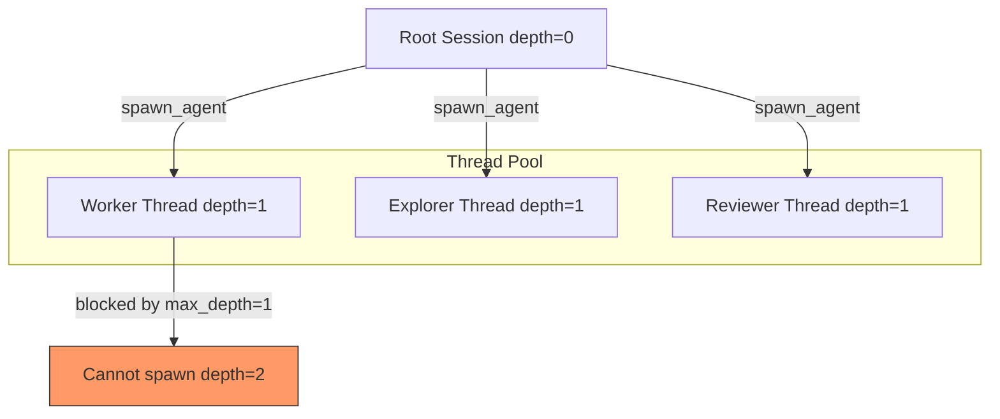
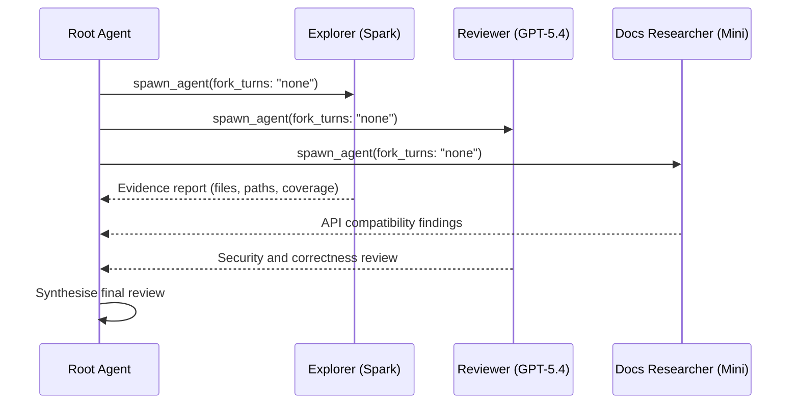

# Codex CLI MultiAgentV2: Custom Roles, Thread Orchestration, and Production Parallel Workflows


---

Codex CLI's subagent system moved from a simple fire-and-forget spawner to a governed orchestration layer with the introduction of MultiAgentV2 in v0.128.0[^1]. The upgrade brings explicit thread caps, wait-time controls, root/subagent hints, fork-mode semantics, and stricter configuration validation[^2]. For teams already running parallel agent workflows, the migration is not optional — v2 changes default behaviours in ways that silently break v1 patterns.

This article dissects the MultiAgentV2 architecture, documents every configuration surface, walks through custom role authoring, and provides production-tested orchestration patterns.

## Architecture: What Changed from V1

MultiAgentV1 treated every spawned agent as an independent fork of the parent session. Context was duplicated wholesale, model selection was inherited, and depth was uncontrolled. This led to three recurring problems:

1. **Token explosion** — full-history forks duplicated the entire conversation into each child, multiplying costs linearly with thread count
2. **Role confusion** — children inherited the parent's instructions rather than receiving task-specific guidance
3. **Runaway nesting** — nothing prevented a child from spawning grandchildren indefinitely

MultiAgentV2 addresses all three with an explicit configuration contract[^3]:



## Configuration Reference

All multi-agent settings live under the `[agents]` table in `config.toml` or as inline overrides via `-c`[^4].

### Global Orchestration Controls

```toml
[features]
multi_agent = true  # on by default since v0.124

[agents]
max_threads = 6                  # concurrent open thread cap
max_depth = 1                    # nesting depth (root = 0)
job_max_runtime_seconds = 1800   # per-worker timeout for CSV jobs
```

| Key | Type | Default | Purpose |
|-----|------|---------|---------|
| `agents.max_threads` | number | 6 | Maximum concurrent agent threads[^4] |
| `agents.max_depth` | number | 1 | Spawning depth limit; root starts at 0[^4] |
| `agents.job_max_runtime_seconds` | number | 1800 | Timeout per CSV batch worker[^4] |

### Thread Cap Behaviour

When `max_threads` is reached, subsequent `spawn_agent` calls queue rather than fail. The orchestrator resumes queued spawns as running threads complete[^3]. In practice, setting this above 8 on a single machine yields diminishing returns due to sandbox overhead and API rate limits.

### Depth Enforcement

With `max_depth = 1`, a child agent cannot spawn its own children. Attempts return a structured error rather than silently degrading. Increase to 2 only if you have a documented use case for hierarchical delegation (e.g., a team-lead agent dispatching to specialist workers)[^5].

## Custom Agent Roles

### File Layout

Custom agents are standalone TOML files placed in either[^3]:

- `~/.codex/agents/` — personal (cross-project)
- `.codex/agents/` — project-scoped (committed to repo)

Each file defines one role. The filename is conventional; the `name` field is the source of truth.

### Schema

```toml
# .codex/agents/reviewer.toml
name = "reviewer"
description = "PR reviewer focused on correctness, security, and missing tests."
developer_instructions = """
You are a code reviewer. Focus on:
1. Logic errors and edge cases
2. Security vulnerabilities (injection, auth bypass, SSRF)
3. Missing test coverage for changed paths
4. Performance regressions in hot paths

Output a structured review with severity ratings.
"""

model = "gpt-5.4"
model_reasoning_effort = "high"
sandbox_mode = "read-only"

nickname_candidates = ["Ada", "Bjarne", "Grace", "Linus"]
```

### Required Fields

| Field | Purpose |
|-------|---------|
| `name` | Unique identifier used in `spawn_agent` calls |
| `description` | Shown to the orchestrator when choosing which role to spawn |
| `developer_instructions` | The system prompt for the spawned agent |

### Optional Fields

| Field | Purpose |
|-------|---------|
| `model` | Override the parent's model selection |
| `model_reasoning_effort` | Per-role reasoning budget |
| `sandbox_mode` | `read-only`, `workspace-write`, or inherited |
| `mcp_servers` | Role-specific MCP server connections |
| `skills.config` | Skill definitions scoped to this role |
| `nickname_candidates` | Display names for UI differentiation[^3] |

## The fork_turns Gotcha

This is the single most common production issue with MultiAgentV2[^6].

When `spawn_agent` is called without an explicit `fork_turns` parameter, it defaults to `"all"` — mapping to `SpawnAgentForkMode::FullHistory`. Full-history forks **reject** `agent_type`, `model`, and `reasoning_effort` overrides with the error:

> "Full-history forked agents inherit the parent agent type, model, and reasoning effort; omit agent_type, model, and reasoning_effort, or spawn without a full-history fork."

### The Fix

Always specify `fork_turns: "none"` when spawning role-specialised agents:

```json
{
  "agent_type": "reviewer",
  "task_name": "security_review",
  "message": "Review the diff in PR #1842 for security issues",
  "fork_turns": "none"
}
```

The three fork modes are:

| Mode | Behaviour | Use Case |
|------|-----------|----------|
| `"all"` | Full parent history copied to child | Continuation of same task with same config |
| `"recent"` | Last N turns only | Partial context handoff |
| `"none"` | Clean slate with role instructions only | Specialist delegation (most common) |

### AGENTS.md Enforcement

Add this to your root AGENTS.md to prevent the orchestrator from hitting this issue:

```markdown
## Multi-Agent Rules
- When spawning specialist agents (reviewer, explorer, docs_researcher),
  ALWAYS use fork_turns: "none"
- Only use fork_turns: "all" when the child continues the parent's exact task
```

## Production Orchestration Patterns

### Pattern 1: Three-Role Code Review

Split review across focused agents for higher quality than a single-pass review:

```toml
# .codex/agents/explorer.toml
name = "explorer"
description = "Read-only codebase explorer for gathering evidence before changes."
model = "gpt-5.3-codex-spark"
model_reasoning_effort = "medium"
sandbox_mode = "read-only"
developer_instructions = """
Trace execution paths, find callers and callees, identify test coverage gaps.
Report findings as structured JSON with file paths and line numbers.
"""

# .codex/agents/reviewer.toml
name = "reviewer"
description = "Correctness and security reviewer."
model = "gpt-5.4"
model_reasoning_effort = "high"
sandbox_mode = "read-only"
developer_instructions = """
Review for logic errors, security vulnerabilities, and missing edge-case tests.
Produce a structured report with severity (critical/high/medium/low).
"""

# .codex/agents/docs_researcher.toml
name = "docs_researcher"
description = "Framework and API documentation lookup."
model = "gpt-5.4-mini"
model_reasoning_effort = "low"
sandbox_mode = "read-only"
mcp_servers = ["context7"]
developer_instructions = """
Look up relevant framework documentation for APIs used in the diff.
Flag deprecated usage or version-incompatible patterns.
"""
```



### Pattern 2: Migration Campaign with Worker Pool

For large-scale refactoring across many files:

```toml
# .codex/agents/migrator.toml
name = "migrator"
description = "Performs a single file migration following the pattern template."
model = "gpt-5.4-mini"
model_reasoning_effort = "medium"
sandbox_mode = "workspace-write"
developer_instructions = """
Apply the migration pattern exactly as specified. Run the file's unit tests
after modification. Report success or failure with the test output.
"""
```

Combined with `spawn_agents_on_csv` for batch processing[^3]:

```json
{
  "csv_path": "./migration-targets.csv",
  "instruction": "Migrate {file_path} from React class components to hooks following the pattern in MIGRATION.md",
  "id_column": "file_path",
  "output_csv_path": "./migration-results.csv",
  "max_concurrency": 4,
  "max_runtime_seconds": 600
}
```

### Pattern 3: Implement-Then-Review Loop

```toml
[agents]
max_threads = 4
max_depth = 1

# Use different models for cost efficiency
# Worker: fast and cheap for implementation
# Reviewer: thorough for quality gates
```

The root agent spawns a `worker` to implement, waits for completion via `wait_agent`, then spawns a `reviewer` to validate. If the reviewer flags issues, the root spawns another worker iteration. This loop typically converges in 2-3 cycles[^7].

## Sandbox and Approval Inheritance

Subagents inherit the parent's sandbox policy by default[^3]. In interactive sessions, approval requests surface with thread labels — press `o` to inspect before approving. Key inheritance rules:

- Runtime overrides (`/approvals` changes) propagate to spawned children automatically
- `sandbox_mode` in a custom role TOML overrides the inherited policy
- Non-interactive flows (`codex exec`) fail if a child requires new approval not pre-granted

## Cost Management

MultiAgentV2 multiplies token usage. A three-agent review pattern with `fork_turns: "none"` uses roughly 3x the base input tokens (each child gets the role instructions plus the task message, not the full history). With `fork_turns: "all"`, costs scale as `N * parent_context_size`.

### Cost-Optimised Role Assignment

| Role | Recommended Model | Reasoning | Rationale |
|------|-------------------|-----------|-----------|
| Explorer | gpt-5.3-codex-spark | medium | Read-only, speed matters |
| Worker | gpt-5.4-mini | medium | Bulk implementation |
| Reviewer | gpt-5.4 | high | Quality gate, fewer calls |
| Orchestrator (root) | gpt-5.5 | medium | Coordination decisions |

### Monitoring Token Spend

Use `codex exec --json` to capture per-thread token metrics in JSONL format, then aggregate with standard tooling:

```bash
codex exec --json "Review the auth module" 2>&1 | \
  jq -s '[.[] | select(.type == "usage")] |
  {total_input: (map(.input_tokens) | add),
   total_output: (map(.output_tokens) | add)}'
```

## Known Sharp Edges

1. **Project-scoped agents require project trust** — if the project is not marked trusted in `~/.codex/config.toml`, `.codex/agents/` files are ignored silently[^8]
2. **MCP servers in custom roles** — the MCP server must be declared in the parent config's `[mcp_servers]` section; the role TOML only references it by name[^3]
3. **Nickname pool exhaustion** — if you spawn more agents of a role than there are `nickname_candidates`, names recycle with numeric suffixes
4. **Thread limit validation** — v0.128 rejects configs where a role's implied concurrency exceeds `max_threads`[^2]

## Migration Checklist: V1 to V2

If you have existing multi-agent workflows built on the v1 implicit behaviour:

- [ ] Add explicit `fork_turns: "none"` to all `spawn_agent` calls that use custom roles
- [ ] Set `agents.max_depth = 1` explicitly (matches the new default but makes intent clear)
- [ ] Move inline agent instructions into `.codex/agents/*.toml` files
- [ ] Add `nickname_candidates` for UI clarity when running >3 threads
- [ ] Test with `agents.max_threads = 2` first to validate serialisation behaviour
- [ ] Add AGENTS.md rules documenting your multi-agent conventions

## Citations

[^1]: [Codex CLI v0.128.0 Release Notes](https://github.com/openai/codex/releases/tag/v0.128.0) — MultiAgentV2 configuration improvements, April 30 2026.
[^2]: [Codex CLI Changelog](https://developers.openai.com/codex/changelog) — "Made MultiAgentV2 configuration more explicit with thread caps, wait-time controls, root/subagent hints, and v2-specific depth handling."
[^3]: [Subagents Documentation](https://developers.openai.com/codex/subagents) — Official subagent configuration reference including custom agent file schema, CSV batch processing, and sandbox inheritance.
[^4]: [Configuration Reference](https://developers.openai.com/codex/config-reference) — All `agents.*` keys with types, defaults, and descriptions.
[^5]: [Simon Willison: Codex Subagents](https://simonwillison.net/2026/Mar/16/codex-subagents/) — Practical walkthrough of custom agents and depth configuration.
[^6]: [GitHub Issue #20077](https://github.com/openai/codex/issues/20077) — "MultiAgentV2 spawn_agent defaults to full-history fork, rejecting agent_type/model overrides."
[^7]: [Running Multiple Codex Agent Instances: Parallel Orchestration Patterns](https://codex.danielvaughan.com/2026/04/18/running-multiple-codex-agents-parallel-orchestration/) — External orchestration approaches and convergence patterns.
[^8]: [GitHub Issue #15250](https://github.com/openai/codex/issues/15250) — "Custom subagents in .codex/agents are not accessible from tool-backed Codex sessions."
