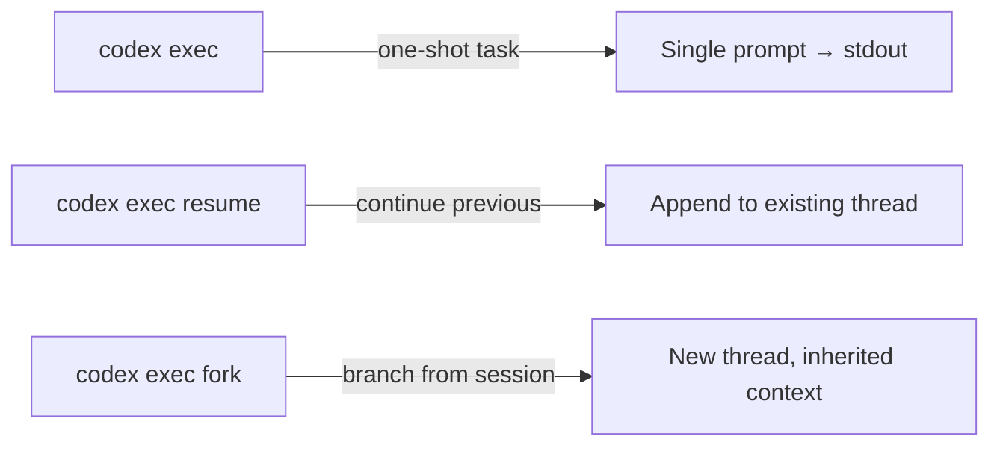
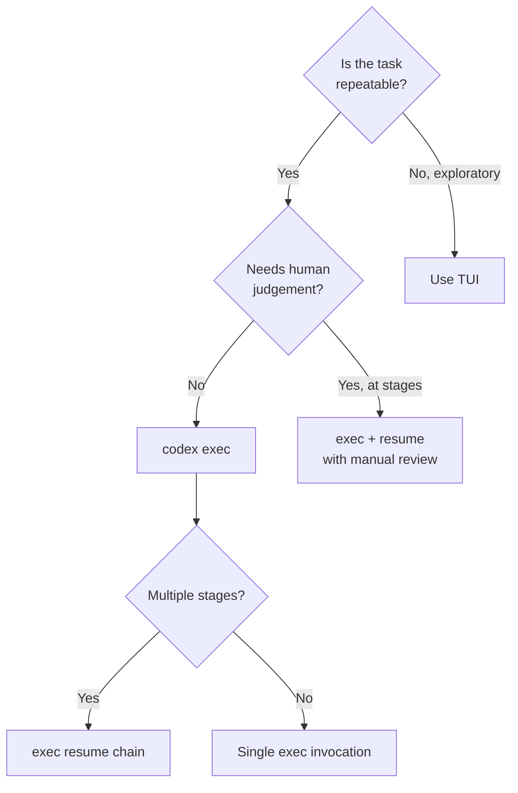

# Codex CLI Non-Interactive Pipelines: Production Automation with exec, resume, and Structured Output


---

The interactive TUI gets all the attention, but `codex exec` is where Codex CLI earns its keep in production. As of May 2026, the non-interactive surface has matured into a proper pipeline primitive: JSON Schema–validated output, session resumption for multi-stage workflows, JSON Lines event streaming with reasoning-token telemetry, and hermetic isolation flags that make CI integration deterministic[^1]. This article covers the complete `codex exec` surface as it stands today, with production-ready recipes you can deploy immediately.

## The Three exec Subcommands

Codex CLI exposes three non-interactive entry points, each targeting a distinct automation pattern[^1][^2]:



### `codex exec` — One-Shot Execution

The workhorse. Accepts a prompt (or `-` for stdin), streams progress to stderr, and writes the final agent message to stdout[^1]. The process exits once the agent loop completes.

```bash
codex exec "Refactor src/auth.ts to use the new OAuth2 client"
```

### `codex exec resume` — Multi-Stage Continuation

Reopens a previous session with full conversational context intact. Two targeting modes[^1][^2]:

```bash
# Resume the most recent session
codex exec resume --last "Now write integration tests for the changes"

# Resume a specific session by ID
codex exec resume 7f9f9a2e-1b3c-4c7a "Run the linter and fix any issues"
```

The key property: the model sees the complete history of the prior session, including file reads, tool calls, and reasoning — enabling multi-day workflows where each stage builds on verified previous work[^2].

### `codex exec fork` — Branched Exploration

Creates a new session inheriting context from an existing one without mutating the original transcript[^3]. Useful when you want to explore alternative approaches in CI without corrupting the main execution thread.

## Structured Output with `--output-schema`

For automation workflows that consume agent output programmatically, the `--output-schema` flag constrains the final response to a JSON Schema[^1][^4]:

```bash
codex exec "Analyse src/ for security vulnerabilities" \
  --output-schema ./schemas/vuln-report.json \
  -o ./reports/vulnerabilities.json
```

The schema file follows standard JSON Schema Draft 2020-12:

```json
{
  "$schema": "https://json-schema.org/draft/2020-12/schema",
  "type": "object",
  "properties": {
    "vulnerabilities": {
      "type": "array",
      "items": {
        "type": "object",
        "properties": {
          "file": { "type": "string" },
          "line": { "type": "integer" },
          "severity": { "enum": ["critical", "high", "medium", "low"] },
          "description": { "type": "string" },
          "suggested_fix": { "type": "string" }
        },
        "required": ["file", "line", "severity", "description"]
      }
    },
    "summary": { "type": "string" },
    "risk_score": { "type": "number", "minimum": 0, "maximum": 10 }
  },
  "required": ["vulnerabilities", "summary", "risk_score"],
  "additionalProperties": false
}
```

The model's final turn is forced to conform. If it cannot satisfy the schema, the response will indicate failure rather than producing malformed output[^4]. Combined with `-o`, this gives you a file-on-disk guarantee for downstream pipeline stages.

## JSON Lines Event Stream

The `--json` flag transforms stdout into a machine-readable event stream[^1]. Each line is a self-contained JSON object, enabling real-time processing without buffering the entire response:

```bash
codex exec --json "Generate release notes for v2.4" | while IFS= read -r line; do
  type=$(echo "$line" | jq -r '.type')
  case "$type" in
    turn.completed)
      echo "$line" | jq -r '.usage'
      ;;
    item.completed)
      echo "$line" | jq -r '.item.content // empty'
      ;;
  esac
done
```

### Token Telemetry in the Event Stream

Each `turn.completed` event includes a `usage` object with reasoning-token granularity[^1][^5]:

```json
{
  "type": "turn.completed",
  "usage": {
    "input_tokens": 14230,
    "cached_input_tokens": 11800,
    "output_tokens": 2150,
    "reasoning_output_tokens": 890
  }
}
```

The `reasoning_output_tokens` field — added in v0.125 — reports how many tokens the model spent on internal chain-of-thought[^5]. This is critical for cost attribution: reasoning tokens are billed at the same rate as output tokens but invisible in the final response text.

## Hermetic Isolation Flags

Production pipelines demand reproducibility. These flags strip non-determinism[^1]:

| Flag | Effect |
|------|--------|
| `--ephemeral` | Skips persisting session rollout files to disk |
| `--ignore-user-config` | Ignores `$CODEX_HOME/config.toml` |
| `--ignore-rules` | Skips user and project execution policy rules |
| `--skip-git-repo-check` | Runs without requiring a Git repository |
| `--sandbox read-only` | Default; prevents all file mutations |
| `--sandbox workspace-write` | Allows writes within the working directory |

A fully hermetic CI invocation:

```bash
CODEX_API_KEY="$VAULT_SECRET" codex exec \
  --ephemeral \
  --ignore-user-config \
  --sandbox workspace-write \
  -c model=gpt-5.4-mini \
  -c model_reasoning_effort=medium \
  "Run the test suite and fix any failures"
```

## Production Pipeline Patterns

### Pattern 1: Multi-Stage Analysis Pipeline

Chain `exec` and `exec resume` for workflows that need verified intermediate results:

```bash
#!/usr/bin/env bash
set -euo pipefail

# Stage 1: Identify deprecated API usages
codex exec --json \
  --output-schema ./schemas/deprecated-apis.json \
  -o ./stage1-results.json \
  "Identify all deprecated API usages in src/"

# Stage 2: Generate replacement stubs (using previous context)
codex exec resume --last \
  --output-schema ./schemas/migration-plan.json \
  -o ./stage2-plan.json \
  "Generate replacement stubs for everything flagged"

# Stage 3: Apply the migration
codex exec resume --last \
  --sandbox workspace-write \
  "Apply the migration plan. Run tests after each file change."
```

### Pattern 2: Stdin-Piped Triage

Feed command output directly into Codex for contextual analysis[^1]:

```bash
# Pipe test failures for diagnosis
npm test 2>&1 | codex exec \
  --output-schema ./schemas/test-diagnosis.json \
  -o ./diagnosis.json \
  "Summarise failures, identify root causes, propose fixes"

# Pipe git diff for review
git diff main...HEAD | codex exec \
  "Review this diff for bugs, security issues, and style violations"
```

### Pattern 3: Scheduled Report Generation

Combine with cron or GitHub Actions for periodic intelligence[^6]:

```yaml
# .github/workflows/weekly-debt-report.yml
name: Technical Debt Report
on:
  schedule:
    - cron: '0 6 * * 1'  # Every Monday at 06:00

jobs:
  analyse:
    runs-on: ubuntu-latest
    steps:
      - uses: actions/checkout@v4
      - name: Generate debt report
        env:
          CODEX_API_KEY: ${{ secrets.CODEX_API_KEY }}
        run: |
          npx -y codex exec \
            --ephemeral \
            --ignore-user-config \
            --output-schema ./schemas/debt-report.json \
            -o ./reports/debt-$(date +%Y-%m-%d).json \
            "Analyse the codebase for technical debt. \
             Focus on: dependency staleness, test coverage gaps, \
             TODO/FIXME density, and circular dependencies."
      - uses: actions/upload-artifact@v4
        with:
          name: debt-report
          path: ./reports/
```

### Pattern 4: Parallel Exec with GNU Parallel

Run independent analyses concurrently for large codebases:

```bash
find src/ -name "*.ts" -type f | \
  parallel -j4 --bar \
  'codex exec --ephemeral --sandbox read-only \
    --output-schema ./schemas/file-review.json \
    -o ./reviews/{/.}.json \
    "Review {} for type safety issues and missing error handling"'
```

## Configuration Overrides for exec

The `-c key=value` flag overrides any `config.toml` key for a single invocation[^1][^7]:

```bash
codex exec \
  -c model=gpt-5.3-codex \
  -c model_reasoning_effort=high \
  -c tool_output_token_limit=16000 \
  "Implement the feature described in SPEC.md"
```

Common overrides for CI:

```toml
# Equivalent config.toml section (for reference)
model = "gpt-5.4-mini"              # Cost-efficient for CI
model_reasoning_effort = "medium"   # Balance speed vs quality
model_verbosity = "low"             # Reduce output noise
tool_output_token_limit = 8000      # Cap tool output injection
```

## Authentication in CI

API key authentication is the recommended path for non-interactive environments[^1][^8]:

```bash
# Set as environment variable (preferred)
export CODEX_API_KEY="sk-proj-..."

# Or inline for single invocations
CODEX_API_KEY="$SECRET" codex exec "task"
```

For Amazon Bedrock–backed deployments, set the standard AWS credential chain instead[^9]:

```bash
export AWS_ACCESS_KEY_ID="..."
export AWS_SECRET_ACCESS_KEY="..."
export AWS_REGION="us-east-1"

codex exec \
  -c 'providers.bedrock.base_url = "https://bedrock-runtime.us-east-1.amazonaws.com"' \
  -c 'providers.bedrock.model = "anthropic.claude-v3"' \
  "Analyse the deployment configuration"
```

## Exit Codes and Error Handling

`codex exec` follows Unix conventions[^1]:

- **0** — Task completed successfully
- **Non-zero** — Failure (model error, timeout, auth failure, required MCP server unavailable)

For pipelines, always check exit codes:

```bash
if ! codex exec --sandbox workspace-write "Fix the failing tests"; then
  echo "Agent could not resolve failures" >&2
  exit 1
fi
```

## Performance Considerations

### Prompt Caching

The `cached_input_tokens` field in telemetry reveals how much context the API cached between turns[^5][^10]. For `exec resume` workflows, prompt caching can reduce input costs by 80%+ on subsequent stages because the prior conversation history hits the cache.

### Ephemeral Mode

Use `--ephemeral` in CI to avoid writing rollout JSONL files to disk[^1]. This eliminates I/O overhead and prevents session accumulation on ephemeral runners.

### Model Selection

For CI tasks, `gpt-5.4-mini` offers the best cost/performance ratio for straightforward operations (linting, test generation, structured extraction). Reserve `gpt-5.5` or `gpt-5.3-codex` for complex reasoning tasks like architecture analysis or multi-file refactoring[^11].

## When to Use exec vs the TUI



## Summary

The `codex exec` surface in May 2026 provides everything needed for production automation: schema-validated output for downstream consumption, session resumption for multi-stage workflows, reasoning-token telemetry for cost attribution, and hermetic isolation for CI reproducibility. Combined with standard Unix patterns (pipes, parallel, cron), it transforms Codex from a developer productivity tool into a programmable code intelligence layer.

---

## Citations

[^1]: OpenAI, "Non-interactive mode – Codex," OpenAI Developers, 2026. [https://developers.openai.com/codex/noninteractive](https://developers.openai.com/codex/noninteractive)

[^2]: OpenAI, "Command line options – Codex CLI," OpenAI Developers, 2026. [https://developers.openai.com/codex/cli/reference](https://developers.openai.com/codex/cli/reference)

[^3]: GitHub Issue #17568, "exec: add fork subcommand for non-interactive session forking," openai/codex, April 2026. [https://github.com/openai/codex/issues/17568](https://github.com/openai/codex/issues/17568)

[^4]: GitHub Issue #14343, "Add --output-schema support to codex exec resume," openai/codex, 2026. [https://github.com/openai/codex/issues/14343](https://github.com/openai/codex/issues/14343)

[^5]: OpenAI, "Changelog – Codex," OpenAI Developers, May 2026. [https://developers.openai.com/codex/changelog](https://developers.openai.com/codex/changelog)

[^6]: OpenAI, "Best practices – Codex," OpenAI Developers, 2026. [https://developers.openai.com/codex/learn/best-practices](https://developers.openai.com/codex/learn/best-practices)

[^7]: OpenAI, "Configuration Reference – Codex," OpenAI Developers, 2026. [https://developers.openai.com/codex/config-reference](https://developers.openai.com/codex/config-reference)

[^8]: OpenAI, "Features – Codex CLI," OpenAI Developers, 2026. [https://developers.openai.com/codex/cli/features](https://developers.openai.com/codex/cli/features)

[^9]: OpenAI, "OpenAI on AWS – Codex and Amazon Bedrock," OpenAI Blog, April 2026. [https://openai.com/index/openai-on-aws/](https://openai.com/index/openai-on-aws/)

[^10]: OpenAI, "Codex Prompting Guide," OpenAI Cookbook, 2026. [https://developers.openai.com/cookbook/examples/gpt-5/codex_prompting_guide](https://developers.openai.com/cookbook/examples/gpt-5/codex_prompting_guide)

[^11]: OpenAI, "Models – GPT-5.3-Codex," OpenAI API Documentation, 2026. [https://developers.openai.com/api/docs/models/gpt-5.3-codex](https://developers.openai.com/api/docs/models/gpt-5.3-codex)
