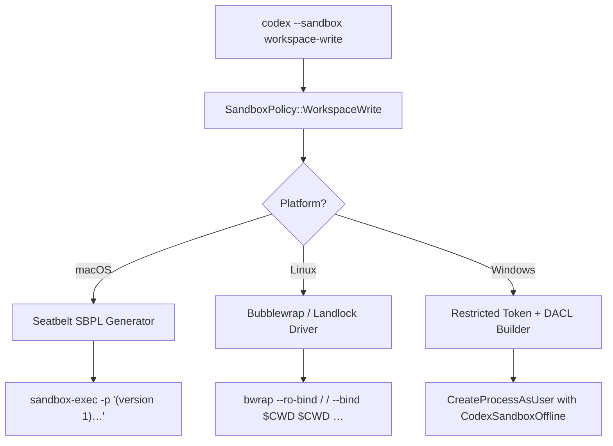
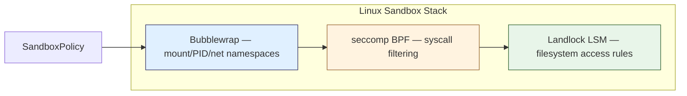

# Codex CLI Sandbox Internals: How Seatbelt, Bubblewrap, Landlock and Windows DACL Keep Agent Commands in Check

When Codex CLI runs a shell command on your behalf, it does not simply call `exec` and hope for the best. Every command executes inside a platform-native sandbox whose job is to enforce one deceptively simple guarantee: *the agent may only touch what you have explicitly allowed*. This article traces the full path from the high-level `SandboxPolicy` enum in `codex-rs` down to the OS primitives that actually confine the process on macOS, Linux and Windows.

## The Policy Layer

All sandboxing starts with a single Rust enum [^1]:

```rust
pub enum SandboxPolicy {
    ReadOnly,          // read the workspace, write nothing
    WorkspaceWrite,    // read everything, write only inside the project root
    DangerFullAccess,  // no sandbox at all
}
```

The user selects a policy through the `--sandbox` flag or the `sandbox_policy` key in `codex.toml`. Once chosen, the policy is handed to a platform-specific *driver* that translates it into OS-level restrictions. The diagram below shows the translation pipeline:



Each driver enforces the same logical contract — read-only mounts, writable workspace roots, network allow/deny — but does so with entirely different kernel facilities. [^2]

## macOS: Seatbelt and SBPL Scripts

On macOS, Codex CLI delegates to `/usr/bin/sandbox-exec`, the user-space entry point for Apple's *Seatbelt* mandatory access control framework. At runtime the Seatbelt driver builds an SBPL (Scheme-based Policy Language) script in memory and passes it via the `-p` flag. [^3]

A simplified version of the generated policy for `WorkspaceWrite` looks like this:

```scheme
(version 1)
(deny default)
(allow file-read*)
(allow file-write*
  (subpath "/Users/you/project"))
(deny file-write*
  (subpath "/Users/you/project/.git")
  (subpath "/Users/you/project/.codex"))
(deny network*)
```

Key design choices:

- **Default-deny posture.** Everything not explicitly allowed is blocked at the kernel level.
- **`.git` and `.codex` are forced read-only** regardless of the chosen policy, preventing the agent from rewriting history or tampering with its own configuration. [^4]
- **Network is binary.** Seatbelt offers no domain-level filtering, so network access is either fully allowed or fully denied. A `network_access = true` setting in the config currently results in the `(deny network*)` rule being silently omitted rather than applying granular controls — a known limitation tracked in GitHub issue #10390. [^5]

Environment variables are scrubbed before the child process launches: `HOME`, `PATH` and a curated allowlist are rebuilt from scratch so that leaked credentials in the parent shell cannot reach agent-generated commands. [^3]

## Linux: Bubblewrap, Landlock and seccomp

The Linux driver has three layers of defence that stack on top of one another.

### Bubblewrap (bwrap)

Bubblewrap is the primary containment tool. It creates a new mount namespace, PID namespace and (optionally) network namespace around the child process. The generated invocation for `WorkspaceWrite` resembles:

```bash
bwrap \
  --ro-bind / / \
  --bind "$PROJECT_ROOT" "$PROJECT_ROOT" \
  --ro-bind "$PROJECT_ROOT/.git" "$PROJECT_ROOT/.git" \
  --dev /dev \
  --proc /proc \
  --unshare-pid \
  --die-with-parent \
  -- /bin/bash -c "$CMD"
```

The entire root filesystem is mounted read-only (`--ro-bind / /`), then selective read-write bind mounts punch holes for the workspace directories. The `--die-with-parent` flag ensures orphaned sandbox processes are killed if the Codex CLI parent exits unexpectedly. [^2]

### Network Isolation

Network policy is implemented via `BwrapNetworkMode`, an enum with three variants:

| Mode | Mechanism | Effect |
|---|---|---|
| `Isolated` | `--unshare-net` | Fully disconnected — no loopback, no DNS |
| `ProxyOnly` | seccomp filter on `SYS_connect`, `SYS_bind`, `SYS_sendto` | Blocks raw socket calls; traffic must flow through a supervised proxy |
| `FullAccess` | No network namespace | Unrestricted |

In `ProxyOnly` mode, a seccomp BPF programme is loaded via `PR_SET_NO_NEW_PRIVS` and `seccomp(SECCOMP_SET_MODE_FILTER)` to intercept networking syscalls at the kernel boundary. [^6]

### Landlock Fallback

On older kernels (pre-5.13) or systems where Bubblewrap is unavailable, the driver falls back to *Landlock LSM*. The `features.use_legacy_landlock = true` flag in `codex.toml` forces this path. Landlock applies filesystem access rules directly to the calling thread without requiring new namespaces, making it a lighter but less comprehensive alternative. [^2]



A notable platform quirk: Ubuntu 24.04's default AppArmor profile can conflict with Bubblewrap's namespace creation. The recommended workaround is to add an AppArmor exception for the `codex` binary or switch to Landlock mode. [^5]

## Windows: Restricted Tokens and DACLs

Windows support, introduced in the `codex-rs` rewrite, takes a fundamentally different approach. Rather than namespaces, it uses the NT security model directly. [^7]

1. **Dedicated local users.** During installation, Codex creates two local accounts: `CodexSandboxOffline` (no network rights) and `CodexSandboxOnline` (standard network access). The choice between them maps directly to the network policy.

2. **Restricted tokens.** The driver calls `CreateProcessAsUser` with a restricted token derived from the chosen sandbox account. The token strips most privileges (`SeShutdownPrivilege`, `SeRemoteShutdownPrivilege`, etc.) and applies a *deny-only* SID list to prevent privilege escalation.

3. **DACL grants.** Workspace directories receive explicit ACL entries granting the sandbox user read/write access, while the rest of the filesystem inherits the default deny. `.git` and `.codex` directories are granted read-only ACEs, mirroring the macOS and Linux behaviour.

```toml
# codex.toml — Windows-specific overrides
[sandbox]
policy = "workspace-write"

[sandbox.windows]
offline_user = "CodexSandboxOffline"
online_user  = "CodexSandboxOnline"
```

The result is a process that runs under a separate user identity with a surgically reduced token — a pattern well-established in Windows service hardening but novel in the context of AI agent tooling. [^7]

## Cross-Platform Invariants

Despite the divergent mechanisms, several invariants hold on every platform:

- **`.git` is always read-only.** No sandbox policy, including `DangerFullAccess` at the application layer, grants write access to `.git` unless the user explicitly overrides this with `allow_git_write = true`.
- **Environment scrubbing.** `AWS_SECRET_ACCESS_KEY`, `GITHUB_TOKEN` and dozens of other sensitive variables are removed from the child environment before launch.
- **Parent-death cleanup.** On Linux, `PR_SET_PDEATHSIG(SIGKILL)` ensures orphan reaping. On macOS, `kqueue` EVFILT_PROC watches serve the same purpose. On Windows, Job Objects with `JOB_OBJECT_LIMIT_KILL_ON_JOB_CLOSE` handle the case.
- **Symlink traversal guards.** All three drivers resolve symlinks *before* applying policy to prevent a symlink inside the workspace from granting access to files outside it — a fix introduced after a bug report demonstrated the escape vector. [^5]

## Practical Implications

For day-to-day use, the sandbox is invisible. But understanding its internals pays off when things go wrong:

- **Build failures inside the sandbox** usually mean a tool writes to a path outside the workspace root. The fix is to redirect output (e.g. `GOPATH`, `CARGO_TARGET_DIR`) into the project tree.
- **Network timeouts in `ProxyOnly` mode** indicate that a dependency manager is opening raw sockets rather than using HTTP. Switching to `FullAccess` network mode or configuring a proxy address resolves the issue.
- **Permission denied on `.git`** is by design. If your workflow requires writing to `.git` (e.g. custom merge drivers), set `allow_git_write = true` in `codex.toml` and accept the risk.

## Conclusion

Codex CLI's sandbox architecture is a case study in defence-in-depth applied to AI agent tooling. By mapping a single policy enum onto three radically different OS security primitives — Seatbelt on macOS, Bubblewrap/Landlock/seccomp on Linux, restricted tokens and DACLs on Windows — the project achieves a consistent security posture without compromising on platform-native performance or idiom. As agent capabilities grow, this isolation layer will only become more critical.

---

**References**

[^1]: OpenAI, "Codex CLI — codex-rs sandbox module," *GitHub*, 2026. [https://github.com/openai/codex/tree/main/codex-rs/core/src/sandbox](https://github.com/openai/codex/tree/main/codex-rs/core/src/sandbox)

[^2]: DeepWiki, "OpenAI Codex — Sandboxing and Security," *DeepWiki*, 2026. [https://deepwiki.com/openai/codex/4-sandboxing-and-security](https://deepwiki.com/openai/codex/4-sandboxing-and-security)

[^3]: Pierce Freeman, "Agent Sandboxes," *piercefreeman.com*, 2025. [https://www.piercefreeman.com/blog/agent-sandboxes](https://www.piercefreeman.com/blog/agent-sandboxes)

[^4]: OpenAI, "Codex CLI Documentation — Sandboxing," *OpenAI*, 2026. [https://openai.com/codex/docs/sandboxing](https://openai.com/codex/docs/sandboxing)

[^5]: OpenAI, "Codex CLI — GitHub Issues," *GitHub*, 2026. [https://github.com/openai/codex/issues](https://github.com/openai/codex/issues)

[^6]: Linux Kernel Documentation, "Seccomp BPF," *kernel.org*, 2024. [https://www.kernel.org/doc/html/latest/userspace-api/seccomp_filter.html](https://www.kernel.org/doc/html/latest/userspace-api/seccomp_filter.html)

[^7]: Microsoft, "Restricted Tokens," *Microsoft Learn*, 2024. [https://learn.microsoft.com/en-us/windows/win32/secauthz/restricted-tokens](https://learn.microsoft.com/en-us/windows/win32/secauthz/restricted-tokens)
