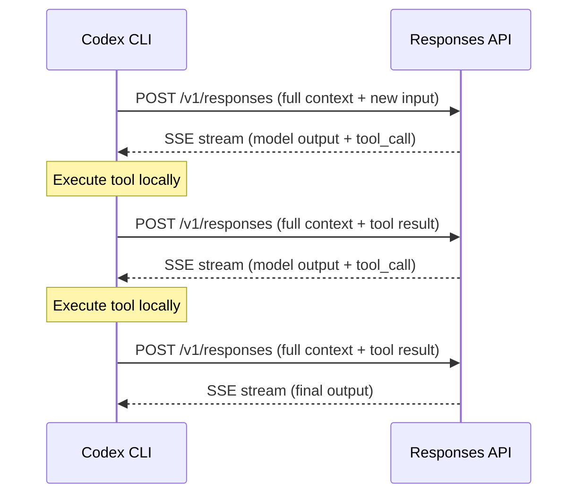
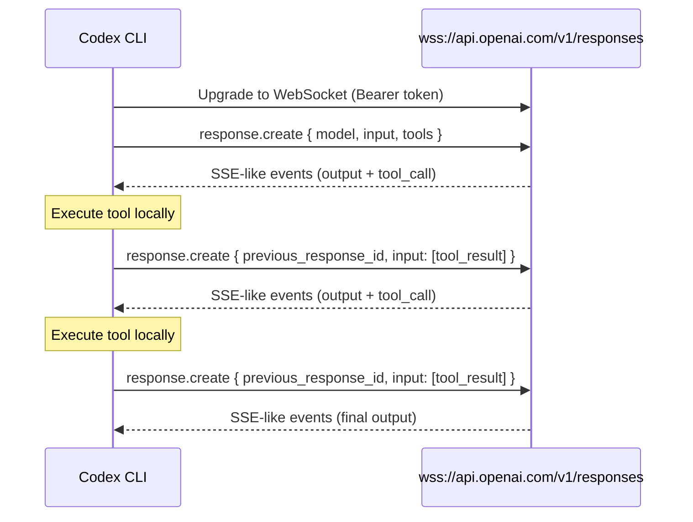
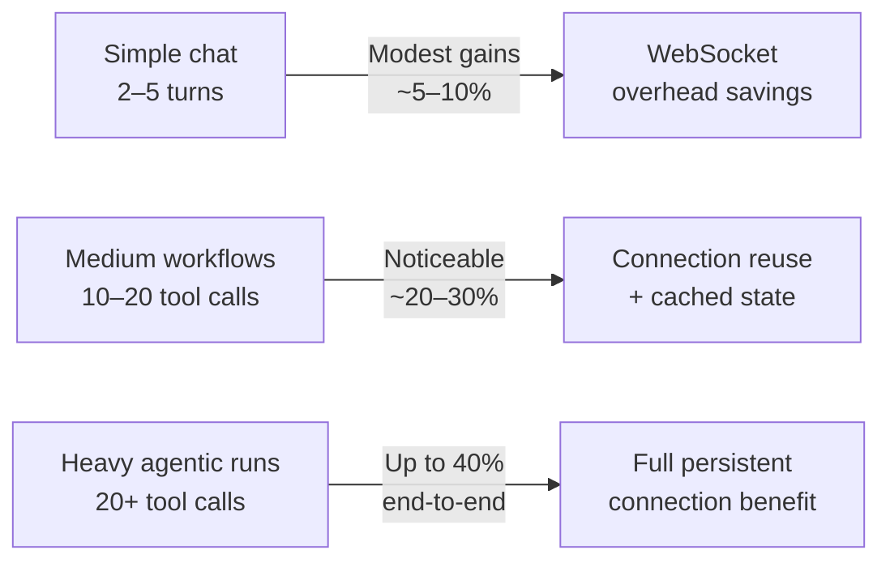

# WebSocket Mode in Codex CLI: How Persistent Connections to the Responses API Cut Agent Loop Latency by 40%


---

Every Codex CLI session is, at its core, a tight loop: send context to the Responses API, receive a model response, execute any requested tool calls, feed results back, repeat. Until recently, each iteration of that loop opened a fresh HTTPS connection and retransmitted the full conversation history — system prompt, AGENTS.md tiers, prior turns, tool outputs, the lot. For a ten-turn session the overhead was tolerable; for a forty-tool-call migration campaign it was not.

In April 2026 OpenAI shipped WebSocket mode for the Responses API[^1], and Codex CLI quickly adopted it as its default transport for the built-in OpenAI provider[^2]. The result: up to 40% faster end-to-end execution on tool-heavy workflows, with Cline and Vercel's AI SDK independently confirming similar gains[^3]. This article explains what changed at the protocol level, how Codex CLI configures and uses it, and what practitioners need to know to get the most out of persistent connections.

## The Problem with Per-Turn HTTP

The traditional Responses API flow works like this:



Each `POST` carries the entire conversation payload. Even with OpenAI's automatic prompt caching — which discounts repeated prefix tokens by up to 50%[^4] — every request still incurs TLS handshake overhead, header serialisation, request routing, and server-side context deserialisation. On a session with 20+ tool calls, those fixed costs compound. OpenAI's internal measurements showed that model inference had reached nearly 1,000 tokens per second, but users experienced only 65 TPS because transport and protocol overhead dominated[^1].

## How WebSocket Mode Works

WebSocket mode replaces the per-turn HTTP round-trip with a single persistent connection:



Three things change:

1. **Connection persistence** — The TLS handshake happens once. Subsequent turns send only a WebSocket text frame containing the `response.create` JSON event[^5].
2. **Incremental input** — After the first turn, the client sends only `previous_response_id` plus new input items (a tool result, a user message). The server holds the most recent response state in a connection-local in-memory cache, eliminating re-serialisation[^5].
3. **Server-side state reuse** — Because the server retains the prior response in memory, it skips the deserialisation and context-reconstruction steps that HTTP mode requires on every request[^1].

The net effect is that the fixed per-turn cost drops from hundreds of milliseconds (TCP + TLS + header parsing + context rebuild) to the time it takes to read a single WebSocket frame.

## Configuring WebSocket Mode in Codex CLI

### The Default: It Just Works

If you use the built-in OpenAI provider (i.e. you have `OPENAI_API_KEY` set and no custom `model_providers` overriding the default), Codex CLI v0.128+ uses WebSocket mode automatically[^2]. There is nothing to configure.

### Custom Providers

If you route through a custom provider — Azure OpenAI, a self-hosted proxy, or an OpenAI data-residency endpoint — you must explicitly enable WebSocket support:

```toml
# ~/.codex/config.toml

[model_providers.azure_eastus]
name = "Azure OpenAI (East US)"
base_url = "https://my-project.openai.azure.com/openai"
wire_api = "responses"
query_params = { api-version = "2025-04-01-preview" }
env_key = "AZURE_OPENAI_API_KEY"
supports_websockets = true
```

The critical key is `supports_websockets = true`[^6]. Without it, Codex falls back to per-turn HTTP for that provider.

### Amazon Bedrock and Other Proxies

Providers that expose an OpenAI-compatible Responses API endpoint but do not support WebSocket upgrade should leave `supports_websockets` unset or explicitly set it to `false`. At the time of writing, Amazon Bedrock's OpenAI-compatible endpoint does not support WebSocket mode[^7]. ⚠️ Setting `supports_websockets = true` against a provider that cannot handle the upgrade will cause connection failures and fall-back retries.

### Disabling WebSocket Mode

If you need to force HTTPS-only transport — for example, behind a corporate proxy that strips WebSocket upgrade headers — there is a known limitation: setting `supports_websockets = false` on the built-in OpenAI provider may not take effect in all versions[^8]. The current workaround is to define a custom provider pointing at the same OpenAI endpoint:

```toml
[model_providers.openai_https]
name = "OpenAI (HTTPS only)"
base_url = "https://api.openai.com/v1"
wire_api = "responses"
env_key = "OPENAI_API_KEY"
supports_websockets = false

model = "openai_https/gpt-5.5"
```

## Connection Lifecycle and Limits

WebSocket connections to the Responses API have specific constraints that affect long-running Codex sessions:

| Constraint | Value | Impact |
|-----------|-------|--------|
| Maximum connection duration | 60 minutes[^5] | Codex auto-reconnects transparently |
| Concurrent responses per connection | 1 (sequential)[^5] | No multiplexing; subagents open separate connections |
| In-memory cache depth | 1 response[^5] | Only the most recent `previous_response_id` is cached |
| `store=false` compatibility | Full[^5] | Safe for zero-data-retention deployments |

The single-response cache deserves attention. If Codex branches a conversation (via `/fork` or subagent spawn), each branch needs its own WebSocket connection because the server only caches the most recent response per connection[^5]. Referencing an older `previous_response_id` on a `store=false` connection returns a `previous_response_not_found` error.

## Server-Side Compaction over WebSocket

Codex CLI's `/compact` command triggers context compaction to free token budget. With WebSocket mode, server-side compaction can be configured automatically via `context_management`:

```json
{
  "type": "response.create",
  "model": "gpt-5.5",
  "previous_response_id": "resp_abc123",
  "input": [{ "role": "user", "content": "Continue the migration" }],
  "context_management": {
    "compact_threshold": 80000
  }
}
```

When the rendered token count crosses `compact_threshold`, the server runs a compaction pass mid-stream, emits a compaction output item, prunes the context, and continues inference — all within the same WebSocket frame sequence[^9]. This eliminates the client-side round-trip that HTTP mode requires (call `/responses/compact`, receive compacted input, send a new request).

## Performance Impact: What the Numbers Show

OpenAI's published benchmarks show three tiers of improvement[^1]:



For GPT-5.3-Codex-Spark, the combination of WebSocket mode and inference optimisations pushed throughput to 1,000 TPS sustained, with bursts to 4,000 TPS[^1]. Third-party confirmation came from Vercel (40% latency decrease in AI SDK integration) and Cline (39% faster multi-file workflows)[^3].

The practical takeaway for Codex CLI users: if your typical session involves fewer than five tool calls — quick questions, single-file edits — you will not notice the difference. If you run migration campaigns, multi-file refactors, or `codex exec` pipelines with `--output-schema`, the 40% figure is realistic.

## Tuning for Maximum Throughput

Beyond enabling WebSocket mode, several `config.toml` settings interact with transport performance:

```toml
# ~/.codex/config.toml

# Increase idle timeout for long tool executions (default: 300000ms)
[model_providers.openai]
stream_idle_timeout_ms = 600000

# Retry on transient WebSocket disconnects (default: 5)
stream_max_retries = 8

# Trigger auto-compaction before context overflows
model_auto_compact_token_limit = 100000

# Limit tool output size to reduce per-turn payload
tool_output_token_limit = 8000
```

The `stream_idle_timeout_ms` is particularly important for WebSocket mode. If a tool execution (e.g. running a test suite) takes longer than the idle timeout, the connection drops. Increasing it to 600 seconds accommodates most CI-style tool runs[^6].

`tool_output_token_limit` caps how much of each tool's stdout/stderr Codex sends back to the model. Reducing it from the default 12,000 to 8,000 tokens shaves per-turn payload size, which compounds over many turns even with WebSocket's incremental sends[^6].

## Subagents and Parallel Connections

MultiAgentV2 workflows in Codex CLI spawn subagents that run their own agent loops. Each subagent maintains a separate WebSocket connection to the Responses API[^10]. This is architecturally correct — the per-connection single-response cache means subagents cannot share a parent's connection — but it does mean that a three-subagent workflow opens four simultaneous WebSocket connections (one root + three children).

In practice, this is not a problem for the OpenAI API, which imposes no documented per-user WebSocket connection limit beyond standard rate limits[^5]. However, if you route through a corporate proxy or API gateway that caps concurrent WebSocket connections, you may need to raise that limit or fall back to HTTP for subagents.

## Debugging Transport Issues

When WebSocket connections fail silently or performance seems unchanged, use `/debug-config` to inspect the active transport:

```bash
# Inside the TUI
/debug-config
```

Look for the `transport` field in the provider diagnostics. It should show `websocket` for providers with `supports_websockets = true`. If it shows `https`, the upgrade likely failed — check proxy settings, firewall rules, or provider compatibility.

For lower-level debugging, set the `CODEX_LOG` environment variable:

```bash
CODEX_LOG=codex_rs::net=debug codex
```

This surfaces WebSocket handshake attempts, frame sizes, and reconnection events in the log output.

## When to Stick with HTTP

WebSocket mode is not universally superior. Three scenarios favour HTTP:

1. **Stateless CI pipelines** — If each `codex exec` invocation is a single-turn, single-tool-call run, the WebSocket upgrade overhead (one extra round-trip) may exceed the savings. HTTP with prompt caching is simpler and equally fast for one-shot runs.
2. **Providers that do not support it** — Amazon Bedrock, some Azure configurations, and most self-hosted inference servers (Ollama, vLLM) do not currently support WebSocket mode on their Responses API endpoints[^7]. ⚠️ Verify before enabling.
3. **Environments that block WebSocket** — Corporate proxies, some cloud WAFs, and restrictive network policies may strip or reject the `Upgrade: websocket` header. If `/debug-config` shows HTTPS fallback, the proxy is the likely culprit.

## What Comes Next

The WebSocket mode specification is still evolving. Two features on the horizon are worth tracking:

- **Multiplexed connections** — Today's one-response-per-connection limit means subagents cannot share sockets. OpenAI has acknowledged this as a future improvement area[^5].
- **Azure OpenAI support** — At the time of writing, Azure's OpenAI-compatible endpoint does not fully support WebSocket mode, though a community question on Microsoft Q&A suggests it is under review[^11]. ⚠️

For Codex CLI practitioners, the action items are straightforward: ensure your provider has `supports_websockets = true` if it supports the protocol, raise `stream_idle_timeout_ms` for long-running tool executions, and let the persistent connection do its work. The 40% is real — provided your workflows are tool-heavy enough to benefit.

## Citations

[^1]: OpenAI, "Speeding up agentic workflows with WebSockets in the Responses API," April 2026. [https://openai.com/index/speeding-up-agentic-workflows-with-websockets/](https://openai.com/index/speeding-up-agentic-workflows-with-websockets/)

[^2]: OpenAI, "Codex CLI Changelog," April 2026. [https://developers.openai.com/codex/changelog](https://developers.openai.com/codex/changelog)

[^3]: Cline, post on X confirming 39% faster multi-file workflows with WebSocket mode, April 2026. [https://x.com/cline/status/2026031848791630033](https://x.com/cline/status/2026031848791630033)

[^4]: OpenAI, "Prompt Caching 201," OpenAI Cookbook. [https://developers.openai.com/cookbook/examples/prompt_caching_201](https://developers.openai.com/cookbook/examples/prompt_caching_201)

[^5]: OpenAI, "WebSocket Mode — Responses API," API documentation. [https://developers.openai.com/api/docs/guides/websocket-mode](https://developers.openai.com/api/docs/guides/websocket-mode)

[^6]: OpenAI, "Configuration Reference — Codex," developer documentation. [https://developers.openai.com/codex/config-reference](https://developers.openai.com/codex/config-reference)

[^7]: OpenAI, "Codex CLI on Amazon Bedrock" and community reports indicating Bedrock's OpenAI-compatible endpoint does not support WebSocket upgrade. ⚠️ Status may change; check Bedrock documentation for current support.

[^8]: GitHub Issue #13103, "Unable to disable WebSocket transport," openai/codex. [https://github.com/openai/codex/issues/13103](https://github.com/openai/codex/issues/13103)

[^9]: OpenAI, "Compaction — Responses API," API documentation. [https://developers.openai.com/api/docs/guides/compaction](https://developers.openai.com/api/docs/guides/compaction)

[^10]: OpenAI, "Subagents — Codex," developer documentation. [https://developers.openai.com/codex/subagents](https://developers.openai.com/codex/subagents)

[^11]: Microsoft Q&A, "Is WebSocket Mode working on Azure for OpenAI models?" [https://learn.microsoft.com/en-us/answers/questions/5788186/is-websocket-mode-working-on-azure-for-openai-mode](https://learn.microsoft.com/en-us/answers/questions/5788186/is-websocket-mode-working-on-azure-for-openai-mode)
