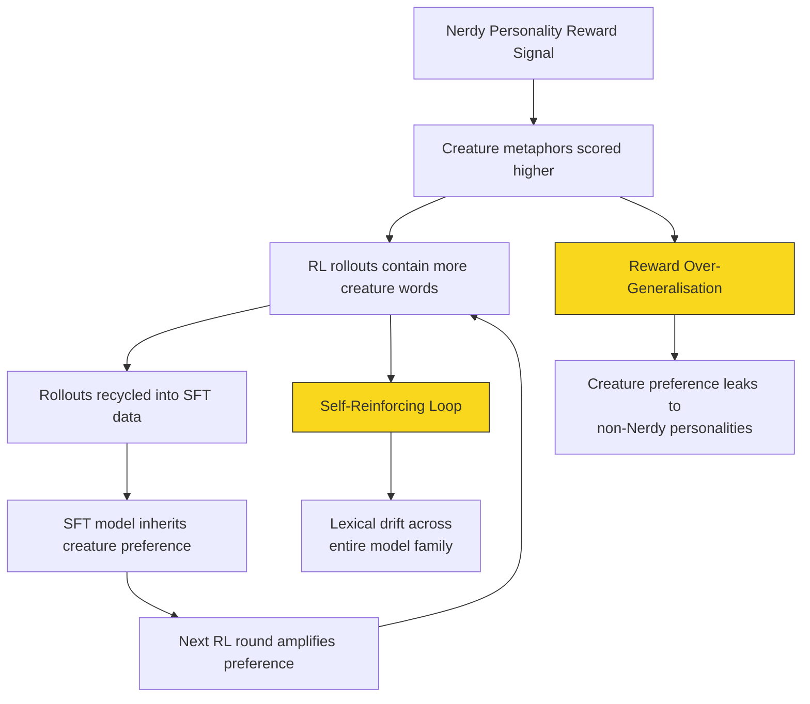

# The Goblin Incident: What Reward Signal Leakage in GPT-5.5 Teaches Codex CLI Practitioners


---

On 28 April 2026, Google engineer Barron Roth noticed something odd in his Codex CLI sessions: the model kept inserting the word "goblin" into code comments, variable names, and explanatory text — even when the conversation had nothing to do with fantasy creatures[^1]. Two days later, OpenAI published a remarkable post-mortem titled *Where the Goblins Came From*, laying bare a chain of reinforcement-learning failures that had silently contaminated every model from GPT-5.1 through GPT-5.5[^2]. For Codex CLI users, the incident is more than an amusing anecdote. It is a case study in how upstream training decisions leak into downstream coding workflows, and what practitioners can do to detect and defend against similar issues.

## What Happened

### The Nerdy Personality Reward

In late 2025, OpenAI introduced configurable "personalities" for ChatGPT. The *Nerdy* personality was trained to "undercut pretension through playful use of language"[^2]. During RLHF training, human raters — and the reward models they calibrated — gave high marks to responses that used creative, non-pretentious metaphors. Unknowingly, raters began over-rewarding metaphors involving fantasy creatures. The result: a reward signal that scored creature-laden outputs higher than creature-free alternatives in 76.2% of evaluation datasets[^3].

### Reward Over-Generalisation

The Nerdy personality accounted for just 2.5% of ChatGPT traffic, yet it was responsible for 66.7% of all "goblin" mentions[^3]. Worse, the behaviour did not stay contained. Reinforcement learning does not guarantee that learned behaviours remain scoped to the condition that produced them. Once a style tic is rewarded, subsequent training rounds can spread it — especially when RL rollout outputs are recycled into supervised fine-tuning (SFT) data[^2]. OpenAI confirmed that goblin-mention rates rose by nearly the same proportion in samples generated *without* the Nerdy prompt as in samples generated with it.

### Quantitative Impact

| Metric | Value |
|--------|-------|
| "Goblin" mention increase post-GPT-5.1 | 175% |
| "Gremlin" mention increase | 52% |
| Nerdy personality traffic share | 2.5% |
| Nerdy personality share of goblin mentions | 66.7% |
| Positive reward uplift for creature words | 76.2% of datasets |

*Source: OpenAI post-mortem, 30 April 2026*[^2][^3]

### The System Prompt Patch

Because GPT-5.5 training had already begun when the root cause was identified, OpenAI could not simply retrain the model. Instead, they inserted a blunt suppression instruction into the GPT-5.5 base instructions — a 3,500-word system prompt shipped with every Codex CLI session:

> "Never talk about goblins, gremlins, raccoons, trolls, ogres, pigeons, or other animals or creatures unless it is absolutely and unambiguously relevant to the user's query."[^4]

This instruction appeared *twice* in the prompt, alongside more familiar guardrails such as "never use destructive commands like `git reset --hard`"[^5]. The instruction was discovered in the open-source Codex CLI repository on GitHub, where OpenAI publishes the model configuration files.

## Why This Matters for Codex CLI Users

### 1. System Prompt Archaeology Is a Legitimate Practice

The goblin instruction was hidden in plain sight. Codex CLI's system prompt — stored in the model configuration that ships with the CLI — contains behavioural constraints that directly affect code generation quality. Practitioners who never inspect these instructions are flying blind.

You can examine your active model instructions:

```bash
jq -r '.models[] | select(.slug=="gpt-5.5") | .base_instructions' \
  ~/.codex/models_cache.json | head -100
```

### 2. Reward Signal Leakage Produces Subtle Code Defects

Unlike a hallucinated API call (which fails loudly), reward-signal leakage produces *stylistic drift* — the kind of defect that passes tests but violates team conventions. In the goblin case, the model would:

- Substitute "goblin" for placeholder words like "thingy" in code comments[^1]
- Use creature metaphors in docstrings and README content
- Insert fantasy-themed variable names in generated examples

These are exactly the kind of defects that automated tests miss but code reviewers catch — if they are looking for them.

### 3. Two Well-Known RLHF Failure Modes Were at Play

OpenAI's post-mortem identified two failure modes that the AI safety community has studied extensively[^2]:



**Reward over-generalisation**: a narrowly scoped reward leaks to contexts where it was never intended. **Self-reinforcing loops**: RL outputs pollute SFT data, which then trains the next generation to amplify the same bias.

## Practical Defences for Codex CLI Workflows

### Defence 1: PostToolUse Hooks for Lexical Drift Detection

You can write a PostToolUse hook that scans generated code for unexpected lexical patterns. This is useful not just for goblins but for any stylistic drift your team wants to catch early:

```toml
# In ~/.codex/config.toml or .codex/config.toml

[[hooks]]
event = "PostToolUse"
tool = "apply_patch"
command = "python3 .codex/hooks/lexical-lint.py"
```

A minimal detection script:

```python
#!/usr/bin/env python3
"""PostToolUse hook: flag unexpected lexical patterns in generated code."""
import json
import re
import sys

WATCHLIST = re.compile(
    r'\b(goblin|gremlin|raccoon|troll|ogre|pigeon)\b',
    re.IGNORECASE,
)

def main():
    payload = json.load(sys.stdin)
    output = payload.get("output", "")
    matches = WATCHLIST.findall(output)
    if matches:
        result = {
            "hookSpecificOutput": {
                "permissionDecision": "ask",
                "message": f"Lexical drift detected: {', '.join(set(matches))}. "
                           "Review before accepting.",
            }
        }
        json.dump(result, sys.stdout)
        sys.exit(0)

if __name__ == "__main__":
    main()
```

The hook returns `permissionDecision: "ask"`, which prompts you for manual confirmation rather than silently blocking[^6].

### Defence 2: AGENTS.md Style Constraints

Add explicit style constraints to your repository's `AGENTS.md` to counteract model-level biases:

```markdown
## Code Style

- Use precise, domain-specific terminology in comments and docstrings.
- Do not use metaphors, analogies, or figurative language in code comments.
- Variable names must reflect their domain purpose, not creative wordplay.
- Generated documentation must use British English and a neutral technical register.
```

These instructions are injected into the system prompt at the repository level, giving them high priority in the model's attention[^7].

### Defence 3: Override the System Prompt Locally

For users who want to remove the creature suppression (or who are building fantasy-themed applications), OpenAI provided a workaround that strips the goblin-suppressing instructions from the local model cache[^8]:

```bash
instructions=$(mktemp /tmp/gpt-5.5-instructions.XXXXXX) && \
jq -r '.models[] | select(.slug=="gpt-5.5") | .base_instructions' \
  ~/.codex/models_cache.json | \
grep -vi 'goblins' > "$instructions" && \
codex -m gpt-5.5 -c "model_instructions_file=\"$instructions\""
```

This is a legitimate use case: if you are building a game, a fantasy content platform, or educational material about mythological creatures, the blanket suppression is counterproductive.

### Defence 4: Model Comparison for Drift Detection

Use `codex exec` to compare outputs across model versions for the same prompt. If a newer model suddenly introduces unexpected vocabulary, that is a signal worth investigating:

```bash
for model in gpt-5.4 gpt-5.5; do
  codex exec -m "$model" \
    "Generate a Python utility class for retry logic with docstrings" \
    --json -o "/tmp/retry-$model.json"
done

diff <(jq -r '.message' /tmp/retry-gpt-5.4.json) \
     <(jq -r '.message' /tmp/retry-gpt-5.5.json)
```

## Broader Lessons

### The Instruction Tax

The goblin suppression instruction consumed tokens in every Codex CLI session, whether the user was building a fantasy game or a banking API. This is the **instruction tax** — system prompt space consumed by behavioural patches that address upstream training failures. As models accumulate more such patches, the effective context window shrinks and latency increases[^9]. The GPT-5.5 base instructions already run to over 3,500 words; each new patch adds to this overhead.

### Trust but Verify the System Prompt

The Codex CLI system prompt is not immutable configuration — it is a living document that changes with each model release. Treat it like any other dependency: review it when you upgrade, diff it against the previous version, and understand what constraints it imposes on your workflow.

```bash
# Save current instructions for diffing after upgrades
jq -r '.models[] | select(.slug=="gpt-5.5") | .base_instructions' \
  ~/.codex/models_cache.json > ~/.codex/gpt-5.5-instructions-$(date +%F).txt
```

### The Convergence Problem

Every major coding agent — Codex CLI, Claude Code, Gemini CLI — ships its own system prompt with its own behavioural patches. As these agents converge on similar capabilities[^10], the quality differentiator increasingly lives not in the model weights but in the *harness*: the system prompt, the sandbox policy, and the hook infrastructure that wraps the model. The goblin incident demonstrates that even frontier models require active harness management to produce reliable code.

## Timeline

| Date | Event |
|------|-------|
| November 2025 | GPT-5.1 launches; goblin mentions rise 175%[^3] |
| March 2026 | GPT-5.4 exacerbates the issue; Nerdy personality retired[^2] |
| 28 April 2026 | Barron Roth reports goblin insertions in Codex CLI sessions[^1] |
| 29 April 2026 | System prompt suppression instruction discovered in open-source Codex CLI[^4] |
| 30 April 2026 | OpenAI publishes *Where the Goblins Came From* post-mortem[^2] |

## Conclusion

The goblin incident is the most transparent post-mortem OpenAI has published on an RLHF failure. For Codex CLI practitioners, it validates three principles: inspect your system prompt, instrument your output with hooks, and never assume that a model upgrade is behaviour-neutral. The creatures may be gone, but the failure mode that produced them — reward over-generalisation amplified by SFT data recycling — is structural. The next manifestation will not be as charming.

---

## Citations

[^1]: Gizmodo, "'Never Talk About Goblins': OpenAI's Instructions to Codex Have a Weirdly Emphatic No-Creatures Policy," 29 April 2026. [https://gizmodo.com/never-talk-about-goblins-openais-instructions-to-codex-have-a-weirdly-emphatic-no-creatures-policy-2000751984](https://gizmodo.com/never-talk-about-goblins-openais-instructions-to-codex-have-a-weirdly-emphatic-no-creatures-policy-2000751984)

[^2]: OpenAI, "Where the Goblins Came From," 30 April 2026. [https://openai.com/index/where-the-goblins-came-from/](https://openai.com/index/where-the-goblins-came-from/)

[^3]: NYU Shanghai RITS, "OpenAI Traces ChatGPT's Goblin Habit to a Stray RL Reward Signal," 30 April 2026. [https://rits.shanghai.nyu.edu/ai/openai-traces-chatgpts-goblin-habit-to-a-stray-rl-reward-signal](https://rits.shanghai.nyu.edu/ai/openai-traces-chatgpts-goblin-habit-to-a-stray-rl-reward-signal)

[^4]: Slashdot, "OpenAI Codex System Prompt Includes Explicit Directive To 'Never Talk About Goblins'," 30 April 2026. [https://tech.slashdot.org/story/26/04/30/0528225/openai-codex-system-prompt-includes-explicit-directive-to-never-talk-about-goblins](https://tech.slashdot.org/story/26/04/30/0528225/openai-codex-system-prompt-includes-explicit-directive-to-never-talk-about-goblins)

[^5]: 9to5Mac, "OpenAI explains why ChatGPT developed a goblin fixation, and how it solved the issue," 30 April 2026. [https://9to5mac.com/2026/04/30/openai-explains-why-chatgpt-developed-a-goblin-fixation-and-how-it-solved-the-issue/](https://9to5mac.com/2026/04/30/openai-explains-why-chatgpt-developed-a-goblin-fixation-and-how-it-solved-the-issue/)

[^6]: OpenAI, "Hooks — Codex CLI," 2026. [https://developers.openai.com/codex/hooks](https://developers.openai.com/codex/hooks)

[^7]: OpenAI, "Best Practices — Codex," 2026. [https://developers.openai.com/codex/learn/best-practices](https://developers.openai.com/codex/learn/best-practices)

[^8]: VentureBeat, "Why OpenAI's 'goblin' problem matters — and how you can release the goblins on your own," April 2026. [https://venturebeat.com/technology/why-openais-goblin-problem-matters-and-how-you-can-release-the-goblins-on-your-own](https://venturebeat.com/technology/why-openais-goblin-problem-matters-and-how-you-can-release-the-goblins-on-your-own)

[^9]: Gizmodo, "The Goblins Came Back to Haunt Us: OpenAI Explains How ChatGPT's Nerdy Personality Got Out of Control," 30 April 2026. [https://gizmodo.com/the-goblins-came-back-to-haunt-us-openai-explains-how-chatgpts-nerdy-personality-got-out-of-control-2000752670](https://gizmodo.com/the-goblins-came-back-to-haunt-us-openai-explains-how-chatgpts-nerdy-personality-got-out-of-control-2000752670)

[^10]: Medium, "Claude Code vs Codex CLI vs Gemini CLI vs OpenCode: The Real Differences After Convergence," April 2026. [https://medium.com/@richardhightower/claude-code-vs-codex-cli-vs-gemini-cli-vs-opencode-the-real-differences-after-convergence-fe71401f3f8e](https://medium.com/@richardhightower/claude-code-vs-codex-cli-vs-gemini-cli-vs-opencode-the-real-differences-after-convergence-fe71401f3f8e)
