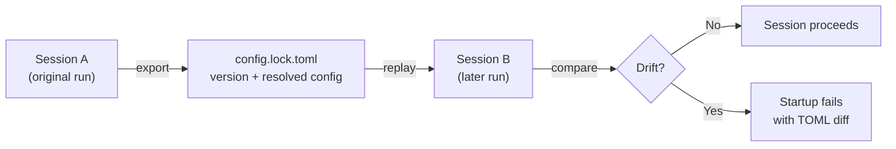
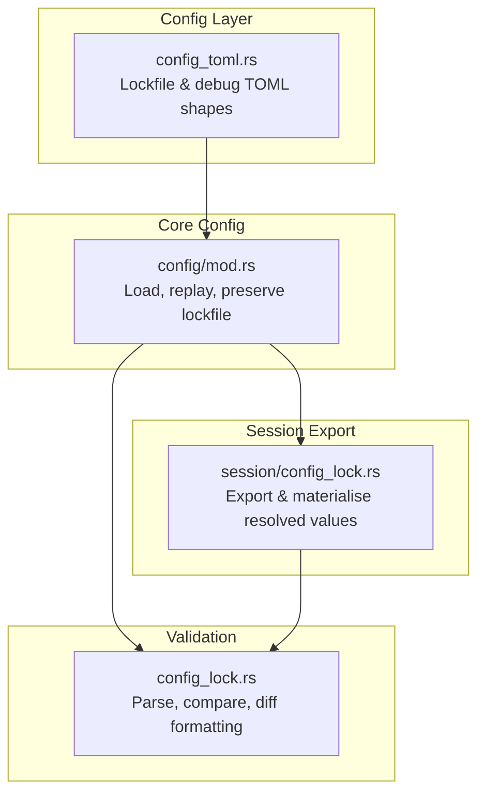

# Codex CLI Config Lockfiles: Reproducible Agent Sessions with Export, Replay, and Drift Detection


---

## The Reproducibility Problem

Every senior engineer has encountered the "it worked on my machine" problem with build tools. Codex CLI introduces a subtler variant: *it worked in my session*. A hand-written `config.toml` is not sufficient to recreate what a Codex session actually ran with, because layered configuration, CLI overrides, defaults, feature aliases, resolved feature states, prompt setup, and model-catalogue values can all shift the final runtime behaviour [^1].

Codex CLI resolves configuration from at least six layers [^2]:

1. CLI flags and `-c` inline overrides (highest precedence)
2. Profile values (`--profile`)
3. Project config (`.codex/config.toml`, closest to cwd wins)
4. User config (`~/.codex/config.toml`)
5. System config (`/etc/codex/config.toml`)
6. Built-in defaults

On managed enterprise machines, cloud-managed requirements and MDM preferences add further layers above these [^3]. By the time Codex starts a session, the *effective* configuration — the actual resolved values — can diverge significantly from any single file on disc.

PR #20405 [^1], merged on 1 May 2026, introduces **config lockfiles**: a mechanism to export the fully-resolved effective configuration from one session and replay it in another, with drift detection that fails fast if the environment has changed.

## How Config Lockfiles Work

The design borrows directly from the lockfile pattern familiar across package managers — `package-lock.json`, `Cargo.lock`, `uv.lock` — but applies it to agent configuration rather than dependencies [^4]. The core workflow has two phases: **export** and **replay**.



### The Lockfile Format

A config lockfile is a TOML file with top-level metadata and a nested `[config]` section containing the replayable values:

```toml
version = 1
codex_version = "0.129.0-alpha.2"

[config]
model = "gpt-5.5"
model_provider = "openai"
model_reasoning_effort = "medium"
service_tier = "fast"
sandbox_mode = "workspace-write"
# ... all resolved effective config fields
```

The lockfile captures resolved runtime values including model selection, reasoning settings, prompts, service tier, web search mode, feature states, memories configuration, skill instructions, and agent limits [^1]. Crucially, it stores *resolved outputs* — not the inputs that produced them. Profile selectors, debug controls, file-include directives, and environment-specific inputs are stripped, so the lockfile contains only the canonical replayable state.

Feature aliases and custom feature configurations are materialised into their canonical resolved form, so replay compares actual behaviour rather than the user-authored alias shape [^1].

## Configuration Keys

Four new keys under `debug.config_lockfile` control the feature [^5]:

| Key | Type | Purpose |
|-----|------|---------|
| `export_dir` | Absolute path | Directory where Codex writes `<thread_id>.config.lock.toml` on session start |
| `load_path` | Absolute path | Lockfile to replay as the authoritative effective config |
| `allow_codex_version_mismatch` | Boolean | Tolerate Codex binary version drift during replay |
| `save_fields_resolved_from_model_catalog` | Boolean | Whether to persist model-catalogue-resolved fields or leave them dynamic |

## Practical Usage

### Exporting a Lockfile

To capture the effective configuration from any session:

```bash
codex -c 'debug.config_lockfile.export_dir="/tmp/codex-locks"'
```

When the session starts, Codex writes a file named `<thread_id>.config.lock.toml` to the specified directory [^1]. This file represents the complete resolved configuration — every layer merged, every default filled, every feature alias expanded.

If you want the lockfile to remain stable across model-catalogue updates (e.g., when OpenAI rotates default reasoning settings or context windows), omit the catalogue-resolved fields:

```bash
codex -c 'debug.config_lockfile.export_dir="/tmp/codex-locks"' \
  -c 'debug.config_lockfile.save_fields_resolved_from_model_catalog=false'
```

### Replaying a Lockfile

To enforce that a later session uses identical effective configuration:

```bash
codex -c 'debug.config_lockfile.load_path="/tmp/codex-locks/abc123.config.lock.toml"'
```

On startup, Codex loads the lockfile as an authoritative config layer, re-resolves the effective configuration from the current environment, then compares the two. If they diverge, startup fails immediately with a TOML diff showing exactly which fields changed [^1].

### Tolerating Version Drift

When replaying across Codex binary upgrades (e.g., from `0.128.0` to `0.129.0`), version checking can be relaxed:

```bash
codex -c 'debug.config_lockfile.load_path="/tmp/codex-locks/abc123.config.lock.toml"' \
  -c 'debug.config_lockfile.allow_codex_version_mismatch=true'
```

This compares config values whilst ignoring the `codex_version` field — useful in CI where the binary might be updated independently of the lockfile.

## Architecture

The implementation spans four key modules in the `codex-rs` codebase [^1]:



The validation module uses the `similar` crate for unified diff output, so drift failures produce human-readable TOML diffs that pinpoint exactly which fields changed and how [^1].

## Use Cases

### CI/CD Pipeline Reproducibility

In continuous integration, config lockfiles ensure that automated `codex exec` runs use identical configuration to the session where the workflow was developed and tested:

```bash
# Developer exports lockfile during development
codex -c 'debug.config_lockfile.export_dir="./ci/locks"' \
  --exec "Run the migration"

# CI replays the lockfile
codex -c 'debug.config_lockfile.load_path="./ci/locks/dev-session.config.lock.toml"' \
  -c 'debug.config_lockfile.allow_codex_version_mismatch=true' \
  --exec "Run the migration"
```

This is particularly valuable alongside the `--ephemeral` and `--ignore-user-config` hermetic isolation flags introduced for `codex exec` [^6], creating a fully deterministic pipeline.

### Debugging Divergent Behaviour

When two team members get different results from the same prompt, comparing their exported lockfiles immediately surfaces configuration differences — different models, reasoning efforts, feature flags, or permission profiles — that would otherwise take hours to diagnose.

### Enterprise Compliance and Audit

Lockfiles provide a tamper-evident record of the exact configuration under which an agent operated. Combined with Codex's rollout tracing [^7] and session recording capabilities, they form part of a comprehensive audit trail for regulated environments.

### Team Configuration Alignment

A committed lockfile in the repository serves as a reference configuration that any team member can replay, ensuring consistent agent behaviour regardless of individual `~/.codex/config.toml` customisations.

## Limitations

The current implementation has several known constraints [^1]:

- **Custom rules and network policies are not captured.** Starlark execution rules and network policy configurations are excluded from the lockfile, so sessions relying heavily on custom `prefix_rule()` definitions will not be fully reproducible from the lockfile alone.
- **Model availability is not guaranteed.** A lockfile may specify a model that has since been deprecated or is unavailable in the target environment.
- **Non-deterministic model output.** Config lockfiles ensure identical *configuration*, not identical *results*. LLM inference remains non-deterministic even with identical settings.
- **Debug-namespace feature.** The `debug.config_lockfile` namespace signals that this is currently an advanced/experimental capability, though the implementation is production-quality.

## Relationship to Existing Reproducibility Features

Config lockfiles complement rather than replace existing reproducibility mechanisms in Codex CLI:

| Mechanism | What it pins | Scope |
|-----------|-------------|-------|
| `config.toml` | User-authored settings | Input layer |
| `requirements.toml` | Enterprise policy constraints | Enforcement layer |
| `--ephemeral` + `--ignore-user-config` | Isolation from local state | Hermetic execution [^6] |
| **Config lockfile** | **Fully-resolved effective config** | **Complete runtime state** |
| Rollout traces | Execution history and tool calls | Post-hoc audit [^7] |

The lockfile sits uniquely in this stack: it captures the *resolved output* of the configuration system rather than any single input, making it the only mechanism that accounts for the interactions between all other layers.

## Getting Started

The feature is available in Codex CLI `0.129.0-alpha.2` and later [^8]. To begin using config lockfiles:

1. **Export from your current workflow:**

   ```bash
   codex -c 'debug.config_lockfile.export_dir="/tmp/codex-locks"'
   ```

2. **Inspect the generated lockfile** to understand your effective configuration — you may be surprised by resolved defaults you were unaware of.

3. **Commit lockfiles** alongside CI workflow definitions for pipeline reproducibility.

4. **Replay in CI** with `allow_codex_version_mismatch=true` to catch configuration drift without blocking on binary updates.

For teams adopting this pattern, consider adding a pre-commit hook that exports a fresh lockfile and diffs it against the committed version, surfacing unintended configuration changes before they reach the pipeline.

## Citations

[^1]: OpenAI Codex, "feat: export and replay effective config locks", PR #20405, GitHub, 1 May 2026. [https://github.com/openai/codex/pull/20405](https://github.com/openai/codex/pull/20405)
[^2]: OpenAI, "Config basics — Codex", OpenAI Developers, 2026. [https://developers.openai.com/codex/config-basic](https://developers.openai.com/codex/config-basic)
[^3]: OpenAI, "Managed configuration — Codex", OpenAI Developers, 2026. [https://developers.openai.com/codex/enterprise/managed-configuration](https://developers.openai.com/codex/enterprise/managed-configuration)
[^4]: A. Nesbitt, "Lockfile Format Design and Tradeoffs", nesbitt.io, January 2026. [https://nesbitt.io/2026/01/17/lockfile-format-design-and-tradeoffs.html](https://nesbitt.io/2026/01/17/lockfile-format-design-and-tradeoffs.html)
[^5]: OpenAI Codex, "config.schema.json — DebugConfigLockToml", GitHub, 2026. [https://github.com/openai/codex/blob/main/codex-rs/core/config.schema.json](https://github.com/openai/codex/blob/main/codex-rs/core/config.schema.json)
[^6]: OpenAI, "Non-interactive mode — Codex", OpenAI Developers, 2026. [https://developers.openai.com/codex/non-interactive](https://developers.openai.com/codex/non-interactive)
[^7]: OpenAI, "Changelog — Codex", OpenAI Developers, 2026. [https://developers.openai.com/codex/changelog](https://developers.openai.com/codex/changelog)
[^8]: OpenAI Codex, "Release 0.129.0-alpha.2", GitHub, 1 May 2026. [https://github.com/openai/codex/releases/tag/rust-v0.129.0-alpha.2](https://github.com/openai/codex/releases/tag/rust-v0.129.0-alpha.2)
