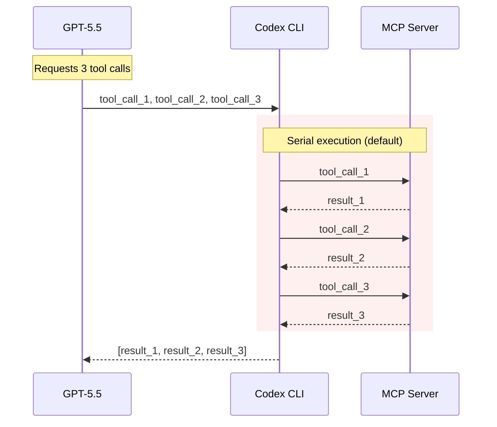
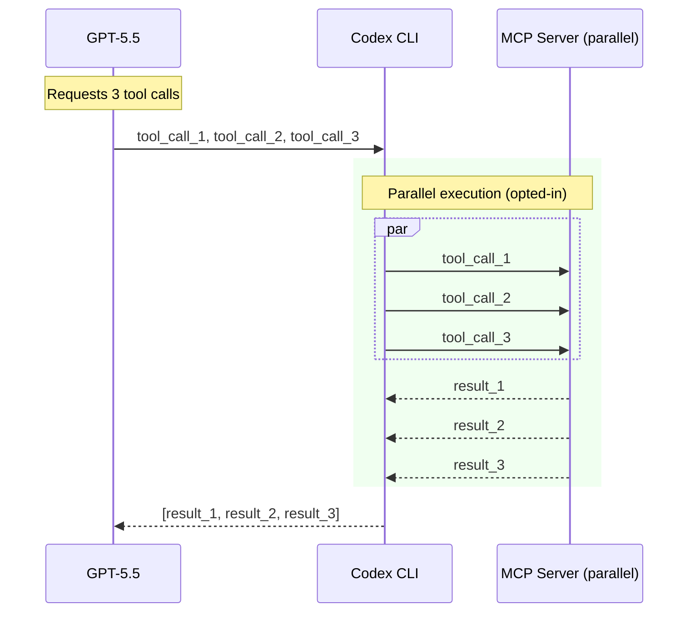
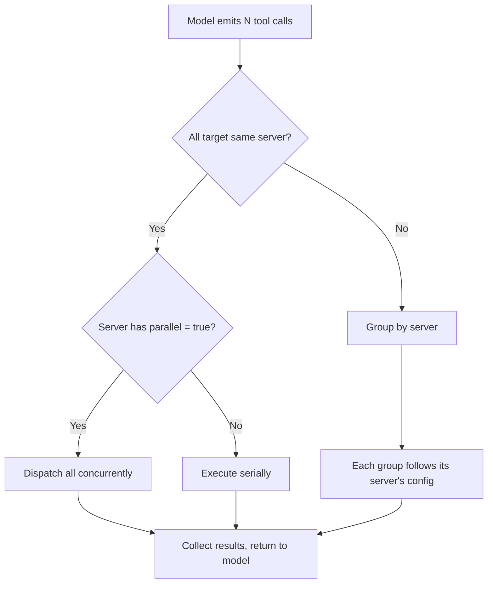

# MCP Parallel Tool Calls in Codex CLI: Unlocking Concurrent Execution with supports_parallel_tool_calls


---

Since v0.121.0, Codex CLI has shipped a quietly powerful configuration flag for MCP servers: `supports_parallel_tool_calls`. When enabled, it allows tools exposed by a given MCP server to execute concurrently rather than serially — cutting wall-clock time roughly in half for eligible workloads [^1]. This article explains how the feature works, when to enable it, and the concurrency pitfalls that make the serial default the right choice for most servers.

## The Serial Default and Why It Exists

By default, every MCP tool call in Codex CLI executes serially. When the model requests three tool calls in a single turn, Codex runs them one after another, waiting for each result before starting the next. This is intentional: MCP servers are arbitrary programs, and many maintain internal state — open file handles, database connections, in-memory caches — that is not safe to access concurrently [^1] [^2].

Consider a documentation server that reads markdown files from disc. Two parallel reads are harmless. But a project management server that creates tickets, updates boards, and modifies sprint data has shared mutable state. Running its tools concurrently risks race conditions that produce non-deterministic failures — the kind that surface intermittently and resist reproduction [^3].

The serial default protects you from this class of bug entirely.



## Enabling Parallel Execution

To opt a specific MCP server into parallel tool calls, add the flag to its configuration block in `config.toml`:

```toml
[mcp_servers.docs]
command = "npx"
args = ["-y", "@example/docs-mcp"]
supports_parallel_tool_calls = true
```

The flag is **per-server**, not global. You can enable it for a read-only documentation server while leaving your database server serial [^1]:

```toml
# Safe for parallel — read-only lookups
[mcp_servers.docs]
command = "docs-server"
supports_parallel_tool_calls = true

# Unsafe for parallel — mutates shared state
[mcp_servers.jira]
command = "jira-mcp-server"
supports_parallel_tool_calls = false  # default, explicit for clarity
```

When the model emits multiple tool calls in a single turn and all target a parallel-enabled server, Codex dispatches them concurrently. If the calls span multiple servers with different settings, each server's calls respect its own configuration [^1].



## Performance Impact

PR #17667 included benchmark results that demonstrate the benefit clearly. With two tool calls each introducing a 25-second delay [^1]:

| Mode | Wall-clock time |
|------|----------------|
| Serial (default) | ~57 seconds |
| Parallel (opted-in) | ~32 seconds |

That is a 44% reduction in wall-clock time — and the gains scale with the number of concurrent calls. For an MCP server exposing search, fetch, and summarise tools, a single turn requesting all three completes in the time of the slowest call rather than the sum of all three.

In practice, the benefit compounds across a session. A 20-turn session where the model averages two parallel-eligible tool calls per turn saves minutes of cumulative wait time. Paired with prompt caching [^4], this makes MCP-heavy workflows substantially more responsive.

## Implementation: How Codex Routes Parallel Calls

The implementation, introduced in v0.121.0 [^5], places the parallel-safety decision at the server level rather than the tool level. This is a deliberate design choice [^1]:

1. **Configuration is read** from the `mcp_servers` block at startup
2. **Server names** with `supports_parallel_tool_calls = true` are threaded into the `ToolRouter`
3. At execution time, the router inspects each `ToolPayload::Mcp` to determine its originating server
4. If the server is parallel-enabled, calls are dispatched concurrently; otherwise, they queue serially

The design avoids relying on tool names for routing, which can be ambiguous when multiple servers expose identically named tools. Server-level configuration sidesteps this entirely [^1].



## The multi_tool_use.parallel Connection

Parallel tool calling at the MCP layer is distinct from the model's own `multi_tool_use.parallel` capability. The model may request multiple tool calls in a single response regardless of MCP configuration — that is a model-level behaviour controlled by the `parallel_tool_calls` parameter in the Responses API [^6]. What `supports_parallel_tool_calls` controls is whether Codex CLI **executes** those calls concurrently or serially.

This distinction matters because a known issue with GPT-5.4 occasionally causes the model to emit raw `multi_tool_use.parallel` scaffold text instead of proper tool-call payloads [^7]. That is a model-layer bug unrelated to MCP server configuration. The MCP parallel flag operates entirely at the execution layer.

## When to Enable It

Enable `supports_parallel_tool_calls` when a server's tools are:

- **Stateless or read-only** — documentation lookups, API queries, search indices
- **Idempotent** — repeated calls produce the same result without side effects
- **Externally safe** — no shared file locks, database transactions, or rate-limited APIs that penalise bursts

Do **not** enable it when:

- Tools **write to shared state** — file systems, databases, project management boards
- Tools have **ordering dependencies** — where tool B's input depends on tool A's output
- The server **rate-limits concurrency** — some APIs throttle parallel requests, causing silent failures
- You are **uncertain** — the serial default is always safe; parallel is an optimisation, not a requirement

## Combining with Other Speed Levers

Parallel MCP calls compose well with Codex CLI's other performance controls [^8]:

| Lever | Effect | Interaction with parallel MCP |
|-------|--------|-------------------------------|
| **Fast mode** | 1.5× inference speed | Reduces time between tool-call batches |
| **Prompt caching** | Reduces input token cost and TTFT | Unchanged — MCP execution is post-inference |
| **Low reasoning effort** | Faster model responses | Fewer reasoning tokens before tool dispatch |
| **Codex-Spark model** | 1,000+ tok/s generation | Faster tool-call emission, same execution benefit |

The optimal configuration for MCP-heavy interactive work combines parallel execution with prompt caching and fast mode:

```toml
[profile.mcp-heavy]
model = "gpt-5.5"
service_tier = "fast"

[profile.mcp-heavy.mcp_servers.docs]
command = "docs-server"
supports_parallel_tool_calls = true

[profile.mcp-heavy.mcp_servers.search]
command = "search-server"
supports_parallel_tool_calls = true
```

## Debugging Parallel Execution Issues

When parallel execution causes unexpected behaviour, the diagnostic path is straightforward:

1. **Disable the flag** — set `supports_parallel_tool_calls = false` and confirm the issue disappears
2. **Check for shared state** — review whether tools read/write the same files, databases, or APIs
3. **Inspect tool timeouts** — parallel calls share the server's `tool_timeout_sec`; if one call is slow, others may time out
4. **Review JSONL telemetry** — `codex exec --json` emits per-call timing that reveals whether parallelism caused ordering issues [^9]

If a server's tools are *mostly* safe for parallel execution but one or two are not, the current implementation does not support per-tool granularity. The workaround is to split the server into two: one parallel-enabled for the safe tools, one serial for the rest.

## Conclusion

`supports_parallel_tool_calls` is a targeted optimisation that trades the safety of serial execution for the speed of concurrency — but only where you explicitly opt in. The per-server granularity, serial default, and execution-layer implementation make it a well-designed addition to Codex CLI's performance toolkit. For teams running MCP-heavy workflows with read-only or stateless servers, enabling it is one of the simplest ways to reclaim wall-clock time without touching model configuration or prompt architecture.

## Citations

[^1]: Josiah (OpenAI), "Add `supports_parallel_tool_calls` flag to included mcps," *Pull Request #17667*, [https://github.com/openai/codex/pull/17667](https://github.com/openai/codex/pull/17667)

[^2]: OpenAI, "Model Context Protocol," *Codex Documentation*, [https://developers.openai.com/codex/mcp](https://developers.openai.com/codex/mcp)

[^3]: OpenAI, "MCP Debugging and Diagnostics," *Codex CLI Best Practices*, [https://developers.openai.com/codex/learn/best-practices](https://developers.openai.com/codex/learn/best-practices)

[^4]: OpenAI, "Prompt Caching," *API Documentation*, [https://developers.openai.com/api/docs/guides/prompt-caching](https://developers.openai.com/api/docs/guides/prompt-caching)

[^5]: Releasebot, "Codex Updates — v0.121.0," [https://releasebot.io/updates/openai/codex](https://releasebot.io/updates/openai/codex)

[^6]: OpenAI, "What models support parallel_tool_calls, and when to use it?" *OpenAI Developer Community*, [https://community.openai.com/t/what-models-support-parallel-tool-calls-and-when-to-use-it/1310788](https://community.openai.com/t/what-models-support-parallel-tool-calls-and-when-to-use-it/1310788)

[^7]: OpenAI, "GPT-5.4 emits internal multi_tool_use.parallel format as plain text," *Issue #13867*, [https://github.com/openai/codex/issues/13867](https://github.com/openai/codex/issues/13867)

[^8]: OpenAI, "Speed – Codex," *Codex Documentation*, [https://developers.openai.com/codex/speed](https://developers.openai.com/codex/speed)

[^9]: OpenAI, "Non-interactive mode," *Codex Documentation*, [https://developers.openai.com/codex/noninteractive](https://developers.openai.com/codex/noninteractive)
