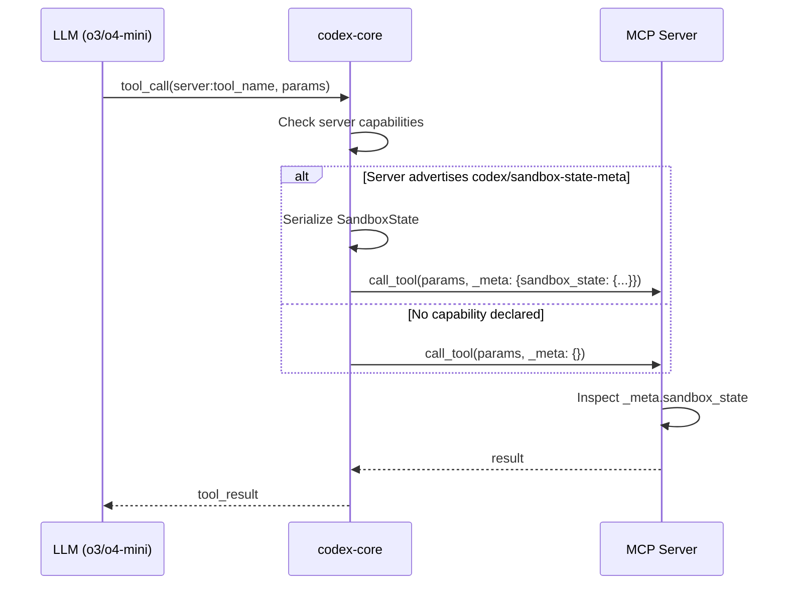
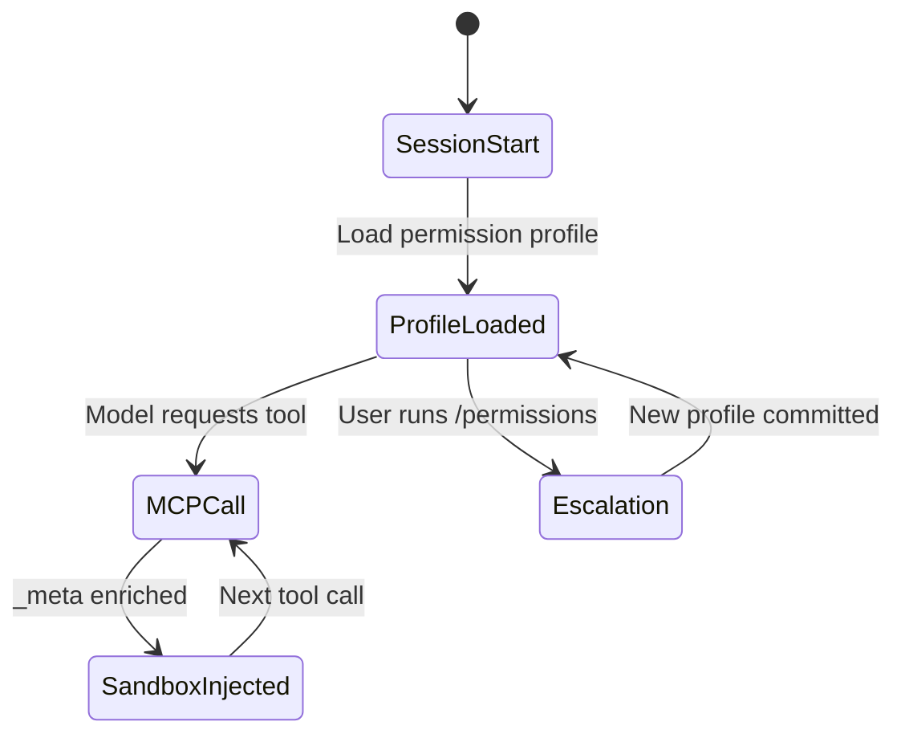

# Codex CLI MCP Sandbox-State Metadata: Building Context-Aware Tool Servers


---

## The Problem: Blind Tool Servers

MCP servers connected to Codex CLI traditionally operate without knowledge of their execution context. A database migration tool behaves identically whether Codex is running in `read-only` mode or `danger-full-access` — it discovers the restriction only when a command fails. This creates poor user experiences: wasted tokens on plans that cannot execute, cryptic sandbox violations mid-operation, and no way for servers to offer degraded-but-useful alternatives.

Since Codex v0.125.0, sandbox state flows through MCP tool metadata[^1], allowing servers to introspect their permission envelope *before* attempting operations. This article covers the architecture, opt-in mechanism, and practical patterns for building context-aware MCP servers.

## Architecture Overview



The key insight: sandbox metadata injection is **opt-in per server**. Only servers that declare the `codex/sandbox-state-meta` experimental capability receive the enriched `_meta` payload[^2]. This preserves backward compatibility — existing servers see no change in their request format.

## Opting In: The Capability Declaration

When Codex starts an MCP server, it performs the standard MCP `initialize` handshake. To receive sandbox state, your server must advertise the experimental capability in its response:

```json
{
  "capabilities": {
    "tools": {},
    "experimental": {
      "codex/sandbox-state-meta": {}
    }
  }
}
```

No configuration in `config.toml` is required beyond the standard MCP server registration[^3]. The capability declaration is sufficient.

## The SandboxState Payload

Once opted in, every model-initiated tool call includes a `_meta` object containing the current sandbox configuration. The structure mirrors Codex's internal `SandboxState` type[^2]:

```json
{
  "_meta": {
    "sandbox_state": {
      "sandbox_mode": "workspace-write",
      "filesystem_policy": {
        "writable_roots": ["/home/user/project"],
        "deny_read_globs": ["**/.env", "**/credentials.*"],
        "protected_paths": [".git/", ".codex/"]
      },
      "network_policy": {
        "network_access": true,
        "allowed_domains": ["api.github.com", "registry.npmjs.org"],
        "unix_sockets": []
      },
      "permission_profile": "workspace",
      "approval_policy": "on-request"
    }
  }
}
```

### Key Fields

| Field | Type | Description |
|-------|------|-------------|
| `sandbox_mode` | string | One of `read-only`, `workspace-write`, `danger-full-access`[^4] |
| `filesystem_policy.writable_roots` | string[] | Directories where writes are permitted |
| `filesystem_policy.deny_read_globs` | string[] | Glob patterns for read-denied paths |
| `network_policy.network_access` | bool | Whether outbound network is available |
| `network_policy.allowed_domains` | string[] | Domain allowlist when network is restricted |
| `permission_profile` | string | Active named profile (`:read-only`, `:workspace`, custom) |
| `approval_policy` | string | Current approval strictness level |

## Practical Pattern: Adaptive Database Migration Server

Consider a database schema migration MCP server. Without sandbox awareness, it always generates destructive `ALTER TABLE` statements. With `_meta` inspection, it can adapt:

```python
import json
from mcp import Server, tool

app = Server("db-migrate")

@app.tool()
async def migrate_schema(spec: str, _meta: dict | None = None) -> str:
    sandbox = (_meta or {}).get("sandbox_state", {})
    mode = sandbox.get("sandbox_mode", "read-only")

    if mode == "read-only":
        # Generate plan only — no execution
        return generate_migration_plan(spec, dry_run=True)
    elif mode == "workspace-write":
        # Check if DB host is in allowed domains
        network = sandbox.get("network_policy", {})
        allowed = network.get("allowed_domains", [])
        if "db.internal" not in allowed and not network.get("network_access"):
            return json.dumps({
                "error": "network_restricted",
                "message": "Database host not in allowed domains. "
                           "Run with network access or add db.internal to allowlist.",
                "suggestion": "Use /permissions to grant network access"
            })
        return execute_migration(spec)
    else:
        # danger-full-access: proceed without checks
        return execute_migration(spec)
```

This pattern eliminates the "try-fail-retry" loop that wastes tokens and confuses the model.

## Practical Pattern: File-Aware Code Generator

A code generation server can use `writable_roots` to ensure generated files land in permitted directories:

```typescript
import { McpServer } from "@modelcontextprotocol/sdk/server/mcp.js";

const server = new McpServer({
  name: "codegen",
  capabilities: {
    experimental: { "codex/sandbox-state-meta": {} }
  }
});

server.tool("generate_module", { name: "string", path: "string" },
  async ({ name, path }, { _meta }) => {
    const sandbox = _meta?.sandbox_state;
    const writableRoots = sandbox?.filesystem_policy?.writable_roots ?? [];

    const isWritable = writableRoots.some(root => path.startsWith(root));
    if (!isWritable && sandbox?.sandbox_mode !== "danger-full-access") {
      return {
        content: [{
          type: "text",
          text: `Cannot write to ${path} — outside writable roots: ${writableRoots.join(", ")}`
        }]
      };
    }

    const code = await generateModule(name);
    await writeFile(path, code);
    return { content: [{ type: "text", text: `Generated ${path}` }] };
  }
);
```

## Interaction with Permission Profile Round-Tripping

Since v0.125.0, permission profiles persist across TUI sessions, user turns, and app-server API calls[^1]. This means the sandbox state your MCP server receives is **stable within a session** — it reflects the committed security posture, not a transient state. If a user escalates permissions mid-session via `/permissions`, subsequent tool calls will carry the updated state.



## Security Considerations

The sandbox-state metadata is **informational, not enforceable** at the MCP layer. A malicious or buggy MCP server can ignore the metadata entirely — Codex's platform-native sandbox (Seatbelt on macOS, Bubblewrap on Linux[^4]) still enforces the actual boundaries. The metadata exists to enable *cooperative* behaviour: well-behaved servers adapting their output to avoid sandbox violations.

Do not use `_meta.sandbox_state` as a security boundary within your MCP server. It is advisory context, not a capability token.

## Debugging Sandbox Metadata

To verify your server receives the expected metadata, enable MCP debug logging:

```bash
CODEX_LOG_LEVEL=debug codex --mcp-debug
```

Tool call payloads including `_meta` will appear in the debug output. You can also use the `codex mcp test` command to send synthetic tool calls with crafted sandbox states[^5].

## When to Use This Feature

**Good candidates:**

- Servers that perform filesystem writes (code generators, scaffolders)
- Servers that make network calls (API clients, package installers)
- Servers offering destructive operations (database tools, infrastructure provisioners)
- Servers that want to provide helpful degraded modes in restricted contexts

**Not needed for:**

- Read-only information servers (documentation lookup, search)
- Pure computation servers (formatters, linters, calculators)
- Servers that never interact with the filesystem or network

## Configuration Example

A complete `config.toml` entry for a sandbox-aware MCP server:

```toml
[mcp_servers.db-migrate]
command = "uvx"
args = ["db-migrate-mcp"]
startup_timeout_sec = 10
tool_timeout_sec = 30
# No special config needed — capability declared by server itself
```

The server advertises `codex/sandbox-state-meta` during initialisation; Codex handles the rest.

## Conclusion

Sandbox-state metadata transforms MCP servers from blind executors into context-aware collaborators. By advertising a single experimental capability, your server gains visibility into the permission envelope it operates within — enabling graceful degradation, informative error messages, and efficient token usage. As this feature moves from experimental to stable, expect it to become a baseline expectation for production MCP servers in enterprise Codex deployments.

---

## Citations

[^1]: OpenAI, "Changelog – Codex v0.125.0", April 2026. [https://developers.openai.com/codex/changelog](https://developers.openai.com/codex/changelog)

[^2]: aaronl-openai, "Send sandbox state through MCP tool metadata", PR #17763, openai/codex. [https://github.com/openai/codex/pull/17763](https://github.com/openai/codex/pull/17763)

[^3]: OpenAI, "Model Context Protocol – Codex", Developer Documentation. [https://developers.openai.com/codex/mcp](https://developers.openai.com/codex/mcp)

[^4]: OpenAI, "Sandbox – Codex", Developer Documentation. [https://developers.openai.com/codex/concepts/sandboxing](https://developers.openai.com/codex/concepts/sandboxing)

[^5]: OpenAI, "Command line options – Codex CLI", Developer Documentation. [https://developers.openai.com/codex/cli/reference](https://developers.openai.com/codex/cli/reference)
