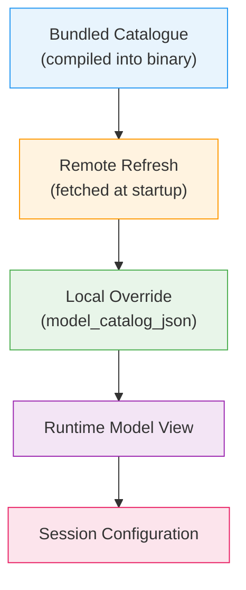
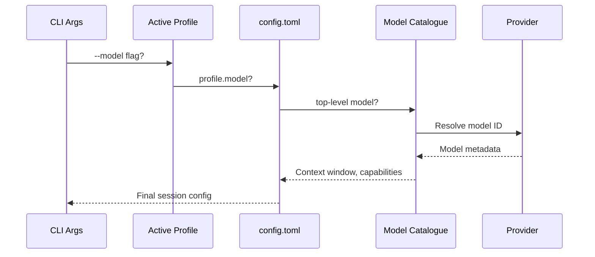

# Codex CLI Model Catalogue Architecture: Providers, Discovery, and Debugging Model Resolution


---

When Codex CLI launches a session, it must resolve which model to use, where to send inference requests, and what capabilities that model supports — context window size, reasoning effort levels, tool-calling support, and more. This resolution happens through the **model catalogue**, a layered system that merges bundled metadata, remote refreshes, custom JSON overrides, and per-provider discovery into a single runtime view. Understanding this architecture matters because misconfiguration here produces some of the most confusing failures in Codex: sessions that silently use the wrong context window, compaction that fires too late, or models that simply refuse to appear in `/model`.

This article dissects the model catalogue from the inside out.

## The Three-Layer Catalogue Stack

Codex resolves model metadata through three layers, each capable of overriding the one below it.



**Layer 1 — Bundled catalogue.** Every Codex release ships with a `models.json` compiled into the binary. This contains model IDs, context window sizes, supported reasoning efforts, provider mappings, and capability flags. The bundled catalogue is the baseline — it guarantees Codex can start even without network access [^1].

**Layer 2 — Remote refresh.** On startup, Codex fetches the latest catalogue from the models endpoint (unless running with `--oss` or when network is unavailable). This refresh can introduce new models, update context window sizes, or change default reasoning efforts without requiring a CLI upgrade [^2]. The `codex debug models --bundled` flag skips this refresh and prints only the compiled-in catalogue, which is invaluable for diagnosing refresh-related discrepancies.

**Layer 3 — Local override.** The `model_catalog_json` configuration key points to a local JSON file loaded at startup. This layer takes precedence over both bundled and remote catalogues. Profile-scoped overrides (`profiles.<name>.model_catalog_json`) allow different teams or workflows to pin specific model metadata [^3].

## Provider Architecture

A model provider defines how Codex connects to a model endpoint. The system ships with four built-in providers whose IDs are reserved and cannot be overridden [^4]:

| Provider | Wire API | Auth Method |
|----------|----------|-------------|
| `openai` | Responses API | OAuth / API key |
| `ollama` | Chat Completions | None (local) |
| `lmstudio` | Chat Completions | None (local) |
| `amazon-bedrock` | Responses API | AWS SigV4 signing |

### Custom Providers

Teams routing through corporate proxies, AI gateways, or alternative endpoints define custom providers in `config.toml`:

```toml
[model_providers.corp-gateway]
name = "Corporate AI Gateway"
base_url = "https://ai-gateway.corp.example.com/v1"
env_key = "CORP_AI_KEY"
wire_api = "responses"
request_max_retries = 3
stream_idle_timeout_ms = 120000
stream_max_retries = 4
```

Then reference it:

```toml
model_provider = "corp-gateway"
model = "gpt-5.4"
```

### Command-Backed Authentication

For environments where API keys rotate or come from credential helpers (e.g., AWS SSO, Vault, `gcloud`), providers support command-backed bearer tokens [^5]:

```toml
[model_providers.vault-openai]
name = "OpenAI via Vault"
base_url = "https://api.openai.com/v1"
wire_api = "responses"

[model_providers.vault-openai.auth]
command = "vault"
args = ["kv", "get", "-field=token", "secret/openai/codex"]
timeout_ms = 5000
refresh_interval_ms = 300000
```

The `auth` block is mutually exclusive with `env_key` and `experimental_bearer_token`. Codex executes the command when a token is first needed, caches the result, and proactively refreshes at the configured interval.

## Provider-Owned Model Discovery

Since v0.125.0, model providers **own model discovery** [^6]. This means each provider can expose its available models and account state to the client. For the Bedrock provider, this surfaces AWS account configuration and region availability directly in the catalogue:

```toml
[model_providers.amazon-bedrock.aws]
profile = "production"
region = "us-east-1"
```

The provider queries available models through the Bedrock API using SigV4 signing and the configured AWS credentials, then merges results into the runtime model view. This eliminates the need to manually register Bedrock model IDs in a local catalogue JSON.

## Diagnosing Model Issues with `codex debug models`

The `codex debug models` subcommand prints the raw model catalogue as JSON after all three layers have merged [^1]. This is the single most useful diagnostic when models behave unexpectedly.

```bash
# Full merged catalogue (bundled + remote + local override)
codex debug models

# Bundled only — skip remote refresh
codex debug models --bundled
```

### Common Diagnostic Workflow

When a model misbehaves — wrong context window, unexpected compaction, missing reasoning support — follow this sequence:

```bash
# 1. Check what Codex actually sees
codex debug models | jq '.[] | select(.id == "gpt-5.5")'

# 2. Compare with bundled baseline
codex debug models --bundled | jq '.[] | select(.id == "gpt-5.5")'

# 3. Check active session config
# Inside TUI, run:
# /status
# /debug-config
```

### The GPT-5.5 Context Window Mismatch

A concrete example of why this matters: in late April 2026, users reported that GPT-5.5 appeared with inconsistent context window values across different Codex installations — 272K in the bundled catalogue, 400K after remote refresh, and 1M when overridden locally [^7]. The mismatch caused several problems:

- **Silent compaction failures.** When `model_auto_compact_token_limit` was derived from the bundled 272K value but the session actually had 400K available, compaction fired too conservatively — wasting context capacity.
- **Late compaction crashes.** Conversely, overriding to 1M when the model only supported 400K meant compaction fired too late, causing turn failures.
- **Misleading `/status` output.** The TUI status line showed one context window size whilst the runtime engine used another.

The fix (tracked in Issue #19409) requires that the official model catalogue, session `model_context_window`, UI/status display, and compaction threshold all agree [^7]. Until then, the defensive approach is to set `model_context_window` explicitly:

```toml
model = "gpt-5.5"
model_context_window = 400000
model_auto_compact_token_limit = 350000
```

## Profile-Scoped Model Routing

Named profiles allow switching entire model configurations with a single flag. This is particularly powerful for multi-model workflows where different tasks need different providers:

```toml
[profiles.fast]
model = "gpt-5.4-mini"
model_reasoning_effort = "low"
model_provider = "openai"

[profiles.deep]
model = "gpt-5.5"
model_reasoning_effort = "high"
model_provider = "openai"

[profiles.local]
model = "qwen3:32b"
model_provider = "ollama"
model_catalog_json = "/home/dev/.codex/catalogs/ollama.json"

[profiles.bedrock]
model = "gpt-5.4"
model_provider = "amazon-bedrock"
```

Switch at launch:

```bash
codex --profile fast "quick lint fix"
codex --profile deep "refactor the authentication module"
codex --profile bedrock "review this PR"
```

Or within a session using `/model` to switch models and the TUI reasoning controls (`Alt+,` to lower, `Alt+.` to raise reasoning effort) [^8].

## The Model Resolution Sequence

When Codex starts a session, model resolution follows this precise order:



1. **CLI flags** (`--model`, `--profile`) take highest precedence
2. **Active profile** settings override top-level config
3. **Top-level `config.toml`** provides defaults
4. **Model catalogue** (three-layer merge) supplies metadata
5. **Provider** validates availability and supplies runtime parameters

If the model ID isn't found in the merged catalogue, Codex falls back to a minimal configuration with conservative defaults — which often means a smaller context window than the model actually supports [^3].

## Practical Recommendations

**Pin `model_context_window` for production workflows.** Do not rely solely on catalogue resolution for critical CI/CD pipelines. Explicit values prevent silent mismatches.

**Use `codex debug models` before filing bugs.** Most "model X doesn't work" reports stem from catalogue resolution issues that are immediately visible in the debug output.

**Prefer `env_key` over `experimental_bearer_token`.** The latter embeds credentials in the config file. The former reads from the environment, keeping secrets out of version control [^4].

**Set `stream_idle_timeout_ms` for high-latency providers.** The default 300-second timeout suits most providers, but corporate proxies or heavily loaded gateways may need longer [^3].

**Test profile switching in non-interactive mode first.** Run `codex exec --profile <name> "echo hello"` to verify the provider resolves correctly before using a profile in long interactive sessions.

## Citations

[^1]: [Command line options — Codex CLI | OpenAI Developers](https://developers.openai.com/codex/cli/reference)
[^2]: [Changelog — Codex | OpenAI Developers](https://developers.openai.com/codex/changelog)
[^3]: [Configuration Reference — Codex | OpenAI Developers](https://developers.openai.com/codex/config-reference)
[^4]: [Advanced Configuration — Codex | OpenAI Developers](https://developers.openai.com/codex/config-advanced)
[^5]: [Sample Configuration — Codex | OpenAI Developers](https://developers.openai.com/codex/config-sample)
[^6]: [Codex Updates by OpenAI — May 2026 — Releasebot](https://releasebot.io/updates/openai/codex)
[^7]: [GPT-5.5 context catalog mismatch makes 400K/1M setup unsafe — GitHub Issue #19409](https://github.com/openai/codex/issues/19409)
[^8]: [Models — Codex | OpenAI Developers](https://developers.openai.com/codex/models)
