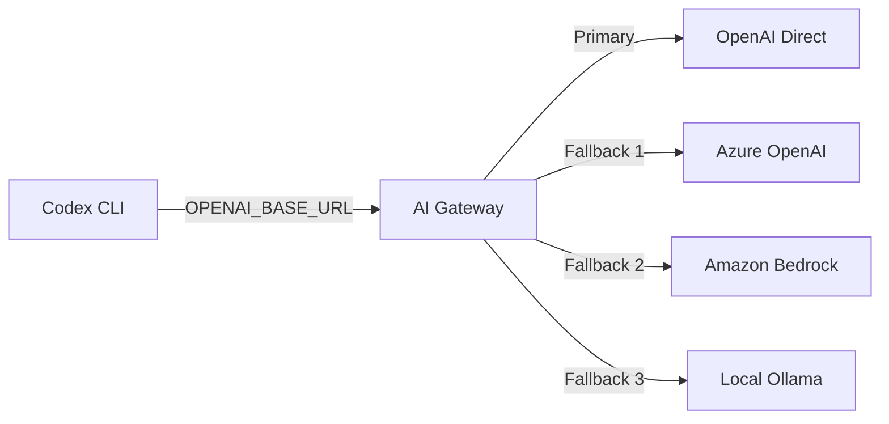
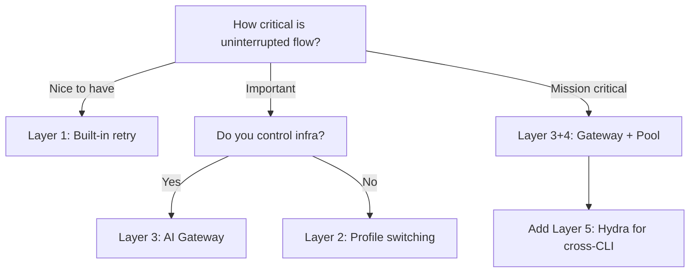

# Codex CLI Multi-Provider Resilience: Failover Chains, Account Pooling, and the Art of Uninterrupted Agent Sessions


---

Rate limits are the silent killer of deep-focus agent sessions. You are forty minutes into a complex refactoring loop, the model has built up a rich understanding of your codebase's dependency graph, and then — HTTP 429. Your session stalls. Prompt cache invalidated. Context cold-started. The cognitive overhead of resuming is real, and for teams running multiple concurrent Codex sessions it compounds fast.

This article maps the full resilience stack available to Codex CLI practitioners in May 2026: from built-in retry mechanics, through custom provider chains in `config.toml`, to community tools that pool accounts and multiplex across entirely different AI coding CLIs.

## The Rate Limit Landscape in May 2026

OpenAI restructured Codex rate limits on 9 April 2026, moving from simple RPM/TPM ceilings to a credit-based system tied to your ChatGPT plan tier[^1]. The practical impact: limits are now *usage-aware* rather than purely request-count-based, meaning a single complex agent loop with heavy tool use can exhaust your allocation faster than dozens of lightweight prompts.

Plan-tier allocations reset on rolling windows, but the exact window length varies by plan and is not publicly documented in precise terms[^2]. What is documented: when you hit the ceiling, you receive an HTTP 429 with `error.type: rate_limit_exceeded` and a `retry-after` header suggesting when to retry[^3].

This means resilience is not optional for professional use — it is a workflow requirement.

## Layer 1: Built-In Retry and Backoff

Codex CLI's Rust runtime (`codex-rs`) handles transient 429 errors automatically. When the API returns `rate_limit_exceeded`, the retry pipeline:

1. Reads the `retry-after` header (if present) to determine minimum wait
2. Applies exponential backoff with jitter
3. Retries up to the configured maximum

You can tune this per-provider in `config.toml`:

```toml
[model_providers.openai]
request_max_retries = 4
stream_max_retries = 10
stream_idle_timeout_ms = 300000
```

The `stream_idle_timeout_ms` setting is particularly important for long-running agent loops: it controls how long the client waits for the next SSE chunk before considering the stream dead[^4]. Setting this too low causes false timeouts during complex reasoning; too high wastes time on genuinely stalled connections.

> **Critical distinction**: `rate_limit_exceeded` triggers retry; `insufficient_quota` does not. The latter means your account has no remaining credits and no amount of retrying will help[^3].

## Layer 2: Custom Provider Chains via config.toml

The most robust built-in resilience mechanism is defining multiple model providers and switching between them using Codex CLI profiles. Each profile can target a different provider, model, and authentication path:

```toml
# Primary: OpenAI direct
[profiles.primary]
model = "gpt-5.5"
model_provider = "openai"
service_tier = "fast"

# Secondary: Azure OpenAI (separate quota pool)
[profiles.azure]
model = "gpt-5.5"
model_provider = "azure-openai"

[model_providers.azure-openai]
name = "Azure OpenAI (UK South)"
base_url = "https://myproject.openai.azure.com/openai"
env_key = "AZURE_OPENAI_API_KEY"
query_params = { api-version = "2025-04-01-preview" }
wire_api = "responses"
request_max_retries = 4

# Tertiary: Amazon Bedrock (entirely separate billing)
[profiles.bedrock]
model = "anthropic.claude-sonnet-4-20250514-v1:0"
model_provider = "amazon-bedrock"

[model_providers.amazon-bedrock.aws]
profile = "codex-prod"
region = "eu-west-2"
```

Switch at launch time with `codex --profile azure` or mid-session with `/model` followed by the desired model[^5]. The key insight: Azure OpenAI and Amazon Bedrock have completely independent rate limit pools from your OpenAI direct account, giving you genuine redundancy rather than just redistributing the same quota.

### Command-Backed Authentication for Enterprise

For teams using credential vaults (HashiCorp Vault, AWS Secrets Manager), command-backed auth eliminates static API keys entirely:

```toml
[model_providers.corp-proxy.auth]
command = "/usr/local/bin/fetch-codex-token"
args = ["--audience", "codex", "--vault-path", "secret/codex/prod"]
timeout_ms = 5000
refresh_interval_ms = 300000
```

Codex calls the command, reads the token from stdout, trims whitespace, and caches it for the specified refresh interval[^6]. This pattern composes naturally with provider failover — each provider entry can have its own auth command pointing to different credential sources.

## Layer 3: AI Gateway Proxies

For teams wanting *automatic* failover without manual profile switching, an AI gateway sits between Codex CLI and the upstream providers:



### LiteLLM Proxy

LiteLLM exposes a unified OpenAI-compatible endpoint to 100+ providers[^7]. Point Codex at it with a single config change:

```toml
openai_base_url = "http://localhost:4000"
```

The proxy handles routing, retry, and failover according to its own `litellm_config.yaml`. The trade-off: LiteLLM adds 2–5 ms latency per request due to its Python runtime, and failover configuration requires manual YAML editing[^8].

### Bifrost Gateway

Bifrost takes a more enterprise-oriented approach: it intercepts Codex CLI's OpenAI-format requests at the network layer, provides weighted load balancing across multiple API keys, and returns a successful response to Codex CLI with no visible interruption when a primary provider returns 429 or 5xx[^9]. Budget controls and per-key spending limits make it attractive for teams managing shared Codex deployments.

### Configuration Pattern

Whichever gateway you choose, the Codex CLI configuration is identical — a custom provider pointing at the gateway's local endpoint:

```toml
model_provider = "gateway"

[model_providers.gateway]
name = "AI Gateway (auto-failover)"
base_url = "http://localhost:4000"
env_key = "GATEWAY_API_KEY"
wire_api = "responses"
```

## Layer 4: Account Pooling and Rotation

When your constraint is aggregate quota across a team rather than single-request rate limits, account pooling becomes the answer.

### CodexUse

CodexUse transforms multiple saved Codex accounts into a single local API endpoint with shared quota, load balancing, and automatic failover[^10]. Key capabilities:

- **Live rate limit monitoring**: see remaining headroom per account before you hit the wall
- **Auto-roll**: configurable warning thresholds trigger automatic profile switching before 429s stall work
- **Telegram remote control**: monitor and switch profiles from a mobile device

The pooling model is particularly useful for consultancies and agencies where different client projects bill against different OpenAI accounts.

### codex-multi-auth

For teams preferring open-source tooling, `codex-multi-auth` provides an OAuth pool with health-aware selection and automatic failover, project-scoped account storage, and routing profiles for local governance[^11].

### The `aisw` Pattern

The `aisw` project takes a cross-tool approach: it manages account switching across Claude Code, Codex CLI, and Gemini CLI simultaneously[^12]. This is valuable when your resilience strategy spans multiple AI coding agents rather than multiple accounts on a single provider.

## Layer 5: The Hydra Pattern — Cross-CLI Multiplexing

The most radical resilience approach abandons provider-level failover entirely and instead wraps multiple AI coding CLIs in a single multiplexer. Hydra, released in May 2026, implements this pattern[^13].

### How It Works

Hydra wraps each CLI in a PTY passthrough that preserves the native TUI experience whilst monitoring terminal output for rate limit patterns:

```yaml
# ~/.config/hydra/config.yaml
providers:
  - name: claude
    command: claude
    patterns: ["rate limit", "quota exceeded", "usage cap"]
  - name: opencode
    command: opencode
    env: { GOOGLE_API_KEY: "..." }
    patterns: ["rate limit", "quota"]
  - name: codex
    command: codex
    patterns: ["rate limit", "insufficient_quota"]
```

When a pattern matches, Hydra:

1. Extracts conversation context (session history, `git diff`, last five commits)
2. Copies it to the clipboard
3. Signals all running Hydra sessions (rate limits are account-wide)
4. Prompts the user to select the next provider

The context transfer is imperfect — you lose the model's internal state and prompt cache — but for many workflows the time saved outweighs the cold-start cost. The free tiers available through OpenCode (Gemini, 1500 requests/day) and Pi (Gemini, 1500 requests/day) mean you can sustain work even after burning through paid allocations[^13].

### Manual Switching

Press `Ctrl+]` inside any Hydra session to trigger a switch directly, without waiting for rate limit detection. This is useful for proactive switching when you know you are approaching your limit.

## Choosing the Right Layer



| Layer | Latency Impact | Automation | Complexity | Cost |
|-------|---------------|------------|------------|------|
| Built-in retry | None | Full | Zero config | Free |
| Profile switching | Manual switch | Manual | Low | Free |
| AI gateway | 2–5 ms | Full | Medium | Self-hosted |
| Account pooling | Negligible | Full | Medium | Free–\$19.50 |
| Cross-CLI (Hydra) | Cold start | Semi-auto | Low | Free |

## Production Recommendations

**Solo practitioners**: Start with Layer 2. Define two or three profiles targeting different providers (OpenAI direct + Azure, or OpenAI + a local model for non-critical work). Switch with `codex --profile <name>` when you hit limits.

**Small teams (2–10 developers)**: Add Layer 3. Run LiteLLM or Bifrost as a shared gateway with weighted routing across team API keys. This centralises rate limit management and gives you a single point for cost observability.

**Enterprise (10+ developers)**: Combine Layers 3 and 4. Deploy a gateway with account pooling behind it, integrate with your credential vault via command-backed auth, and enforce provider policies through `requirements.toml`:

```toml
# requirements.toml (admin-enforced)
[model_providers]
allowed = ["openai", "azure-openai", "amazon-bedrock"]

[features]
apps = false
```

**Heavy individual users**: Layer 5 (Hydra) as a complement to any of the above. When one entire platform is exhausted, seamlessly continue in another CLI tool.

## Monitoring Your Headroom

Whichever resilience layer you adopt, visibility into remaining quota prevents surprise interruptions:

- **`codex update --check`** reports your current version and hints at account status[^14]
- **OpenAI Dashboard**: the usage page shows real-time credit consumption
- **CodexUse**: live per-account headroom display with configurable warning thresholds[^10]
- **OTEL metrics**: configure `otel.metrics_exporter` in `config.toml` to emit per-request token counts to Grafana, SigNoz, or Datadog for trend analysis[^15]

## Limitations and Sharp Edges

- **No built-in multi-provider failover**: Codex CLI does not natively cascade through providers on 429. You must use an external gateway or manual switching[^5].
- **Context loss on provider switch**: switching profiles or CLI tools loses the prompt cache and in-memory conversation state. Use `/compact` before switching to compress context into a portable summary.
- **Wire API compatibility**: not all providers support the `responses` wire API. Amazon Bedrock, for instance, uses its own SigV4 signing and requires the built-in Bedrock provider[^6]. Ensure your gateway translates correctly.
- **Credential isolation**: command-backed auth cannot be combined with `env_key` or `requires_openai_auth` in the same provider entry[^6].

## Citations

[^1]: [Understanding the New Codex Limit System After the April 9 Update](https://community.openai.com/t/understanding-the-new-codex-limit-system-after-the-april-9-update/1378768) — OpenAI Developer Community, April 2026
[^2]: [Codex Rate Limits Discussion Thread](https://community.openai.com/t/codex-rate-limits-discussion-thread/1378553) — OpenAI Developer Community, 2026
[^3]: [Codex CLI Rate Limiting Behaviour: Backoff, Retry, and Quota Exhaustion Patterns](https://codex.danielvaughan.com/2026/04/12/codex-cli-rate-limiting/) — Daniel Vaughan, April 2026
[^4]: [Configuration Reference – Codex](https://developers.openai.com/codex/config-reference) — OpenAI Developer Documentation, 2026
[^5]: [Advanced Configuration – Codex](https://developers.openai.com/codex/config-advanced) — OpenAI Developer Documentation, 2026
[^6]: [Model Providers: Command-Backed Authentication](https://developers.openai.com/codex/config-advanced) — OpenAI Developer Documentation, 2026
[^7]: [OpenAI Codex Integration](https://docs.litellm.ai/docs/tutorials/openai_codex) — LiteLLM Documentation, 2026
[^8]: [Best AI Gateway to Route Codex CLI to Any Model](https://www.getmaxim.ai/articles/best-ai-gateway-to-route-codex-cli-to-any-model/) — Maxim AI, April 2026
[^9]: [Bifrost AI Gateway for Codex CLI: Governance, Cost Control, and Provider Flexibility at Scale](https://www.getmaxim.ai/articles/bifrost-ai-gateway-for-codex-cli-governance-cost-control-and-provider-flexibility-at-scale/) — Maxim AI, 2026
[^10]: [CodexUse: Codex CLI Profile Manager & Account Switcher](https://codexuse.com/) — CodexUse, 2026
[^11]: [codex-multi-auth: Multi-Account OAuth Manager](https://github.com/ndycode/codex-multi-auth) — GitHub, 2026
[^12]: [Project aisw: Switching Between Multiple Accounts in Claude Code, Codex CLI, and Gemini CLI](https://burakdede.com/blog/switch-accounts-claude-code-codex-gemini-cli/) — Burak Dede, 2026
[^13]: [Hydra: Never Stop Coding When Your AI CLI Hits a Rate Limit](https://github.com/saadnvd1/hydra) — GitHub, May 2026
[^14]: [CLI Reference – Codex](https://developers.openai.com/codex/cli/reference) — OpenAI Developer Documentation, 2026
[^15]: [Codex CLI Enterprise Observability](https://developers.openai.com/codex/config-advanced) — OpenAI Developer Documentation, 2026
