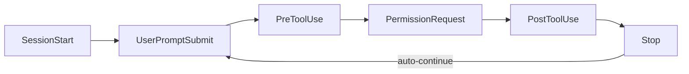

# Codex CLI Plugin Ecosystem: Building, Distributing, and Managing Marketplace Plugins


---

Since v0.117.0 landed on 26 March 2026, Codex CLI has treated plugins as a first-class workflow primitive [^1]. What previously required separate MCP server entries in `config.toml`, loose `SKILL.md` files scattered across directories, and ad-hoc app connector wiring now collapses into a single installable, shareable, versioned package. With over 90 curated plugins shipping in the official directory and a growing community registry [^2][^3], the plugin system has become the primary extension mechanism for Codex. This article walks through the architecture, the authoring workflow, marketplace distribution, and the operational details that matter when you're shipping plugins to a team.

## Plugin anatomy

A plugin is a directory whose only hard requirement is a `.codex-plugin/plugin.json` manifest. Everything else — skills, MCP servers, app connectors, hooks — is optional and lives at the plugin root [^4]:

```
my-plugin/
├── .codex-plugin/
│   └── plugin.json          # required — identity and component pointers
├── skills/
│   └── summarise-pr/
│       └── SKILL.md          # agent instructions
├── .mcp.json                 # MCP server definitions
├── .app.json                 # app connector mappings
├── hooks/
│   └── hooks.json            # lifecycle hooks
└── assets/
    ├── icon.png
    └── screenshot-1.png
```

The manifest governs identity, component discovery, and marketplace presentation. A minimal version needs three fields:

```json
{
  "name": "my-first-plugin",
  "version": "1.0.0",
  "description": "Reusable greeting workflow",
  "skills": "./skills/"
}
```

A production manifest adds publisher metadata, interface presentation, and component pointers [^4]:

```json
{
  "name": "pr-reviewer",
  "version": "0.3.1",
  "description": "Automated PR review with style-guide enforcement.",
  "author": {
    "name": "Platform Team",
    "email": "platform@example.com"
  },
  "repository": "https://github.com/example/pr-reviewer",
  "license": "MIT",
  "keywords": ["code-review", "github"],
  "skills": "./skills/",
  "mcpServers": "./.mcp.json",
  "hooks": "./hooks/hooks.json",
  "interface": {
    "displayName": "PR Reviewer",
    "shortDescription": "Style-guide-aware code review",
    "category": "Development",
    "capabilities": ["Read", "Write"],
    "brandColor": "#10A37F",
    "composerIcon": "./assets/icon.png",
    "defaultPrompt": [
      "Review the current PR against our style guide.",
      "Summarise outstanding review comments."
    ]
  }
}
```

All component paths are relative and must start with `./` [^4].

## Skills: the authoring primitive

Skills are what the agent actually reads. Each skill is a directory under `skills/` containing a `SKILL.md` file with YAML frontmatter [^5]:

```markdown
---
name: summarise-pr
description: Summarise a GitHub PR's changes, highlighting breaking changes and test gaps.
---

When asked to summarise a PR:
1. Fetch the diff using the GitHub MCP server.
2. Group changes by component (API, database, frontend, tests).
3. Flag any breaking interface changes.
4. Note missing test coverage for new code paths.
5. Output a structured summary with severity ratings.
```

Codex uses progressive disclosure: it reads each skill's `name` and `description` at startup and only loads the full `SKILL.md` body when it decides to invoke that skill [^5]. This means your description needs to be precise enough for the model to match intent, whilst the body contains the detailed instructions.

Users invoke plugin skills in two ways: natural language ("summarise this PR") or explicit `@` invocation in the composer [^1].

## Bundling MCP servers

Plugins can ship MCP server configurations in `.mcp.json`, supporting both a direct server map and a wrapped format [^4]:

```json
{
  "mcp_servers": {
    "github": {
      "command": "github-mcp-server",
      "args": ["--stdio"]
    },
    "docs": {
      "command": "docs-mcp",
      "args": ["--stdio", "--index", "./docs"]
    }
  }
}
```

When the plugin is installed, these servers become available in the session. Your existing approval settings still govern tool execution — installing a plugin does not bypass sandbox or permission controls [^1].

## Plugin-bundled hooks

Since v0.128.0, plugins can bundle lifecycle hooks that activate automatically on installation [^6][^7]. Codex supports six hook events that integrate into the agentic loop:



A plugin's `hooks/hooks.json` follows the standard hook schema [^7]:

```json
{
  "hooks": {
    "PostToolUse": [
      {
        "matcher": "apply_patch",
        "hooks": [
          {
            "type": "command",
            "command": "./hooks/lint-check.sh",
            "statusMessage": "Running lint on patched files...",
            "timeout": 60
          }
        ]
      }
    ]
  }
}
```

When multiple hook sources exist (user-level, project-level, plugin-bundled), Codex merges all matching hooks rather than replacing lower-precedence layers [^7]. Hooks require the feature flag in `config.toml`:

```toml
[features]
codex_hooks = true
```

## Marketplace distribution

Codex discovers plugins from four sources, checked in priority order [^4]:

1. **Official Plugin Directory** — the curated set (GitHub, Slack, Notion, Sentry, etc.)
2. **Repo marketplace** — `$REPO_ROOT/.agents/plugins/marketplace.json`
3. **Claude-style marketplace** — `$REPO_ROOT/.claude-plugin/marketplace.json`
4. **Personal marketplace** — `~/.agents/plugins/marketplace.json`

A marketplace file declares available plugins with their sources and installation policies:

```json
{
  "name": "team-plugins",
  "interface": {
    "displayName": "Platform Team Plugins"
  },
  "plugins": [
    {
      "name": "pr-reviewer",
      "source": {
        "source": "git-subdir",
        "url": "https://github.com/example/codex-plugins.git",
        "path": "./plugins/pr-reviewer",
        "ref": "main"
      },
      "policy": {
        "installation": "INSTALLED_BY_DEFAULT",
        "authentication": "ON_INSTALL"
      },
      "category": "Development"
    }
  ]
}
```

Three installation policies control default behaviour [^4]:

- `AVAILABLE` — visible in the marketplace browser, user opts in
- `INSTALLED_BY_DEFAULT` — installed automatically when the marketplace is added
- `NOT_AVAILABLE` — hidden; useful for deprecating plugins without removing the entry

### CLI marketplace commands

```bash
# Add a remote marketplace from a GitHub repo
codex plugin marketplace add owner/repo

# Pin to a specific branch
codex plugin marketplace add owner/repo --ref release/v2

# Add a local marketplace
codex plugin marketplace add ./internal-plugins

# Upgrade all marketplace caches
codex plugin marketplace upgrade

# Remove a marketplace
codex plugin marketplace remove team-plugins
```

Installed plugins are cached at `~/.codex/plugins/cache/$MARKETPLACE/$PLUGIN/$VERSION/`. Codex uses the plugin version as part of the cache key, so a version bump in `plugin.json` forces a reinstall on next sync [^4].

## Managing installed plugins

In the TUI, the `/plugins` command opens the plugin browser with marketplace tabs [^1]. You can toggle plugins on and off without uninstalling:

```toml
# ~/.codex/config.toml
[plugins."pr-reviewer@team-plugins"]
enabled = false
```

Remote uninstall (added in v0.128.0) lets you remove plugins that were installed from git-backed marketplaces without manual cache cleanup [^6].

## The community ecosystem

Beyond the official directory's twelve curated plugins (Box, Cloudflare, Figma, GitHub, Gmail, Google Drive, Hugging Face, Linear, Notion, Sentry, Slack, Vercel) [^3], the community has produced a substantial catalogue. The Awesome Codex Plugins registry lists over 40 community-contributed plugins spanning development tooling (Jenkins, KiCad, Langfuse), workflow automation, and specialist domains [^3].

The HOL Plugin Registry provides automated trust scoring across six factors — installability, maintenance, documentation, security posture, test coverage, and dependency hygiene [^3]. The `codex-plugin-scanner` CLI and its companion GitHub Action enable PR gating on plugin quality before publication:

```bash
npx codex-plugin-scanner validate ./my-plugin
```

## Scaffolding with $plugin-creator

Codex ships a built-in `$plugin-creator` skill that generates the directory structure, manifest, and a local marketplace entry for testing [^4]. Start a session and ask it to create a plugin:

```
> Use $plugin-creator to scaffold a plugin called "db-migrator" that
  bundles a PostgreSQL MCP server and a migration skill.
```

This produces a working plugin directory you can iterate on before publishing.

## Practical patterns

### Team-wide plugin distribution

For organisations, the repo marketplace is the distribution primitive. Commit a `.agents/plugins/marketplace.json` at repository root with `"installation": "INSTALLED_BY_DEFAULT"`, and every developer who clones the repo gets the plugins automatically. This replaces ad-hoc instructions to "add this MCP server to your config" — the plugin bundles the server, the skills, and the hooks in one unit.

### Plugin-as-guardrail

Combine a skill with bundled `PreToolUse` and `PostToolUse` hooks to create enforcement plugins. For example, a "security-policy" plugin could:

- Use a `PreToolUse` hook to block `curl` commands to non-allowlisted domains
- Use a `PostToolUse` hook on `apply_patch` to run a secrets scanner
- Provide a skill that explains the policy when developers ask why a command was blocked

### Version pinning across environments

Pin marketplace refs to tags rather than branches for deterministic builds:

```json
{
  "source": {
    "source": "git-subdir",
    "url": "https://github.com/example/codex-plugins.git",
    "path": "./plugins/pr-reviewer",
    "ref": "v0.3.1"
  }
}
```

This ensures CI and local environments run identical plugin versions.

## Current limitations

- **Official directory publishing** is not yet self-serve — OpenAI states this is "coming soon" [^4]. Distribution currently relies on git repositories and local filesystems.
- **Plugin-bundled hooks** require `codex_hooks = true` in `config.toml`, which remains a feature flag rather than a default [^7].
- **No plugin dependency resolution** — if plugin A requires plugin B, you must ensure both are installed independently.
- **Cache invalidation** is version-keyed only; changes on the same version string will not trigger a re-download until the cache is manually cleared or the marketplace is upgraded [^4].

## Citations

[^1]: OpenAI, "Plugins – Codex", OpenAI Developers, 2026. [https://developers.openai.com/codex/plugins](https://developers.openai.com/codex/plugins)

[^2]: OpenAI, "Codex for (almost) everything", OpenAI Blog, April 2026. [https://openai.com/index/codex-for-almost-everything/](https://openai.com/index/codex-for-almost-everything/)

[^3]: Hashgraph Online, "Awesome Codex Plugins", GitHub, 2026. [https://github.com/hashgraph-online/awesome-codex-plugins](https://github.com/hashgraph-online/awesome-codex-plugins)

[^4]: OpenAI, "Build plugins – Codex", OpenAI Developers, 2026. [https://developers.openai.com/codex/plugins/build](https://developers.openai.com/codex/plugins/build)

[^5]: OpenAI, "Agent Skills – Codex", OpenAI Developers, 2026. [https://developers.openai.com/codex/skills](https://developers.openai.com/codex/skills)

[^6]: OpenAI, "Changelog – Codex", OpenAI Developers, v0.128.0, 30 April 2026. [https://developers.openai.com/codex/changelog](https://developers.openai.com/codex/changelog)

[^7]: OpenAI, "Hooks – Codex", OpenAI Developers, 2026. [https://developers.openai.com/codex/hooks](https://developers.openai.com/codex/hooks)
