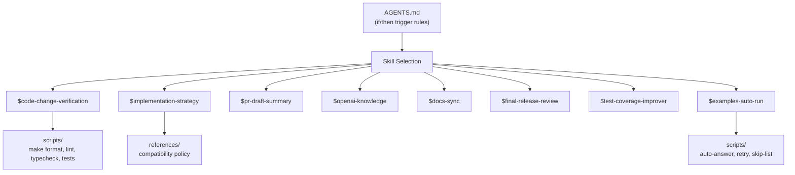
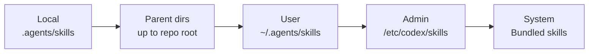
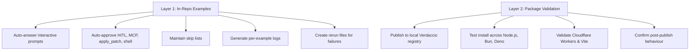

# Codex CLI Skills for OSS Maintenance: Lessons from OpenAI's Own Agents SDK Repositories


---

OpenAI practises what it preaches. In March 2026 the company published a detailed case study showing how Codex CLI skills transformed maintenance of its two flagship open-source Agents SDK repositories — the Python package (`openai-agents-python`) and the TypeScript package (`openai-agents-js`)[^1]. The results speak for themselves: 457 merged pull requests between December 2025 and February 2026, up from 316 in the preceding quarter[^1]. This article unpacks every pattern from that case study, maps each to the official skills documentation[^2], and offers guidance for teams wanting to replicate the approach in their own repositories.

## Why Skills Beat Ad-Hoc Prompts for Maintenance

Maintenance work is repetitive but not trivial. Formatting, linting, type-checking, release review, integration testing and PR description drafting recur on every contribution. Encoding these as ephemeral chat prompts guarantees drift: one contributor forgets the lint step, another uses the wrong verification order, a third skips the compatibility check. Skills solve this by bundling instructions, scripts and references into a versioned directory that Codex discovers automatically[^2].

The critical insight from the OpenAI case study is the **mandatory trigger pattern** — AGENTS.md rules that force skill invocation before certain categories of change are permitted[^1]. This shifts quality enforcement from "remember to run the checks" to "the agent runs the checks by default."

## Anatomy of the Skills Stack

The two repositories share a common architecture.



Each skill follows the standard directory layout[^2]:

```
.agents/skills/
  code-change-verification/
    SKILL.md
    scripts/
    references/
  implementation-strategy/
    SKILL.md
    references/
  ...
```

The `SKILL.md` file is the manifest: YAML front matter with `name` and `description`, followed by Markdown instructions the model reads when the skill is selected[^2].

## The Eight Python-Repo Skills

OpenAI's Python Agents SDK repository ships eight skills[^1]:

| Skill | Purpose | Key Mechanism |
|-------|---------|---------------|
| `code-change-verification` | Runs formatting, linting, type-checking and test validation | `make format && make lint && make typecheck && make tests` |
| `implementation-strategy` | Decides compatibility boundary before runtime edits | Reference docs on API stability policy |
| `docs-sync` | Audits docs against the codebase for gaps and staleness | Codebase diffing against existing docs |
| `examples-auto-run` | Executes examples in automated mode with retries | Auto-answer prompts, skip lists, structured logs |
| `final-release-review` | Compares release candidates against previous tags | Risk assessment, green/yellow/blocked output |
| `openai-knowledge` | Fetches live OpenAI platform docs via MCP | OpenAI Docs MCP server integration |
| `pr-draft-summary` | Generates branch suggestions, PR titles, draft descriptions | Git diff analysis |
| `test-coverage-improver` | Finds coverage gaps and proposes high-impact tests | Coverage reporting and analysis |

## The Three Extra JavaScript-Repo Skills

The TypeScript package adds three skills for npm monorepo concerns[^1]:

| Skill | Purpose |
|-------|---------|
| `changeset-validation` | Validates changeset files and bump levels match package diffs |
| `integration-tests` | Publishes to local Verdaccio registry, validates across Node.js, Bun, Deno, Cloudflare Workers and Vite |
| `pnpm-upgrade` | Coordinates pnpm toolchain and CI pin updates |

The JavaScript verification sequence is more complex than the Python one:

```bash
pnpm i
pnpm build
pnpm -r build-check
pnpm -r -F "@openai/*" dist:check
pnpm lint
pnpm test
```

## AGENTS.md: The Mandatory Trigger Layer

The most powerful pattern from the case study is the **if/then trigger table** inside AGENTS.md. Rather than relying on developers to invoke skills manually, the repository encodes rules that make invocation non-optional[^1]:

```markdown
## Mandatory skill usage

- Before editing runtime or API changes affecting compatibility:
  call `$implementation-strategy`
- If a change affects SDK code, tests, examples, or build behavior:
  call `$code-change-verification`
- If the work touches OpenAI API or platform integrations:
  call `$openai-knowledge`
- If substantial code work is ready for review:
  call `$pr-draft-summary`
```

The JavaScript repo extends this with:

```markdown
- If a package change affects release metadata:
  call `$changeset-validation`
```

The case study explicitly advises keeping "release-critical compatibility rules in the same place as the skill triggers"[^1], so AGENTS.md becomes the single source of truth for what must happen before a change lands.

### Skill Discovery Hierarchy

Codex scans for skills in a well-defined precedence order[^2]:



For open-source repositories, the `LOCAL` scope matters most — skills travel with the repository, so every contributor and every CI runner gets the same workflow.

## The Script-Versus-Model Division

A recurring theme in the case study is the clear boundary between what scripts do and what the model does[^1]:

**Scripts handle deterministic operations:**

- Running verification commands in fixed order
- Managing example execution with auto-answer and retry
- Collecting structured logs
- Fetching release tags
- Exposing helper commands (`start`, `stop`, `status`, `logs`, `tail`, `collect`, `rerun`)

**The model handles judgement-intensive operations:**

- Interpreting diff context for compatibility impact
- Comparing release candidates against prior tags
- Generating human-readable PR descriptions
- Assessing test coverage priorities
- Deciding whether a release is safe, cautious or blocked

This division is worth studying. Teams that push too much judgement into shell scripts end up with brittle, over-engineered automation. Teams that let the model run verification commands end up with non-deterministic, unreproducible results. The sweet spot is scripts for the mechanical parts, model for the interpretive parts.

## Writing Effective Skill Descriptions

The case study includes a worked example of description quality[^1]:

**Weak:**

> Run the mandatory verification stack in the OpenAI Agents JS monorepo.

**Strong:**

> Run the mandatory verification stack when changes affect runtime code, tests, or build/test behavior in the OpenAI Agents JS monorepo.

The difference matters because the `description` field drives implicit skill selection[^2]. If the description omits trigger conditions, Codex cannot match the skill to the right context. The official documentation recommends front-loading "the key use case and trigger words so Codex can still match the skill if descriptions are shortened"[^2] — relevant because Codex progressively truncates descriptions when many skills compete for the initial 2% context budget[^2].

## Integration Testing: The Verdaccio Pattern

The JavaScript integration-tests skill deserves special attention. It implements a two-layer testing strategy[^1]:



Layer 1 catches source-level issues. Layer 2 catches packaging issues — missing exports, incorrect type declarations, bundler incompatibilities — that only surface after `npm pack` and install. This pattern is broadly applicable to any library that ships as a package.

## Release Review: Evidence-Based Decisions

The `final-release-review` skill produces structured output for release readiness[^1]. From PR #2480, the output includes:

1. **Overall release call** — green, yellow, or blocked
2. **Scope summary** — file counts and change categories
3. **Risk assessment** — specific risks with evidence from diffs
4. **Actionable follow-up** — concrete next steps

The strategy is deliberately conservative: "start from 'safe to release' and switch to blocked only when diff shows concrete evidence of problems"[^1]. This bias towards releasing unless proven otherwise keeps velocity high whilst surfacing genuine blockers.

## GitHub Actions: Closing the Automation Loop

Skills become fully autonomous when wired into GitHub Actions via the Codex GitHub Action[^3]. The case study references this integration for CI-triggered workflows. Key security considerations for running skills in CI[^1][^3]:

- Limit who can start skill-invoking workflows (trusted events or explicit approvals)
- Sanitise inputs from PRs, commits, issues and comments
- Protect API keys with `drop-sudo` or unprivileged users
- Run Codex as the final job step to minimise the blast radius

## Where Human Review Remains Essential

The case study is refreshingly honest about what skills cannot replace[^1]:

- **API or architecture changes** where multiple reasonable designs exist
- **Behaviour modifications** affecting product expectations or backwards-compatibility promises
- **Naming, migration and release-communication decisions** requiring judgement
- **Cross-team alignment** where context exceeds what a model can hold

The throughput improvement — 44.6% more merged PRs per quarter — comes from shifting verification drudgery to skills whilst preserving high-context human review for decisions that actually require it[^1].

## Replicating This in Your Own Repository

### Step 1: Audit Recurring Workflows

List every task that triggers on most PRs. Common candidates: linting, testing, changelog updates, documentation checks, PR description generation.

### Step 2: Create the Skills Directory

```bash
mkdir -p .agents/skills/{verification,release-review,pr-summary}
```

### Step 3: Write Focused SKILL.md Files

```markdown
---
name: verification
description: >
  Run the mandatory verification stack when changes affect
  runtime code, tests, or build/test behaviour.
---

## Steps

1. Run `make lint` and report any failures.
2. Run `make typecheck` and report any failures.
3. Run `make test` and report results.
4. If all pass, confirm verification complete.
5. If any fail, summarise failures and suggest fixes.
```

### Step 4: Wire Triggers into AGENTS.md

```markdown
## Mandatory skill usage

- If a change affects source code, tests, or build behaviour:
  call `$verification`
- When preparing a PR for review:
  call `$pr-summary`
```

### Step 5: Test With `$skill-creator`

Use the built-in `$skill-creator` skill to scaffold and iterate on skill definitions[^2]. Test trigger phrases against the description to confirm correct auto-selection.

## Lessons for the Broader Ecosystem

The OpenAI Agents SDK case study demonstrates a maturity model for skills adoption:

1. **Ad-hoc prompts** — every contributor writes their own verification instructions
2. **Shared AGENTS.md** — verification steps are documented but not enforced
3. **Skills** — verification is packaged, versioned and discoverable
4. **Mandatory triggers** — AGENTS.md rules make skill invocation non-optional
5. **CI integration** — GitHub Actions run skills autonomously on every PR

Most teams are at stage 1 or 2. The case study shows the payoff of reaching stage 4 and 5: not just faster PRs, but more consistent quality across a growing contributor base.

## Citations

[^1]: OpenAI (2026). "Using skills to accelerate OSS maintenance." *OpenAI Developers Blog*. [https://developers.openai.com/blog/skills-agents-sdk](https://developers.openai.com/blog/skills-agents-sdk)

[^2]: OpenAI (2026). "Agent Skills — Codex." *OpenAI Developers*. [https://developers.openai.com/codex/skills](https://developers.openai.com/codex/skills)

[^3]: OpenAI (2026). "GitHub Action — Codex." *OpenAI Developers*. [https://developers.openai.com/codex/github-action](https://developers.openai.com/codex/github-action)
