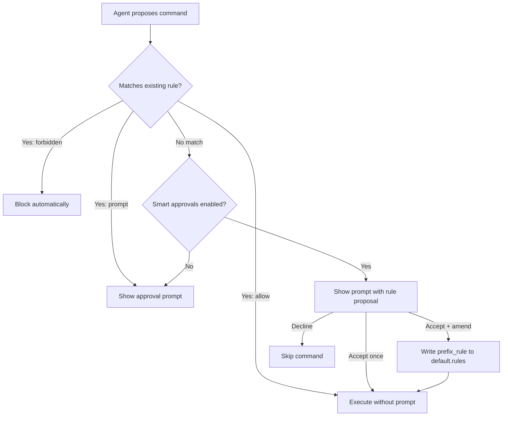
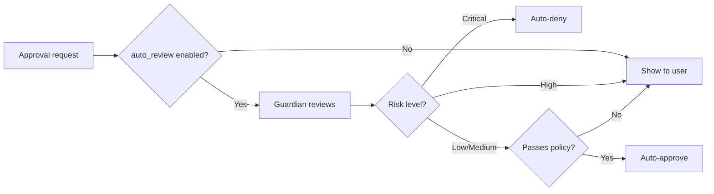
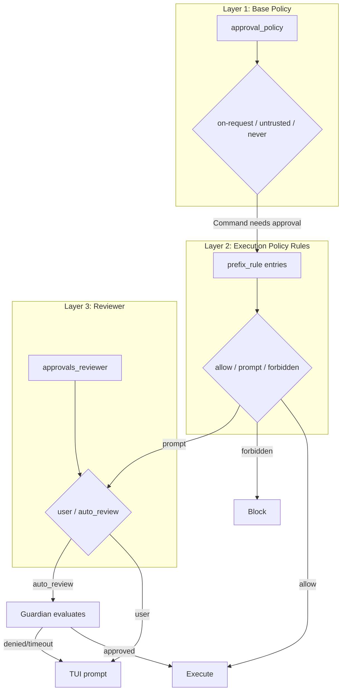

# Codex CLI Smart Approvals: How Adaptive Command Policies and Prefix Rules Eliminate Approval Fatigue


---

Every developer who has used Codex CLI in `on-request` mode knows the rhythm: approve `git status`, approve `git diff`, approve `npm test`, approve `git status` again. The agent works through a task, and you spend half your time pressing "y". The smart approvals system, enabled by default since v0.120 and refined through v0.128, changes this dynamic fundamentally. Instead of treating every command as a fresh trust decision, Codex CLI learns from your approval patterns, proposes execution policy rules, and — when configured — delegates routine approval decisions to an automated reviewer agent[^1][^2].

This article explains how the three layers of the approval system interact: the base `approval_policy`, the Starlark-based execution policy rules, and the guardian auto-reviewer. It covers the TUI flow for accepting and amending rules, practical configuration patterns for solo developers and teams, and the enterprise governance controls that let administrators enforce approval boundaries without breaking developer flow.

## The Approval Problem

Codex CLI's two-axis security model combines a **sandbox** (what the agent *can* do technically) with an **approval policy** (when the agent must *ask* before acting)[^3]. The sandbox restricts filesystem and network access at the OS level. The approval policy is a workflow control — it determines whether Codex pauses for human confirmation before executing a shell command, writing outside the workspace, or making a network request.

The default pairing — `workspace-write` sandbox with `on-request` approval — is sensible for interactive work. File edits inside the project apply automatically; commands and network operations prompt for consent. The problem is granularity. `on-request` treats `git log --oneline` identically to `rm -rf /`. Every shell invocation triggers a pause.

The blunt alternative, `approval_policy = "never"`, removes all prompts but also removes all guardrails. For automation in CI this is appropriate. For interactive development, it trades one problem (fatigue) for another (unreviewed mutations)[^4].

Smart approvals introduce the missing middle ground.

## How Smart Approvals Work

Smart approvals are a feature-flagged capability controlled by the `smart_approvals` feature flag[^5]. When enabled — which is the default since v0.120 — the TUI approval prompt gains an additional option beyond the traditional "accept" and "decline": **accept with rule amendment**.

When Codex CLI proposes an escalation (a command that the current policy requires approval for), the smart approvals engine analyses the command's prefix and offers to create a `prefix_rule()` entry in your execution policy. If you accept the amendment, Codex writes the rule to `~/.codex/rules/default.rules`, and future invocations of that command pattern skip the approval prompt entirely[^6].



The key distinction is that smart approvals do not automatically learn. They *propose*, and you decide. Every rule amendment is an explicit human decision, reviewed in the TUI before it takes effect[^1].

## The Execution Policy Rules System

Execution policy rules are the persistence layer behind smart approvals. They live in `.rules` files under `rules/` directories adjacent to active configuration layers[^6]:

- **User layer**: `~/.codex/rules/default.rules`
- **Project layer**: `<repo>/.codex/rules/custom.rules`
- **Enterprise layer**: `/etc/codex/requirements.toml` (or via MDM/cloud-managed config)

### The `prefix_rule()` Function

Rules files use **Starlark**, a Python-like language originally developed for Bazel that is designed for safe, deterministic execution without filesystem side effects[^7]. The core construct is `prefix_rule()`:

```toml
# ~/.codex/rules/default.rules

# Allow all read-only git commands
prefix_rule(
    pattern = ["git", ["status", "diff", "log", "branch", "show", "remote"]],
    decision = "allow",
    justification = "Read-only Git operations are safe in any context",
    match = ["git status", "git diff HEAD~3", "git log --oneline -20"],
    not_match = ["git push", "git reset --hard"]
)

# Require approval for destructive git operations
prefix_rule(
    pattern = ["git", ["push", "reset", "rebase", "force-push"]],
    decision = "prompt",
    justification = "Destructive Git operations need human review"
)

# Block rm -rf unconditionally
prefix_rule(
    pattern = ["rm", "-rf"],
    decision = "forbidden",
    justification = "Recursive force-delete is never appropriate in agent context"
)
```

The `pattern` parameter uses ordered prefix matching. Each element is either a literal string or a list of alternatives at that argument position. The `decision` parameter accepts three values[^6]:

| Decision | Behaviour |
|----------|-----------|
| `allow` | Execute without prompting (default) |
| `prompt` | Request user confirmation every time |
| `forbidden` | Block automatically — the agent cannot override |

When multiple rules match the same command, Codex applies the **most restrictive** decision: `forbidden` > `prompt` > `allow`[^6].

### Built-In Test Assertions

The `match` and `not_match` parameters are not documentation — they are **compile-time assertions**. Codex evaluates them when loading the rules file. If a `match` example does not match the rule's pattern, or a `not_match` example does match, the rules file fails to load and Codex reports the error at startup[^8]:

```bash
# Verify rules without starting a session
codex execpolicy check --pretty \
    --rules ~/.codex/rules/default.rules \
    -- git status
```

This returns JSON showing the matching rule, the matched prefix tokens, and the effective decision. For teams, this command belongs in CI — lint your rules files the same way you lint your code[^9].

### Shell Splitting and Conservative Blocking

Codex's rule engine understands shell pipelines. A command like `git add . && npm test` is split at safe operators (`&&`, `||`, `;`, `|`), and each component is evaluated independently against the rules[^6]. However, commands containing advanced shell features — variable expansion, redirection, control flow, or wildcards — are treated as **single opaque invocations** and matched against the full command string. This conservative approach prevents dangerous commands from hiding behind shell complexity[^7].

## The Guardian Auto-Reviewer

For teams that want to reduce approval prompts further without writing rules for every command pattern, Codex offers the **guardian auto-reviewer**. This is a separate model call — a reviewer agent that evaluates approval requests against a risk framework before they reach the human[^2][^10].

Enable it with:

```toml
# ~/.codex/config.toml
approval_policy = "on-request"
approvals_reviewer = "auto_review"
```

When configured, eligible approval requests pass through the guardian before appearing in the TUI. The reviewer produces a structured assessment with a risk level (low, medium, high, critical) and a rationale. Critical-risk actions are always denied. High-risk actions require explicit user authorisation. Low-risk actions may be auto-approved[^3][^10].

The reviewer checks for:

- **Data exfiltration** — commands that pipe sensitive files to external endpoints
- **Credential probing** — attempts to read `.env`, SSH keys, or cloud credential stores
- **Persistent security weakening** — modifications to firewall rules, SSH configs, or permission models
- **Destructive operations** — `rm -rf`, `DROP TABLE`, or `git reset --hard` on protected branches

Timeouts, parse failures, and review errors **fail closed** — if the reviewer cannot reach a decision, the request escalates to the human[^3].



### Cost Implications

The guardian adds extra model calls to every approval event. For interactive sessions with frequent command execution, this can add measurable token overhead. The cost is justified when:

1. The developer would otherwise switch to `approval_policy = "never"` to avoid fatigue
2. The team needs audit trails for every approval decision
3. Enterprise policy requires a second reviewer for all agent-initiated commands

For cost-sensitive workflows, combine specific `prefix_rule()` entries for known-safe commands with `auto_review` as a fallback for everything else. The rules fire first, and only commands that hit `prompt` reach the guardian[^11].

## Granular Approval Policies

Since v0.126, the `approval_policy` parameter supports a granular mode that gives fine-grained control over which categories of approval prompt are interactive versus auto-rejected[^3]:

```toml
approval_policy = { granular = {
    sandbox_approval = true,        # Sandbox escalation prompts
    rules = true,                   # Execpolicy 'prompt' rules
    mcp_elicitations = true,        # MCP tool side-effect prompts
    request_permissions = false,    # Auto-reject permission requests
    skill_approval = false          # Auto-reject skill scripts
}}
```

This allows teams to keep security-critical categories interactive while silencing noise from lower-risk categories. Setting `rules = true` ensures that execution policy `prompt` decisions still surface to the user (or to the guardian), whilst `skill_approval = false` auto-rejects skill script approval requests that would otherwise interrupt flow[^3].

## Practical Configuration Patterns

### Solo Developer: Progressive Trust

Start with the default `on-request` policy and let smart approvals propose rules as you work. After a week, inspect `~/.codex/rules/default.rules` — it will contain the rules Codex proposed and you accepted. Review them, tighten any that are too broad, and commit the file to your dotfiles repository:

```bash
# Review your accumulated rules
codex execpolicy check --pretty \
    --rules ~/.codex/rules/default.rules \
    -- npm run build

# Test against edge cases
codex execpolicy check --pretty \
    --rules ~/.codex/rules/default.rules \
    -- npm run deploy:production
```

### Team: Shared Project Rules

Commit a curated `.codex/rules/team.rules` to the repository. Project-local rules load only when the project `.codex/` layer is trusted[^6]:

```toml
# .codex/rules/team.rules

# Our standard dev workflow
prefix_rule(
    pattern = ["npm", ["test", "run", "ci"]],
    decision = "allow",
    justification = "Standard dev scripts are safe"
)

prefix_rule(
    pattern = ["docker", ["build", "compose"]],
    decision = "allow",
    justification = "Containerised builds are isolated"
)

# Never deploy from agent context
prefix_rule(
    pattern = ["npm", "run", ["deploy", "publish"]],
    decision = "forbidden",
    justification = "Deployments require human-initiated CI"
)
```

### Enterprise: Enforced Policy via requirements.toml

Administrators can enforce restrictive rules via `requirements.toml` that users cannot override. Requirements rules can only `prompt` or `forbidden` — never `allow` — ensuring the admin layer can only tighten policy, never loosen it[^12][^13]:

```toml
# /etc/codex/requirements.toml

# Force approval for all network-touching commands
[[rules]]
pattern = ["curl"]
decision = "prompt"
justification = "All HTTP requests require approval per security policy"

[[rules]]
pattern = ["wget"]
decision = "forbidden"
justification = "wget is not permitted in agent context"
```

The enforcement precedence follows: cloud-managed requirements > MDM requirements > system requirements.toml > project rules > user rules[^12].

## Debugging Approval Behaviour

When a command is unexpectedly blocked or approved, the `codex execpolicy check` command is the diagnostic tool:

```bash
# Check with all active rule layers
codex execpolicy check --pretty \
    --rules ~/.codex/rules/default.rules \
    --rules .codex/rules/team.rules \
    -- docker run --rm myimage

# Output shows:
# - Which rules matched
# - The effective decision (most restrictive wins)
# - The resolved program path
```

For host-executable resolution (where `/usr/bin/git` falls back to basename `git`), add `--resolve-host-executables`:

```bash
codex execpolicy check --pretty \
    --rules ~/.codex/rules/default.rules \
    --resolve-host-executables \
    -- /usr/local/bin/node script.js
```

Common debugging scenarios:

1. **Rule not matching**: Check that the pattern uses the correct argument position. `["npm", "test"]` matches `npm test` but not `npm run test`.
2. **Unexpected block**: Multiple rules may match. The `forbidden` decision from one rule overrides `allow` from another.
3. **Rules not loading**: Starlark syntax errors or failed `match`/`not_match` assertions prevent the entire file from loading. Check `codex` startup output for error messages[^8].

## The Full Approval Stack

Understanding how all three layers interact is critical for getting the right balance between security and flow:



Layer 1 determines whether a command even enters the approval flow. Layer 2 provides command-specific overrides. Layer 3 decides who makes the final call when Layer 2 says `prompt`[^1][^3].

## What Is Still Experimental

The rules system is marked as experimental and may change[^6]. Known limitations as of v0.128:

- **No wildcard patterns**: You cannot write `prefix_rule(pattern = ["git", "*"])` to match any git subcommand. You must enumerate alternatives explicitly ⚠️
- **No regular expressions**: Pattern elements are literal strings only ⚠️
- **`general_rule()` not yet shipped**: GitHub issue #15214 tracks a more expressive rule type that would support arbitrary predicates. As of May 2026, this remains under development[^14]
- **Session-scoped accept**: Accepting a command for the current session (without writing a rule) does not persist across sessions

## Recommendations

1. **Start with smart approvals on** (the default). Let Codex propose rules and accept them when the prefix is safe.
2. **Review `default.rules` weekly**. Trim rules that are too broad. Add `not_match` assertions for edge cases.
3. **Commit team rules to the repo**. Use `.codex/rules/team.rules` for project-specific allowlists.
4. **Use `codex execpolicy check` in CI**. Validate that your rules produce the expected decisions for a known set of commands.
5. **Enable `auto_review` for teams with compliance requirements**. The guardian adds cost but provides audit trails and risk-based escalation.
6. **Never use `approval_policy = "never"` in interactive sessions**. Use rules and auto-review to reduce fatigue instead.

## Citations

[^1]: [Rules — Codex | OpenAI Developers](https://developers.openai.com/codex/rules)
[^2]: [Add Smart Approvals guardian review — openai/codex PR #13860](https://github.com/openai/codex/pull/13860)
[^3]: [Agent approvals & security — Codex | OpenAI Developers](https://developers.openai.com/codex/agent-approvals-security)
[^4]: [Codex CLI: Disable Approval with --ask-for-approval never — SmartScope](https://smartscope.blog/en/generative-ai/chatgpt/codex-cli-approval-modes-no-approval/)
[^5]: [Codex CLI Feature Flags and TUI Tuning — codex.danielvaughan.com](https://codex.danielvaughan.com/2026/03/28/codex-cli-feature-flags-tui-tuning/)
[^6]: [Rules — Codex | OpenAI Developers](https://developers.openai.com/codex/rules)
[^7]: [codex/codex-rs/execpolicy/README.md — openai/codex on GitHub](https://github.com/openai/codex/blob/main/codex-rs/execpolicy/README.md)
[^8]: [Understanding Codex Execution Policy Rules — Zenn](https://zenn.dev/yorifuji/articles/3d44ca14ad6b3e?locale=en)
[^9]: [codex/docs/execpolicy.md — openai/codex on GitHub](https://github.com/openai/codex/blob/main/docs/execpolicy.md)
[^10]: [Configuration Reference — Codex | OpenAI Developers](https://developers.openai.com/codex/config-reference)
[^11]: [Pricing — Codex | OpenAI Developers](https://developers.openai.com/codex/pricing)
[^12]: [Managed configuration — Codex | OpenAI Developers](https://developers.openai.com/codex/enterprise/managed-configuration)
[^13]: [Admin Setup — Codex | OpenAI Developers](https://developers.openai.com/codex/enterprise/admin-setup)
[^14]: [Allow user to create rules with improved Starlark support — Issue #15214 — openai/codex](https://github.com/openai/codex/issues/15214)
