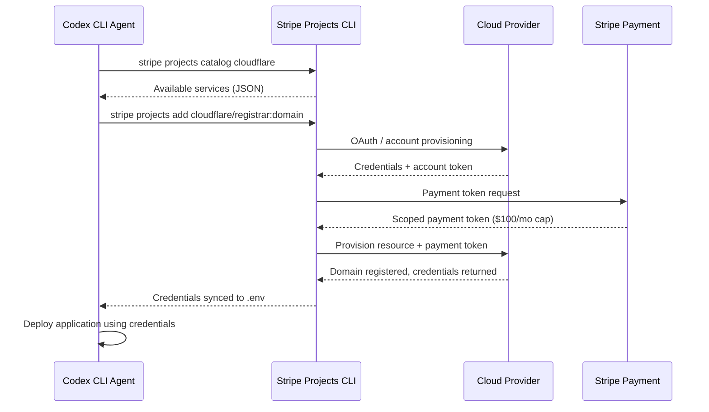
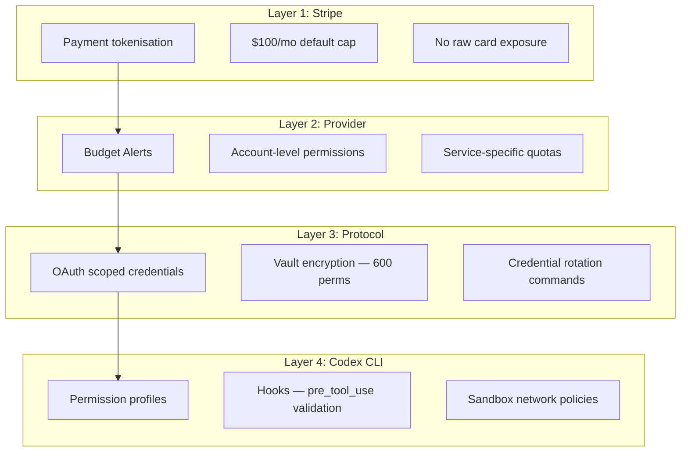

# Codex CLI and Stripe Projects: Autonomous Agent Provisioning from Code to Production


---

Coding agents have been writing production-quality code for over a year. They can generate, test, refactor, and review — yet the final step has stubbornly remained human territory: provisioning infrastructure, registering domains, and deploying to production. Stripe Projects, launched in open beta alongside Cloudflare's agent provisioning protocol, removes that bottleneck entirely [^1][^2]. An AI agent can now create a cloud account, purchase a domain, start a paid subscription, and deploy a running application — all without a human touching a dashboard.

For Codex CLI practitioners, this represents the completion of an end-to-end autonomous pipeline. This article covers how the protocol works, how to connect it to Codex CLI workflows, and the safety architecture that prevents a coding agent from accidentally buying fifty domains at machine speed.

## The Last Mile Problem

Codex CLI already handles the hard parts of software delivery. It generates code in sandboxed environments, runs test suites, applies patches, and even orchestrates multi-agent teams through subagents and MCP servers [^3]. But when the code is ready, someone still has to log into Cloudflare, create an account, configure DNS, and hit "Deploy." That handoff — from agent output to live infrastructure — is where autonomous pipelines break down.

Stripe Projects eliminates the handoff by exposing cloud provisioning as a set of CLI commands that agents can invoke with the same determinism as `git push` [^2].

## How Stripe Projects Works

The protocol rests on three pillars: discovery, authorisation, and payment [^1].



### Discovery

Agents query the Stripe Projects catalogue to determine which services are available and what they cost:

```bash
stripe projects catalog cloudflare
```

This returns a JSON manifest of available services — hosting, domain registration, Workers deployment — without requiring the agent to know the provider's API surface in advance [^2]. The catalogue currently spans 31 providers including Cloudflare, Vercel, Neon, Supabase, and Railway [^2].

### Authorisation

When an agent provisions a service, Stripe attests to the user's identity. For new users, Cloudflare automatically creates an account and returns API credentials. For existing users, a standard OAuth flow grants scoped access [^1]. The critical design choice: raw credentials are encrypted in a local vault file with `600` permissions, never exposed in conversation context [^2].

### Payment

Stripe tokenises the user's payment method into a Shared Payment Token. The agent never sees card numbers. The provider charges against this token, with a default spending cap of \$100 USD per month per provider [^1]. Budget Alerts on the Cloudflare side provide a second layer of financial governance [^1].

## Connecting Codex CLI to Stripe Projects

The integration works through Codex CLI's existing tool-calling capabilities. The Stripe Projects CLI provides flags specifically designed for non-interactive agent use [^2]:

| Flag | Purpose |
|------|---------|
| `--json` | Structured output for agent parsing |
| `--no-interactive` | Fails on missing input rather than prompting |
| `--auto-confirm` | Accepts confirmation dialogues automatically |
| `--accept-tos` | Auto-accepts provider terms of service |
| `--quiet` | Suppresses non-essential output |

### Practical Setup

Before handing control to an agent, complete the one-time human setup:

```bash
# Authenticate with Stripe
stripe login

# Link your Cloudflare account (triggers OAuth in browser)
stripe projects link cloudflare

# Add a payment method (one-time)
stripe projects billing add
```

This avoids browser pop-ups during agent sessions — a critical prerequisite since Codex CLI operates in a terminal sandbox without GUI access [^2].

### The Autonomous Deployment Workflow

With the prerequisites in place, a Codex CLI session can handle the entire lifecycle:

```
You: Build a landing page for my new SaaS product, register the domain
     example-saas.dev, and deploy it to Cloudflare Workers.

Codex: I'll break this into phases:
  1. Scaffold the landing page
  2. Provision infrastructure via Stripe Projects
  3. Deploy to Cloudflare Workers

  Running: stripe projects init example-saas --no-interactive --json
  Running: stripe projects add cloudflare/registrar:domain --auto-confirm
  Running: stripe projects add cloudflare/workers:site --auto-confirm
  Running: stripe projects env --pull
  [Building landing page...]
  Running: wrangler deploy --env production
```

The agent invokes `stripe projects add` to provision resources, pulls credentials into `.env`, and deploys using the returned API tokens — all within a single session [^2].

### MCP Integration

For teams already using Cloudflare's Code Mode MCP server with Codex CLI, Stripe Projects credentials integrate naturally. The `stripe projects llm-context` command generates a combined context file that includes project configuration and provider-supplied documentation, which can be fed directly into an AGENTS.md or skill definition [^2]:

```bash
stripe projects llm-context > .codex/cloudflare-context.md
```

This gives the agent awareness of which services are provisioned, what credentials are available, and how to interact with each provider's API.

## Safety Architecture

Autonomous provisioning demands rigorous safety controls. The protocol provides three layers; Codex CLI adds a fourth.



### Codex CLI Permission Profiles

Never run a provisioning workflow under `full-auto`. Instead, use a permission profile that requires approval for shell commands matching provisioning patterns [^3]:

```toml
# .codex/config.toml
[permissions]
profile = "custom"

[permissions.custom]
allow_commands = [
    "wrangler *",
    "npm *",
    "node *",
]
require_approval = [
    "stripe projects add *",
    "stripe projects upgrade *",
    "stripe projects billing *",
]
deny_commands = [
    "stripe projects remove *",
]
```

This configuration lets Codex deploy freely but gates any command that provisions or upgrades paid resources behind human approval [^3].

### Hooks for Spend Validation

Codex CLI hooks can intercept tool calls before execution and validate them against spend policies [^3]:

```toml
[hooks.pre_tool_use.shell]
command = "python3 .codex/hooks/validate_spend.py"
description = "Validate provisioning commands against budget policy"
```

A validation hook might check the current month's spending against a team budget, reject commands that provision premium tiers, or require a second approval for any command involving `registrar:domain` [^4].

### The Three Failure Modes

Security researchers have identified three categories of provisioning failure that Codex CLI teams should guard against [^4]:

1. **Misidentified targets** — the agent registers the wrong domain or deploys to production instead of staging. Mitigate with separate Stripe Projects per environment (`my-app-staging`, `my-app-production`) and AGENTS.md instructions that explicitly name the target project [^2].

2. **Retry loops** — flaky provider APIs trigger repeated provisioning attempts, burning through budget caps. Mitigate with `max_turns` limits on the Codex runner and idempotency checks in hooks [^4].

3. **Scope creep** — the agent provisions services beyond the task scope. Mitigate with `deny_commands` in the permission profile and explicit allowlists in AGENTS.md [^3].

## What This Changes

The Cloudflare/Stripe protocol signals a broader industry shift. Infrastructure providers are beginning to treat agents as first-class consumers rather than humans operating through CLIs [^5]. Cloudflare's framing is explicit: agents are a new kind of user, and the platform's job is to make their path from zero to deployed as frictionless as a human's — while maintaining auditable safety rails [^1].

For Codex CLI users, the practical implication is straightforward: the tools already exist to build an autonomous pipeline from `git init` to live production. The constraint is no longer capability but governance — ensuring that agents operate within defined budgets, scoped permissions, and approval gates.

The teams that get this right will ship faster than any human-only workflow. The teams that skip the safety architecture will find out, at machine speed, exactly how much damage an unconstrained agent can do with a credit card.

## Summary

Stripe Projects gives Codex CLI agents the final piece of the autonomous deployment puzzle: provisioned infrastructure with built-in payment rails and spending caps. The protocol's three-pillar design (discovery, authorisation, payment) maps cleanly onto Codex CLI's existing permission profiles, hooks, and MCP integrations. Start with the human-first setup (Stripe login, provider linking, billing), then let agents handle the rest — with explicit approval gates on anything that costs money.

---

## Citations

[^1]: Cloudflare, "Agents can now create Cloudflare accounts, buy domains, and deploy," May 2026. [https://blog.cloudflare.com/agents-stripe-projects/](https://blog.cloudflare.com/agents-stripe-projects/)

[^2]: Stripe, "Stripe Projects CLI," May 2026. [https://docs.stripe.com/projects](https://docs.stripe.com/projects)

[^3]: OpenAI Developers, "Best practices — Codex," May 2026. [https://developers.openai.com/codex/learn/best-practices](https://developers.openai.com/codex/learn/best-practices)

[^4]: Pat Skinner, "Cloudflare agents can now buy domains. The case for runtime spend rails just got concrete," DEV Community, May 2026. [https://dev.to/pat9000/cloudflare-agents-can-now-buy-domains-the-case-for-runtime-spend-rails-just-got-concrete-539f](https://dev.to/pat9000/cloudflare-agents-can-now-buy-domains-the-case-for-runtime-spend-rails-just-got-concrete-539f)

[^5]: InfoWorld, "Are we ready to give AI agents the keys to the cloud? Cloudflare thinks so," May 2026. [https://www.infoworld.com/article/4165857/are-we-ready-to-give-ai-agents-the-keys-to-the-cloud-cloudflare-thinks-so.html](https://www.infoworld.com/article/4165857/are-we-ready-to-give-ai-agents-the-keys-to-the-cloud-cloudflare-thinks-so.html)
