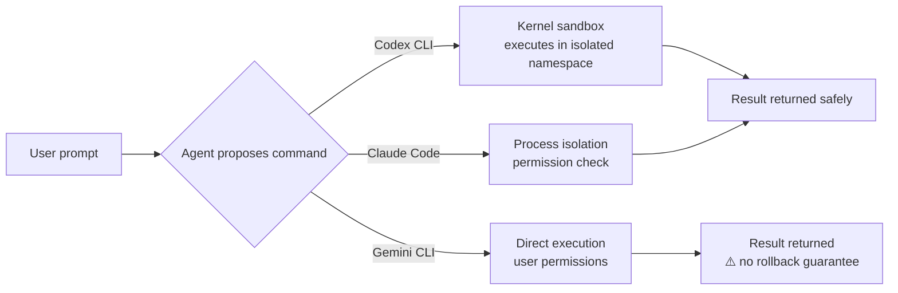

# Terminal Agent Showdown: Codex CLI vs Claude Code vs Gemini CLI in May 2026

---

The terminal agent race has intensified since the three-way contest crystallised in late 2025. OpenAI's Codex CLI (v0.128.0, Rust-native), Anthropic's Claude Code (v2.1.126, TypeScript), and Google's Gemini CLI (v0.40.0, TypeScript) now occupy distinct niches — yet each keeps encroaching on the others' territory. This article benchmarks all three as they stand in the first week of May 2026, covering architecture, performance, safety, pricing, and the workflows where each tool genuinely excels.

---

## Architecture at a Glance

The three agents share a surface-level similarity — you type a natural-language prompt, and the agent reads code, proposes edits, and runs commands — but the underlying stacks diverge sharply.

```mermaid
graph TB
    subgraph Codex["Codex CLI (Rust)"]
        C1[Rust binary] --> C2[Kernel sandbox<br/>Seatbelt / Landlock / DACL]
        C2 --> C3[Responses API<br/>WebSocket mode]
        C3 --> C4[GPT-5.5 / GPT-5.4 /<br/>GPT-5.3-Codex-Spark]
    end

    subgraph Claude["Claude Code (TypeScript)"]
        CL1[Node.js process] --> CL2[Process-level isolation]
        CL2 --> CL3[Messages API]
        CL3 --> CL4[Claude Opus 4.7 /<br/>Claude Sonnet 4.6]
    end

    subgraph Gemini["Gemini CLI (TypeScript)"]
        G1[Node.js + SEA] --> G2[No sandbox<br/>Direct filesystem]
        G2 --> G3[Gemini API]
        G3 --> G4[Gemini 2.5 Pro /<br/>Gemini 3.1 Pro]
    end
```

| Dimension | Codex CLI | Claude Code | Gemini CLI |
|-----------|-----------|-------------|------------|
| **Runtime** | Rust binary | Node.js (TypeScript) | Node.js SEA bundle |
| **Sandbox** | Kernel-level (Seatbelt, Landlock, DACL)[^1] | Process-level isolation | None — direct filesystem access[^2] |
| **Default model** | GPT-5.5[^3] | Claude Opus 4.7[^4] | Gemini 2.5 Pro[^5] |
| **Context window** | 192K tokens[^2] | 200K tokens (1M with Opus 4.7)[^4] | 1M tokens standard[^2] |
| **Transport** | Responses API + WebSocket[^6] | Messages API | Gemini API |
| **Licence** | Apache 2.0[^1] | Source-available (community licence)[^7] | Apache 2.0[^5] |

---

## Benchmark Scores: May 2026

SWE-bench Verified remains the most-cited benchmark, though OpenAI now recommends the harder SWE-bench Pro after discovering potential data contamination in Verified.[^8]

| Benchmark | Codex CLI (GPT-5.5) | Claude Code (Opus 4.7) | Gemini CLI (3.1 Pro) |
|-----------|---------------------|------------------------|----------------------|
| **SWE-bench Verified** | 88.7%[^8] | 87.6%[^8] | 80.6%[^8] |
| **Terminal-Bench 2.0** | 77.3%[^9] | 72.1%[^9] | 68.4% ⚠️ |
| **First-pass accuracy** | ~85%[^9] | ~95%[^10] | ~78% ⚠️ |

Claude Code's higher first-pass accuracy reflects Opus 4.7's stronger multi-file reasoning — it tends to get edits right on the first attempt, whereas Codex CLI's sandbox-and-retry loop compensates for occasional misses through faster iteration.[^10] Gemini CLI's raw scores trail both, but its 1M-token context window means it handles very large files where competitors must chunk or compact.[^2]

---

## Sandbox and Safety

This is where the three tools diverge most dramatically.

**Codex CLI** drops commands into a kernel-enforced sandbox. On macOS, Seatbelt profiles restrict filesystem writes to the working directory. On Linux, Landlock LSM plus seccomp filters achieve the same. On Windows, DACL-based permission boundaries have stabilised as of v0.128.0.[^1][^11] Three permission profiles — `suggest` (read-only), `auto-edit` (workspace writes), and `full-auto` (network access) — gate what the agent may do, and `requirements.toml` lets enterprises enforce ceiling policies across teams.[^12]

**Claude Code** offers process-level isolation with permission tiers (`ask`, `auto-accept`, `bypass`) but lacks the kernel-level enforcement Codex provides.[^7] For security-critical work, Claude Code compensates with `/security-review`, a built-in slash command that audits the current codebase.[^13]

**Gemini CLI** has no sandbox at all.[^2] The agent writes directly to the filesystem with the same permissions as the user running it. For a free tool with 1,000 daily requests, this is a deliberate trade-off — but it means running `gemini` in a production repository without reviewing every proposed change carries genuine risk.

---

## Pricing and Token Economics

Cost structures have diverged further in 2026, with each vendor optimising for a different segment.[^14]

| Plan | Codex CLI | Claude Code | Gemini CLI |
|------|-----------|-------------|------------|
| **Free tier** | API trial credits only | None | 1,000 reqs/day (personal Google account)[^5] |
| **Entry subscription** | ChatGPT Plus (\$20/mo) | Claude Pro (\$20/mo) | Google One AI Premium (\$22/mo) |
| **Power tier** | ChatGPT Pro (\$200/mo) | Claude Max 20x (\$200/mo) | Gemini Advanced (\$60/mo) |
| **API pricing (input)** | \$2.50/MTok (GPT-5.5)[^15] | \$15/MTok (Opus 4.7)[^16] | \$1.25/MTok (2.5 Pro)[^17] |
| **API pricing (output)** | \$10/MTok (GPT-5.5)[^15] | \$75/MTok (Opus 4.7)[^16] | \$10/MTok (2.5 Pro)[^17] |

Codex CLI's 4x token-efficiency claim[^9] changes the effective cost calculation considerably. If Codex completes a task in 25% of the tokens Claude Code requires, the per-task cost gap narrows despite Opus 4.7's higher per-token rate being offset by its lower token consumption per task. In practice, most developers on subscription plans find the distinction academic — the monthly cap matters more than per-token rates.

Gemini CLI's free tier remains unbeatable for exploration and learning. For teams, the lack of a sandbox and weaker benchmark scores push it towards supplementary rather than primary use.[^2]

---

## Feature Comparison: May 2026

### MCP Support

All three now support the Model Context Protocol, ending a period where Codex CLI held a lead.[^1][^7][^5]

- **Codex CLI**: Stdio and streamable HTTP transports, `supports_parallel_tool_calls` per-server opt-in, sandbox-state metadata forwarding, plugin-bundled MCP servers.[^18]
- **Claude Code**: Stdio and SSE transports, native skill discovery via MCP, `/mcp` diagnostic commands.[^7]
- **Gemini CLI**: Stdio transport, MCP resource listing and reading added in v0.40.0.[^5]

### Multi-Agent Orchestration

- **Codex CLI**: MultiAgentV2 with configurable thread caps and wait-time controls, subagent spawning, `codex mcp-server` for embedding in Agents SDK pipelines.[^3][^19]
- **Claude Code**: Agent Teams (launched February 2026) with shared task lists and mailbox system, `/ultrareview` cloud-based bug-hunting fleet.[^13]
- **Gemini CLI**: No native multi-agent support. External orchestration required.[^5]

### Plan Mode

- **Codex CLI**: `/plan` command, plan-mode nudges in TUI (v0.128.0), persistent `PLANS.md` for long-horizon sessions.[^3]
- **Claude Code**: Plan mode with `/plan` command, session recap for returning to paused plans.[^13]
- **Gemini CLI**: Plan Mode added March 2026 — a read-only phase that prevents the agent from writing files until the plan is approved.[^20]

### Session Management

- **Codex CLI**: `codex resume`, conversation forking, context compaction at configurable thresholds, `--ephemeral` for disposable sessions.[^1]
- **Claude Code**: `/resume` picker defaults to current directory, `/recap` for session context recovery, `claude project purge` for state cleanup.[^13]
- **Gemini CLI**: `/memory inbox` for reviewing extracted skills, JSONL chat recording for audit trails.[^5]

---

## Where Each Tool Excels

### Codex CLI: Autonomous Batch Operations

Codex CLI's combination of kernel sandboxing and `codex exec` non-interactive mode makes it the strongest choice for unattended workloads: CI/CD pipelines, scheduled code reviews, and automated PR generation.[^1][^9] The `--output-schema` flag ensures machine-readable structured output, and the `--attempts` flag enables best-of-N runs for reliability-critical tasks.[^6]

**Best for:** CI integration, security-sensitive environments, token-conscious teams, enterprises requiring `requirements.toml` policy enforcement.

### Claude Code: Complex Reasoning and Multi-File Refactors

Claude Opus 4.7's 95% first-pass accuracy and 1M context window make Claude Code the tool of choice when you need to get a complex refactor right on the first attempt.[^10] The Agent Teams feature enables multi-agent collaboration without external orchestration, and `/ultrareview` provides cloud-scale code auditing.[^13]

**Best for:** Large refactors, multi-file reasoning, teams willing to pay for quality, frontend-heavy projects.

### Gemini CLI: Exploration, Prototyping, and Large Codebases

The free tier (1,000 requests/day) and 1M-token context window make Gemini CLI unbeatable for exploration.[^5] Multimodal input — pasting screenshots into the terminal for the agent to analyse — is a genuine differentiator for UI debugging and design-to-code workflows.[^2] The v0.40.0 bundled ripgrep enables offline codebase search, a feature neither competitor matches.[^5]

**Best for:** Budget-conscious developers, massive codebases, multimodal workflows, prototyping and exploration.

---

## The Three-Tool Stack

A pattern emerging among power users is maintaining all three agents:[^10]

1. **Gemini CLI** for quick questions, large-context exploration, and free-tier tasks
2. **Codex CLI** for CI pipelines, sandboxed autonomous work, and structured output
3. **Claude Code** for complex multi-file reasoning and deep refactors

This mirrors how developers historically kept multiple text editors — each tool has genuine strengths that the others cannot replicate within their current architecture.

---

## What to Watch

- **Codex CLI v0.129** is in alpha with improved `/mcp` diagnostics and faster reasoning controls via keyboard shortcuts (Alt+, / Alt+.).[^3]
- **Claude Code's** `/ultrareview` remains in research preview — if it stabilises, cloud-based multi-agent review could shift the competitive landscape.[^13]
- **Gemini CLI** needs a sandbox story. The v0.40.0 release added MCP resource management but still offers no execution isolation.[^5] Until this changes, enterprise adoption will remain limited.
- **SWE-bench Pro** is displacing SWE-bench Verified as the reference benchmark after contamination concerns.[^8] May 2026 scores on Pro are significantly lower across the board, suggesting the gap between agents is narrower than Verified suggests.

---

## Citations

[^1]: [Codex CLI Documentation — OpenAI Developers](https://developers.openai.com/codex/cli)
[^2]: [Gemini CLI vs Codex CLI: 1M Context Window vs Sandbox Execution — Morphllm](https://www.morphllm.com/comparisons/gemini-cli-vs-codex)
[^3]: [Codex Changelog — OpenAI Developers](https://developers.openai.com/codex/changelog)
[^4]: [Claude Opus 4.7 — Anthropic](https://platform.claude.com/docs/en/release-notes/overview)
[^5]: [Gemini CLI Updates — Releasebot, May 2026](https://releasebot.io/updates/google/gemini-cli)
[^6]: [Codex CLI Features — OpenAI Developers](https://developers.openai.com/codex/cli/features)
[^7]: [Claude Code Changelog — Anthropic](https://code.claude.com/docs/en/changelog)
[^8]: [SWE-bench Verified Leaderboard — May 2026](https://llm-stats.com/benchmarks/swe-bench-verified)
[^9]: [Claude Code vs Codex CLI vs Gemini CLI: Benchmarked and Ranked — CodeAnt](https://www.codeant.ai/blogs/claude-code-cli-vs-codex-cli-vs-gemini-cli-best-ai-cli-tool-for-developers-in-2025)
[^10]: [Claude Code vs Codex CLI vs Gemini CLI 2026 Comparison — DeployHQ](https://www.deployhq.com/blog/comparing-claude-code-openai-codex-and-google-gemini-cli-which-ai-coding-assistant-is-right-for-your-deployment-workflow)
[^11]: [Codex CLI on Windows — OpenAI Developers](https://developers.openai.com/codex/windows)
[^12]: [Managed Configuration — OpenAI Developers](https://developers.openai.com/codex/config-advanced)
[^13]: [Claude Code v2.1.126 Release Notes — Anthropic, May 2026](https://releasebot.io/updates/anthropic/claude-code)
[^14]: [AI Coding Tools Pricing Comparison 2026 — NxCode](https://www.nxcode.io/resources/news/ai-coding-tools-pricing-comparison-2026)
[^15]: [OpenAI API Pricing — GPT-5.5](https://developers.openai.com/codex/models)
[^16]: [Claude API Pricing — Anthropic](https://platform.claude.com/docs/en/release-notes/overview)
[^17]: [Gemini API Pricing — Google](https://ai.google.dev/pricing)
[^18]: [Codex CLI MCP Documentation — OpenAI Developers](https://developers.openai.com/codex/guides/agents-sdk)
[^19]: [Codex CLI MultiAgentV2 — OpenAI Developers](https://developers.openai.com/codex/subagents)
[^20]: [Complete Guide to Codex Plan Mode 2026 — SmartScope](https://smartscope.blog/en/generative-ai/chatgpt/codex-plan-mode-complete-guide/)
