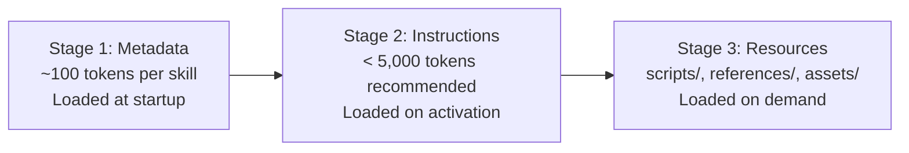
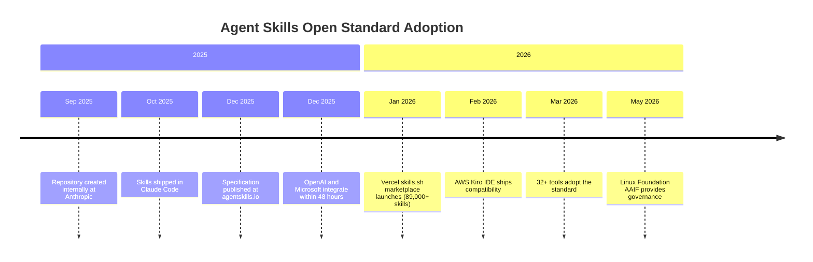
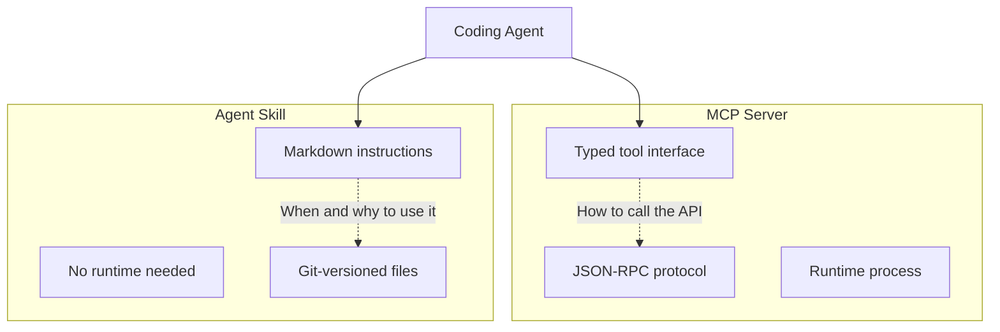

# The Agent Skills Open Standard: Writing Portable SKILL.md Files That Work Across Codex CLI, Claude Code, and 30+ Tools


---

If you have invested time building skills for Codex CLI, you may not realise that those same files already work — unchanged — in Claude Code, Gemini CLI, Cursor, Kiro, and at least 28 other tools. This is not an accident. It is the result of the Agent Skills Open Standard, a specification that emerged from Anthropic's Claude Code in late 2025 and was formally published at [agentskills.io](https://agentskills.io) in December of that year [^1]. Within 48 hours of publication, both OpenAI and Microsoft had integrated support [^2].

This article explains the specification, shows how Codex CLI implements it, and walks through writing a portable skill that runs identically across every adopting tool.

## Why a Standard Matters

Before the standard, every coding agent had its own configuration format. Claude Code used `CLAUDE.md` files. Codex CLI used `AGENTS.md`. Cursor had its own rules system. If you wanted the same behaviour everywhere, you maintained parallel files — a maintenance burden that scaled poorly with team size.

The Agent Skills Open Standard solves this with a single directory-based format centred on a `SKILL.md` file [^3]. The specification is deliberately minimal: two required frontmatter fields, a Markdown body, and optional supporting directories. This simplicity is the standard's greatest strength — there are no build steps, no package managers, no runtimes. Skills are just directories of files, version-controlled with Git.

## The Specification

### Directory Structure

```
my-skill/
├── SKILL.md          # Required: metadata + instructions
├── scripts/          # Optional: executable code
├── references/       # Optional: documentation
├── assets/           # Optional: templates, resources
└── agents/           # Optional: agent-specific config
    └── openai.yaml   # Codex-specific UI and policy metadata
```

### Frontmatter Schema

The `SKILL.md` file uses YAML frontmatter with the following fields [^3]:

| Field           | Required | Constraints |
|-----------------|----------|-------------|
| `name`          | Yes      | Max 64 characters. Lowercase letters, numbers, hyphens only. Must match the parent directory name. No leading/trailing/consecutive hyphens. |
| `description`   | Yes      | Max 1,024 characters. Describes what the skill does and when to use it. |
| `license`       | No       | License name or reference to a bundled `LICENSE.txt`. |
| `compatibility` | No       | Max 500 characters. Environment requirements (required packages, network access). |
| `metadata`      | No       | Arbitrary key-value map for additional properties. |
| `allowed-tools` | No       | Space-separated string of pre-approved tools. Experimental. |

A minimal skill:

```markdown
---
name: lint-fix
description: Runs the project linter and fixes all auto-fixable violations. Use when the user asks to fix lint errors or clean up code style.
---

## Instructions

1. Detect the project's linter from config files (`eslint.config.js`, `pyproject.toml`, `.rubocop.yml`).
2. Run the linter in fix mode.
3. Report what changed and what remains unfixed.
```

### Body Content

The Markdown body after frontmatter contains instructions the agent follows. There are no format restrictions, but the specification recommends keeping the main `SKILL.md` under 500 lines and moving detailed reference material to separate files in `references/` [^3].

### Progressive Disclosure

Agents load skills in three stages [^3]:



This staged loading means you can have hundreds of skills installed without meaningful context window impact — only the `name` and `description` fields are read until a skill is actually triggered.

## How Codex CLI Implements the Standard

Codex CLI scans four locations for skills, in priority order [^4]:

| Scope  | Path | Use Case |
|--------|------|----------|
| REPO   | `.agents/skills/` in current, parent, or root directories | Team workflows committed to the repository |
| USER   | `$HOME/.agents/skills/` | Personal skill collection |
| ADMIN  | `/etc/codex/skills/` | Organisation-wide defaults |
| SYSTEM | Bundled with Codex | Built-in skills shipped with the CLI |

### Invocation

Skills activate in two ways:

- **Explicit**: Type `$skill-name` in the TUI or pass it via `codex exec`
- **Implicit**: Codex matches your prompt against skill descriptions and activates the best match automatically

You can disable implicit invocation per-skill using the Codex-specific `agents/openai.yaml` metadata file:

```yaml
# agents/openai.yaml
policy:
  allow_implicit_invocation: false
```

### Disabling Skills

Individual skills can be disabled in `~/.codex/config.toml`:

```toml
[[skills.config]]
path = "/home/user/.agents/skills/noisy-skill/SKILL.md"
enabled = false
```

### Built-in CLI Commands

Codex ships two skill management commands [^4]:

- `$skill-creator` — an interactive wizard that scaffolds a new skill directory
- `$skill-installer [name]` — installs curated skills from the [openai/skills](https://github.com/openai/skills) catalogue

## Writing a Portable Skill: Step by Step

Here is a practical example — a skill that generates conventional commit messages from staged Git changes. This skill works identically in Codex CLI, Claude Code, Gemini CLI, Cursor, and any other conformant tool.

### 1. Create the Directory

```bash
mkdir -p .agents/skills/conventional-commit
```

### 2. Write SKILL.md

```markdown
---
name: conventional-commit
description: >
  Generates a Conventional Commits message from staged git changes.
  Use when the user asks to commit, write a commit message, or says
  "commit this". Do NOT use for unstaged changes.
license: MIT
compatibility: Requires git
metadata:
  author: your-team
  version: "1.0"
---

## Instructions

1. Run `git diff --cached --stat` to see what is staged.
2. If nothing is staged, tell the user and stop.
3. Run `git diff --cached` to read the full diff.
4. Classify the change as one of: feat, fix, refactor, docs, test, chore, ci, perf, style, build.
5. Write a commit message following this format:

   ```text
   type(scope): subject

   body
   ```

1. The subject line must be ≤ 72 characters, imperative mood, no trailing full stop.
2. The body should explain *why*, not *what*.
3. Present the message and ask for confirmation before committing.

## Edge Cases

- Multiple unrelated changes: suggest splitting into separate commits.
- Breaking changes: add `BREAKING CHANGE:` footer.
- Co-authored commits: preserve existing `Co-Authored-By` trailers.

```

### 3. Add Supporting Scripts (Optional)

```bash
mkdir -p .agents/skills/conventional-commit/scripts
```

```python
#!/usr/bin/env python3
# scripts/validate_message.py
"""Validates a commit message against Conventional Commits spec."""
import sys
import re

PATTERN = r'^(feat|fix|refactor|docs|test|chore|ci|perf|style|build)(\(.+\))?: .{1,72}$'

message = sys.stdin.readline().strip()
if re.match(PATTERN, message):
    print("Valid")
    sys.exit(0)
else:
    print(f"Invalid: {message}")
    sys.exit(1)
```

### 4. Commit It

```bash
git add .agents/skills/conventional-commit/
git commit -m "chore: add conventional-commit skill"
```

Every developer who clones the repository now has the skill available in whichever agent they use.

## Cross-Agent Compatibility: What Works and What Does Not

### Universal Features

The core of the standard — `SKILL.md` with `name` and `description` frontmatter, Markdown instructions, and `scripts/`/`references/`/`assets/` directories — works identically across all 32+ adopting tools [^2].

### Agent-Specific Extensions

Each tool has added its own optional extensions that other tools ignore [^5]:

| Extension | Tool | Purpose |
|-----------|------|---------|
| `agents/openai.yaml` | Codex CLI | UI properties, invocation policy, tool dependencies |
| `context: fork` | Claude Code | Subagent execution context |
| `when_to_use` list | Claude Code | Structured trigger conditions |
| `user-invocable` | Claude Code | Expose as slash command |
| `disable-model-invocation` | Claude Code | Restrict to explicit invocation only |

These extensions are safe to include — tools that do not understand them simply ignore them. A skill can carry both `agents/openai.yaml` for Codex and `when_to_use` for Claude Code without conflict.

### The Portability Rule

If your skill sticks to the core specification — standard frontmatter, Markdown instructions, and the three optional directories — it will work everywhere without modification [^2]. The moment you rely on agent-specific features (like Claude Code's `context: fork` for subagent execution), you gain power at the cost of portability.

## The Adoption Landscape

The standard's adoption timeline tells an unusual story of rapid cross-vendor convergence [^2]:



Governance now sits with the Linux Foundation's Agentic AI Foundation (AAIF), announced in December 2025, with 146 member organisations as of February 2026 [^2]. This neutral governance reduces the risk of any single vendor steering the standard for competitive advantage.

## Skills vs MCP: Complementary, Not Competing

A common question: why not just use MCP servers instead of skills?

The answer is that they solve different problems. MCP provides **structured API access** — a typed interface to external systems (databases, APIs, file systems). Skills provide **procedural knowledge** — instructions for *how* to accomplish a task using whatever tools are available [^6].



A well-designed workflow uses both: an MCP server that provides tools for interacting with your CI system, and a skill that teaches the agent *when* to check CI, *how* to interpret failures, and *what* to do about them.

## Practical Recommendations

**Structure for progressive disclosure.** Keep `SKILL.md` under 500 lines. Put detailed references in `references/`. This matters because every token loaded is a token not available for reasoning.

**Write trigger-friendly descriptions.** The `description` field is how agents decide whether to activate your skill. "Helps with code" will rarely trigger. "Runs ESLint in fix mode on staged JavaScript and TypeScript files when the user asks to fix lint errors" will trigger reliably.

**Validate before committing.** Use the official validation tool [^3]:

```bash
npx skills-ref validate ./my-skill
```

**Use `compatibility` sparingly.** Most skills do not need it. Include it only when your skill genuinely requires specific system packages or network access.

**Commit skills to the repository.** Team skills belong in `.agents/skills/` within the repo, not in individual developers' home directories. This ensures consistency and makes skills subject to code review.

**Test across agents.** Before declaring a skill portable, verify it in at least Codex CLI, Claude Code, and one other tool. The specification is young enough that implementation differences still surface occasionally.

## What to Watch

The specification is stable but still evolving. The `allowed-tools` field remains experimental [^3]. The Vercel marketplace at [skills.sh](https://skills.sh) is rapidly growing but quality varies — treat community skills with the same scrutiny you would apply to any third-party dependency. OpenAI's own [skills catalogue](https://github.com/openai/skills) provides a curated baseline with `.system`, `.curated`, and `.experimental` tiers [^7].

The most significant development to watch is whether the AAIF governance process leads to a formal versioned specification with backwards-compatibility guarantees — something the standard currently lacks.

## Citations

[^1]: Anthropic, "Agent Skills Open Standard — Specification," agentskills.io, December 2025. [https://agentskills.io/specification](https://agentskills.io/specification)
[^2]: Paperclipped, "Agent Skills Open Standard Explained — Interoperability Guide 2026," paperclipped.de, March 2026. [https://www.paperclipped.de/en/blog/agent-skills-open-standard-interoperability/](https://www.paperclipped.de/en/blog/agent-skills-open-standard-interoperability/)
[^3]: Agent Skills, "Specification — Agent Skills," agentskills.io, 2026. [https://agentskills.io/specification](https://agentskills.io/specification)
[^4]: OpenAI, "Agent Skills — Codex | OpenAI Developers," developers.openai.com, 2026. [https://developers.openai.com/codex/skills](https://developers.openai.com/codex/skills)
[^5]: Agensi, "SKILL.md Format Reference: Frontmatter Fields & Templates," agensi.io, 2026. [https://www.agensi.io/learn/skill-md-format-reference](https://www.agensi.io/learn/skill-md-format-reference)
[^6]: Agensi, "What Is the Agent Skills Open Standard? (2026 Explainer)," agensi.io, 2026. [https://www.agensi.io/learn/agent-skills-open-standard](https://www.agensi.io/learn/agent-skills-open-standard)
[^7]: OpenAI, "Skills Catalog for Codex," github.com/openai/skills, 2026. [https://github.com/openai/skills](https://github.com/openai/skills)
