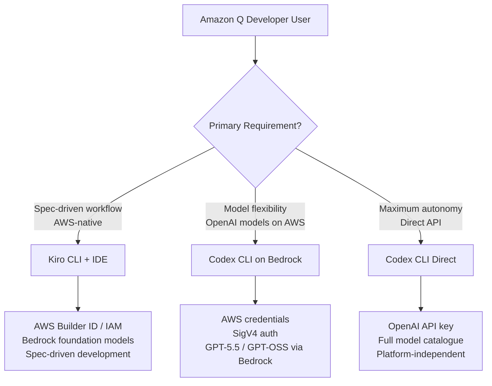
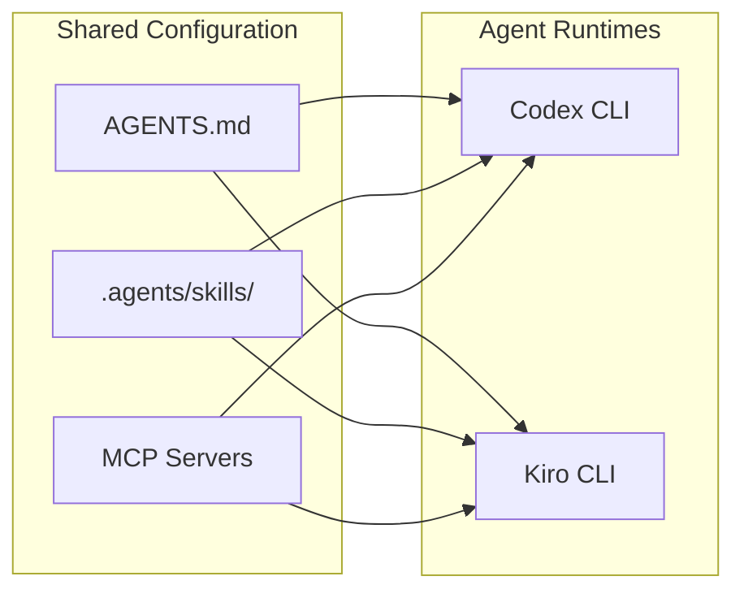

# The Amazon Q Developer Sunset: Migration Paths for AWS Teams Moving to Codex CLI, Kiro, or Bedrock


---

## The End of an Era

On 30 April 2026, AWS announced that Amazon Q Developer IDE plugins and paid subscriptions will reach end of support on 30 April 2027[^1]. New signups are blocked from 15 May 2026. Starting 29 May 2026, Opus 4.6 is removed from Q Developer Pro, with the latest coding models (including Opus 4.7) available exclusively on Kiro[^2].

This is not a quiet deprecation. AWS is actively steering its developer tooling strategy in two directions simultaneously: their own spec-driven IDE (Kiro) and a deep partnership with OpenAI to bring Codex and GPT-5.5 to Amazon Bedrock[^3]. For teams that built workflows around Q Developer, the clock is ticking.

## What Survives and What Dies

Not everything is disappearing. Q Developer in the AWS Management Console, documentation website, console mobile app, and Slack/Teams integrations continues unaffected[^1]. Critical bugfixes ship to existing IDE plugin users through the transition window.

What ends:

- **IDE plugins** (VS Code, JetBrains, Visual Studio, Eclipse) — end of support 30 April 2027
- **Q Developer Pro subscriptions** — no new signups after 15 May 2026
- **Q Developer Free Tier via Builder ID** — account creation blocked from 15 May 2026
- **Opus 4.6 model access** — removed from Q Developer Pro on 29 May 2026[^2]

## The Three Migration Paths

AWS teams face a three-way decision. Each path has different trade-offs for autonomy, model access, and infrastructure control.



### Path 1: Kiro (AWS-Native Replacement)

Kiro reached general availability in May 2026 with full CLI support[^4]. It is the spiritual successor to Q Developer, built on VS Code foundations with spec-driven development at its core.

**What you gain over Q Developer:**

- Spec-driven development (user stories → technical design → implementation tasks)[^4]
- Agent hooks for event-driven automation
- Custom subagents with pre-approved tool permissions
- MCP server support
- Property-based testing from natural-language specifications[^5]

**What you lose:**

- Q Developer's inline suggestions model (replaced by Kiro's own completions)
- Eclipse and Visual Studio native plugins (CLI-only access for those editors)[^6]

**Configuration migration** is straightforward for VS Code users — Kiro imports extensions, themes, keybindings, and settings automatically on first launch[^6]. JetBrains users integrate via the Agent Client Protocol (ACP).

### Path 2: Codex CLI on Amazon Bedrock

For teams that want OpenAI's models within AWS infrastructure, Codex on Bedrock (limited preview since 28 April 2026) provides the bridge[^3]. You authenticate with AWS credentials, run inference through Bedrock, and apply usage toward your AWS cloud commitments.

**config.toml for Bedrock:**

```toml
[model_providers.amazon-bedrock]
name = "Amazon Bedrock"

# SigV4 authentication via environment or ~/.aws/credentials
# Note: profile-only auth currently requires env vars as fallback

[model_providers.amazon-bedrock.env]
AWS_ACCESS_KEY_ID = ""
AWS_SECRET_ACCESS_KEY = ""
AWS_DEFAULT_REGION = "us-east-1"

# Disable web_search to avoid Bedrock Mantle compatibility issues
web_search = "disabled"
```

**Available models on Bedrock Mantle:**

- `gpt-oss-120b` — full-size open model
- `gpt-oss-20b` — compact variant for cost-sensitive workloads

⚠️ GPT-5.5 is not yet available on Bedrock Mantle as of this writing. Teams requiring GPT-5.5 should use the direct API path.

**Enterprise controls inherited from Bedrock:**

- IAM-based access management
- AWS PrivateLink connectivity
- CloudTrail logging
- Guardrails integration
- Encryption at rest and in transit[^7]

### Path 3: Codex CLI Direct (Platform-Independent)

The simplest migration for teams not locked into AWS billing. Direct API access gives you the full model catalogue (GPT-5.5, GPT-5.2-Codex, Codex-Spark, GPT-5.4-mini) without Bedrock's preview limitations.

```toml
# ~/.codex/config.toml — direct API
model = "gpt-5.5"

[profiles.fast]
model = "gpt-5.3-codex-spark"
model_reasoning_effort = "low"

[profiles.deep]
model = "gpt-5.5"
model_reasoning_effort = "high"

[profiles.ci]
model = "gpt-5.4-mini"
```

## Feature Mapping: Q Developer → Codex CLI

| Q Developer Feature | Codex CLI Equivalent | Notes |
|---|---|---|
| Inline completions | Not applicable | Codex CLI is agentic, not autocomplete |
| Chat in IDE | TUI interactive mode | Terminal-native; IDE via app-server |
| Code generation | `codex exec` or TUI prompt | Full file generation + editing |
| Security scanning | `codex exec` + SAST skills | Via Codex Security or custom skills |
| Code transformation | `/goal` workflows | Persistent multi-turn refactoring |
| Agent mode | Default behaviour | Codex is agent-first |
| Customisation rules | AGENTS.md + SKILL.md | Richer than Q Developer's profiles |
| MCP support | Native since v0.121 | Full MCP client implementation |

The conceptual shift is significant. Q Developer was primarily a completion engine with an agent mode bolted on. Codex CLI is fundamentally an autonomous agent that you steer with configuration, skills, and approval policies[^8].

## The Hybrid Strategy

Many enterprise teams will run both Kiro and Codex CLI:

- **Kiro** for spec-driven greenfield development where AWS-native billing and governance matter
- **Codex CLI on Bedrock** for existing AWS workflows that need OpenAI model quality
- **Codex CLI direct** for individual developers who want maximum flexibility

This is viable because both Kiro and Codex CLI support the Agent Skills open standard (SKILL.md)[^9]. Skills you write for one tool work in the other. AGENTS.md files are read by both. The portability layer means you are not locked into a single agent.



## Migration Checklist

For teams currently on Q Developer Pro planning their transition:

1. **Audit your Q Developer usage** — identify which features you actually use (completions, chat, security scanning, agent mode)
2. **Export custom rules** — translate Q Developer customisation profiles into AGENTS.md format
3. **Evaluate model needs** — if you need GPT-5.5, Bedrock is not yet sufficient; use direct API
4. **Test Codex CLI in CI** — replace Q Developer security scanning with `codex exec` pipelines using `--output-schema`
5. **Set up credential management** — for Bedrock, configure OIDC federation for CI/CD; for direct, set up `OPENAI_API_KEY` in your secrets manager
6. **Install skills** — replace Q Developer's built-in capabilities with equivalent SKILL.md packages from the marketplace (89,753 available as of March 2026)[^9]
7. **Configure approval policies** — Q Developer had implicit trust; Codex CLI requires explicit permission profiles[^10]

## Cost Comparison

| Plan | Monthly Cost | What You Get |
|---|---|---|
| Q Developer Free (ending) | \$0 | Limited completions, basic chat |
| Q Developer Pro (ending) | \$19/user | Unlimited completions, agent mode |
| Codex CLI (ChatGPT Plus) | \$20/user | 5× usage multiplier, GPT-5.5 |
| Codex CLI (ChatGPT Pro) | \$100/user | 10× usage (through 31 May), Spark access |
| Codex CLI (API pay-as-you-go) | Variable | Full control, no multiplier caps |
| Kiro Free | \$0 | 50 agent interactions/month |
| Kiro Pro | \$19/user | 1,000 agent interactions/month |

For teams spending \$19/user on Q Developer Pro, the direct swap to Codex CLI via ChatGPT Plus at \$20/user provides substantially more capability — particularly the full agentic workflow, 400K context window with GPT-5.5, and the skills ecosystem[^11].

## Timeline Decision Framework

| Date | Action Required |
|---|---|
| Now (May 2026) | Begin evaluation; install Codex CLI alongside Q Developer |
| 15 May 2026 | No new Q Developer accounts — ensure all team members have access |
| 29 May 2026 | Opus 4.6 removed from Q Developer — verify no dependency |
| Q3 2026 | Complete migration for active development workflows |
| 30 April 2027 | Q Developer IDE plugins cease functioning |

Teams have a full year, but the smart move is to migrate active workflows now while Q Developer remains available as a fallback. The skills and AGENTS.md you write today work across both tools immediately.

## What This Means for the Market

AWS's decision to sunset their own AI coding assistant in favour of a partnership with OpenAI is a remarkable validation of the foundation-model-lab-as-tool-vendor model. Rather than competing on models, AWS is competing on infrastructure and governance — providing the enterprise wrapper (IAM, PrivateLink, CloudTrail, billing) around OpenAI's agent technology[^3].

For Codex CLI practitioners, this means the AWS ecosystem is no longer adversarial territory. Your `config.toml` can route through Bedrock with full enterprise controls, your skills work in Kiro, and your AGENTS.md files are read by both. The fragmentation tax just got cheaper.

---

## Citations

[^1]: AWS DevOps Blog, "Amazon Q Developer end-of-support announcement", 30 April 2026 — https://aws.amazon.com/blogs/devops/amazon-q-developer-end-of-support-announcement/
[^2]: Let's Data Science, "Amazon Q Developer Announces End-of-Support Timeline", April 2026 — https://letsdatascience.com/news/amazon-q-developer-announces-end-of-support-timeline-97a57c03
[^3]: OpenAI, "OpenAI on AWS", 28 April 2026 — https://openai.com/index/openai-on-aws/
[^4]: Kiro, "Kiro is generally available: Build with your team in the IDE and terminal", May 2026 — https://kiro.dev/blog/general-availability/
[^5]: Tessl, "Kiro spec-driven development platform hits prime time with CLI support", May 2026 — https://tessl.io/blog/kiro-spec-driven-development-platform-hits-prime-time-with-cli-support-in-tow/
[^6]: Kiro, "Migrating from Amazon Q Developer", May 2026 — https://kiro.dev/docs/migrating-from-q-developer/
[^7]: AWS, "Amazon Bedrock now offers OpenAI models, Codex, and Managed Agents", 28 April 2026 — https://aws.amazon.com/about-aws/whats-new/2026/04/bedrock-openai-models-codex-managed-agents/
[^8]: OpenAI Developers, "Codex CLI", 2026 — https://developers.openai.com/codex/cli
[^9]: Paperclipped, "Agent Skills Open Standard Explained", March 2026 — https://www.paperclipped.de/en/blog/agent-skills-open-standard-interoperability/
[^10]: OpenAI Developers, "Codex CLI v0.128.0 Changelog", 30 April 2026 — https://developers.openai.com/codex/changelog
[^11]: OpenAI Developers, "Codex Pricing", 2026 — https://developers.openai.com/codex/pricing
