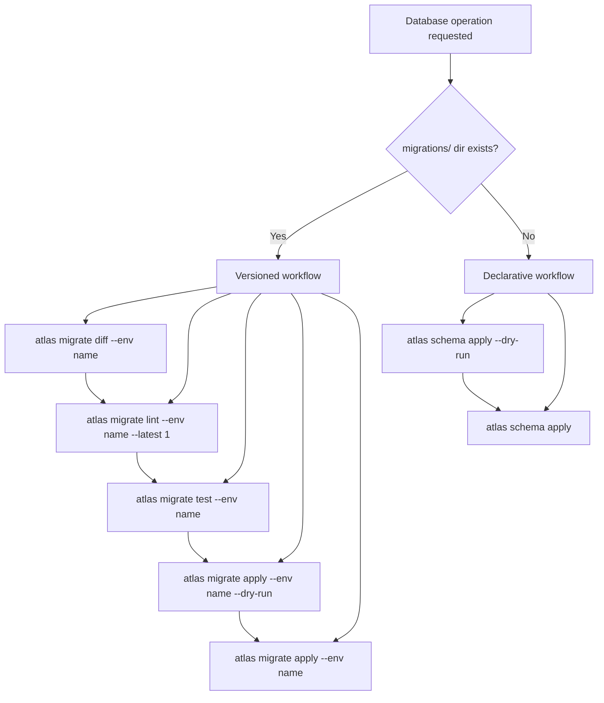
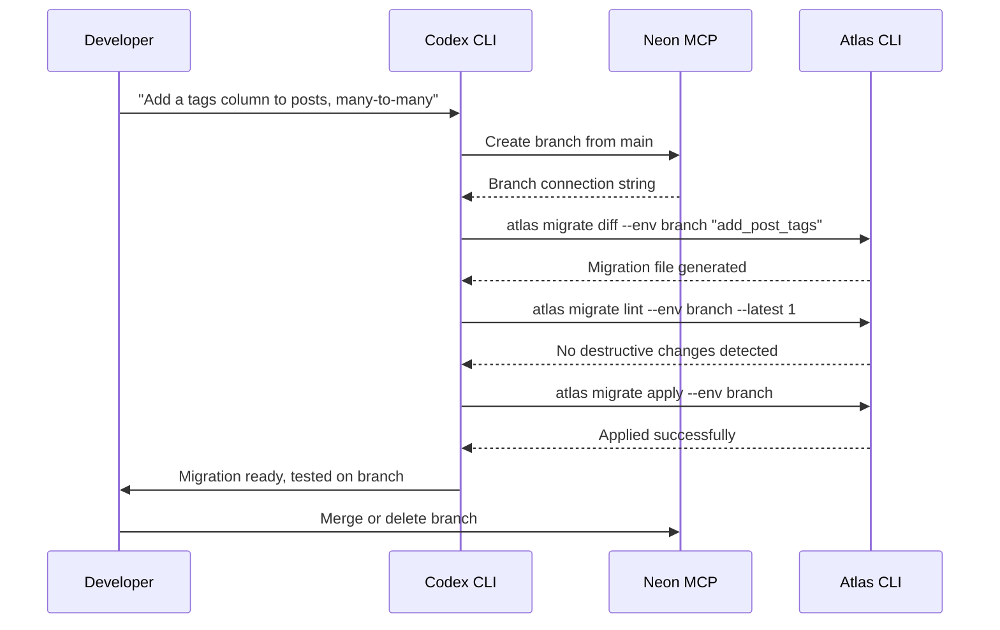

# Database Schema Migrations with Codex CLI: Atlas Skills, Neon Branching, and Safety Patterns


---

Database schema migrations remain one of the riskiest operations in any engineering workflow. A mistyped `ALTER TABLE` can lock a production table for minutes; a dropped column can silently break downstream services. Handing these operations to an autonomous coding agent sounds reckless — until you layer the right guardrails. This article examines how Codex CLI, combined with Atlas agent skills and Neon's database branching via MCP, creates a migration workflow that is both agent-driven and production-safe.

## The Problem: Schema Changes Need Both Speed and Caution

Most teams treat database migrations as a two-phase process: a developer writes the migration, then a reviewer scrutinises it for data-loss risks, locking behaviour, and rollback feasibility. Codex CLI can accelerate the first phase considerably — generating migration files from natural-language descriptions, diffing schema states, and even updating ORM models in tandem. But without structural constraints, an agent might apply destructive changes directly, skip validation, or leak connection strings into its context window.

The solution involves three complementary layers: **Atlas agent skills** for migration expertise, **Neon MCP branching** for isolated execution, and **Codex permission profiles** for sandbox enforcement.

## Atlas Agent Skills: Portable Migration Expertise

Atlas, the open-source schema-as-code tool from Ariga, ships a purpose-built agent skill that follows the Agent Skills Open Standard [^1]. The skill activates only when Codex detects database-related intent — preserving context window budget for the rest of your session.

### Installation

Install at user level for cross-project availability, or at project level for repository-specific configuration:

```bash
# User-level (available in all projects)
mkdir -p ~/.codex/skills/atlas/references

# Project-level (committed to the repo)
mkdir -p .codex/skills/atlas/references
```

The `SKILL.md` file declares the skill metadata and contains the full instruction set:

```yaml
---
name: atlas
description: Database schema management and migrations with Atlas CLI
---
```

The body of the file covers seven workflow categories — inspection, diffing, generation, validation, linting, testing, and application — plus ORM integration patterns for GORM, Drizzle, SQLAlchemy, Django, Ent, Sequelize, and TypeORM [^2].

### The Critical Security Pattern

Atlas enforces a fundamental rule: **never pass database URLs directly to the model context**. All credentials flow through `atlas.hcl` environment blocks using `getenv()`, and Codex references them via the `--env` flag:

```hcl
env "staging" {
  url = getenv("DATABASE_URL")
  dev = "docker://postgres/17/dev?search_path=public"
  migration {
    dir = "file://migrations"
  }
  schema {
    src = "file://schema.hcl"
  }
}
```

This means Codex never sees raw connection strings — it works entirely through named environments [^3].

### Workflow Decision Logic

The skill embeds a decision tree that Codex follows automatically:



The versioned workflow is the production-grade path: generate a diff, lint it for destructive operations, test it against a disposable dev database, preview with `--dry-run`, and only then apply [^2].

## Neon MCP: Isolated Database Branches for Agent Execution

Atlas handles migration generation and validation, but where does the agent actually *run* those migrations during development? Against a shared staging database? That defeats the purpose of isolation. Neon's MCP server solves this by giving Codex the ability to create instant, copy-on-write database branches [^4].

### Configuration

Add the Neon MCP server to your Codex configuration:

```toml
[mcp_servers.neon]
url = "https://mcp.neon.tech/mcp"
bearer_token_env_var = "NEON_API_KEY"
```

Set the project context once:

```bash
neon set-context --project-id <project-id> --org-id <org-id>
```

This generates a `.neon` configuration file that the MCP server references for all subsequent operations [^4].

### The Branching Workflow

When Codex needs to test a schema change, it creates an isolated branch through the MCP server. Neon's copy-on-write architecture means branches are instantaneous and cost-effective — they share storage with the parent until data diverges [^4].



If the migration fails — say, a constraint violation or a timeout on a large table — it fails safely on an isolated branch. Codex can analyse the error, adjust the migration, and retry without any impact on shared environments [^4].

### Retrieving Branch Connection Strings

For local application testing against the branched schema:

```bash
neon connection-string <branch-name>
```

This lets you validate that application code works against the new schema before merging the migration into your main branch [^4].

## Codex Safety Patterns for Database Work

Beyond Atlas and Neon, Codex CLI's own safety mechanisms provide additional protection for database operations.

### Permission Profiles

Use a restrictive permission profile for database migration sessions. The `read-only` sandbox prevents any filesystem writes outside the migration directory, whilst network restrictions limit which hosts Codex can reach:

```bash
codex --sandbox read-only \
  --add-dir ./migrations \
  "Generate a migration to add soft-delete columns to all user-facing tables"
```

For applying migrations, switch to a more permissive profile with explicit approval:

```bash
codex --approval-mode suggest \
  "Apply the pending migrations to the staging branch"
```

The `suggest` approval mode ensures Codex proposes each command and waits for human confirmation before execution — critical for destructive database operations [^5].

### Hooks for Migration Guardrails

Codex hooks can intercept migration commands before they execute. A `PreToolUse` hook can enforce mandatory `--dry-run` on first execution, require linting before any `apply`, or block `DROP` statements entirely in certain environments:

```jsonc
// .codex/hooks/pre-tool-use.js
if (toolName === "shell" && command.includes("migrate apply")) {
  if (!sessionState.lintCompleted) {
    return { status: "deny", reason: "Run atlas migrate lint before applying" };
  }
  if (!command.includes("--dry-run") && !sessionState.dryRunCompleted) {
    return { status: "deny", reason: "Run with --dry-run first" };
  }
}
```

This turns Codex's hook system into a procedural enforcement layer — the agent cannot skip steps in the migration workflow [^6].

### Non-Interactive Pipelines

For CI/CD integration, `codex exec` with `--output-schema` produces structured migration reports:

```bash
codex exec "Review pending migrations for destructive operations" \
  --output-schema ./migration-report-schema.json \
  -o ./migration-report.json
```

This integrates cleanly into pull request workflows where migration safety must be verified automatically [^7].

## Combining the Layers: A Complete Workflow

Here is how all three layers work together in practice:

```mermaid
flowchart LR
    subgraph "1. Generation"
        A[Developer prompt] --> B[Atlas skill activates]
        B --> C[Codex generates migration via atlas migrate diff]
    end
    subgraph "2. Validation"
        C --> D[atlas migrate lint]
        D --> E[atlas migrate test]
        E --> F[Hooks enforce dry-run]
    end
    subgraph "3. Isolation"
        F --> G[Neon MCP creates branch]
        G --> H[atlas migrate apply on branch]
        H --> I[Application tested against branch]
    end
    subgraph "4. Promotion"
        I --> J[PR with migration files]
        J --> K[CI runs codex exec review]
        K --> L[Merge and apply to production]
    end
```



1. **Generation**: The developer describes the desired schema change in natural language. The Atlas skill activates, and Codex uses `atlas migrate diff` to produce the migration file.

2. **Validation**: The generated migration is linted for destructive operations, tested against a disposable dev database, and previewed with `--dry-run`. Hooks enforce this sequence.

3. **Isolation**: The Neon MCP server creates an instant database branch. The migration is applied to the branch, and the application is tested against the branched schema.

4. **Promotion**: The migration files are committed in a pull request. CI runs a `codex exec` review to flag any remaining risks. On merge, the migration applies to production through the standard deployment pipeline.

## ORM Integration Considerations

Atlas supports external schema sources from major ORMs [^2]. When Codex generates a migration, it can work from your ORM model definitions rather than raw SQL:

| ORM | Language | Atlas Integration |
|-----|----------|-------------------|
| GORM | Go | `external_schema` data source |
| Drizzle | TypeScript | Native schema diffing |
| SQLAlchemy | Python | Alembic-compatible output |
| Django | Python | Migration file generation |
| Ent | Go | First-class Atlas support |
| Sequelize | Node.js | `external_schema` data source |
| TypeORM | TypeScript | `external_schema` data source |

The key advantage: Codex can modify your ORM models *and* generate the corresponding migration in a single turn, keeping schema and code in sync [^2].

## Choosing the Right Scope

Atlas distinguishes between **schema-scoped** and **database-scoped** dev database URLs — and getting this wrong silently drops database-level objects [^3]:

```bash
# Schema-scoped (single schema, most common)
docker://postgres/17/dev?search_path=public

# Database-scoped (multiple schemas, extensions like PostGIS/pgvector)
docker://postgres/17/dev
```

If your project uses PostgreSQL extensions or cross-schema references, you must use database-scoped URLs. The Atlas skill includes this guidance, but it is worth verifying in your `atlas.hcl` before letting Codex generate migrations against the wrong scope.

## Limitations and Caveats

- **Neon MCP is PostgreSQL-only**: The branching workflow described here requires Neon, which supports PostgreSQL. For MySQL or SQL Server, you will need alternative isolation strategies (e.g., Docker-based dev databases via Atlas's built-in `docker://` URLs).
- **Large table migrations**: Agent-generated migrations may not account for table-locking behaviour on large datasets. Always review migrations touching tables with millions of rows manually. ⚠️
- **Connection string leakage**: Despite Atlas's `--env` pattern, MCP server logs or tool output could still contain connection details. Audit your Codex session logs if operating under compliance requirements. ⚠️
- **`--output-schema` and MCP interaction**: There is a known issue where `--json` combined with `--output-schema` can produce malformed output when MCP servers are active [^8]. Test your CI pipeline configuration before relying on structured output.

## Conclusion

Database migrations are an area where agent autonomy and human oversight must coexist. The combination of Atlas's portable agent skills, Neon's instant database branching, and Codex CLI's hooks and permission profiles creates a workflow where the agent handles the tedious parts — diffing schemas, generating migration files, testing against isolated branches — whilst structural guardrails prevent the catastrophic parts. The agent writes the migration; the infrastructure ensures it cannot apply it unsafely.

## Citations

[^1]: [Agent Skills – Codex | OpenAI Developers](https://developers.openai.com/codex/skills) — Official documentation for Codex CLI agent skills, including the SKILL.md specification and discovery mechanism.

[^2]: [Database Schema Migration Skill for AI Agents | Atlas Guides](https://atlasgo.io/guides/ai-tools/agent-skills) — Atlas's agent skill documentation covering SKILL.md structure, supported workflows, ORM integrations, and dev database configuration.

[^3]: [OpenAI Codex with Atlas | Atlas Guides](https://www.atlasgo.io/guides/ai-tools/codex-instructions) — Atlas's Codex-specific integration guide covering AGENTS.md instructions, atlas.hcl configuration, and security patterns for credential management.

[^4]: [Safe AI-powered schema refactoring with OpenAI Codex and Neon | Neon Guides](https://neon.com/guides/openai-codex-neon-mcp) — Neon's guide to Codex CLI integration via MCP, covering API key setup, branching workflows, and isolated migration testing.

[^5]: [Features – Codex CLI | OpenAI Developers](https://developers.openai.com/codex/cli/features) — Official Codex CLI features documentation covering permission profiles, approval modes, and sandbox configuration.

[^6]: [Hooks – Codex | OpenAI Developers](https://developers.openai.com/codex/hooks) — Official Codex CLI hooks documentation covering PreToolUse, PostToolUse, and UserPromptSubmit lifecycle events.

[^7]: [Non-interactive mode – Codex | OpenAI Developers](https://developers.openai.com/codex/noninteractive) — Documentation for `codex exec` headless mode, including `--output-schema` for structured JSON output in CI/CD pipelines.

[^8]: [Bug: --json and --output-schema silently ignored when tools/MCP servers are active | GitHub Issue #15451](https://github.com/openai/codex/issues/15451) — Known issue where structured output flags interact poorly with active MCP servers.
