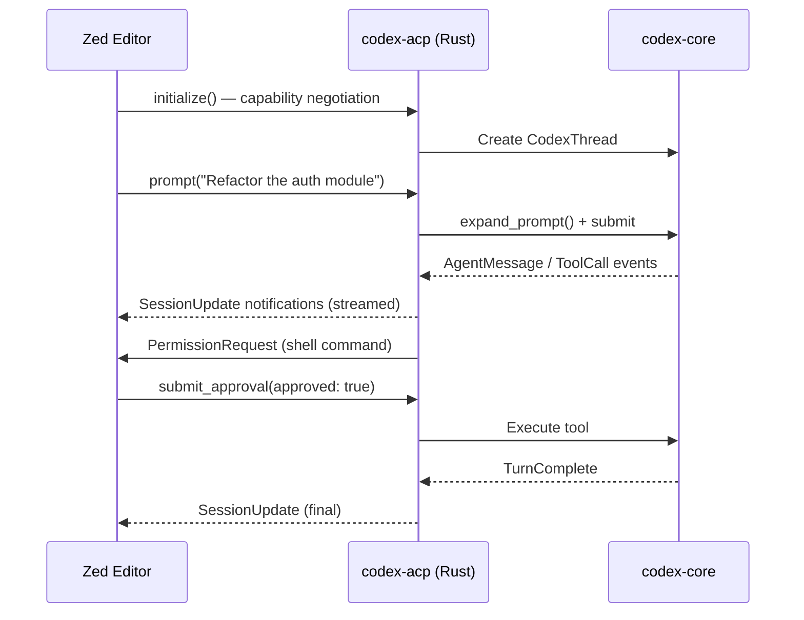
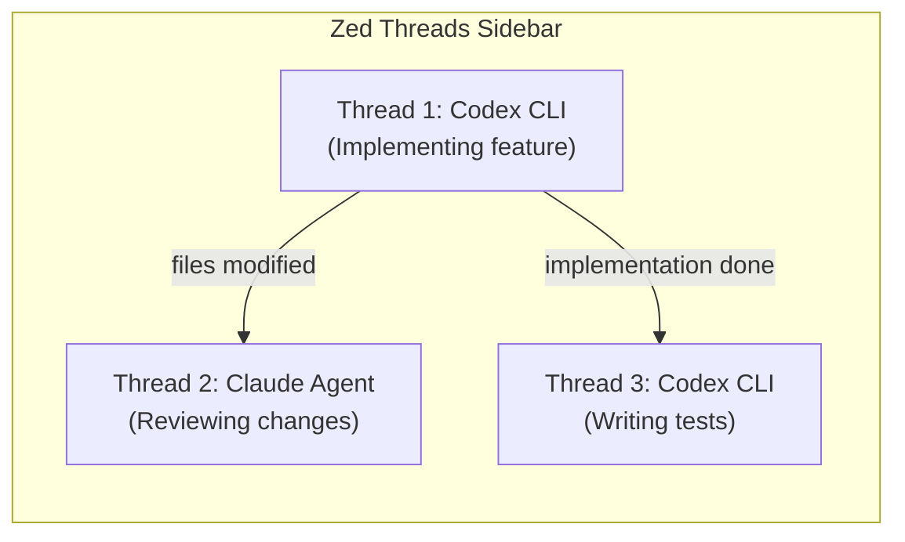

# Codex CLI in Zed 1.0: Parallel Agents, ACP Integration, and Multi-Agent IDE Workflows


---

Zed 1.0 shipped on 29 April 2026 with parallel agents as its headline AI feature[^1]. You can now run Codex CLI alongside Claude Agent, Gemini CLI, and any other ACP-compatible agent in the same window — each in its own thread, working concurrently on different parts of your codebase at 120 fps[^2]. This article covers the practical setup, the architecture that makes it work, and workflow patterns for getting the most out of Codex CLI inside Zed.

## Why Codex CLI in an Editor?

Codex CLI is a terminal-first tool. Running it inside Zed via the Agent Client Protocol gives you three things the raw terminal cannot:

1. **Shared file context** — Zed forwards your project's working directory, open files, and symbol references to Codex without manual `@`-mention gymnastics.
2. **Parallel orchestration** — The Threads Sidebar lets you spin up multiple Codex threads alongside other agents, grouped by project, with real-time progress monitoring[^2].
3. **Unified approval surface** — Tool executions (shell commands, file patches, network calls) surface as interactive approvals inside the editor rather than competing for a single terminal pane[^3].

The trade-off is reduced terminal interactivity: codex-acp runs in non-PTY mode to prevent agent deadlocks (for example, when `git rebase` waits for editor input)[^4].

## Architecture: How codex-acp Bridges the Gap

The `codex-acp` adapter is a Rust binary distributed via NPM (`@zed-industries/codex-acp`) with platform-specific native binaries for macOS, Linux, and Windows[^5]. It implements the ACP `Agent` trait and translates between two protocol worlds:



Key architectural decisions[^5]:

- **LocalSet-based async runtime** — single-threaded agent logic without `Send` bounds, with blocking file I/O offloaded via `tokio::spawn_blocking()`.
- **Session HashMap** — each thread maps a `SessionId` to an `Rc<Thread>` wrapping a `CodexThread` from codex-core.
- **Sandboxed filesystem** — `AcpFs` restricts operations to the project root, delegating through client-provided capabilities.
- **Deterministic serialisation** — `serde_json` with `preserve_order` for reproducible JSON-RPC payloads.

## Setup

### Prerequisites

- Zed ≥ 1.0 (build 0.208+)[^6]
- An OpenAI API key or active ChatGPT subscription
- Codex CLI config at `~/.codex/config.toml` (optional but recommended)

### First Launch

Open the agent panel with `Cmd+?` (macOS) or `Ctrl+?` (Linux/Windows), click `+`, and select **Codex**. Zed installs `codex-acp` automatically on first use — this managed installation takes precedence over any global `codex` binary[^6].

Authenticate using one of three methods:

| Method | When to use |
|--------|-------------|
| ChatGPT Login | Subscription-based access; limited in remote projects |
| `CODEX_API_KEY` | Dedicated Codex API key via environment |
| `OPENAI_API_KEY` | Standard OpenAI platform key |

To switch later, run `/logout` inside the thread and re-authenticate.

### Configuration via settings.json

Pass environment variables and defaults through Zed's `settings.json`:

```json
{
  "agent_servers": {
    "codex-acp": {
      "type": "registry",
      "env": {
        "CODEX_API_KEY": "${env:CODEX_API_KEY}",
        "CODEX_MODEL": "gpt-5.5"
      },
      "default_model": "gpt-5.5",
      "default_mode": "code"
    }
  }
}
```

Codex also reads `~/.codex/config.toml` directly — model selection, MCP servers, permission profiles, and AGENTS.md all apply as normal[^7]. MCP servers configured in both Zed's `context_servers` and Codex's native config are available within threads.

### Custom Keybinding

Bind Codex thread creation for rapid access:

```json
[
  {
    "bindings": {
      "cmd-alt-c": [
        "agent::NewExternalAgentThread",
        { "agent": { "custom": { "name": "codex-acp" } } }
      ]
    }
  }
]
```

## Parallel Agent Workflows

The Threads Sidebar (`Option+Cmd+J` on macOS) is the control surface for concurrent agents[^2]. Threads are grouped by project and support stop, archive, and real-time progress monitoring.

### Pattern 1: Codex + Claude Code Side-by-Side

Run a Codex thread for implementation and a Claude Agent thread for review simultaneously:



Each thread operates independently. Codex threads inherit your `config.toml` profiles, so you can use different reasoning effort levels per thread by switching models with `/model` or the ACP `set_session_model()` method mid-conversation[^5].

### Pattern 2: Multi-Service Monorepo Sprint

For polyglot monorepos, dedicate one thread per service boundary:

1. **Thread 1** — Codex on `services/auth/` with Go-specific AGENTS.md
2. **Thread 2** — Codex on `services/billing/` with TypeScript conventions
3. **Thread 3** — Claude Agent reviewing the integration contract between them

Zed forwards the correct working directory per thread, so each agent sees only its relevant context.

### Pattern 3: Exploration Then Execution

Use the Codex `explorer` built-in role for read-only codebase analysis, then spawn a separate `worker` thread for implementation:

1. Open a thread, ask: "Map the dependency graph of the payment module — which files would change if we swap Stripe for Adyen?"
2. Review the analysis in the Threads Sidebar
3. Open a new Codex thread with `/mode auto` and paste the implementation plan

## Supported ACP Methods

codex-acp exposes the following capabilities[^5]:

| Method | Purpose |
|--------|---------|
| `initialize()` | Capability negotiation; advertises auth methods |
| `authenticate()` | ChatGPT OAuth, `CODEX_API_KEY`, `OPENAI_API_KEY` |
| `new_session()` | Creates conversation with MCP server config |
| `prompt()` | Submits input, streams event responses |
| `cancel()` | Aborts ongoing operations |
| `set_session_mode()` | Switches approval mode (auto/manual) |
| `set_session_model()` | Changes LLM model mid-session |

### Slash Commands

Codex advertises its slash commands to Zed via ACP's `AvailableCommands` mechanism[^5]:

- `/review` — Code review with change suggestions
- `/review-branch`, `/review-commit` — VCS-aware analysis
- `/init` — Repository initialisation
- `/compact` — Conversation history compression
- `/logout` — Clear stored credentials

Custom prompts defined in your Codex configuration also appear as available commands.

## What Zed Forwards (and What It Doesn't)

Understanding the boundary is critical for correct configuration:

| Forwarded | Not forwarded |
|-----------|---------------|
| Model selection | Zed Profiles (first-party only) |
| Mode selection | Tool permissions (handled by Codex) |
| Environment variables from `agent_servers` | Rules files |
| MCP servers from `context_servers` | |
| Working directory (project root) | |

This means your Codex `config.toml` remains the source of truth for permission profiles, deny-read policies, and sandbox mode[^7]. Zed's `agent_servers.env` block supplements rather than replaces Codex's native configuration.

## Debugging

When things go wrong, open the Command Palette and run **dev: open acp logs** to inspect the JSON-RPC messages exchanged between Zed and codex-acp[^6]. Common issues:

- **Authentication failures** — Ensure `CODEX_API_KEY` is set in your shell environment or in `agent_servers.env`
- **MCP servers not loading** — Remote OAuth-based MCP servers have known issues via ACP; prefer stdio-based servers[^6]
- **Stale codex-acp version** — Zed manages its own installation; restart Zed to pick up updates

## Limitations

- **No PTY mode** — Terminal output loses colour and interactive prompts are suppressed to prevent deadlocks[^4]
- **No thread history resumption** — Unlike native Zed threads, external agent threads cannot be resumed from history[^6]
- **No past message editing** — ACP external agents do not support editing previously sent messages[^6]
- **No checkpointing** — The rollback/checkpoint workflow available in Zed's first-party agent is absent for external agents

## Decision Framework

| Scenario | Recommendation |
|----------|---------------|
| Deep terminal interaction needed (git rebase, interactive debuggers) | Use Codex CLI directly in terminal |
| Multi-file refactoring with editor context | Codex via Zed ACP |
| Parallel agent orchestration across services | Zed Parallel Agents with mixed Codex + Claude threads |
| CI/CD automation | `codex exec` headless — ACP adds no value |
| Code review alongside implementation | Two parallel threads (Codex implement, Claude review) |

## What to Watch

- **Thread history persistence** — Zed Discussion #48304 tracks multi-agent conversation history for external agents[^8]
- **Per-project agent servers** — Discussion #54499 proposes per-project `agent_servers` configuration, enabling project-specific Codex profiles[^9]
- **JetBrains ACP** — JetBrains is implementing ACP support, which will bring the same codex-acp adapter to IntelliJ-family IDEs[^10]

## Citations

[^1]: [Zed 1.0 Release](https://zed.dev/blog/zed-1-0) — Zed Industries, 29 April 2026
[^2]: [Introducing Parallel Agents in Zed](https://zed.dev/blog/parallel-agents) — Zed Blog, 22 April 2026
[^3]: [codex-acp Architecture — DeepWiki](https://deepwiki.com/zed-industries/codex-acp) — Accessed May 2026
[^4]: [Codex is Live in Zed](https://zed.dev/blog/codex-is-live-in-zed) — Zed Blog, 16 October 2025
[^5]: [zed-industries/codex-acp GitHub Repository](https://github.com/zed-industries/codex-acp) — Zed Industries
[^6]: [Zed External Agents Documentation](https://zed.dev/docs/ai/external-agents) — Zed Docs
[^7]: [Codex CLI Configuration Reference](https://developers.openai.com/codex/config-reference) — OpenAI Developers
[^8]: [ACP Agents - Multi Agent Conversations and History — Discussion #48304](https://github.com/zed-industries/zed/discussions/48304) — Zed GitHub
[^9]: [Allow per-project agent servers — Discussion #54499](https://github.com/zed-industries/zed/discussions/54499) — Zed GitHub
[^10]: [Agent Client Protocol](https://zed.dev/acp) — Zed Industries
