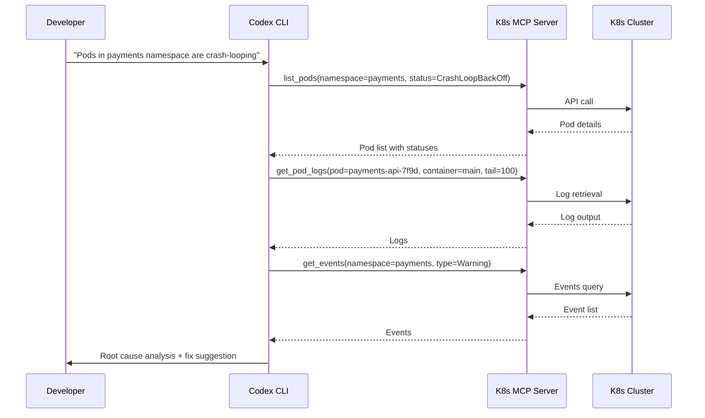
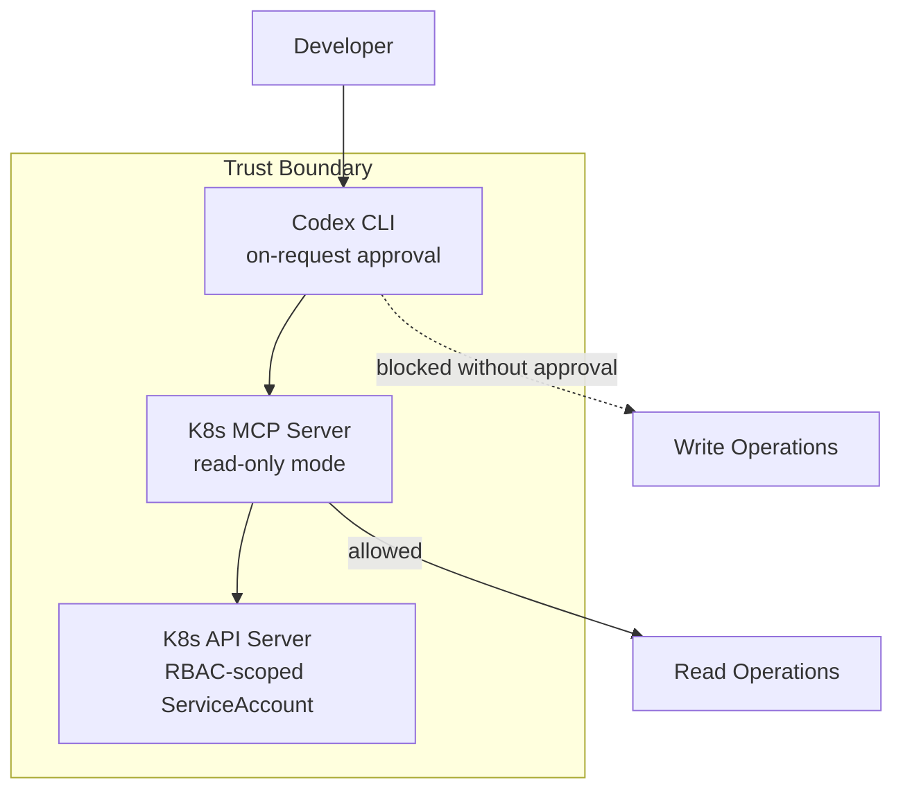

# Codex CLI and Kubernetes: MCP Servers, Helm Chart Workflows, and Cluster Debugging


---

Kubernetes development involves a constant dance between YAML manifests, Helm chart templating, cluster state inspection, and debugging misbehaving pods. Codex CLI can handle all of these — but only if it can see your cluster. Out of the box, Codex has no Kubernetes awareness. Connect it to a Kubernetes MCP server, however, and it gains live cluster context: pod status, event streams, Helm releases, logs, and even the ability to apply manifests or roll back deployments.

This article covers how to wire Codex CLI into a Kubernetes workflow using MCP servers, how to generate and manage Helm 4.x charts with agent assistance, and how to debug cluster issues without leaving your terminal.

## The Kubernetes MCP Server Landscape

Two mature MCP servers dominate the Kubernetes space in mid-2026, each with a distinct architecture.

### kubectl-mcp-server

Published in the CNCF Landscape[^1], `kubectl-mcp-server` wraps the `kubectl` and `helm` CLI tools, exposing over 250 tools across troubleshooting, deployment, cost optimisation, and security auditing[^2]. It requires `kubectl` (and optionally `helm`) to be installed on the host. Available via npm or pip:

```bash
npm install -g kubectl-mcp-server
# or
pip install kubectl-mcp-server
```

### containers/kubernetes-mcp-server

Maintained by the Containers organisation on GitHub, this Go-native implementation talks directly to the Kubernetes API server without shelling out to `kubectl`[^3]. The result is lower latency, no external binary dependencies, and a modular toolset architecture that lets you enable only the capabilities you need:

| Toolset | Purpose | Default |
|---------|---------|---------|
| `config` | Kubeconfig management | Enabled |
| `core` | Pods, Events, Namespaces | Enabled |
| `helm` | Chart install, list, uninstall | Disabled |
| `tekton` | Pipeline and task execution | Disabled |
| `kiali` | Service mesh observability | Disabled |
| `kubevirt` | Virtual machine management | Disabled |

This toolset gating is particularly useful with Codex CLI, where minimising the number of exposed tools reduces context consumption and avoids tool-selection confusion[^4].

## Configuring Codex CLI for Kubernetes

Both servers integrate via Codex CLI's standard MCP configuration in `~/.codex/config.toml`. The key detail: use `mcp_servers` (with an underscore), not `mcp-servers`[^5].

### Option 1: kubectl-mcp-server (npm)

```toml
[mcp_servers.kubernetes]
command = "npx"
args = ["-y", "kubectl-mcp-server"]

[mcp_servers.kubernetes.env]
KUBECONFIG = "/home/dev/.kube/config"
```

### Option 2: containers/kubernetes-mcp-server (native binary)

```toml
[mcp_servers.k8s]
command = "/usr/local/bin/kubernetes-mcp-server"
args = ["--toolsets", "config,core,helm", "--read-only"]
```

The `--read-only` flag prevents all write operations — a sensible default for production clusters[^3]. Remove it for development environments where you want Codex to apply manifests directly.

### Project-Scoped Configuration

For team projects, place MCP configuration in `.codex/config.toml` at the repository root. Codex will load it automatically for trusted projects, giving every team member the same Kubernetes tooling without manual setup[^5]:

```toml
# .codex/config.toml (committed to repo)
[mcp_servers.k8s-staging]
command = "npx"
args = ["-y", "kubectl-mcp-server"]

[mcp_servers.k8s-staging.env]
KUBECONFIG = ".kube/staging-config"
```

## Helm Chart Generation Workflows

Helm 4.x, released in late 2025, brought server-side apply (SSA) as the default installation strategy[^6]. This changes how templates handle field ownership and conflicts — and Codex CLI is well-positioned to generate charts that follow Helm 4 conventions, provided you give it the right instructions.

### AGENTS.md for Kubernetes Projects

An `AGENTS.md` file at the project root ensures Codex follows your cluster conventions:

```markdown
# AGENTS.md

## Kubernetes Conventions

- Target Kubernetes 1.32+ and Helm 4.1
- Use server-side apply (SSA) — do NOT set `--force` on install
- All manifests must include resource requests and limits
- Use `app.kubernetes.io/` standard labels on every resource
- NetworkPolicy is mandatory for every namespace
- Secrets must reference ExternalSecrets, never inline values
- Prefer `RollingUpdate` strategy with `maxUnavailable: 0`

## Helm Chart Structure

- Follow the Helm 4 chart layout: Chart.yaml, values.yaml, templates/
- Include _helpers.tpl for all template functions
- Every values.yaml key must have a comment explaining its purpose
- Tests go in templates/tests/ using helm test conventions
```

### Generating a Chart from Scratch

With the Kubernetes MCP server connected, Codex can inspect your running services and generate a matching Helm chart:

```
> Look at the running deployments in the staging namespace and generate
  a Helm 4 chart that reproduces this setup. Include resource limits
  matching current usage, HPA configs, and a values.yaml with
  environment-specific overrides for staging and production.
```

Codex will use the MCP server to query deployments, services, configmaps, and HPAs, then scaffold a complete chart directory. The MCP connection means it works from live cluster state rather than hallucinating resource names.

### Chart Review and Linting

For existing charts, combine Codex CLI's `/review` command with the MCP server's Helm toolset:

```
> /review -- Focus on Helm 4 SSA compatibility, missing resource
  limits, and security context gaps. Cross-reference values.yaml
  defaults against our staging cluster's actual resource usage.
```

## Cluster Debugging Patterns

The highest-value use of Kubernetes MCP servers with Codex CLI is interactive debugging. Instead of manually cycling through `kubectl describe`, `kubectl logs`, and `kubectl get events`, you describe the symptom and let Codex investigate.

### The Debugging Flow



### Practical Debugging Examples

**OOMKilled pods:**

```
> The order-processor pods keep getting OOMKilled. Check their
  current memory limits, actual memory usage from metrics,
  and recent events. Suggest new limits based on the p95 usage.
```

**Failed rolling update:**

```
> The last deployment of auth-service is stuck with unavailable
  replicas. Check the rollout status, new pod logs, and events.
  If the new pods are failing, show me what changed and draft
  a rollback command.
```

**Network policy debugging:**

```
> Service A in namespace frontend can't reach Service B in
  namespace backend. Check the NetworkPolicies in both namespaces,
  verify the label selectors match, and show me what's blocking.
```

### Permission Profiles for Cluster Work

When debugging production clusters, use Codex CLI's permission profiles to prevent accidental writes[^7]:

```toml
# ~/.codex/config.toml
[profiles.k8s-prod]
model = "o3"
approval_policy = "on-request"

[profiles.k8s-dev]
model = "o4-mini"
approval_policy = "auto-edit"
```

Run with `codex --profile k8s-prod` for production investigation. The `on-request` approval policy means Codex will show you every `kubectl apply` or `helm upgrade` command before executing it.

## Multi-Cluster Workflows

Both MCP servers support multi-cluster management through kubeconfig contexts. The Go-native server handles this particularly well — every tool accepts an optional `context` parameter, so Codex can query staging and production clusters in the same session without switching contexts[^3].

A common pattern for comparing environments:

```
> Compare the deployment specs for payment-service across
  the staging and production contexts. Highlight any differences
  in resource limits, replica counts, image tags, and environment
  variables. Format as a table.
```

## CI/CD Integration with `codex exec`

For automated Kubernetes validation in CI pipelines, use `codex exec` with the MCP server:

```bash
codex exec \
  --sandbox workspace-write \
  --model o4-mini \
  --output-schema '{"type":"object","properties":{"issues":{"type":"array","items":{"type":"string"}},"severity":{"type":"string","enum":["pass","warn","fail"]}},"required":["issues","severity"]}' \
  "Review all Helm charts in deploy/ for security issues, missing
   resource limits, and Kubernetes 1.32 deprecations. Return structured
   results."
```

The `--output-schema` flag ensures machine-parseable output that your pipeline can gate on[^8].

## Security Considerations

Running an MCP server with cluster access inside Codex CLI requires careful thought about trust boundaries:

1. **Read-only by default** — Start every MCP server in read-only mode. Only enable writes for development clusters where Codex needs to apply changes[^3].

2. **Scoped kubeconfigs** — Do not hand Codex a cluster-admin kubeconfig. Create a dedicated ServiceAccount with RBAC scoped to the namespaces and verbs the agent actually needs.

3. **Sandbox alignment** — Codex CLI's sandbox should match the MCP server's permissions. A read-only MCP server paired with `approval_policy = "on-request"` is the safest combination for production work[^7].

4. **Secret redaction** — The Go-native server supports sensitive data redaction in client logs, preventing Kubernetes secrets from leaking into Codex session transcripts[^3].



## What to Watch

The Kubernetes MCP server ecosystem is maturing rapidly. The Go-native server added Tekton pipeline support and Kiali service mesh observability in recent releases[^3]. The CNCF-listed `kubectl-mcp-server` now includes cost optimisation tools that map resource usage to estimated cloud spend[^2]. As Codex CLI's plugin marketplace grows, expect packaged Kubernetes plugins that bundle an MCP server, AGENTS.md conventions, and deployment skills into a single installable unit.

For teams already using Codex CLI for application development, adding Kubernetes MCP integration closes the gap between writing code and deploying it — all without leaving the terminal.

## Citations

[^1]: [kubectl-mcp-server — CNCF Landscape and GitHub](https://github.com/rohitg00/kubectl-mcp-server)
[^2]: [kubectl-mcp-server README — 253 tools, 8 workflow prompts](https://github.com/rohitg00/kubectl-mcp-server#features)
[^3]: [containers/kubernetes-mcp-server — Go-native implementation](https://github.com/containers/kubernetes-mcp-server)
[^4]: [Codex CLI MCP Configuration — OpenAI Developers](https://developers.openai.com/codex/mcp)
[^5]: [Codex CLI Config Basics — MCP Server Configuration](https://developers.openai.com/codex/config-basic)
[^6]: [Helm 4.0.0 Release — Server-Side Apply](https://helm.sh/)
[^7]: [Codex CLI Permission Profiles — OpenAI Developers](https://developers.openai.com/codex/config-advanced)
[^8]: [Codex CLI Non-Interactive Mode — Structured Output](https://developers.openai.com/codex/noninteractive)
