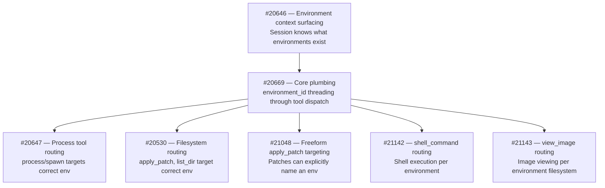
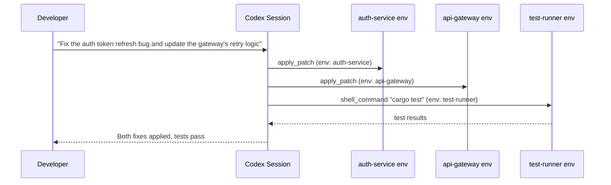

# Codex CLI Multi-Environment Sessions: One Conversation, Many Targets


---

Until May 2026, every Codex CLI session was anchored to a single execution context — one working directory, one sandbox, one filesystem. If you needed to touch a second service in a monorepo, you opened a second session. If you wanted to fix staging while reading production logs, you juggled terminals. The v0.129 alpha series changes that: a single Codex session can now route individual tool calls to different environments — local, remote, or containerised — within the same conversation [^1].

This article dissects the architecture, walks through the PR stack that enabled it, and shows practical patterns for monorepo, remote-development, and enterprise workflows.

## The Problem: Single-Environment Lock-In

Codex CLI's sandbox model has always been per-session. You launch `codex` from a project root, and every `apply_patch`, `shell_command`, and `list_dir` targets that single directory tree. For microservice architectures, polyglot monorepos, and hybrid local-remote setups, this creates friction:

- **Monorepo pain:** Fixing a frontend bug that requires a corresponding backend change means two sessions, two approvals, two mental contexts.
- **Remote-local split:** You edit locally but need to run integration tests on a staging server — so you SSH separately and lose conversational continuity.
- **Enterprise isolation:** Staging writes and production reads need different permission profiles, forcing separate sessions with separate configs.

## Architecture: Environment Registry and Tool Routing

The multi-environment feature rests on two foundations introduced across the v0.125–v0.129 release cycle: the **EnvironmentManager** registry and **per-tool-call environment routing** [^2][^3].

### EnvironmentManager

PR #18401 refactored the `EnvironmentManager` from a single-environment holder into a keyed registry [^2]. Each environment gets a unique identifier and its own execution context (working directory, sandbox configuration, permission profile). The manager exposes three lookup paths:

- **Default environment** — the project root, returned as `Option` (absent when access is disabled via `CODEX_EXEC_SERVER_URL=none`)
- **Local environment** — always available as an internal fallback
- **Arbitrary ID lookup** — retrieves any registered environment by key

Remote exec-server connections are lazy: they initialise only when an environment is first used for execution or filesystem operations, avoiding startup overhead for environments that may never be touched in a given session [^2].

### Turn-Scoped Environment Selection

PR #18416 added experimental `environments` parameters to the `turn/start` and `thread/start` API calls [^3]. The semantic model distinguishes three cases:

| `environments` value | Behaviour |
|---------------------|-----------|
| Omitted | Inherit the thread's sticky environments |
| Empty array `[]` | No environment access for this turn |
| Explicit IDs | Override sticky selection for this turn only |

Each entry in the array can include a per-environment `cwd`, allowing the model to target a specific subdirectory within an environment [^3]. Resolution happens server-side before turn execution begins — an invalid ID fails fast at turn initialisation rather than mid-execution [^3].

### Sticky Environments

The v0.125.0 release introduced **sticky environments** at the thread level [^4]. Once set, they persist across turns unless explicitly overridden. This means a monorepo session can declare its environments once at thread start and every subsequent turn inherits them without repetition.

## The Tool-Routing PR Stack

Between May 2 and May 5, a sequence of seven PRs systematically threaded `environment_id` through every tool surface [^1][^5]:



The core pattern is consistent: the model emits a tool call containing an `environment_id` field; the `ToolRouter` resolves it via the `EnvironmentManager`; the tool executes against the resolved environment's working directory and sandbox [^5].

### Freeform Patch Special Case

Most tool calls use JSON payloads where adding an `environment_id` field is trivial. The exception is freeform `apply_patch`, which accepts raw unified-diff text without a JSON wrapper. PR #21048 addressed this by extending the freeform parser to accept environment targeting metadata [^1].

## Practical Patterns

### Pattern 1: Monorepo Multi-Service Fix

A typical microservice monorepo contains independent services that share a conversation but need isolated execution:



Each service runs in its own sandbox with its own dependencies, but the model maintains a single conversational context that understands the relationship between changes.

### Pattern 2: Remote TUI with Environment Routing

Codex CLI already supports remote TUI mode via the app-server [^6]:

```bash
# On the remote host
codex app-server --listen ws://0.0.0.0:4500 --ws-auth capability-token

# On your laptop
codex --remote ws://staging.internal:4500 --remote-auth-token-env CODEX_REMOTE_TOKEN
```

With multi-environment support, a single remote app-server can expose multiple environments — a development workspace, a staging sandbox, and a read-only production view — all accessible from one local TUI session [^6].

### Pattern 3: CI/CD Pipeline Integration

In non-interactive mode, `codex exec` can target different environments across a pipeline:

```bash
# Build in the build environment
codex exec --env build-env "Compile the project and run linters"

# Test in an isolated test environment
codex exec --env test-env "Run the full integration test suite"

# Deploy to staging (read-write)
codex exec --env staging-env "Deploy the latest build"
```

The `--env` flag selects a Codex Cloud environment by ID [^7]. For self-hosted setups, environment configuration flows through the app-server's thread-level sticky environments API.

### Pattern 4: Enterprise Regulated Deployment

Combine multi-environment routing with per-environment permission profiles for regulated workflows:

```toml
# config.toml — per-environment permission profiles

[permissions.staging.filesystem]
":project_roots" = { "." = "write" }

[permissions.staging.network]
enabled = true
mode = "limited"

[permissions.production.filesystem]
":project_roots" = { "." = "read" }

[permissions.production.network]
enabled = false
```

The agent writes freely to staging but can only read production — enforced at the sandbox level, not by prompt engineering [^8].

## Cloud Environments vs App-Server Environments

It is worth distinguishing two overlapping but distinct environment models:

| | Codex Cloud Environments | App-Server Environments |
|---|---|---|
| **Target** | Cloud-hosted containers | Local, remote, or custom sandboxes |
| **Configuration** | Web dashboard + setup scripts | `EnvironmentManager` registry via API |
| **Selection** | `--env ENV_ID` flag | `environments` parameter in `turn/start` |
| **Caching** | Container cached up to 12 hours [^9] | Session-scoped, lazy initialisation |
| **Network** | Proxy-controlled, off by default in agent phase [^9] | Per-profile network rules |

Cloud environments suit hosted CI/CD and Codex web workflows. App-server environments suit self-hosted, IDE-integrated, and enterprise-internal deployments. The `environment_id` concept is shared across both [^7][^9].

## Current Limitations

As of May 5 2026, the feature is still in the v0.129 alpha track. Known gaps [^1]:

- **MCP tool routing per environment** — not yet PRed. MCP calls currently route to the default environment regardless of `environment_id`.
- **TUI environment indicators** — the interactive TUI does not yet show which environment is active per turn.
- **`config.toml` environment definitions** — documentation for declaratively defining environments in configuration is pending.
- **Frodex fork inheritance** — forked sessions inherit parent environment context, but the interaction model between forked agents and shared environments needs further testing.

⚠️ The v0.129 alpha PRs are landing rapidly; some of the open PRs (#20646, #20647, #20530) may have merged by the time you read this. Check the [Codex changelog](https://developers.openai.com/codex/changelog) for the latest status.

## What to Watch

Multi-environment execution is arguably the most architecturally significant addition since subagents. It transforms Codex from a single-context tool into a multi-context orchestrator. The immediate next milestones to track:

1. **MCP routing** — once MCP tools respect `environment_id`, the full tool surface is covered.
2. **TUI indicators** — visual feedback on which environment each turn targets.
3. **Declarative environment config** — defining environments in `config.toml` rather than through the programmatic API.
4. **v0.129 stable promotion** — when these features graduate from alpha to the stable release channel.

For teams running monorepos, hybrid local-remote setups, or regulated multi-stage pipelines, this is the feature to start planning around.

---

## Citations

[^1]: Multi-Environment Execution Architecture — Consolidated View (May 2026). Internal research notes based on [openai/codex PRs](https://github.com/openai/codex/pulls) #20646, #20669, #20647, #20530, #21048, #21142, #21143.
[^2]: [PR #18401 — Support multiple managed environments](https://github.com/openai/codex/pull/18401). Refactors EnvironmentManager to keyed registry with default/local lookup.
[^3]: [PR #18416 — Add turn-scoped environment selections](https://github.com/openai/codex/pull/18416). Experimental `turn/start.environments` params for per-turn environment ID + cwd selections.
[^4]: [Codex CLI Changelog — v0.125.0 (April 24, 2026)](https://developers.openai.com/codex/changelog). App-server integrations now support sticky environments and remote thread config/store plumbing.
[^5]: [PR #20669 — Prepare selected environment plumbing](https://github.com/openai/codex/pull/20669). Core plumbing adding `environment_id` threading through the tool-call pipeline.
[^6]: [Codex CLI Features — Remote TUI mode](https://developers.openai.com/codex/cli/features). Remote TUI lets you run the app server on one machine and the terminal UI from another.
[^7]: [Codex CLI Reference — Command line options](https://developers.openai.com/codex/cli/reference). `--env` flag for targeting Codex Cloud environment identifiers.
[^8]: [Codex Advanced Configuration — Permission profiles](https://developers.openai.com/codex/config-advanced). Named permission profiles with per-profile filesystem and network rules.
[^9]: [Codex Cloud Environments](https://developers.openai.com/codex/cloud/environments). Cloud environment configuration, container caching, setup scripts, and network access controls.
