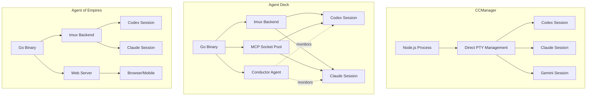
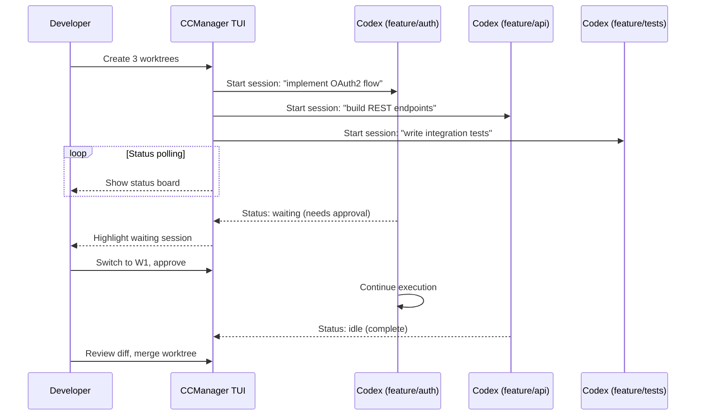

# Agent Session Managers for Codex CLI: CCManager, Agent Deck, and the Emerging Orchestration Layer


---

Running a single Codex CLI session is straightforward. Running six in parallel — each on a separate worktree, each targeting a different feature branch, with clear visibility into which sessions are idle, waiting for approval, or actively executing — is where the complexity lives. A new category of open-source tooling has emerged in early 2026 to solve precisely this problem: **agent session managers**.

This article examines the three leading session managers that support Codex CLI, explains their architectural differences, and offers practical guidance on choosing and configuring the right one for your workflow.

## The Problem: Terminal Entropy at Scale

When you run multiple `codex` processes in separate terminal tabs, you quickly encounter:

- **Status blindness** — no single view showing which agents are busy, waiting, or idle
- **Context switching cost** — hunting through tmux panes or terminal tabs to find the session that needs input
- **Worktree management overhead** — manually creating, tracking, and cleaning up git worktrees
- **No coordination** — agents cannot be paused, resumed, or restarted from a central interface

Codex CLI's native session persistence (`~/.codex/sessions`) handles thread continuation[^1], but it offers no multi-session orchestration layer. The session managers fill this gap.

## The Contenders

### CCManager

CCManager is a Node.js CLI application supporting eight coding agents including Codex CLI, Claude Code, Gemini CLI, Cursor Agent, Copilot CLI, Cline CLI, OpenCode, and Kimi CLI[^2]. It takes a self-contained approach — no tmux dependency required.

**Installation:**

```bash
npm install -g ccmanager
# or run without installing:
npx ccmanager
```

**Key capabilities:**

- **Worktree lifecycle management** — create, merge, and delete git worktrees from within the TUI
- **Session state detection** — per-agent state machines identifying busy, waiting, and idle states
- **Context preservation** — copy session data (conversation history, project state) between worktrees[^2]
- **Status change hooks** — execute custom commands when session states change
- **Auto-approval (experimental)** — AI-driven approval of safe prompts to reduce human intervention
- **Devcontainer support** — run sessions inside containers while managing from the host[^2]

**Codex CLI integration:**

```json
// .ccmanager.json (project root)
{
  "defaultAssistant": "codex",
  "worktree": {
    "autoDirectory": true,
    "copySessionData": false
  },
  "hooks": {
    "onStatusChange": "notify-send 'Codex session changed: ${status}'"
  }
}
```

CCManager detects Codex CLI sessions via tailored state detection, identifying the three states (running, waiting for input, idle) through terminal output parsing[^2].

### Agent Deck

Agent Deck is a Go-based TUI that positions itself as "your AI agent command centre"[^3]. It supports Claude Code, OpenCode, Codex CLI, and Gemini CLI with a focus on resource efficiency and advanced orchestration.

**Distinguishing features:**

- **MCP Socket Pool** — shares MCP server processes via Unix sockets across sessions, reducing memory usage by 85–90% compared to per-session MCP instances[^3]
- **Conductor sessions** — persistent orchestrator agents that monitor child sessions, auto-respond when confident, and escalate to the human when they cannot[^3]
- **Cost tracking** — real-time token usage and cost aggregation across all sessions with support for 13+ model pricing tiers[^3]
- **Telegram/Slack integration** — remote monitoring and control from mobile devices[^3]
- **Docker sandbox isolation** — containerised sessions with shared authentication volumes

**Installation:**

```bash
# Download from GitHub releases
curl -sSL https://github.com/asheshgoplani/agent-deck/releases/latest/download/install.sh | bash
```

**Session polling architecture:**

Agent Deck polls each session every 2 seconds, displaying status indicators:

| Symbol | State | Meaning |
|--------|-------|---------|
| ● | Running | Agent actively executing |
| ◐ | Waiting | Awaiting human approval |
| ○ | Idle | Session open, no activity |
| ✕ | Error | Session crashed or timed out |

### Agent of Empires (AoE)

Agent of Empires wraps tmux with agent-aware functionality, supporting Claude Code, Codex CLI, Gemini CLI, Mistral Vibe, Cursor CLI, Copilot CLI, Pi.dev, and Factory Droid[^4]. Its distinguishing feature is a **web dashboard with remote phone access**.

**Key differentiators:**

- **Persistent sessions** — agents continue running after closing the TUI or disconnecting SSH[^4]
- **HTTPS web dashboard** — QR code and passphrase authentication for mobile access
- **Built-in diff viewer** — review and edit changes without leaving the TUI[^4]
- **Automatic agent detection** — discovers installed agents on system startup

```bash
# Start with web dashboard on port 8080
aoe --web --port 8080
```

## Architecture Comparison



## Feature Matrix

| Feature | CCManager | Agent Deck | Agent of Empires |
|---------|-----------|------------|------------------|
| **Language** | Node.js | Go | Go |
| **tmux required** | No | Yes | Yes |
| **Codex CLI support** | ✓ | ✓ | ✓ |
| **Agents supported** | 8 | 4+ | 10 |
| **Worktree management** | ✓ | ✓ | ✓ |
| **MCP pooling** | ✗ | ✓ (85–90% savings) | ✗ |
| **Conductor/orchestrator** | ✗ | ✓ | ✗ |
| **Cost tracking** | ✗ | ✓ | ✗ |
| **Web dashboard** | ✗ | ✗ | ✓ |
| **Mobile access** | ✗ | Telegram/Slack | HTTPS + QR |
| **Devcontainer support** | ✓ | Docker sandbox | Docker sandbox |
| **Auto-approval** | Experimental | Via conductor | ✗ |
| **Session data copying** | ✓ (Claude) | ✗ | ✗ |
| **Licence** | MIT | MIT | MIT |

## Configuring Codex CLI for Session Managers

All three tools benefit from Codex CLI's native configuration. Key settings that improve session manager integration:

```toml
# ~/.codex/config.toml

# Enable structured output for easier state parsing
[output]
format = "json"

# Permission profile that reduces approval interrupts
[permissions]
profile = "default"

# Ensure sessions are resumable
[session]
persist = true
```

For headless contexts where a session manager handles approval, Codex CLI's `--approval-mode` flag controls whether the agent pauses for human input:

```bash
# Full autonomy (session manager handles oversight)
codex --approval-mode full-auto --model o4-mini "implement the auth module"

# Suggest mode (agent proposes, session manager shows diff)
codex --approval-mode suggest "refactor the database layer"
```

## Workflow: Three-Agent Sprint with CCManager

A practical pattern for feature development using CCManager with Codex CLI:



## When to Use What

**Choose CCManager if:**

- You want zero external dependencies (no tmux)
- You need session data copying between worktrees
- You work across many different CLI agents
- You prefer Node.js for extensibility

**Choose Agent Deck if:**

- You run many concurrent sessions and MCP memory usage matters
- You want conductor-based automated orchestration
- Cost visibility across sessions is important
- You need Telegram/Slack notifications

**Choose Agent of Empires if:**

- You need remote access from a phone or tablet
- You already use tmux and want agent-aware enhancements
- You work via SSH and need persistent sessions that survive disconnects
- You want a built-in diff viewer for quick reviews

## The Convergence Pattern

These tools are converging on a common architecture: a **session supervisor** that wraps terminal processes, detects agent state through output parsing, manages git worktrees for isolation, and provides a unified status view. As Codex CLI's own MultiAgentV2 system matures with explicit thread caps and subagent orchestration[^5], the boundary between external session managers and native multi-agent support will blur.

The most likely outcome by late 2026: session managers become the **UX layer** while Codex CLI's native orchestration handles the **coordination protocol**. Today, they remain complementary — use the session manager for visibility and lifecycle control, and Codex CLI's built-in subagents for task decomposition within a single session.

## Citations

[^1]: OpenAI, "Features – Codex CLI," OpenAI Developers, 2026. [https://developers.openai.com/codex/cli/features](https://developers.openai.com/codex/cli/features)

[^2]: kbwo, "CCManager: Coding Agent Session Manager," GitHub, 2026. [https://github.com/kbwo/ccmanager](https://github.com/kbwo/ccmanager)

[^3]: Ashesh Goplani, "Agent Deck: Terminal session manager for AI coding agents," GitHub, 2026. [https://github.com/asheshgoplani/agent-deck](https://github.com/asheshgoplani/agent-deck)

[^4]: njbrake, "Agent of Empires: Manage multiple Claude Code, OpenCode agents from TUI or Web," GitHub, 2026. [https://github.com/njbrake/agent-of-empires](https://github.com/njbrake/agent-of-empires)

[^5]: OpenAI, "Changelog – Codex," OpenAI Developers, 2026. [https://developers.openai.com/codex/changelog](https://developers.openai.com/codex/changelog)
