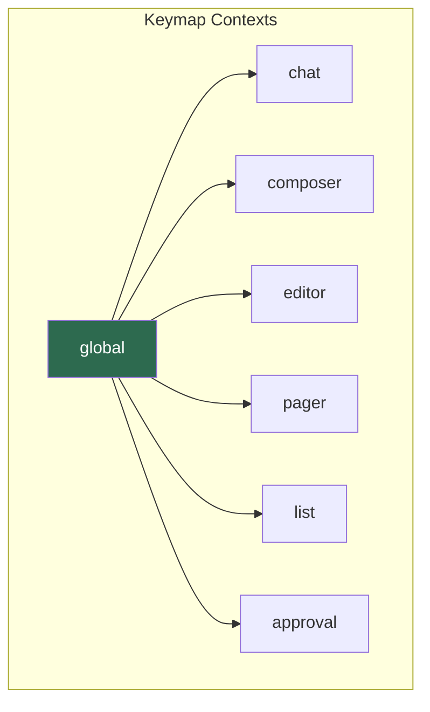
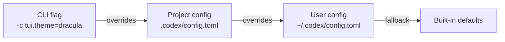

# Codex CLI TUI Customisation: Keymaps, Themes, Status Lines and Terminal Titles


---

Codex CLI's terminal user interface ships with sensible defaults, but developers who spend hours inside the TUI each day quickly want control over keybindings, syntax highlighting colours, the status line layout, and terminal title behaviour. Since v0.128.0, the CLI exposes a comprehensive `tui.*` configuration namespace in `config.toml` that covers all four areas[^1]. This article is a practical reference for every customisation surface, with recipes for common editor-muscle-memory setups.

## Keymap Configuration

### The Problem Keymaps Solve

Before configurable keymaps landed, Codex's built-in shortcuts clashed with terminal emulators, tmux prefix keys, and decade-old muscle memory. GitHub issue #3049 catalogued dozens of conflicts — Ctrl+L bound to "clear screen" in most terminals collided with Codex's "clear context" action[^2]. The solution was a layered keymap system that lets users rebind every action.

### Contexts and Actions

Keymaps are scoped to seven **contexts**, each governing a distinct part of the TUI[^1][^3]:



When a key is pressed, the TUI checks the **current context** first. If no binding matches, it falls back to the **global** context. This means you can set a global shortcut and override it in a single context without affecting the others.

### Configuration Syntax

Bindings live under `tui.keymap.<context>.<action>` in `config.toml`[^1][^3]:

```toml
# ~/.codex/config.toml

[tui.keymap.global]
open_transcript = "ctrl-t"
toggle_plan = "ctrl-g"
open_external_editor = "ctrl-o"
clear_context = "ctrl-shift-l"   # avoid clash with terminal clear

[tui.keymap.composer]
submit = ["enter", "ctrl-m"]     # arrays bind multiple keys
history_prev = "ctrl-p"
history_next = "ctrl-n"

[tui.keymap.approval]
approve = "y"
reject = "n"
```

Key names use a normalised format: modifiers in lowercase (`ctrl-`, `shift-`, `alt-`), followed by the key name (`a`–`z`, `enter`, `tab`, `page-down`, `f1`–`f12`)[^3]. To **unbind** an action entirely, assign an empty array:

```toml
[tui.keymap.global]
open_external_editor = []   # disable Ctrl+O
```

### Recipe: Vim-Style Navigation

Vim users can remap the list and pager contexts to feel familiar:

```toml
[tui.keymap.list]
up = "k"
down = "j"
select = "enter"

[tui.keymap.pager]
scroll_up = "k"
scroll_down = "j"
page_up = "ctrl-u"
page_down = "ctrl-d"
top = "g"
bottom = "shift-g"
```

### Recipe: Emacs-Style Composer

```toml
[tui.keymap.composer]
submit = "ctrl-j"
cursor_left = "ctrl-b"
cursor_right = "ctrl-f"
delete_word_back = "alt-backspace"
history_prev = "ctrl-p"
history_next = "ctrl-n"
```

### The /keymap Slash Command

For quick inspection without leaving the TUI, the `/keymap` slash command displays the active keymap for every context, including any overrides from your config[^4]. This is the fastest way to diagnose a conflict — run `/keymap`, find the action, and check which key is bound.

## Syntax Highlighting Themes

### The Theme Engine

Codex CLI uses the **syntect** library for syntax highlighting, the same engine behind `bat` and other Rust-based terminal tools. It ships with 32 bundled themes and supports custom TextMate `.tmTheme` files[^1][^5].

### Selecting a Theme

Set the theme in `config.toml` using its kebab-case name:

```toml
# ~/.codex/config.toml
tui.theme = "dracula"
```

Or switch interactively with the `/theme` slash command, which opens a picker showing a live preview of each theme applied to a code sample[^4]. The selection persists to your config file.

### Custom Themes

Drop any `.tmTheme` file into `$CODEX_HOME/themes/` (default `~/.codex/themes/`) and it becomes available by name — the filename minus the extension, converted to kebab-case[^5]. For example:

```
~/.codex/themes/my-company-dark.tmTheme
```

becomes selectable as `my-company-dark` in `/theme` or `config.toml`.

## Status Line Configuration

The status line — the persistent footer at the bottom of the TUI — is fully configurable via an ordered array of item identifiers[^1][^3]:

```toml
# Show model, approval mode, and context usage (left to right)
tui.status_line = ["model", "approval", "context_usage"]
```

Available status line items include: `model`, `approval`, `context_usage`, `session_id`, `sandbox`, `cwd`, and `spinner`. The order of the array determines the left-to-right layout. To disable the status line entirely:

```toml
tui.status_line = null
```

Disabling the status line reclaims one terminal row — marginal on a desktop monitor, meaningful on a laptop with a 13-inch display running Codex inside a tmux pane.

## Terminal Title

Codex writes dynamic information to the terminal title bar, configurable via[^1][^3]:

```toml
tui.terminal_title = ["spinner", "project"]
```

The default shows an activity spinner and the project directory name. You can include `model`, `session_id`, or `branch` for additional context. Set to an empty array to leave the terminal title untouched — useful if your terminal multiplexer already manages titles:

```toml
tui.terminal_title = []
```

## Display and Notification Options

Several boolean and enum options fine-tune the visual experience[^1][^3]:

| Option | Type | Default | Purpose |
|--------|------|---------|---------|
| `tui.animations` | boolean | `true` | Enable spinner and transition animations |
| `tui.alternate_screen` | enum | `auto` | `auto`, `always`, or `never` — controls whether Codex uses the alternate terminal buffer |
| `tui.notifications` | boolean / array | `true` | Desktop notifications on turn completion; array to filter event types |
| `tui.notification_method` | enum | `auto` | `auto`, `osc9`, or `bel` |
| `tui.notification_condition` | enum | `unfocused` | `unfocused` or `always` |
| `tui.show_tooltips` | boolean | `true` | Show keyboard shortcut hints in the UI |
| `disable_paste_burst` | boolean | `false` | Prevent paste-detection from triggering burst mode |

For SSH sessions or constrained environments, a minimal configuration disables everything non-essential:

```toml
tui.animations = false
tui.alternate_screen = "never"
tui.notifications = false
tui.show_tooltips = false
tui.terminal_title = []
```

## Configuration Layering

TUI settings follow the same layering as all Codex configuration: **project-level** (`.codex/config.toml` in the repository root) overrides **user-level** (`~/.codex/config.toml`), and command-line `-c` flags override both[^6]. This means a team can enforce a shared theme or keymap policy via a committed project config, whilst individual developers retain personal overrides at the user level.



Profiles (`[profiles.X]`) can also carry TUI settings, letting you switch entire visual configurations with `--profile`[^6]:

```toml
[profiles.presentation]
tui.theme = "github-light"
tui.animations = false
tui.show_tooltips = true

[profiles.focus]
tui.theme = "one-dark"
tui.status_line = null
tui.notifications = false
```

## Summary

The TUI customisation surface in Codex CLI is deliberately narrow — keymaps, themes, status line, terminal title, and a handful of display toggles — but it covers the friction points that matter most during extended sessions. Start with `/keymap` and `/theme` to explore what is available interactively, then codify your preferences in `config.toml`. For teams, commit a project-level config to align the experience across developers without overriding personal keybindings.

## Citations

[^1]: [Config reference — Codex CLI](https://developers.openai.com/codex/config-reference), OpenAI Developers, accessed May 2026
[^2]: [Configurable keybindings — Issue #3049](https://github.com/openai/codex/issues/3049), GitHub, 2025
[^3]: [Sample config.toml — Codex CLI](https://developers.openai.com/codex/config-sample), OpenAI Developers, accessed May 2026
[^4]: [Slash commands — Codex CLI](https://developers.openai.com/codex/cli/slash-commands), OpenAI Developers, accessed May 2026
[^5]: [Features — Codex CLI](https://developers.openai.com/codex/cli/features), OpenAI Developers, accessed May 2026
[^6]: [Config basics — Codex CLI](https://developers.openai.com/codex/config-basic), OpenAI Developers, accessed May 2026
