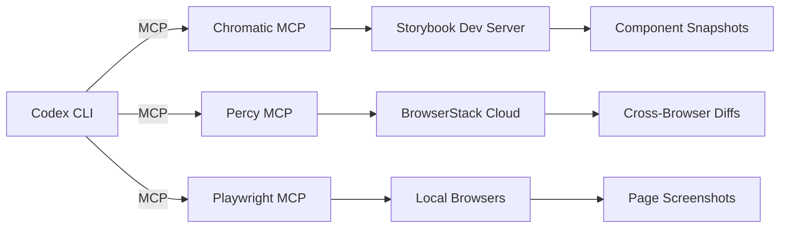
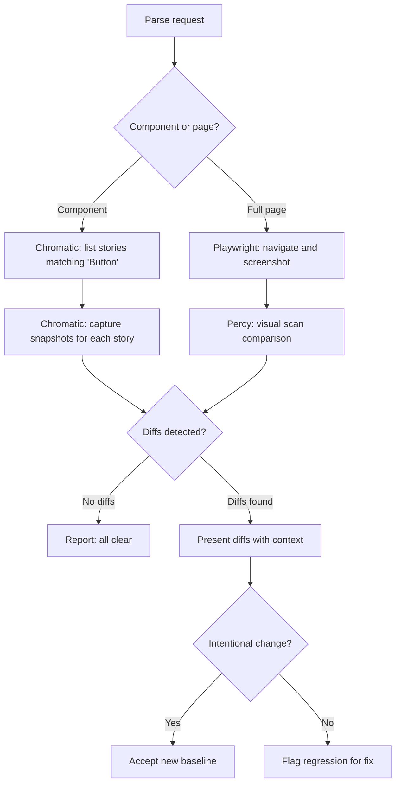

# Codex CLI for Visual Regression Testing: Integrating Percy, Chromatic, and Playwright via MCP


---

Visual regression testing — the practice of capturing screenshots and comparing them pixel-by-pixel against approved baselines — has traditionally required bespoke scripting, manual baseline management, and significant CI pipeline plumbing. With the maturation of MCP (Model Context Protocol) servers for visual testing tools, Codex CLI can now orchestrate the entire visual regression workflow conversationally: capturing snapshots, analysing diffs, triaging failures, and updating baselines without leaving the terminal.

This article covers how to integrate three complementary MCP servers — Chromatic, Percy/BrowserStack, and Playwright — with Codex CLI to build an agent-driven visual testing workflow suitable for component libraries, design systems, and full-page application testing.

## The Visual Testing Landscape in 2026

Visual regression testing has consolidated around two dominant cloud platforms and one open-source automation layer:

- **Chromatic** — Storybook-native visual testing with component-level snapshots, maintained by the Storybook team[^1]
- **Percy by BrowserStack** — Cross-browser visual snapshots with AI-powered diff detection and visual scan capabilities[^2]
- **Playwright** — Microsoft's browser automation framework, providing the screenshot capture layer that feeds into either cloud platform[^3]

Each now ships an MCP server, making them accessible as tool calls from any MCP-compatible agent — including Codex CLI.

## Architecture: MCP Servers as the Integration Layer

Rather than writing shell scripts that invoke CLI tools sequentially, Codex CLI communicates with each testing platform through its MCP server. The agent decides which tools to invoke based on the task context.



This separation means Codex can combine tools fluidly — capture a page screenshot with Playwright, run it through Percy for cross-browser comparison, and check individual component states via Chromatic — all within a single conversational session[^4].

## Setting Up Chromatic MCP

Chromatic's MCP server ships as a Storybook addon since Storybook 10.3. Installation is a single command[^1]:

```bash
npx storybook add @storybook/addon-mcp
```

Once installed, the local Storybook dev server exposes an MCP endpoint at `http://localhost:6006/mcp`. Configure Codex CLI to connect:

```toml
# ~/.codex/config.toml
[[mcp_servers]]
name = "chromatic"
transport = "http"
url = "http://localhost:6006/mcp"
```

For CI environments or when connecting to published Storybook builds, Chromatic provides a remote MCP URL tied to your project:

```toml
[[mcp_servers]]
name = "chromatic-cloud"
transport = "http"
url = "https://mcp.chromatic.com/project/<project-id>"
headers = { Authorization = "Bearer ${CHROMATIC_TOKEN}" }
```

The Chromatic MCP server exposes tools for listing stories, capturing component snapshots, retrieving visual diffs against baselines, and accepting or rejecting changes[^1][^5].

## Setting Up Percy MCP

Percy's MCP server connects Codex CLI to BrowserStack's visual testing infrastructure. It supports two modes: traditional Percy snapshots (explicit capture points) and Percy Visual Scan (automatic full-page crawling)[^2]:

```toml
# ~/.codex/config.toml
[[mcp_servers]]
name = "percy"
transport = "stdio"
command = "npx"
args = ["@percy/mcp-server"]
env = { PERCY_TOKEN = "${PERCY_TOKEN}" }
```

Key tools exposed by the Percy MCP server:

| Tool | Purpose |
|------|---------|
| `percy_snapshot` | Capture a named snapshot of a URL |
| `percy_visual_scan` | Run AI-powered full-page visual scan |
| `percy_builds_list` | List recent builds with diff counts |
| `percy_build_review` | Review and approve/reject diffs |
| `percy_baseline_update` | Accept current state as new baseline |

Percy's visual scan mode is particularly powerful with Codex CLI — the agent can trigger a scan, receive the diff results, and make triage decisions based on whether changes are intentional (matching a recent code change) or unexpected regressions[^2].

## Setting Up Playwright MCP

The Playwright MCP server provides low-level browser automation that complements the cloud platforms. It operates on DOM accessibility snapshots rather than raw pixels, making it useful for structural verification alongside visual comparison[^3][^6]:

```toml
# ~/.codex/config.toml
[[mcp_servers]]
name = "playwright"
transport = "stdio"
command = "npx"
args = ["@anthropic/playwright-mcp-server"]
```

Playwright MCP tools enable Codex to navigate pages, interact with elements, and capture screenshots — all without requiring a headed browser. For visual regression specifically, the workflow is:

1. Navigate to the target URL
2. Wait for visual stability (network idle, animations complete)
3. Capture a full-page screenshot
4. Compare against a stored baseline using pixel-diff or perceptual hashing

## The Agent-Driven Workflow

With all three MCP servers configured, Codex CLI can orchestrate visual regression testing through natural language. A typical session:

```
> codex "Run visual regression tests for the Button component after my latest changes"
```

The agent's decision flow:



## Verification Gates with PostToolUse Hooks

For teams that want visual regression checks to run automatically after every file write, Codex CLI's hook system provides a verification gate[^7]:

```toml
# .codex/config.toml
[[hooks]]
event = "PostToolUse"
tool = "write"
match_glob = "src/components/**/*.{tsx,css}"
command = "npm run test:visual -- --component $(basename $CODEX_TOOL_ARG_FILE_PATH .tsx)"
```

This triggers a visual test whenever the agent modifies a component file, catching regressions before they reach code review.

## CI Integration with codex exec

For non-interactive pipelines, `codex exec` runs the visual regression workflow without TUI interaction[^8]:

```bash
codex exec \
  --approval-policy never \
  --model gpt-5.5 \
  "Run Chromatic visual tests for all modified stories. \
   If any diffs are unexpected regressions, exit with code 1. \
   If all diffs match the PR description's intended changes, accept them."
```

The agent reads the PR description for context, compares it against detected visual changes, and makes an informed accept/reject decision — reducing the manual review burden for design system teams.

## Combining Platforms: A Practical Strategy

Each platform serves a different testing granularity:

| Layer | Tool | Best For |
|-------|------|----------|
| Component | Chromatic | Isolated component states, Storybook stories |
| Page | Percy | Full-page cross-browser visual comparison |
| Interaction | Playwright | Dynamic states, hover/focus/animation frames |

A mature visual regression strategy uses all three. Chromatic catches component-level regressions during development. Percy validates cross-browser rendering in CI. Playwright captures interaction states that static snapshots miss. Codex CLI, with access to all three via MCP, can select the appropriate tool based on context[^4].

## Limitations and Considerations

- **Token cost**: Visual testing workflows generate verbose tool responses (base64 screenshots, diff metadata). Monitor token usage when running comprehensive visual suites through the agent
- **Baseline drift**: Accepting baselines through the agent requires the same governance as manual acceptance — ensure your team's review process covers agent-approved baseline changes
- **Flaky screenshots**: Animation timing, font rendering, and dynamic content cause false positives. Configure appropriate thresholds in Percy (0.1% pixel diff tolerance) and use Chromatic's TurboSnap for targeted captures[^1][^2]
- **MCP server stability**: Both Chromatic and Percy MCP servers are marked as production-ready as of May 2026, but the Playwright MCP server remains in active development with occasional breaking changes to tool signatures[^3]

## Recommendations

1. **Start with Chromatic MCP** if you already use Storybook — it requires zero additional infrastructure beyond the addon installation
2. **Add Percy for cross-browser coverage** when your application must render consistently across Chrome, Firefox, Safari, and mobile viewports
3. **Use Playwright MCP for interaction states** that cannot be captured through static story rendering
4. **Set pixel-diff thresholds explicitly** — both Percy and Chromatic support configurable sensitivity to reduce false positives
5. **Gate deployments on visual approval** using `codex exec` in CI to automate triage of intentional versus unintentional changes

## Citations

[^1]: [Storybook MCP — Chromatic Documentation](https://www.chromatic.com/docs/mcp/), accessed May 2026. Documents the MCP addon installation, local and remote server configuration, and available tool endpoints.

[^2]: [Percy MCP Server — BrowserStack Documentation](https://www.browserstack.com/docs/percy/integrate/mcp-server), accessed May 2026. Covers Percy snapshot and visual scan MCP tools, setup, and CI integration.

[^3]: [Playwright MCP Server — Microsoft GitHub](https://github.com/anthropic-ai/anthropic-quickstarts/tree/main/playwright-mcp-server), accessed May 2026. DOM-based accessibility snapshots and browser automation via MCP.

[^4]: [MCP Servers — Codex CLI Configuration Reference](https://developers.openai.com/codex/config-reference), accessed May 2026. Documents `[[mcp_servers]]` configuration including transport types, environment variables, and authentication.

[^5]: [Chromatic Visual Testing with AI Agents — Storybook Blog](https://storybook.js.org/blog/chromatic-mcp-visual-testing/), April 2026. Announces MCP server availability and cross-tool compatibility.

[^6]: [Playwright MCP for Codex CLI — Community Guide](https://github.com/anthropic-ai/anthropic-quickstarts/blob/main/playwright-mcp-server/README.md), accessed May 2026. Setup instructions and tool documentation.

[^7]: [Hooks — Codex CLI Documentation](https://developers.openai.com/codex/hooks), accessed May 2026. PostToolUse event configuration and match patterns.

[^8]: [codex exec — Non-Interactive Mode](https://developers.openai.com/codex/guides/codex-exec), accessed May 2026. Running Codex CLI in CI pipelines without TUI interaction.
